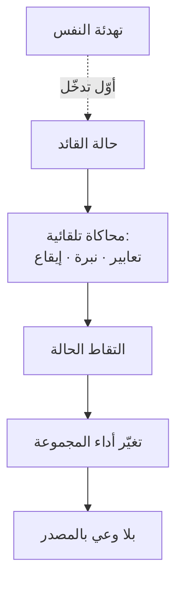

# العدوى الانفعالية (Emotional Contagion)
> [!info] تعريف مختصر
> العدوى الانفعالية هي انتقال الحالة الشعورية بين الأفراد تلقائيًّا وبلا وعي، عبر محاكاة التعابير والنبرات والوضعيات. **وهي غير متماثلة تراتبيًّا**: تنتقل من الأعلى سلطةً إلى الأدنى أقوى ممّا تنتقل عكسًا — فحالة القائد تُبَثّ سواء قصد أو لم يقصد.

## الشرح العلمي والاحترافي
وصفها **هاتفيلد وكاسيوبو ورابسون** في *Emotional Contagion* (1994): ميل تلقائي إلى محاكاة تعابير الآخرين ثم **التقاط الحالة المصاحبة**؛ يحدث في أجزاء من الثانية وبلا وعي.

**وأهمّ دليل تنظيمي عليها** تجربة **سيغال بارسادي (Sigal Barsade)** في *The Ripple Effect* (Administrative Science Quarterly, 2002): إدخال متواطئ يحمل حالة انفعالية بعينها إلى مجموعة عمل غيّر حالة المجموعة كلّها **وأداءها التعاوني وقراراتها** — بلا أن يعي أعضاؤها مصدر التغيّر.

**ونتيجتان عمليّتان للقائد:**
① **حالتك تُبَثّ سواء قصدت أو لم تقصد.** فالمدير المتوتّر لا «يُخفي» توتّره؛ بل يُوزّعه.
② **وهذا هو المخرج الوحيد من سؤال «من يُهدّئني أنا؟»**: تهدئتك لنفسك **أوّل تدخّل تُجريه على الغرفة** — وأكثرها أثرًا، لأنّه يعمل قبل أن تنطق بكلمة.

**وتُفسّر أيضًا** لماذا يُخرَج طرفا الصراع من الاجتماع الجماعي في [[Displacement Strategy|الإزاحة]]: لا لحفظ ماء الوجه فقط، **بل لمنع انتشار الاستثارة إلى الجميع** ولمنع اصطفاف الشهود.

## أين ومتى يُستخدم
- قبل الدخول إلى اجتماع تتوقّع فيه مواجهة — لضبط حالتك أوّلًا.
- بعد اجتماع سيّئ مع الإدارة، وقبل لقاء فريقك.
- في تشخيص انهيار مزاج فريق كامل بلا سبب ظاهر — ابحث عن المصدر لا عن الأفراد.
- في تصميم لحظات الاحتفال والتهدئة عبر السبرنت.

## مثال وسيناريو تطبيقي
> [!example] مدير تسليم يخرج من اجتماع مع الإدارة العليا وقد تلقّى لومًا حادًّا، ثم يدخل مباشرةً على اجتماع فريقه. **لم يذكر شيئًا ممّا حدث** — لكنّه تكلّم أسرع، وقاطع مرّتين، ونظر إلى هاتفه، وأنهى الاجتماع قبل موعده. وبعد ساعتين لاحظ أنّ الفريق متوتّر بلا سبب، وأنّ مطوّرًا أجّل الإفصاح عن مشكلة كان سيذكرها. **لم يُخفِ حالته؛ وزّعها.** والتصرّف الصحيح: **عشر دقائق فاصلة** يُسمّي فيها حالته لنفسه («أنا متوتّر من اجتماع سابق ولا علاقة له بهم»)، ويكتب هدف الاجتماع القادم في سطر — ثم يدخل.

## خطوات أو مخطّط
1. **سمِّ حالتك لنفسك** بصيغة صريحة قبل أيّ لقاء مهمّ.
2. **افصل بين الاجتماعات** — لا تدخل على فريقك مباشرةً بعد اجتماع محتدم.
3. **اضبط الإيقاع لا الكلمات**: أبطئ حين يُسرع الآخر، واخفض صوتك حين يرفع — فالتقارب في الإيقاع يخفض الاستثارة بلا أن يُكشَف بوصفه تقليدًا.
4. **أخرج الاستثارة من الغرفة الجماعية** حين يقع صراع بين طرفين.
5. **راقب المصدر لا الأعراض** حين ينهار مزاج فريق كامل.

## ⚠️ مفاهيم خاطئة شائعة
> [!warning]
> - **ليست تعاطفًا ولا اختيارًا.** التعاطف عملية إدراكية قد تكون واعية؛ والعدوى **تلقائية** وتحدث سواء أردتَ أو لم تُرد.
> - **«أنا لا أُظهر ما بداخلي» وهم شائع.** الإخفاء الواعي للتعابير — **الكبح التعبيري** — لا يمنع الانتقال؛ بل يرفع استثارتك ويُقلّل ألفة الطرف الآخر بك.
> - **لا تعني التصنّع.** المطلوب تنظيم حالتك فعلًا لا تمثيل حالة أخرى — والتمثيل يُكشَف في اللحظات غير المُخطَّطة.

## ❌ ممارسات خاطئة في المشاريع
> [!failure]
> - **نقل ضغط الإدارة إلى الفريق حرفيًّا** ظنًّا أنّها «شفافية» — تُنتج قلقًا لا يقابله فعل ممكن فتستهلك انتباههم بلا نتيجة.
> - **معالجة انهيار مزاج الفريق بالأفراد** — اجتماعات فردية مع خمسة أشخاص بينما المصدر واحد.
> - **الكبح بدل التنظيم** — تخصيص الطاقة لإخفاء التوتّر بدل خفضه؛ والبديل [[Cognitive Reappraisal|إعادة التقييم]].
> - **تجاهل الاتّجاه التراتبي** — أن يُطلَب من الفريق أن «يكون إيجابيًّا» بينما مصدر الحالة هو القائد نفسه.

## 🔗 مصطلحات ومفاهيم ذات صلة
[[Silent Leadership]] | [[Cognitive Reappraisal]] | [[Biological Leadership]] | [[Amygdala Hijack]] | [[Psychological Safety]] | [[Displacement Strategy]] | [[Emotional Intelligence]] | [[Burnout]]

> [!tip] 💡 إثراء عملي — كورس لعبة العقل
> الردّ على سؤال «من يُهدّئنا نحن؟»، وبروتوكول ما قبل الاجتماع الصعب: [[02 - بيولوجيا اللحظة - اللوزة والقشرة الجبهية]].
