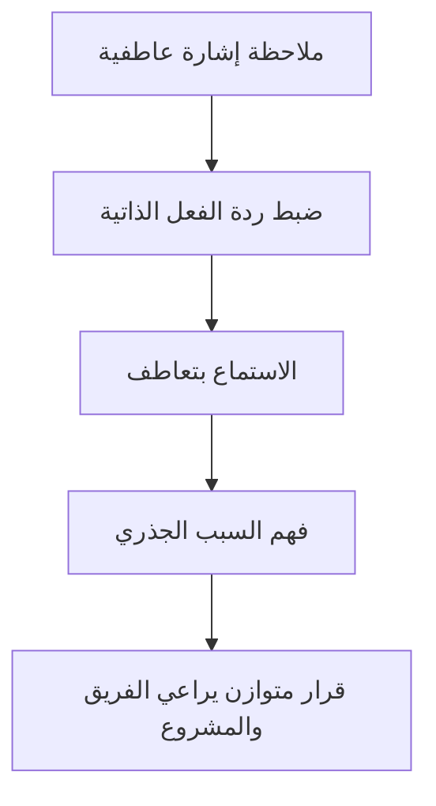

# الذكاء العاطفي (Emotional Intelligence)
> [!info] تعريف مختصر
> الذكاء العاطفي (Emotional Intelligence، ويُختصر EQ) هو القدرة على إدراك مشاعرك ومشاعر الآخرين، وفهمها، والتحكّم بها بطريقة صحية لبناء علاقات عمل فعّالة واتخاذ قرارات جيدة تحت الضغط.

## الشرح العلمي والاحترافي
طوّر عالم النفس دانييل غولمان (Daniel Goleman) نموذجًا شهيرًا للذكاء العاطفي يتكوّن من خمسة عناصر:
- **الوعي الذاتي (Self-Awareness):** معرفة مشاعرك وأثرها عليك وعلى قراراتك.
- **إدارة الذات (Self-Regulation):** القدرة على ضبط ردود الفعل الاندفاعية، خصوصًا في المواقف الضاغطة.
- **الدافعية (Motivation):** الحافز الداخلي للإنجاز، وليس فقط المكافآت الخارجية.
- **التعاطف (Empathy):** فهم مشاعر الآخرين ودوافعهم.
- **المهارات الاجتماعية (Social Skills):** القدرة على بناء علاقات، حل النزاعات، والتأثير الإيجابي في الفريق.

في إدارة المشاريع، الذكاء العاطفي ليس "مهارة ناعمة ثانوية" بل عامل حاسم في نجاح القائد. فالقائد الذي يمتلك ذكاءً تقنيًا عاليًا لكنه ضعيف عاطفيًا قد يفقد ثقة فريقه سريعًا: يتجاهل الإرهاق (Burnout)، يتصرّف بانفعال أثناء الأزمات، أو لا يلاحظ التوتر بين أعضاء الفريق قبل أن يتحوّل إلى نزاع علني. الذكاء العاطفي يرتبط مباشرة بمفهوم [[Psychological Safety]] لأن القائد الذي يقرأ مشاعر فريقه بدقة هو الأقدر على خلق بيئة يشعر فيها الجميع بالأمان للتحدث والاعتراف بالأخطاء.

## أين ومتى يُستخدم
- في القيادة اليومية للفرق البرمجية: أثناء [[07 - Daily Standup]] لملاحظة توتر أو إحباط غير معلن لدى عضو في الفريق.
- في إدارة النزاعات بين أعضاء الفريق أو بين الفريق والعميل.
- في التواصل مع أصحاب المصلحة (Stakeholders) تحت الضغط، مثل تأخير مشروع أو أزمة إنتاج.
- في مقابلات التوظيف والتقييمات السنوية لقياس مدى ملاءمة الشخص لدور قيادي.
- في [[10 - Sprint Retrospective]] لخلق مساحة آمنة يتحدث فيها الفريق بصراحة دون خوف من اللوم.

## مثال وسيناريو تطبيقي
> [!example] يقود عمر فريق تطوير في شركة "فينتك ريف". قبل إطلاق مهم بأسبوعين، لاحظ أن أحد المطورين، ياسر، أصبح صامتًا في الاجتماعات ويؤخّر تسليم مهامه. بدل توبيخه فورًا أو تجاهل الأمر، طلب عمر لقاءً فرديًا قصيرًا، واستمع دون مقاطعة. اكتشف أن ياسر يمرّ بضغط شخصي بسبب مرض في العائلة، وأنه يخشى الإفصاح عن ذلك خوفًا من أن يُعتبر "غير ملتزم". أعاد عمر توزيع بعض المهام على زملائه مؤقتًا، وأبلغ الإدارة بتعديل بسيط في الجدول الزمني بدل الضغط على ياسر. النتيجة: التزم ياسر بموعد أقرب لاحقًا بدافعه الشخصي، والفريق سلّم المشروع في الوقت المناسب دون أزمة داخلية.

## خطوات أو مخطّط
1. لاحظ إشارات المشاعر (لغة الجسد، نبرة الصوت، التغيّر في السلوك المعتاد).
2. توقّف قبل الرد الانفعالي — خذ لحظة لضبط ردة فعلك (إدارة الذات).
3. استمع بتعاطف حقيقي دون افتراض النوايا مسبقًا.
4. اسأل أسئلة مفتوحة لفهم السبب الجذري للمشكلة.
5. تصرّف بحلول عملية تراعي الجانب الإنساني والجانب المهني معًا.

## ⚠️ مفاهيم خاطئة شائعة
> [!warning]
> - الاعتقاد أن الذكاء العاطفي يعني "أن تكون لطيفًا دائمًا": هو في الحقيقة القدرة على اتخاذ قرارات صعبة (حتى المحاسبة على الأداء) بطريقة تحترم مشاعر الطرف الآخر.
> - الخلط بين الذكاء العاطفي والانفعالية: الشخص عالي EQ لا يُظهر كل مشاعره بل يديرها بوعي.
> - اعتباره مهارة فطرية ثابتة لا يمكن تطويرها؛ الأبحاث تُظهر أن الذكاء العاطفي يتحسّن بالتدريب والممارسة الواعية مع الوقت.

## ❌ ممارسات خاطئة في المشاريع
> [!failure]
> - قائد يتجاهل علامات الإرهاق (Burnout) عند فريقه لأنه يركّز فقط على المواعيد النهائية — الحل: تخصيص وقت دوري لسؤال الفريق صراحة عن حالتهم، لا فقط عن تقدّم المهام.
> - الرد بانفعال فوري على خطأ في الإنتاج أمام الفريق كاملًا، مما يخلق خوفًا من الإبلاغ عن الأخطاء مستقبلًا — الحل: معالجة الموقف بهدوء أولًا، ثم مناقشة السبب الجذري لاحقًا في جو أهدأ.
> - افتراض أن صمت عضو في الفريق يعني الموافقة أو عدم وجود مشكلة — الحل: التحقق مباشرة عبر سؤال فردي بدل الافتراض.

## 🔗 مصطلحات ومفاهيم ذات صلة
- [[Behavioral Leadership]]
- [[Servant Leadership]]
- [[Psychological Safety]]
- [[Empowerment]]
- [[Active Listening]]
- [[10 - Sprint Retrospective]]
- [[06 - Scrum Master]]

> [!tip] 💡 إثراء عملي — كورس لعبة العقل
> الذكاء العاطفي مُفكَّكًا إلى أدوات قابلة للنسخ: [[Labeling]] · [[Mirroring]] · [[Tactical Empathy]] · [[Cognitive Reappraisal]]. والأساس العصبي وحدوده في [[02 - بيولوجيا اللحظة - اللوزة والقشرة الجبهية]].
