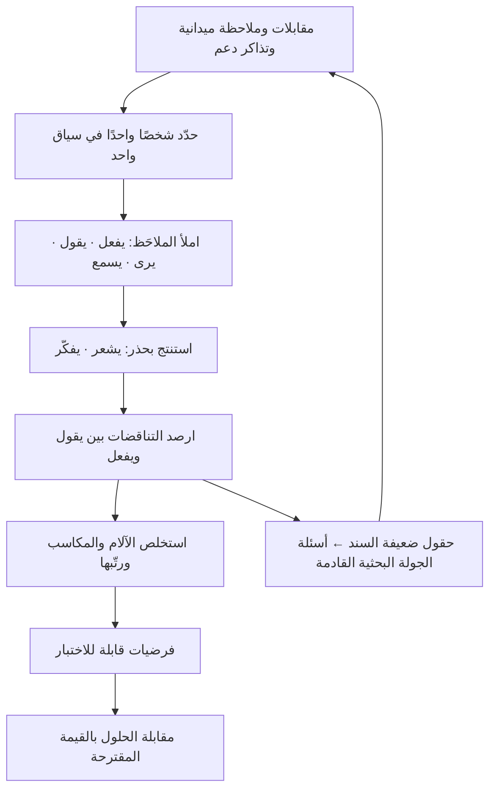

# خريطة التعاطف (Empathy Map)

> [!info] تعريف مختصر
> لوح تنظيمي بسيط يُلخّص ما نعرفه عن مستخدم أو شريحة، موزّعًا على ستّة حقول: ما **يرى**، وما **يسمع**، وما **يقول**، وما **يفعل**، وما **يشعر** به، وما **يفكّر** فيه — وتُضاف إليها عادة خانتان أسفل اللوح: **الآلام (Pains)** و**المكاسب (Gains)**. اشتُهر اللوح عبر شركة الاستشارات التصميمية **XPLANE** ومؤسّسها **ديف جراي (Dave Gray)**، وانتشر لاحقًا في أدبيات نماذج الأعمال والتصميم. وظيفته الحقيقية **تنظيمية لا استكشافية**: هو حاوية تُفرَّغ فيها مخرجات البحث الميداني بشكل يكشف الثغرات والتناقضات — وليس مصدرًا للمعرفة بذاته. خريطة تعاطف مبنيّة على تخمين الفريق ليست تعاطفًا، بل إسقاطًا جماعيًّا للذات على المستخدم في هيئة أنيقة.

## الشرح العلمي والاحترافي
- **الحقول الستّة وما يميّز كلًّا منها**:
  1. **يرى (See)**: البيئة البصرية المحيطة — ماذا يرى في سوقه وعمله ومحيطه، وما العروض والحلول التي تقع في مجاله البصري يوميًّا، وما الذي يراه أقرانه يفعلونه.
  2. **يسمع (Hear)**: المؤثّرات الاجتماعية والمعلوماتية — ماذا يقول له المدير والزملاء والعائلة، وأي قنوات ومصادر يثق بها، ومن الأشخاص الذين يؤثّر رأيهم في قراره فعلًا.
  3. **يقول (Say)**: تصريحاته العلنية — عباراته الحرفية في المقابلات والشكاوى والاجتماعات. يُفضَّل نقلها كاقتباس حرفي لا كإعادة صياغة، لأن مفردات المستخدم نفسها مادة خام للتصميم والرسائل التسويقية.
  4. **يفعل (Do)**: سلوكه الملاحَظ فعليًّا — ما الذي يفعله بيديه، وبأي ترتيب، وبأي أدوات، وما الحيل الالتفافية (Workarounds) التي اخترعها. هذا أوثق حقول اللوح لأنه لا يعتمد على تقرير الشخص عن نفسه.
  5. **يشعر (Feel)**: حالته العاطفية أثناء التجربة — القلق، الإحراج، الملل، عدم الثقة، الارتياح — مع تحديد اللحظة التي يظهر فيها الشعور لا وصفه عامًّا.
  6. **يفكّر (Think)**: ما يدور في ذهنه ولا يقوله — معتقداته عن الحل، مخاوفه من الحكم عليه، حساباته الداخلية للمخاطرة.
- **القيمة الأكبر تأتي من التوتّر بين الحقول لا من امتلائها**: الفائدة التشخيصية الحقيقية تظهر في الفجوة بين **يقول** و**يفعل**، وبين **يقول** و**يفكّر**. مستخدم يقول «النظام ممتاز» ويُلاحَظ أنه يحتفظ بجدول موازٍ على جهازه يخبرنا شيئًا لا تخبرنا به أي شهادة رضا. لذلك فإن خريطة التعاطف التي تتّسق حقولها اتّساقًا تامًّا هي غالبًا خريطة مؤلّفة لا مُلاحَظة.
- **ترتيب الملء يؤثّر في النتيجة**: الممارسة الأنضج تبدأ بالحقول القابلة للملاحظة الخارجية (يفعل، يقول، يرى، يسمع) قبل الحقول الاستنتاجية (يشعر، يفكّر)، لأن الأخيرين استنتاج المُحلِّل لا تصريح المستخدم. البدء بهما يجعل بقيّة الحقول تُملأ لتبرير الاستنتاج.
- **حدّها الجوهري — لا تُغني عن المقابلة بل تنظّم مخرجاتها**: [[User Interview]] هو **مصدر** المعرفة: هو الذي يُنتج الاقتباسات والوقائع والسرد السببي. خريطة التعاطف **مستودع** لتلك المعرفة يجعلها قابلة للمشاركة والمقارنة والاستدلال. الخلط بين الأداتين هو أشيع أخطاء استعمالها: فريق يجلس ساعة يملأ اللوح من ذاكرته ثم يخرج مقتنعًا أنه "فهم المستخدم"، وقد أنتج في الحقيقة توثيقًا منظّمًا لافتراضاته. المعيار الصارم: كل بطاقة على اللوح يجب أن يمكن سؤال «من قال هذا أو أين لُوحظ؟» والإجابة عنه بمصدر.
- **التمييز عن الأدوات المجاورة**: [[User Journey Map]] تنظّم المعرفة **زمنيًّا** عبر مراحل الرحلة وتكشف أين يقع الاحتكاك؛ وخريطة التعاطف تنظّمها **إدراكيًّا** حول شخص واحد في سياق واحد وتكشف من هو ولماذا يتصرّف هكذا. و[[Value Proposition Canvas]] تأخذ مخرجات الآلام والمكاسب وتقابلها بما يقدّمه المنتج. و[[Jobs to be Done]] تسأل عن المهمّة والظرف السببي. الاستخدام الناضج تسلسلي: مقابلات ← خريطة تعاطف ← آلام ومكاسب ← مقابلتها بالحلول.
- **صلاحيتها في السياق المؤسّسي**: تُستعمل بفاعلية للأدوار الداخلية أيضًا (موظّف دعم، مندوب مبيعات، مراجع امتثال)، حيث حقلا "يسمع" و"يشعر" يكشفان ضغوطًا تنظيمية تفسّر مقاومة التبنّي أكثر مما تفسّرها أي مشكلة في الواجهة.
- **خطر الشخصية المتوسّطة**: دمج عدّة مستخدمين متباينين في خريطة واحدة يُنتج شخصًا لا وجود له، متوسّط الآلام والمكاسب، لا يمثّل أحدًا ولا يقود إلى قرار. القاعدة: خريطة لكلّ شريحة سلوكية متمايزة، والتمايز يكون بالسلوك والظرف لا بالعمر والوظيفة.
- **حدود إضافية يجب الاعتراف بها**: اللوح ثابت (لقطة في لحظة) بينما المستخدم يتغيّر؛ وهو غير مرتّب بالأولوية (كل بطاقة تبدو بوزن واحد)؛ ولا يقول شيئًا عن حجم الشريحة أو قيمتها الاقتصادية. لذلك لا يصحّ أن يكون وحده أساس قرار استثماري، بل مدخلًا نوعيًّا يُقرن ببيانات كمّية.

## أين ومتى يُستخدم
- **بعد جولة مقابلات مباشرة**: كخطوة تركيب (Synthesis) تحوّل عشرات الصفحات من الملاحظات إلى صورة قابلة للمناقشة والاختلاف عليها.
- **في مرحلة اكتشاف المنتج** ([[Product Discovery]]): لتحديد الفجوات المعرفية — أي حقل فارغ في اللوح هو سؤال بحثي للجولة القادمة، وهذا من أنفع استعمالاتها وأقلّها شهرة.
- **قبل بناء [[Value Proposition Canvas]]**: خانتا الآلام والمكاسب تُغذّيان جانب العميل في اللوح مباشرة.
- **عند مواءمة الفرق البعيدة عن المستخدم**: تعطي المطوّرين والتسويق وخدمة العملاء صورة مشتركة واحدة تُختصر إليها نتائج البحث بدل تقرير طويل لا يُقرأ.
- **في تصميم رسالة المنتج ونصوص الواجهة**: حقل "يقول" مصدر مباشر لمفردات المستخدم الحقيقية، وهي أقوى من المفردات المصكوكة داخليًّا.
- **مع [[Voice of the Customer]] وبيانات الدعم**: تذاكر الدعم والشكاوى مادة ممتازة لملء حقول "يقول" و"يشعر" بتكلفة بحث منخفضة.
- **لفهم مقاومة التبنّي داخل المؤسسة**: خريطة تعاطف للموظّف المتأثّر بالنظام الجديد تكشف مخاوف لا تظهر في أي اجتماع رسمي.

## مثال وسيناريو تطبيقي
> [!example] **شركة تقنية تبيع نظامًا لإدارة المخزون لمحلّات التجزئة الصغيرة في السوق الخليجي.** بعد ستة أشهر من الإطلاق: 210 محلات اشتركت، لكن 62% منها توقّفت عن إدخال البيانات خلال أول 45 يومًا رغم استمرار الاشتراك المدفوع (مدفوعًا سنويًّا).
> الفرضية السائدة داخل الشركة كانت: «الواجهة معقّدة، نحتاج تبسيطها». وكان الفريق على وشك تمويل إعادة تصميم كاملة.
> بدل ذلك، زار فريق مكوّن من مصمّم ومطوّر ومدير منتج **11 محلًّا** وقضى في كلٍّ منها نصف يوم يراقب ويسأل، ثم بنى خرائط تعاطف — واحدة لصاحب المحل، وأخرى للعامل الذي يُدخل البيانات فعليًّا، بعد أن اتّضح في أول زيارتين أنهما شخصان مختلفان تمامًا في كل شيء.
> **خريطة العامل** جاءت كالتالي:
> — **يفعل**: يُدخل بيانات المخزون في نهاية اليوم بعد إغلاق المحل وهو مرهق؛ يحتفظ بدفتر ورقي موازٍ يكتب فيه أثناء النهار ثم ينقل منه؛ يصوّر الفواتير بجواله بدل إدخالها.
> — **يقول**: «النظام حلو بس ما عندي وقت»، «الدفتر أسرع»، «إذا غلطت ما أعرف أرجّع».
> — **يسمع**: صاحب المحل يقول له «لا تضيّع وقتك بالجوال، اخدم الزبون»؛ وزميله في محل مجاور يقول إن نظامهم أوقفوه بعد شهرين.
> — **يرى**: زبائن ينتظرون عند الكاشير؛ شاشة تطلب 9 حقول إلزامية لإضافة صنف واحد.
> — **يشعر**: خوفًا من ارتكاب خطأ يُحاسَب عليه؛ إحراجًا حين ينشغل بالجوال أمام الزبون.
> — **يفكّر**: «إذا دخلت رقمًا غلط بيطلع النقص من راتبي».
> التناقض بين الحقول كان هو الاكتشاف: العامل **يقول** إن السبب ضيق الوقت، لكنه **يفعل** شيئًا أطول زمنًا (كتابة ورقية ثم نقل). فالسبب الحقيقي ليس الوقت ولا تعقيد الواجهة، بل **الخوف من الخطأ غير القابل للتراجع** مضافًا إليه ضغط اجتماعي من صاحب المحل.
> ما بُني بناءً على ذلك لم يكن إعادة تصميم: بل ثلاثة تغييرات — إمكانية التراجع عن أي إدخال خلال 24 ساعة بوضوح تام، وتقليص الحقول الإلزامية من 9 إلى 3 مع تأجيل الباقي، وإدخال سريع بالتقاط صورة للفاتورة تُراجَع لاحقًا. كما أُضيفت رسالة موجّهة لصاحب المحل تُظهر له الوقت الذي يوفّره الإدخال اليومي، لمعالجة حقل "يسمع".
> بعد ربع كامل: نسبة المحلات النشطة في الإدخال بعد 45 يومًا ارتفعت من 38% إلى 71%، دون إعادة تصميم الواجهة التي كانت ستُموّل بستة أشهر عمل.

## خطوات أو مخطّط
1. حدّد **شخصًا واحدًا في سياق واحد** لكل خريطة، وسمِّه بدور سلوكي دقيق («العامل الذي يُدخل بيانات نهاية اليوم») لا بفئة عامة («المستخدم»).
2. اجمع المادة الخام أولًا: مقابلات، ملاحظة ميدانية، تذاكر دعم، تسجيلات مكالمات. لا تفتح اللوح قبل امتلاك مصدر.
3. املأ الحقول القابلة للملاحظة أولًا: **يفعل** ثم **يقول** ثم **يرى** و**يسمع**.
4. استخدم اقتباسات حرفية في حقل "يقول"، ووثّق مصدر كل بطاقة (رقم المقابلة أو التذكرة) على البطاقة نفسها.
5. انتقل إلى الحقلين الاستنتاجيين **يشعر** و**يفكّر**، وميّزهما بصريًّا بلون مختلف باعتبارهما استنتاجًا قابلًا للنقض لا واقعة.
6. ابحث عمدًا عن التناقضات بين الحقول، وسجّلها كقائمة منفصلة — هذه هي مخرجات الخريطة الأثمن.
7. استخلص خانتَي **الآلام** و**المكاسب** من مجموع الحقول، ورتّبهما بالأولوية حسب التكرار والحدّة.
8. حوّل كل حقل فارغ أو ضعيف السند إلى سؤال بحثي مُدرَج في الجولة التالية.
9. مرّر مخرجات الآلام والمكاسب إلى [[Value Proposition Canvas]]، والتناقضات إلى قائمة فرضيات قابلة للاختبار.
10. أعِد بناء الخريطة عند كل تغيّر جوهري في المنتج أو السوق؛ ولا تحتفظ بخريطة عمرها أكثر من دورة منتج كاملة دون تحديث.

## ⚠️ مفاهيم خاطئة شائعة
> [!warning]
> - **الظنّ بأنها أداة بحث**: هي أداة **تركيب وتنظيم**. لا تُنتج معرفة، بل تعرض المعرفة الموجودة بشكل يكشف نقصها. ملؤها بلا مصدر ميداني يحوّلها إلى توثيق منظّم لافتراضات الفريق.
> - **الخلط بينها وبين الشخصية النمطية (Persona)**: الشخصية ملفّ تعريفي يجمع خصائص وسلوكيات وأهدافًا ويُستخدم مرجعًا مستقرًّا؛ وخريطة التعاطف لقطة إدراكية لحظية حول موقف محدّد. غالبًا ما تُستعمل الخريطة كمُدخل لبناء الشخصية لا كبديل عنها.
> - **اعتبار حقلي "يشعر" و"يفكّر" وقائع**: هما استنتاج المُحلِّل من أدلّة غير مباشرة، ودرجة يقينهما أقلّ بكثير من "يفعل". معاملتهما كحقيقة مثبتة تبني قرارات تصميمية على تأويل.
> - **الظنّ بأن الخريطة تُغني عن الحديث مع المستخدمين لاحقًا**: كل خريطة تولّد أسئلة أكثر مما تُجيب إن أُحسن استعمالها؛ الحقول الفارغة أهمّ من الممتلئة.
> - **دمج عدّة شرائح في خريطة واحدة**: يُنتج شخصية متوسّطة لا وجود لها. التمايز الصحيح سلوكي وظرفي، لا ديموغرافي.
> - **الاعتقاد بأن اتّساق الحقول علامة جودة**: التناقض بين ما يقوله المستخدم وما يفعله هو المادة الأثمن في اللوح؛ خريطة متّسقة تمامًا غالبًا مؤلَّفة.
> - **معاملتها كمخرج نهائي يُعرض ويُؤرشَف**: قيمتها في ما تُنتجه بعدها — فرضيات، أسئلة بحثية، وبنود آلام تدخل في تحديد الأولويات. خريطة لم تغيّر قرارًا واحدًا هي جهد ضائع مهما كانت أنيقة.

## ❌ ممارسات خاطئة في المشاريع
> [!failure]
> - **الخطأ: ملء اللوح في ورشة داخلية بلا مقابلة واحدة، بحجّة أن الفريق "يعرف عملاءه".** لماذا يضرّ: يمنح الافتراضات صفة المعرفة الموثّقة، فتُبنى عليها قرارات لا يجرؤ أحد على مساءلتها لاحقًا لأنها "موثّقة". الحل: اشترط مصدرًا لكل بطاقة، واحذف كل بطاقة بلا مصدر أو ضعها في منطقة منفصلة معنونة «افتراض غير مُختبَر».
> - **الخطأ: إعادة صياغة كلام المستخدم بلغة الفريق في حقل "يقول".** لماذا يضرّ: تُفقد المفردات الأصلية التي هي أثمن مخرجات البحث لتصميم الرسائل والواجهات، وتُهذَّب حدّة الشكوى فتفقد إشارتها. الحل: انقل الاقتباسات حرفيًّا بين علامتَي تنصيص مع رقم مرجع المقابلة.
> - **الخطأ: بناء الخريطة للمشتري وحده متجاهلًا المستخدم الفعلي.** لماذا يضرّ: في البيع المؤسّسي والتجزئة، من يوقّع العقد غير من يستعمل النظام يوميًّا؛ فيُصمَّم المنتج لإقناع الأول ويهجره الثاني، ويظهر ذلك في تجديد لا يحدث. الحل: خريطة منفصلة لكل دور، وقارن بينها صراحةً وسجّل مواضع تعارض المصالح.
> - **الخطأ: تجاهل التناقضات لأنها تربك السردية.** لماذا يضرّ: يُنتج خريطة مريحة تؤكّد ما يريده الفريق، وتُفقد الأداة وظيفتها التشخيصية الأساسية. الحل: خصّص قسمًا ثابتًا في اللوح للتناقضات، واجعل مراجعتها بندًا إلزاميًّا في جلسة التركيب.
> - **الخطأ: استخدام الخريطة كأساس وحيد لقرار استثماري.** لماذا يضرّ: اللوح لا يحمل معلومة عن حجم الشريحة ولا تكرار المشكلة ولا قيمتها الاقتصادية، فقد يُموَّل حلّ لألم حادّ لدى قلّة نادرة. الحل: اقرن الآلام المستخرجة ببيانات كمّية (تكرار في تذاكر الدعم، حجم الشريحة، أثر على مؤشّر) قبل ترتيب الأولويات.
> - **الخطأ: تعليق الخريطة على الجدار وتركها عامين.** لماذا يضرّ: تتحوّل إلى مرجع قديم يُستشهد به في قرارات جديدة رغم تغيّر السوق والمنتج والمستخدم. الحل: ضع تاريخ الإنشاء والمصادر على اللوح، وحدّد له صلاحية زمنية صريحة تُلزم بالتحديث.
> - **الخطأ: الاكتفاء بها عن رسم الرحلة الزمنية.** لماذا يضرّ: تكشف من هو المستخدم ولماذا يتصرّف هكذا، لكنها لا تكشف **أين** في التدفّق يقع الانهيار؛ فيبقى التشخيص عامًّا بلا نقطة تدخّل. الحل: استخدمها مع [[User Journey Map]] أو [[Service Blueprint]] بحسب طبيعة الخدمة.

## 🔗 مصطلحات ومفاهيم ذات صلة
[[User Interview]] | [[User Journey Map]] | [[Value Proposition Canvas]] | [[Jobs to be Done]] | [[Pain Point]] | [[Product Discovery]] | [[Voice of the Customer]] | [[The Mom Test]] | [[Service Blueprint]] | [[HEART Framework]]
