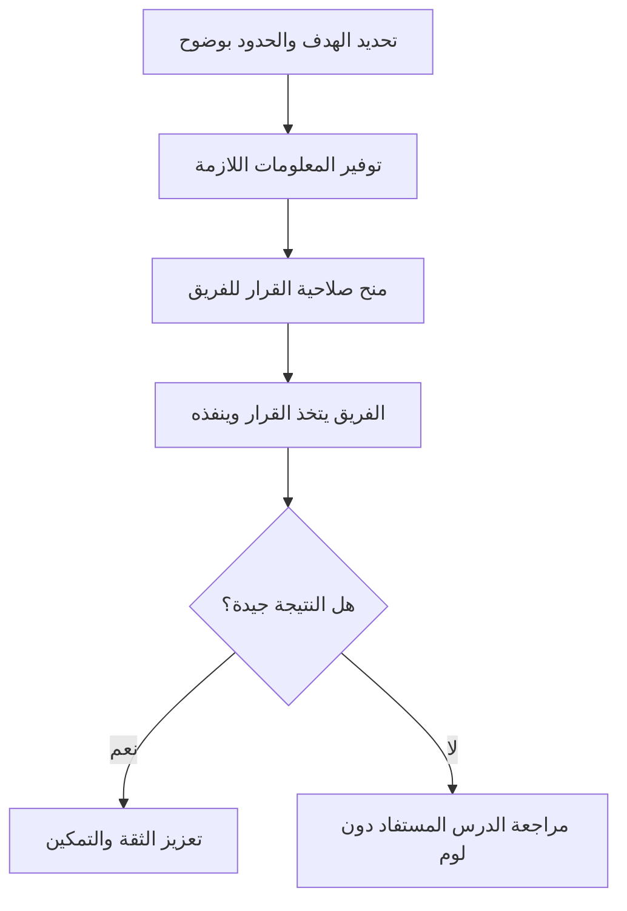

# التمكين (Empowerment)
> [!info] تعريف مختصر
> التمكين (Empowerment) هو منح أعضاء الفريق صلاحية اتخاذ القرارات المتعلقة بعملهم، مع الثقة والموارد اللازمة، بدل انتظار موافقة القائد على كل خطوة صغيرة.

## الشرح العلمي والاحترافي
التمكين مبدأ أساسي في القيادة الحديثة والمنهجيات الرشيقة (Agile). يقوم على فكرة بسيطة: الشخص الأقرب للمشكلة هو غالبًا الأنسب لاتخاذ القرار بشأنها، لأنه يملك التفاصيل والسياق الذي قد لا يملكه القائد.
- التمكين لا يعني "غياب القيادة" أو الفوضى؛ بل يعني أن القائد يحدد الأهداف والحدود بوضوح (Boundaries)، ثم يترك للفريق حرية اختيار "كيف" ينجز العمل ضمن هذه الحدود.
- يرتبط التمكين مباشرة بمفهوم [[Self-Organizing Team]]: الفرق الرشيقة الناجحة (خاصة في Scrum) تُمكَّن من تنظيم عملها، تقدير المهام، وحل مشاكلها التقنية اليومية دون تدخل إداري مستمر.
- يبني التمكين الملكية (Ownership): حين يشارك المطوّر في اتخاذ القرار، يشعر بمسؤولية أكبر تجاه النتيجة، وهذا يرفع الجودة والالتزام.
- التمكين الحقيقي يتطلب ثلاثة عناصر معًا: الصلاحية (Authority)، المعلومات الكافية لاتخاذ قرار جيد، والأمان النفسي لتحمّل تبعات القرار دون خوف من العقاب عند الخطأ — وهنا يتقاطع مع [[Psychological Safety]].

## أين ومتى يُستخدم
- عند بناء فرق Scrum أو Kanban ذاتية التنظيم، حيث يُمنح الفريق حرية اختيار الأدوات والطرق التقنية.
- في تفويض القرارات التشغيلية اليومية (مثل اختيار مكتبة برمجية أو ترتيب أولوية المهام التقنية الصغيرة) لأعضاء الفريق بدل مدير المشروع.
- عند توسّع الشركة وزيادة عدد الفرق، حيث يصبح من المستحيل على قائد واحد اتخاذ كل القرارات (راجع [[Leadership at Every Level]]).
- في برامج تطوير الموظفين الجدد بعد فترة تدريب أولية، لمنحهم تدريجيًا مسؤولية أكبر.

## مثال وسيناريو تطبيقي
> [!example] في شركة "بوابة السحاب" لتطوير حلول التخزين السحابي، كان مدير المشروع يوافق شخصيًا على كل قرار تقني صغير، مما أبطأ الفريق. قررت الإدارة تمكين فريق التطوير: حدّدت هدفًا واضحًا ("تقليل زمن استجابة الـ API إلى أقل من 200 مللي ثانية خلال ربع سنة") وميزانية تقنية محددة، وتركت للفريق حرية اختيار الأدوات وطريقة إعادة الهيكلة (Refactoring). خلال أسبوعين، اقترح أحد المطورين تحويل جزء من النظام إلى معمارية Microservices دون انتظار موافقة رسمية مطوّلة — لأن القرار كان ضمن حدود التمكين الممنوحة له. النتيجة: تحقّق الهدف قبل الموعد المحدد بأسبوع، وارتفعت معنويات الفريق لأنهم شعروا بالملكية الحقيقية على الحل.

## خطوات أو مخطّط
1. حدّد الهدف النهائي (Outcome) بوضوح، وليس التفاصيل التنفيذية.
2. ارسم الحدود (Boundaries): الميزانية، الجدول الزمني، القيود التقنية أو التنظيمية.
3. زوّد الفريق بالمعلومات والسياق الكافيين لاتخاذ قرار جيد.
4. امنح الصلاحية الفعلية (لا الشكلية) لاتخاذ القرار ضمن هذه الحدود.
5. ادعم الفريق عند الأخطاء بدل معاقبته، وناقش الدرس المستفاد بدل توزيع اللوم.

## ⚠️ مفاهيم خاطئة شائعة
> [!warning]
> - الاعتقاد أن التمكين يعني ترك الفريق بلا توجيه ("افعلوا ما تشاؤون"): التمكين الحقيقي يتطلب أهدافًا وحدودًا واضحة، وإلا تحوّل إلى فوضى.
> - الخلط بين التمكين والتفويض الشكلي: بعض القادة "يقولون" إنهم يمكّنون الفريق لكنهم يتدخلون في كل قرار صغير عمليًا، وهذا تمكين مزيف.
> - افتراض أن كل فريق جاهز للتمكين الكامل فورًا؛ التمكين يُبنى تدريجيًا مع نضج الفريق وثقته بنفسه.

## ❌ ممارسات خاطئة في المشاريع
> [!failure]
> - مدير يمنح الفريق "حرية القرار" لكنه يُلغي قراراتهم لاحقًا دون تفسير — الحل: الالتزام الفعلي بدعم القرارات المتخذة ضمن الحدود المتفق عليها، حتى لو اختلف معها القائد شخصيًا.
> - تمكين الفريق دون تزويده بالسياق الكافي (مثل أهداف العمل أو قيود الميزانية)، مما يؤدي لقرارات جيدة تقنيًا لكنها خاطئة استراتيجيًا — الحل: مشاركة المعلومات الكاملة قبل منح الصلاحية.
> - معاقبة الفريق بشدة عند أول خطأ بعد التمكين، مما يجعله يعود لطلب الموافقة على كل شيء خوفًا من الخطأ — الحل: التعامل مع الأخطاء كفرص تعلّم ضمن ثقافة [[Psychological Safety]].

## 🔗 مصطلحات ومفاهيم ذات صلة
- [[Theory X and Y]]
- [[Command and Control]]
- [[Chain of Command]]
- [[Self-Organizing Team]]
- [[Spotify Model]]
- [[Two-Pizza Team]]
- [[Psychological Safety]]
- [[Servant Leadership]]
- [[Leadership at Every Level]]
- [[Behavioral Leadership]]
- [[Micromanagement]]
- [[06 - Scrum Master]]
