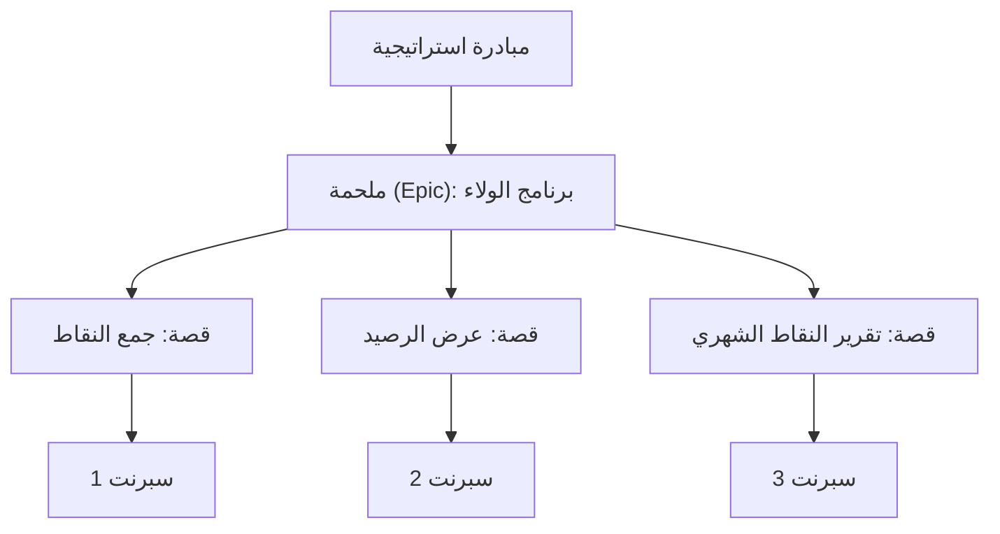

# الملحمة (Epic)

> [!info] تعريف مختصر
> الملحمة (Epic) هي عنصر عمل كبير جداً بحيث لا يمكن إنجازه في سبرنت واحد، ويُقسَّم إلى عدة قصص مستخدم ([[11 - User Stories]]) أصغر وقابلة للتنفيذ ضمن سبرنتات متتالية.

## الشرح العلمي والاحترافي
- الملحمة تمثل هدفاً أو ميزة كبيرة على مستوى المنتج، مثل "نظام دفع إلكتروني كامل" أو "إعادة تصميم تجربة التسجيل"، وليست مهمة تنفيذية مباشرة يمكن العمل عليها كما هي.
- لأن حجم الملحمة كبير وغير محدد التفاصيل بدقة، لا يمكن تقدير وقتها أو تسليمها دفعة واحدة؛ لذا يجب تفكيكها (Decomposition) إلى قصص مستخدم أصغر، كل واحدة تحقق [[INVEST Criteria]] وتُنجَز خلال سبرنت واحد.
- تُستخدم الملاحم في تنظيم الـ [[13 - Backlog]] على مستوى استراتيجي؛ فبدلاً من التعامل مع مئات القصص المبعثرة، يُجمَّع العمل ضمن ملاحم قليلة مرتبطة بأهداف عمل واضحة (وغالباً مرتبطة بـ [[OKR]] أو خارطة الطريق [[15 - Roadmap]]).
- التسلسل الهرمي الشائع هو: مبادرة (Initiative) ← ملحمة (Epic) ← قصة مستخدم (Story) ← مهمة (Task)؛ فالملحمة تقع في مستوى وسط بين الهدف الاستراتيجي العريض والعمل التفصيلي اليومي.
- تتبّع تقدم الملحمة عادة يكون عبر عدّ القصص المكتملة داخلها، أو عبر مخطط تراكمي مثل [[Burnup Chart]]، مما يعطي صورة واضحة عن نسبة الإنجاز دون الحاجة لتفاصيل كل قصة على حدة.

## أين ومتى يُستخدم
- يُستخدم في سكرم ([[02 - Scrum]]) وأدوات إدارة المنتج (مثل Jira) لتنظيم العمل على مستوى أعلى من قصص المستخدم الفردية.
- يُلجأ إليه في المراحل المبكرة من التخطيط، عندما تُعرف فكرة الميزة الكبيرة لكن تفاصيلها الدقيقة لم تُحدَّد بعد، فتُنشأ كملحمة عامة ثم تُفصَّل تدريجياً عبر [[Backlog Refinement]].
- يستخدمه مالك المنتج ([[05 - Product Owner]]) للتواصل مع الإدارة العليا وأصحاب المصلحة حول التقدم على مستوى الميزات الكبرى، بدلاً من إغراقهم بتفاصيل كل قصة.

## مثال وسيناريو تطبيقي
> [!example] سيناريو ملموس
> شركة تطبيق توصيل طعام تريد إطلاق "برنامج ولاء للعملاء" خلال الربع القادم. يُنشئ مالك المنتج ملحمة بعنوان "برنامج الولاء" في الـ Backlog.
> تُفصَّل هذه الملحمة تدريجياً إلى قصص مستخدم مثل: "بصفتي عميلاً، أريد جمع نقاط عند كل طلب حتى أحصل على خصومات"، و"بصفتي عميلاً، أريد رؤية رصيد نقاطي في صفحة حسابي"، و"بصفتي مديراً، أريد تقريراً بعدد النقاط الممنوحة شهرياً".
> على مدى 3 سبرنتات (6 أسابيع)، يُنجز الفريق هذه القصص واحدة تلو الأخرى، وعندما تكتمل جميعها، تُعتبر الملحمة "منتهية" وتُغلَق في الـ Backlog.

## خطوات أو مخطّط
1. تحديد الهدف العام للملحمة وربطها بهدف عمل واضح (مثلاً زيادة معدل الاحتفاظ بالعملاء).
2. إنشاء الملحمة في الـ Backlog كعنصر عمل عالي المستوى دون تفاصيل دقيقة بعد.
3. تفكيك الملحمة تدريجياً إلى قصص مستخدم أصغر أثناء [[Backlog Refinement]]، كل واحدة قابلة للإنجاز في سبرنت واحد.
4. تحديد أولوية القصص وإدخالها إلى السبرنتات المتتالية عبر [[08 - Sprint Planning]].
5. تتبّع تقدم الملحمة بعدّ القصص المكتملة أو عبر [[Burnup Chart]] حتى تكتمل جميع قصصها.

## ⚠️ مفاهيم خاطئة شائعة
> [!warning]
> - الظن أن الملحمة يمكن أن تدخل السبرنت وتُنجَز كما هي دون تفكيك؛ في الحقيقة يجب تقسيمها دائماً إلى قصص أصغر أولاً.
> - الخلط بين الملحمة والمبادرة (Initiative)؛ فالمبادرة أوسع وقد تحتوي عدة ملاحم، بينما الملحمة عادة تخص ميزة واحدة كبيرة.
> - الاعتقاد أن حجم الملحمة يجب أن يكون محدداً بدقة منذ البداية؛ في الواقع من الطبيعي أن تتوضح تفاصيلها تدريجياً مع تقدم الفريق في العمل عليها.

## ❌ ممارسات خاطئة في المشاريع
> [!failure]
> - ترك الملحمة دون تفكيك لفترة طويلة، فتبقى غامضة ويصعب تقدير تقدمها الفعلي. التجنب: تفكيك جزء من الملحمة إلى قصص واضحة قبل كل سبرنت عبر [[Backlog Refinement]] المستمر.
> - محاولة إدخال الملحمة كاملة في سبرنت واحد لأن الفريق "متحمس لإنجازها بسرعة"، مما يخالف [[INVEST Criteria]] ويؤدي غالباً إلى فشل السبرنت. التجنب: الالتزام بتقسيم العمل إلى قصص صغيرة قابلة للإنجاز ضمن مدة السبرنت.
> - عدم ربط الملحمة بهدف عمل واضح، فتصبح مجرد "قائمة ميزات" دون معنى استراتيجي. التجنب: ربط كل ملحمة بهدف قابل للقياس مثل [[OKR]] أو [[Business Case]] قبل البدء بها.

## 🔗 مصطلحات ومفاهيم ذات صلة
[[11 - User Stories]] | [[13 - Backlog]] | [[Backlog Refinement]] | [[INVEST Criteria]] | [[15 - Roadmap]] | [[OKR]] | [[Burnup Chart]] | [[05 - Product Owner]] | [[Task and Story Slicing]] | [[08 - Sprint Planning]]
