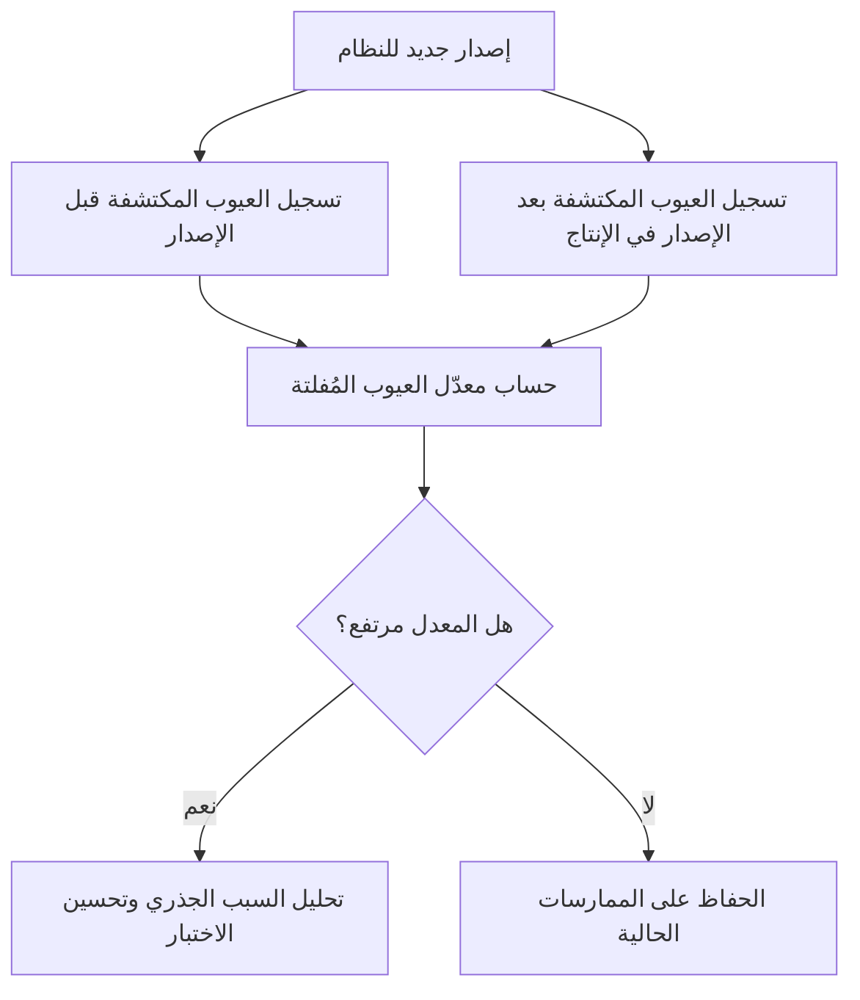

# معدّل العيوب المُفلتة (Escaped Defect Rate)
> [!info] تعريف مختصر
> معدّل العيوب المُفلتة هو مؤشر يقيس نسبة العيوب (Defects/Bugs) التي "أفلتت" من كل مراحل الاختبار الداخلي ووصلت إلى بيئة الإنتاج ليكتشفها المستخدمون الحقيقيون بدلًا من فريق الجودة.

## الشرح العلمي والاحترافي
- يُحسب هذا المؤشر عادة بصيغة تقريبية:
  Escaped Defect Rate = عدد العيوب المكتشَفة في الإنتاج ÷ (عدد العيوب المكتشَفة في الإنتاج + عدد العيوب المكتشَفة قبل الإصدار) × 100%
- كلما ارتفعت هذه النسبة، دلّ ذلك على ضعف في عمليات الاختبار الداخلية (سواء [[Regression Testing]] أو [[UAT]] أو تغطية [[Edge Cases]] غير الكافية)، وكلما انخفضت دلّ على فعالية أعلى في اكتشاف العيوب مبكرًا قبل وصولها للمستخدم.
- هو أحد أهم مؤشرات الأداء (KPI) في فرق الجودة والهندسة، لأنه يقيس أثر الاختبار على تجربة العميل الفعلية وليس فقط على عدد الاختبارات المكتوبة.
- يرتبط مباشرة بمبدأ [[Shift-Left and Shift-Right]]: الشركات التي تختبر مبكرًا وبعمق (Shift-Left) تميل لخفض هذا المعدل، لأن معظم العيوب تُكتشف وتُصلح قبل الإصدار وليس بعده.
- يُستخدم أيضًا كمقياس غير مباشر لجودة عملية [[QA vs QC]] ولفعالية [[Risk-Based Testing]]، ويُقارَن عادة عبر إصدارات متتالية لمعرفة هل تتحسن جودة الفريق أم تتراجع.

## أين ومتى يُستخدم
- بعد كل إصدار (Release)، لتقييم مدى فعالية دورة الاختبار التي سبقته.
- في تقارير الجودة الشهرية أو ربع السنوية على مستوى المنتج أو الفريق.
- عند مقارنة أداء فرق أو منتجات مختلفة من ناحية نضج عمليات الاختبار.
- في اجتماعات [[10 - Sprint Retrospective]] عندما يرتفع هذا المعدل بشكل ملحوظ، لفهم السبب عبر [[Root Cause Analysis]].
- كمدخل لتخطيط الاستثمار في الاختبار الآلي أو زيادة تغطية [[Edge Cases]].

## مثال وسيناريو تطبيقي
> [!example] في شركة تطوير تطبيقات، سجّل فريق الجودة أنه خلال الربع الأول من العام اكتشف الفريق داخليًا 180 عيبًا قبل الإصدار، بينما اكتشف المستخدمون في الإنتاج 20 عيبًا إضافيًا بعد الإطلاق. معدّل العيوب المُفلتة = 20 ÷ (20 + 180) × 100% = 10%. في الربع الثاني، بعد إضافة اختبارات انحدار آلية جديدة وتوسيع تغطية الحالات الحافّة، انخفض العدد إلى 8 عيوب مُفلتة فقط من إجمالي 210، أي معدل قدره نحو 3.8%. عرض مدير الجودة هذا التحسن في اجتماع الإدارة كدليل ملموس على أن الاستثمار في أتمتة الاختبار حسّن تجربة العملاء وقلّل الأعطال بعد الإطلاق.

## خطوات أو مخطّط
1. تسجيل كل عيب مكتشَف مع تحديد "أين" اكتُشف: قبل الإصدار (داخليًا) أو بعده (في الإنتاج).
2. حساب المعدل بشكل دوري (شهري أو لكل إصدار).
3. تتبّع الاتجاه عبر الزمن، لا الرقم المطلق لمرة واحدة فقط.
4. عند ارتفاع المعدل، إجراء [[Root Cause Analysis]] لمعرفة أين ضعفت عملية الاختبار.
5. تحسين تغطية الاختبار (حالات حافّة، اختبار انحدار، اختبار قبول) بناءً على النتائج، وإعادة القياس في الدورة التالية.

## ⚠️ مفاهيم خاطئة شائعة
> [!warning]
> - الاعتقاد أن هدف الفريق يجب أن يكون "صفر بالمئة" دائمًا؛ الوصول لصفر مطلق مكلف جدًا وغير واقعي عمليًا لمعظم المنتجات، والهدف هو خفض المعدل ضمن حدود مقبولة للمخاطر.
> - قراءة الرقم بمعزل عن حجم الإصدار؛ إصدار كبير جدًا وبه عيبان مُفلتان قد يكون أفضل بكثير من إصدار صغير وبه عيب واحد فقط نسبيًا.
> - الظن أن ارتفاع المعدل يعني دائمًا "فريق اختبار ضعيف"؛ أحيانًا السبب تغيير مفاجئ في تعقيد المنتج أو ضغط زمني على الجدول لم يُمنح فيه وقت اختبار كافٍ.

## ❌ ممارسات خاطئة في المشاريع
> [!failure]
> - عدم تصنيف العيوب حسب مكان اكتشافها (داخلي مقابل إنتاج)، فيصبح حساب المؤشر مستحيلًا. الحل: إلزام الفريق بتحديد مصدر اكتشاف كل عيب عند تسجيله في [[Issue Log]].
> - استخدام هذا المؤشر لمعاقبة الأفراد بدلًا من تحسين العملية، ما يدفع الفريق لإخفاء العيوب بدل الإبلاغ عنها. الحل: التعامل مع المؤشر كأداة تحسين جماعي لا أداة محاسبة فردية.
> - تجاهل خفض هذا المعدل رغم ارتفاعه المستمر، ما يؤدي لتراكم عدم رضا العملاء دون معالجة السبب الجذري. الحل: ربط المؤشر بخطة تحسين واضحة عند تجاوزه حدًا معينًا.

## 🔗 مصطلحات ومفاهيم ذات صلة
[[Regression Testing]], [[UAT]], [[Edge Cases]], [[Root Cause Analysis]], [[Shift-Left and Shift-Right]], [[Risk-Based Testing]], [[QA vs QC]], [[KPI]], [[Reopen]], [[10 - Sprint Retrospective]]
