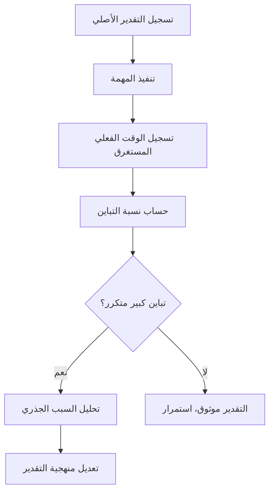

# تباين التقدير (Estimation Variance)
> [!info] تعريف مختصر
> تباين التقدير (Estimation Variance) هو مقدار الفرق بين التقدير الأصلي لمهمة أو مشروع (Original Estimate) والزمن أو الجهد الفعلي المُستغرق فيها، ويُستخدم لقياس دقة عملية التقدير وتحسينها مستقبلًا.

## الشرح العلمي والاحترافي
- يُحسب تباين التقدير عادة بصيغة: (الفعلي − المقدَّر) ÷ المقدَّر × 100%، فيعطي نسبة مئوية توضح هل كان التقدير متفائلًا جدًا (تباين موجب كبير) أو متشائمًا جدًا (تباين سالب).
- في تحليل PERT، يُحسب التباين إحصائيًا من ثلاثة تقديرات: المتفائل (Optimistic)، الأرجح (Most Likely)، والمتشائم (Pessimistic)، باستخدام الصيغة: التباين = ((المتشائم − المتفائل) ÷ 6)².
- التباين المرتفع في تقدير مهمة يدل على غموض في المتطلبات أو نقص في الخبرة السابقة المشابهة، وغالبًا ما يشير إلى الحاجة لتقسيم المهمة (انظر [[Task and Story Slicing]]) أو مزيد من التوضيح قبل البدء.
- يُستخدم متوسط تباين التقدير عبر عدة سبرنتات كمؤشر لتحسين عملية التخطيط، وليس لمعاقبة الأفراد؛ فالهدف هو تحسين المعايرة الجماعية للفريق (Team Calibration) لا كشف "الخطأ" الفردي.
- يرتبط تباين التقدير ارتباطًا وثيقًا بمحاكاة مونت كارلو (Monte Carlo Simulation) التي تستخدم توزيعات احتمالية بدلًا من رقم واحد للتنبؤ بمواعيد أكثر واقعية.

## أين ومتى يُستخدم
- في مراجعات ما بعد السبرنت (Sprint Retrospective) لتحليل الفجوة بين ما خُطِّط له وما تحقّق فعليًا.
- في تحليل PERT/CPM لحساب الانحراف المعياري للمسار الحرج (Critical Path) وتحديد احتمالية إنجاز المشروع في الموعد.
- عند بناء مخازين زمنية (Buffer) في منهجية سلسلة الحرجة، حيث يُشتق حجم المخزون من تباين التقديرات الفردية.
- عند تقييم أداء عملية التخطيط عبر عدة مشاريع لتحسين دقة التقدير المستقبلي.

## مثال وسيناريو تطبيقي
> [!example] فريق تطوير قدّر مهمة "بناء واجهة API للدفع الإلكتروني" بـ 5 أيام (Original Estimate). استغرق التنفيذ الفعلي 8 أيام بسبب تعقيدات غير متوقعة في بوابة الدفع الخارجية. تباين التقدير = (8−5)÷5×100% = 60% تجاوز. عند مراجعة الاستبطان (Retrospective)، يكتشف الفريق أن سبب التجاوز هو نقص الخبرة السابقة مع مزوّد الدفع تحديدًا، وليس ضعفًا عامًا في التقدير. يقرر الفريق مستقبلًا إضافة معامل تصحيح (Correction Factor) بنسبة 30% لأي مهمة تتضمن تكاملًا مع طرف ثالث جديد لم يتعامل معه الفريق سابقًا.

## خطوات أو مخطّط
1. سجّل التقدير الأصلي (Original Estimate) لكل مهمة قبل البدء.
2. سجّل الزمن أو الجهد الفعلي المستغرق بعد الإنجاز.
3. احسب التباين: (الفعلي − المقدَّر) ÷ المقدَّر × 100%.
4. اجمع التباينات عبر عدة مهام أو سبرنتات لرصد نمط عام (تفاؤل مزمن أم تشاؤم مزمن).
5. حلّل أسباب التباينات الكبيرة تحديدًا (غموض متطلبات، تبعيات خارجية، نقص خبرة).
6. عدّل منهجية التقدير المستقبلية بناءً على الأنماط المكتشفة.

## ⚠️ مفاهيم خاطئة شائعة
> [!warning]
> - الاعتقاد بأن هدف قياس التباين هو "لوم" من أخطأ في التقدير، بينما الهدف الحقيقي هو تحسين العملية الجماعية.
> - افتراض أن التباين الصفري في كل مهمة هدف واقعي أو مرغوب؛ بعض التباين الطبيعي متوقع دومًا ولا يشير لخلل.
> - الخلط بين تباين التقدير وتباين الجدول الزمني الكلي للمشروع؛ الأول على مستوى المهمة الفردية، والثاني تراكمي وأوسع.

## ❌ ممارسات خاطئة في المشاريع
> [!failure]
> - عدم تسجيل التقديرات الأصلية بشكل موثّق، فيصبح قياس التباين لاحقًا مستحيلًا أو غير دقيق.
> - معاقبة الأفراد على تباين التقدير الفردي، مما يدفعهم لتضخيم التقديرات دفاعيًا في المستقبل (تقدير آمن مبالغ فيه).
> - تجاهل تحليل السبب الجذري (Root Cause Analysis) وراء التباين المتكرر، والاكتفاء بتسجيل الرقم دون فهم لماذا حدث.

## 🔗 مصطلحات ومفاهيم ذات صلة
[[Original Estimate]] | [[Relative Estimation]] | [[Planning Poker]] | [[Monte Carlo Simulation]] | [[Root Cause Analysis]] | [[Buffer]] | [[Critical Path]] | [[12 - Story Points]]
