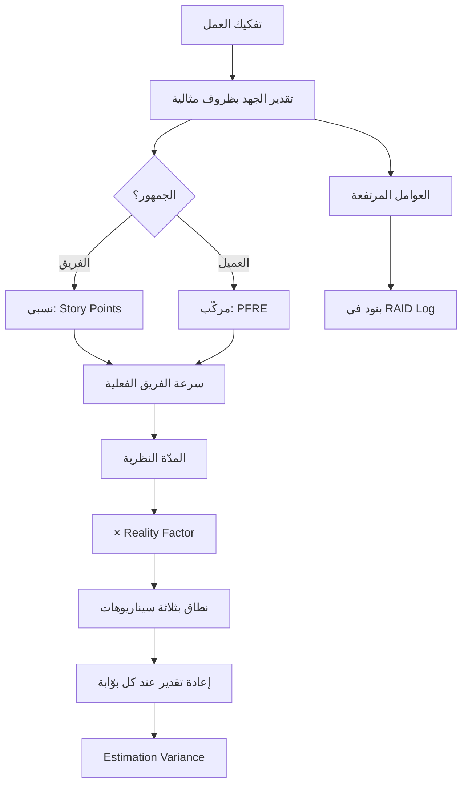

# التقدير (Estimation)

> [!info] تعريف مختصر
> **التقدير** هو التنبّؤ المنهجي بالجهد أو المدّة أو التكلفة اللازمة لإنجاز عمل لم يُنجَز بعد. وجوهره أنه **احتمال لا وعد**: فالغرض منه ليس إصابة رقم واحد، بل **تحديد نطاق معقول وكشف مصادر عدم اليقين** حتى تُدار قبل أن تتحوّل إلى تأخير. والتقدير الذي يُقدَّم كرقم واحد مجرَّد من افتراضاته يفقد وظيفته الأساسية ويصير التزاماً لا معلومة.

## الشرح العلمي والاحترافي

- **التفريق المؤسِّس: الجهد ≠ المدّة**
  | | `Effort` (الجهد) | `Duration` (المدّة) |
  |---|---|---|
  | يقيس | ساعات عمل فعلية | زمن منقضٍ حتى الإنجاز |
  | يتأثّر بـ | حجم العمل وتعقيده | الجهد + الانتظار + التبعيات + التفرّغ |
  | مثال | 40 ساعة عمل | 3 أسابيع |
  
  والخلط بينهما أشيع سبب لانهيار الجداول: يُقدَّر الجهد بأربعين ساعة فيوعَد بأسبوع واحد، بينما زمن الانتظار وتبديل السياق يجعلانها ثلاثة.

- **مدارس التقدير الثلاث**:
  1. **المطلق (`Absolute`)** — بالساعات أو الأيام. مباشر لكنه هشّ: يفترض تفرّغاً كاملاً ويتجاهل الانتظار.
  2. **النسبي ([[Relative Estimation]])** — بالمقارنة بعنصر مرجعي ([[12 - Story Points|نقاط القصة]]). أدقّ من المطلق لأن البشر يقارنون أفضل ممّا يقيسون، لكنه غير قابل للتفسير خارج الفريق.
  3. **المركّب (`Composite`)** — يفكّك التقدير إلى طبقات معلَنة: حجم وظيفي × مضاعِفات تعقيد × سرعة فعلية. وهو ما يفعله [[PFRE]] في مشاريع الأنظمة المؤسسية، ويتميّز بأنه **قابل للتفكيك أمام العميل**.

- **مخروط عدم اليقين (`Cone of Uncertainty`)**: دقّة التقدير ليست ثابتة عبر عمر المشروع. في مرحلة الفكرة قد يكون الخطأ ±4 أضعاف، وينكمش تدريجياً كلّما زادت المعرفة. **والنتيجة العملية:** تقديرٌ في بداية المشروع يُعرَض كرقم واحد هو ادّعاء معرفة غير موجودة. اعرض **نطاقاً** يضيق مع كل بوّابة مرحلية.

- **لماذا نعرض نطاقاً لا رقماً؟** لأن الرقم الواحد يُقرأ كوعد، والنطاق يُقرأ كمعلومة. والصيغة المهنية: «في أفضل الفروض خمسة أشهر، وفي الأرجح ستة، وفي أسوأ الفروض سبعة — والفارق سببه سرعة قراراتكم وجاهزية بياناتكم.» وهذه الجملة **تنقل جزءاً من التحكّم إلى العميل** بدل أن تجعله متلقّياً لرقم.

- **التقدير المثالي مقابل الواقعي**: كل تقدير تقني يفترض ضمناً أن القرارات فورية والبيانات جاهزة ولا انتظار. ولأن هذا غير صحيح، يُضرب التقدير المثالي في [[Reality Factor|معامل الواقعية]] المشتقّ من تشخيص بيئة العميل لا من الحدس.

- **التقدير كأداة كشف لا حساب فقط**: أثمن ما ينتجه التقدير ليس الرقم بل **الأسئلة التي أجبرك على طرحها**: كم نظاماً يتأثّر؟ من يعتمد؟ ما حالة البيانات؟ ماذا يتعطّل بدونه؟ وكل عامل مرتفع في التقدير هو **مخاطرة مُكتشَفة مبكّراً** تدخل [[RAID Log]].

- **الفرق بين التقدير والالتزام (`Estimate vs Commitment`)**: التقدير مُخرَج تحليلي يملكه الفريق؛ والالتزام قرار إداري يملكه من يتحمّل عواقبه. وحين تُدمَج الكلمتان يصير الفريق مسؤولاً عن وعدٍ لم يقطعه — وهذا أصل معظم إرهاق الفرق.

## أين ومتى يُستخدم
- في **إعداد العروض الفنية والمالية** وتحديد الجداول التعاقدية.
- في **تخطيط السبرنت** لتحديد ما يسع الفريق إنجازه.
- عند **تقييم [[Change Request|طلبات التغيير]]** لتحويل الطلب إلى أثر زمني ومالي معلن.
- في **قرار التقسيم المرحلي**: توزيع الجهد يكشف أين يتركّز الثقل.
- عند **المفاضلة بين حلّ قياسي وتخصيص**، إذ تُظهر الأرقام كلفة التخصيص الحقيقية.
- في **المعايرة بعد التسليم** عبر [[Estimation Variance|انحراف التقدير]] لتحسين المشاريع القادمة.

## مثال وسيناريو تطبيقي
> [!example] نفس النطاق — ثلاثة تقديرات مختلفة كلّها «صحيحة»
> فريق يقدّر تدفّق مبيعات كامل:
>
> | الطريقة | الناتج | ما تخفيه |
> |---|---|---|
> | **مطلق** | «40 يوم عمل» | لا تقول شيئاً عن الانتظار ولا عن تفرّغ الفريق |
> | **نسبي** | «120 نقطة» | غير مفهومة خارج الفريق؛ لا تصلح للعقد |
> | **مركّب ([[PFRE]])** | «77.3 وحدة ← 15.5 أسبوعاً نظرياً ← 34 أسبوعاً واقعياً» | **لا تخفي شيئاً**: كل طبقة معلَنة وقابلة للنقاش |
>
> **ما حدث في الاجتماع:** حين عُرض الرقم المطلق اعترض العميل («40 يوماً كثيرة»)، وتحوّل النقاش إلى مساومة على الرقم. وحين عُرض التقدير المركّب تغيّر السؤال إلى: **«أي طبقة نستطيع خفضها؟»** — فاتّضح أن 18.5 أسبوعاً من الـ34 مصدرها بطء القرارات وضعف البيانات، وكلاهما بيد العميل.
>
> **النتيجة:** وُقّع [[SLA]] للقرارات وشُكّل فريق تنظيف بيانات، فانخفض [[Reality Factor|معامل الواقعية]] من 2.2 إلى 1.6 وقصر الجدول اثني عشر أسبوعاً — **دون أن يتغيّر النطاق ولا حجم الفريق**.

## خطوات أو مخطّط
1. فكّك العمل إلى بنود قابلة للفهم (خطوات عملية لا شاشات).
2. قدّر **الجهد** أولاً بظروف مثالية — دون احتياطات مخفية.
3. اختر طريقة تناسب الجمهور: نسبية داخلياً، مركّبة أمام العميل.
4. حدّد افتراضات كل بند واكتبها — الافتراض غير المكتوب مخاطرة صامتة.
5. حوّل الجهد إلى مدّة عبر سرعة الفريق الفعلية لا النظرية.
6. طبّق [[Reality Factor|معامل الواقعية]] المشتقّ من تشخيص بيئة العميل.
7. اعرض **نطاقاً** بثلاثة سيناريوهات لا رقماً واحداً.
8. حوّل كل عامل مرتفع إلى بند في [[RAID Log]].
9. أعد التقدير عند كل بوّابة مرحلية، وسجّل الفعلي مقابل المقدَّر.

## ⚠️ مفاهيم خاطئة شائعة
> [!warning]
> - **الخلط بين الجهد والمدّة**: أربعون ساعة عمل ليست أسبوعاً واحداً في أي بيئة حقيقية.
> - **الظنّ بأن التقدير وعد**: هو احتمال بنطاق؛ والالتزام قرار إداري منفصل.
> - **اعتبار الرقم الواحد دقّة**: الرقم الواحد في مرحلة مبكّرة ادّعاء معرفة غير موجودة.
> - **الاعتقاد بأن التقدير مهمّة تُنجَز مرّة**: هو نشاط متكرّر يضيق نطاقه مع كل بوّابة.
> - **الظنّ بأن الدقّة تأتي من التفصيل الأكبر**: تفصيل مفرط فوق مجهول كبير يعطي دقّة زائفة، والأفضل تقليل المجهول أولاً.
> - **قياس جودة المقدِّر بإصابة الرقم**: تُقاس بـ**اتّساق الانحراف** لا بالإصابة — انحراف ثابت 20% قابل للمعايرة، وانحراف عشوائي لا.

## ❌ ممارسات خاطئة في المشاريع
> [!failure]
> - **الضغط على الفريق لخفض التقدير دون خفض النطاق**: يُنتج رقماً مقبولاً وجدولاً مستحيلاً. الحلّ: التفاوض على النطاق لا على الرقم.
> - **إخفاء الافتراضات**: يجعل الانحراف اللاحق يبدو فشلاً بدل أن يبدو افتراضاً سقط. الحلّ: قائمة افتراضات ملحقة بكل تقدير.
> - **إضافة احتياطي مخفيّ داخل البنود**: يفسد المعايرة ويمنع التفاوض على السبب. الحلّ: [[Buffer|احتياطي]] معلن على مستوى المشروع.
> - **عدم قياس الفعلي مقابل المقدَّر**: يحرم المؤسسة من التحسّن التراكمي. الحلّ: تسجيل [[Estimation Variance]] لكل بند مُنجَز.
> - **تقدير عمل لم يُفهَم بعد**: يُنتج رقماً بلا معنى. الحلّ: قل «لا أعرف بعد» واطلب مرحلة استكشاف مُقدَّرة زمنياً (`Time-box`).
> - **استخدام تقدير فريق على فريق آخر**: السرعة خاصية الفريق لا العمل. الحلّ: احتفظ بالحجم واقسمه على سرعة الفريق المنفِّذ.

## 🔗 مصطلحات ومفاهيم ذات صلة
[[PFRE]] | [[Relative Estimation]] | [[12 - Story Points]] | [[Effort Units]] | [[Reality Factor]] | [[Estimation Variance]] | [[18 - Velocity]] | [[Buffer]] | [[Phasing]] | [[RAID Log]]
