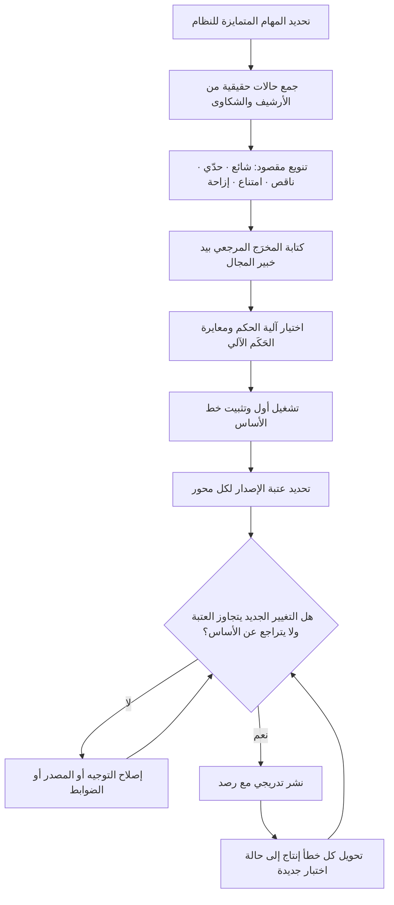

# التقييمات (Evals)

> [!info] تعريف مختصر
> مجموعة **محفوظة وثابتة** من حالات الاختبار — مُدخل، ومخرَج مرجعي أو معيار حكم واضح — تُشغَّل آليًّا عند كل تغيير يمسّ سلوك نظام مبني على الذكاء الاصطناعي: ترقية النموذج، أو تعديل التوجيه، أو تغيّر مصادر المعرفة، أو تحديث ضوابط الأمان. وظيفتها تحويل السؤال «هل صار أفضل؟» من انطباع شخصي إلى رقم قابل للمقارنة قبل/بعد. هي البديل العملي الوحيد عن عبارة «جرّبناها وبدت جيّدة» — تلك العبارة التي تعمل مع عشر حالات مألوفة ثم تنهار أمام آلاف الحالات الحقيقية. التقييمات لأنظمة الذكاء الاصطناعي نظيرٌ لما تمثّله اختبارات الانحدار للبرمجيات التقليدية ([[Regression Testing]])، مع فارق جوهري: المخرَج هنا نصّ متغيّر لا قيمة ثابتة، فيلزم تعريف «الصحيح» تعريفًا صريحًا قبل القياس.

## الشرح العلمي والاحترافي
- **المشكلة التي وُجدت لحلّها: عدم الحتمية**: البرنامج التقليدي يعطي المخرَج نفسه للمُدخل نفسه، فيكفي اختبار واحد ليقطع. النموذج اللغوي قد يعطي صياغتين مختلفتين للطلب نفسه، وقد ينجح في الحالة أ ويفشل في الحالة أ′ المشابهة لها. لذلك لا يقول التقييم «نجح أو فشل» عن حالة واحدة، بل يقيس **معدّلًا عبر عيّنة كافية** — والحكم يكون على التوزيع لا على المثال.
- **الحالات مُلك المنتج لا مُلك الهندسة**: أصعب جزء في بناء التقييم ليس تشغيله، بل الإجابة عن سؤال «ما الإجابة الصحيحة هنا؟» — وهو سؤال عمل لا سؤال تقني. من يملك المشكلة (مدير المنتج، محلّل الأعمال، خبير المجال) هو من يكتب الإجابات المرجعية؛ والمهندس يبني آلة التشغيل والقياس.
- **الحالات السلبية أثمن من الإيجابية**: مجموعة تقييم مكوّنة من أسئلة يعرف الفريق أن النظام يجيب عنها جيّدًا لا تقيس شيئًا سوى الطمأنينة. القيمة تأتي من: حالات يجب أن تنتهي بامتناع، وحالات مُدخل ناقص أو متناقض، وحالات خارج النطاق، ومحاولات إزاحة التعليمات، وحالات لغوية صعبة (عربي عامّي، تبديل لغة داخل الجملة، أخطاء إملائية).
- **ثلاثة أنماط للحكم، تُخلط بحسب المهمّة**: (١) **حكم آلي حاسم** حين يكون هناك جواب واحد صحيح أو قائمة مغلقة — التصنيف، الاستخراج، مطابقة الحقول، وجود الاستشهاد في المصدر. (٢) **حكم بشري** بمعيار مكتوب لمهام الصياغة والنبرة والملاءمة، ويُطبَّق على عيّنة لا على الكل. (٣) **نموذج حَكَم (LLM-as-judge)** يقيس مطابقة المخرَج لمعيار موصوف، وهو رخيص وسريع لكنه **يحتاج معايرة**: يُقاس اتفاقه مع الحكم البشري على عيّنة أولًا، وإلا فإنك تقيس تحيّز حَكَم غير موثوق. مخاطره معروفة: ميل إلى الإجابات الأطول والأكثر بلاغة، وتساهل مع مخرجات تشبه أسلوبه.
- **العتبة قرار عمل لا رقم تقني**: «90% دقّة» بلا معنى ما لم يُحدَّد ما كلفة الـ10% الباقية ومن يتحمّلها. الفريق الناضج يحدّد عتبة إصدار لكل فئة بحسب أثر الخطأ ([[Probability and Impact Matrix]])، وقد يقبل 80% في مهمّة اقتراحية بينما يشترط 99% مع مراجعة بشرية في مهمّة مالية.
- **الأخطاء الحقيقية هي الوقود**: أفضل مصدر لحالات جديدة هو الإنتاج نفسه — كل شكوى مستخدم، وكل تصحيح يدوي من موظّف، وكل حادثة تُدرَس ([[Root Cause Analysis]]) يجب أن تنتهي بحالة اختبار مضافة. بهذا تنمو المجموعة في اتجاه الضعف الحقيقي لا في اتجاه ما يتخيّله الفريق.
- **التلوّث وفقدان المعنى**: إذا صار الفريق يعدّل التوجيه مرارًا حتى يحفظ حالات المجموعة تحديدًا، فقد قِيست القدرة على اجتياز الاختبار لا القدرة على أداء المهمّة. العلاج المعتاد: الاحتفاظ بجزء **محجوب (Holdout)** لا يُطّلع عليه أثناء التطوير، وتدوير الحالات دوريًّا.
- **الكلفة والزمن قيدان مشروعان**: تقييم من آلاف الحالات على كل تغيير قد يكون بطيئًا ومكلفًا. الممارسة الشائعة تقسيم المجموعة إلى طبقة سريعة صغيرة (عشرات الحالات) تُشغَّل مع كل تعديل، وطبقة كاملة تُشغَّل قبل الإصدار أو عند ترقية النموذج — بنفس منطق بوّابات التكامل المستمر ([[CI and CD]]).
- **التقييم يقيس أيضًا ما ليس جودةً نصّية**: زمن الاستجابة، والكلفة لكل طلب، ومعدّل الامتناع، ونسبة الإحالة إلى إنسان. نظام «أدقّ» بضعف الكلفة وثلاثة أضعاف الزمن قد يكون قرارًا خاسرًا؛ فالقرار يُتّخذ على لوحة مؤشّرات لا على رقم واحد.

## أين ومتى يُستخدم
- **كبوّابة إصدار قبل نشر أي تغيير**: لا يُنشر تعديل توجيه ولا ترقية نموذج قبل تشغيل المجموعة ومقارنة النتيجة، تمامًا كشرط اجتياز الاختبارات في خطّ التسليم ([[CI and CD]]).
- **عند المفاضلة بين نموذجين أو مورّدين**: بدل الاعتماد على نتائج معايير عامة منشورة لا تشبه بياناتك، تُشغَّل مجموعتك أنت على الخيارين وتُقارن الدقّة والكلفة والزمن معًا ([[Vendor Management]]).
- **في تعريف الإنجاز ومعايير القبول**: بلوغ العتبة يصير بندًا في [[Definition of Done]]، وتُكتب الحالات بصيغة قابلة للاختبار ([[Given When Then]]).
- **في قياس الهلوسة تحديدًا ([[Hallucination]])**: عبر حالات لها إجابة مرجعية موثّقة، وحالات مصمّمة لتغري النموذج باختلاق مصدر أو رقم.
- **في ضبط عمل هندسة التوجيه ([[Prompt Engineering]])**: كل تعديل في الصياغة يُقاس أثره رقميًّا بدل الجدل الذوقي حول أي صياغة «أفضل».
- **في اختبار المسار البديل ([[Graceful Degradation]])**: حالات تحاكي تعطّل المزوّد أو تجاوز الكلفة للتأكّد من أن السلوك البديل يعمل فعلًا لا في التصميم فقط.
- **بعد كل حادثة إنتاج**: تُضاف الحالة إلى المجموعة كإجراء ثابت، فتتحوّل الحادثة إلى مناعة دائمة بدل درس منسي ([[Feedback Loop]]).

## مثال وسيناريو تطبيقي
> [!example] بنك رقمي في المنطقة بنى مساعدًا يجيب عن أسئلة العملاء حول الرسوم وحدود التحويل. قبل بناء التقييم كانت طريقة الاعتماد: يجرّب ثلاثة موظّفين نحو 25 سؤالًا قبل كل إصدار، وإن «بدت الإجابات جيّدة» يُنشر. في ثلاثة أشهر وقعت حادثتان: الأولى إجابة برسوم تحويل دولي قديمة أُلغيت قبل عام، والثانية بعد ترقية روتينية للنموذج توقّف فيها المساعد عن الالتزام ببنية الحقول التي تعتمدها الواجهة، فظهرت نصوص خام للعملاء لأربع ساعات.
> **بناء المجموعة الأولى** استغرق أسبوعين بمشاركة مديرة المنتج وموظّفَين من مركز الاتصال. المصادر: 600 محادثة حقيقية من الأرشيف اختير منها 210 حالة بتنويع مقصود — لا بأخذ الأكثر تكرارًا فقط. التوزيع النهائي: 90 حالة أسئلة شائعة بإجابات مرجعية مأخوذة من جدول الرسوم المعتمد؛ 35 حالة يجب أن تنتهي بامتناع وإحالة (استفسارات عن منتجات موقوفة، أو طلبات نصيحة استثمارية، أو أسئلة عن حساب شخص آخر)؛ 30 حالة صياغة صعبة (عامّية خليجية، وخلط عربي-إنجليزي، وأخطاء إملائية في أسماء المنتجات)؛ 25 حالة مُدخل ناقص يجب أن ينتهي بسؤال توضيحي لا بافتراض؛ 20 حالة محاولة إزاحة للتعليمات؛ 10 حالات كانت سببًا في شكاوى فعلية.
> **آلية الحكم** كانت مختلطة: الحالات ذات الجواب الرقمي أو التصنيفي تُحكم آليًّا بمطابقة تامة؛ حالات الامتناع تُحكم آليًّا بوجود سلوك الإحالة؛ وحالات الصياغة يحكمها نموذج حَكَم بمعيار مكتوب من خمسة بنود، بعد أن قيس اتفاقه مع حكم بشري على 50 حالة فبلغ 86% — واعتُبر مقبولًا للمتابعة الدورية مع بقاء عيّنة أسبوعية بشرية.
> **النتيجة الأولى** كانت صادمة للفريق: 71% على الحالات الشائعة، و12 من 35 فقط في حالات الامتناع، و4 من 20 في محاولات الإزاحة. بعد ثلاث دورات تحسين (إغلاق قوائم القيم، وإلزام الاستشهاد بجدول الرسوم السارية، ووسم المستندات بتاريخ السريان، ونقل منع الأسئلة الاستثمارية إلى فلتر تقني خارج النموذج): 93%، و33 من 35، و18 من 20.
> ثبّت البنك القاعدة التالية: لا إصدار دون تشغيل المجموعة كاملة، ولا نشر إذا تراجع أي محور عن خط الأساس المعتمد ([[Baseline]])، وكل شكوى عميل تتحوّل خلال 48 ساعة إلى حالة اختبار جديدة. عند ترقية النموذج التالية أمسك التقييم — قبل النشر — تراجعًا في الالتزام ببنية الحقول، وهو العطل نفسه الذي كلّفهم أربع ساعات انقطاع سابقًا.

## خطوات أو مخطّط
1. حدّد المهام المتمايزة التي يؤدّيها النظام (تصنيف، إجابة معرفية، صياغة، استخراج)، وابنِ لكل مهمّة مجموعتها؛ فخلطها في مقياس واحد يخفي الضعف.
2. اجمع الحالات من الواقع لا من الخيال: أرشيف المحادثات، تذاكر الدعم، الشكاوى، تصحيحات الموظّفين اليدوية.
3. نوّع عمدًا: حالات شائعة، وحدّية ([[Edge Cases]])، وناقصة، وخارج النطاق، ويجب أن تنتهي بامتناع، ومحاولات إزاحة تعليمات.
4. اكتب لكل حالة **المخرَج المرجعي أو معيار الحكم**، بيد خبير المجال، ووثّق سبب اعتبار هذا الجواب صحيحًا.
5. اختر آلية الحكم لكل نوع: آلي حاسم، أو بشري بمعيار مكتوب، أو نموذج حَكَم معايَر مقابل عيّنة بشرية.
6. شغّل المجموعة على النسخة الحالية وسجّل النتيجة كخط أساس معتمد ([[Baseline]]).
7. حدّد عتبة إصدار لكل محور بقرار من مالك المنتج، مربوطة بكلفة الخطأ لا بذوق تقني.
8. اجعل التشغيل آليًّا وبوّابةً في خطّ التسليم: طبقة سريعة مع كل تعديل، وطبقة كاملة قبل الإصدار وعند ترقية النموذج.
9. أضف كل خطأ إنتاج إلى المجموعة خلال مدّة محدّدة، واحجب جزءًا من الحالات عن فريق التطوير لمنع التفصيل عليها.
10. راجع المجموعة ربعيًّا: احذف ما فقد صلته، وأضف ما استجدّ من منتجات وسياسات، وأعد معايرة الحَكَم الآلي.

## ⚠️ مفاهيم خاطئة شائعة
> [!warning]
> - **«التقييم مهمّة فريق الجودة وحده»**: تحديد ما هو الجواب الصحيح قرار عمل يخصّ مالك المنتج وخبير المجال. الجودة تبني الآلة وتضبط الانضباط، لكنها لا تستطيع اختراع معيار الصحّة في مجال ليس مجالها.
> - **«نتائج المعايير العامة المنشورة تكفي للاختيار»**: تلك المعايير تقيس قدرات عامة على بيانات ليست بياناتك ولا لغتك ولا سياقك التنظيمي. نموذج متفوّق عمومًا قد يكون أضعف تحديدًا في مهمّتك. المعيار الوحيد المعتبر مجموعتك أنت.
> - **«الرقم الواحد يلخّص الجودة»**: «دقّة 92%» تخفي أن الأخطاء قد تتكدّس كلها في الفئة الأعلى خطرًا. التقرير المفيد يفصّل بحسب الفئة ونوع الخطأ ومستوى الأثر.
> - **«نبني المجموعة مرة واحدة»**: المنتجات تتغيّر، والسياسات تُحدَّث، والمستخدمون يبتكرون أنماط سؤال جديدة. مجموعة لم تُحدَّث منذ ستة أشهر تعطي طمأنينة كاذبة عن نظام تغيّر واقعه.
> - **«نموذج حَكَم يغني عن البشر تمامًا»**: هو مضاعِف إنتاجية لا بديل. بدون معايرة دورية مقابل حكم بشري قد ينحرف بهدوء ويكافئ الإسهاب والبلاغة على حساب الصحّة.
> - **«التقييم يعني اختبار الحالات الناجحة»**: مجموعة بلا حالات امتناع وبلا محاولات إزاحة تعليمات تقيس أدب المخرجات لا سلامة النظام.
> - **«ما دام التقييم اجتاز فالإنتاج آمن»**: التقييم يمثّل ما استطعت تخيّله وجمعه. الرصد الحيّ في الإنتاج والعيّنة البشرية الدورية يبقيان ضروريين ([[Feedback Loop]]).

## ❌ ممارسات خاطئة في المشاريع
> [!failure]
> - **تأجيل بناء التقييم إلى ما بعد الإطلاق**: الخطأ اعتباره ترفًا يأتي بعد الميزة. لماذا يضرّ: تُبنى الميزة بلا تعريف متّفق عليه للنجاح، فيُكتشف الخلل من العميل لا من الفريق، وتصير كلفة الإصلاح أضعافًا ([[Cost-of-Change Curve]]). الحل: اجعل وجود 30–50 حالة أولى شرطًا في [[Definition of Ready]] قبل بدء التطوير.
> - **بناء المجموعة من أسئلة الفريق نفسه**: الخطأ أن يكتب المهندسون الحالات من خيالهم. لماذا يضرّ: يكتب المرء ما يعرف نظامه أنه يجيده، فتقيس المجموعة تحيّز كاتبها لا واقع المستخدم. الحل: استمدّ الحالات من محادثات وشكاوى حقيقية، واجعل خبير المجال يعتمد الإجابات المرجعية.
> - **تعديل التوجيه حتى تمرّ الحالات المعروفة**: الخطأ التفصيل على المجموعة. لماذا يضرّ: يرتفع الرقم بينما لا يتحسّن الأداء الحقيقي — وهو الشكل الكلاسيكي لتحسين المؤشّر بدل النتيجة ([[Outcome vs Output]]). الحل: احجب جزءًا من الحالات عن فريق التطوير وحكّمه عند القرار النهائي فقط.
> - **إهمال الكلفة وزمن الاستجابة في التقرير**: الخطأ قياس الدقّة وحدها. لماذا يضرّ: يُعتمد خيار أدقّ بقليل وأغلى بكثير وأبطأ، فتتضرّر التجربة والاقتصاديات معًا ([[TCO]]). الحل: لوحة قرار من ثلاثة محاور — دقّة، كلفة لكل طلب، زمن استجابة — مع عتبة لكل محور.
> - **تشغيل التقييم يدويًّا عند التذكّر**: الخطأ ترك التشغيل لاجتهاد الأفراد. لماذا يضرّ: يُنسى عند الضغط تحديدًا، وهو الوقت الذي تكثر فيه التعديلات المتسرّعة. الحل: بوّابة آلية في خطّ التسليم تمنع النشر عند التراجع عن خط الأساس.
> - **عدم إعادة التقييم عند ترقية النموذج**: الخطأ افتراض أن الأحدث أفضل دائمًا. لماذا يضرّ: قد يتغيّر تنسيق المخرجات أو يتراجع الالتزام بالبنية فينكسر ما يعتمد عليه، وقد يقع ذلك دون رسالة خطأ واحدة. الحل: عامل الترقية كتغيير جوهري يستوجب طلب تغيير ([[Change Request]]) وتقييمًا كاملًا وخطّة تراجع ([[Rollback]]).
> - **ترك الحالات بلا مالك ولا مراجعة دورية**: الخطأ أن تصبح المجموعة ملفًّا مهجورًا. لماذا يضرّ: تتراكم فيها حالات لمنتجات ألغيت وإجابات مرجعية صارت خاطئة، فيبدأ الفريق بتجاهل نتائجها كليًّا. الحل: مالك معلن ومراجعة ربعية مجدولة ضمن أصول العملية التنظيمية ([[Organizational Process Assets]]).

## 🔗 مصطلحات ومفاهيم ذات صلة
[[Hallucination]] | [[Prompt Engineering]] | [[Graceful Degradation]] | [[Vibe Coding]] | [[Regression Testing]] | [[Definition of Done]] | [[Baseline]] | [[CI and CD]] | [[Given When Then]] | [[Risk-Based Testing]] | [[Escaped Defect Rate]]
