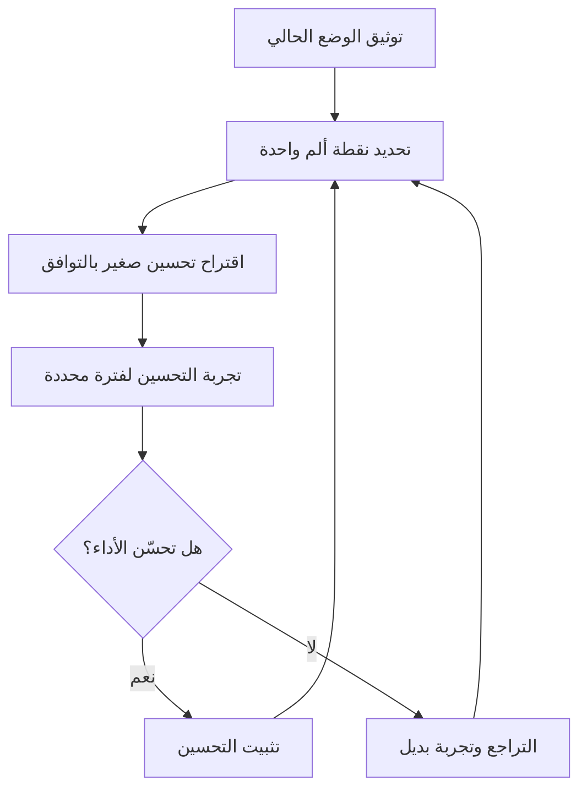

# التغيير التطوّري (Evolutionary Change)

> [!info] تعريف مختصر
> التغيير التطوّري (Evolutionary Change) هو أحد المبادئ الأساسية في منهجية كانبان (Kanban)، ويعني تحسين العمليات الحالية تدريجيًا بخطوات صغيرة مقبولة، بدلًا من فرض تغيير جذري ومفاجئ (Revolutionary Change) على النظام والفريق.

## الشرح العلمي والاحترافي
- يقوم هذا المبدأ على فكرة أن التغيير الجذري المفاجئ يواجه غالبًا مقاومة قوية من الأفراد والفرق، لأنه يهدد شعورهم بالأمان والسيطرة على عملهم، وقد يفشل حتى لو كان "صحيحًا من الناحية النظرية".
- بدلًا من ذلك، يدعو التغيير التطوّري إلى: البدء بما هو موجود حاليًا من عمليات وأدوار (Start with what you do now)، ثم إجراء تحسينات صغيرة ومستمرة يتفق عليها الفريق بالتوافق (Consensus)، ويُقاس أثرها قبل الانتقال للخطوة التالية.
- هذا يرتبط مباشرة بمبدأ "الاتفاق على السعي إلى التغيير التطوّري" (Agree to pursue evolutionary change)، وهو أحد المبادئ الأساسية الأربعة لكانبان إلى جانب: ابدأ بما تفعله الآن، احترم الأدوار والمسؤوليات الحالية، وشجّع القيادة على كل المستويات ([[Leadership at Every Level]]).
- الفلسفة الكامنة وراءه مستمدة من [[Kaizen]] في نظام إنتاج تويوتا ([[Toyota Production System]]): تحسينات صغيرة تراكمية أفضل على المدى الطويل من مشاريع "إعادة هندسة" ضخمة عالية المخاطر.
- عمليًا، يعني هذا أن أي تغيير مقترح (في سياسة العمل، حدود العمل الجاري WIP، أو بنية لوحة كانبان) يُقدَّم كتجربة صغيرة قابلة للتراجع عنها، لا كقرار نهائي مفروض من الأعلى.

## أين ومتى يُستخدم
- يُستخدم بشكل أساسي عند تبنّي [[03 - Kanban]] كمنهجية لإدارة العمل، خاصة في الفرق التي تعمل ضمن أنظمة قائمة يصعب أو يخطر إيقافها لإعادة تصميمها من الصفر (مثل فرق الدعم الفني، العمليات، والصيانة).
- يُلجأ إليه عند مقاومة الفريق للتغييرات الكبيرة، أو عندما تكون المخاطر التشغيلية لتغيير جذري مرتفعة جدًا.
- يظهر عمليًا في اجتماعات مراجعة العمليات الدورية ([[Gemba Walk]] أو اجتماعات تحسين مستمر)، حيث تُقترح تحسينات صغيرة ويُختبر أثرها عبر دورة أو دورتين قبل تثبيتها.
- مناسب أيضًا عند دمج فريقين أو أقسام مختلفة (Team Merge)، حيث يقلّل التغيير التدريجي من الاحتكاك الثقافي.

## مثال وسيناريو تطبيقي
> [!example] فريق دعم فني في شركة "بيانات" كان يعمل بنظام تذاكر فوضوي بلا حدود على عدد المهام الجارية، ما تسبب في تعدد المهام (Multitasking) المفرط وتأخر الاستجابة. بدلًا من فرض نظام كانبان كامل بحدود صارمة دفعة واحدة (وهو ما رفضه الفريق سابقًا)، اقترح قائد الفريق تغييرًا تطوّريًا:
> - الأسبوع الأول: مجرد رسم لوحة تعكس خطوات العمل الحالية فعليًا (بلا حدود WIP)، لجعل العمل مرئيًا فقط.
> - الأسبوع الثالث: بعد أن اعتاد الفريق اللوحة، اقترح وضع حد أقصى مرن قدره 3 تذاكر لكل شخص في عمود "قيد المعالجة"، بعد نقاش قصير مع الفريق.
> - الشهر الثاني: بعد ملاحظة تحسّن زمن الاستجابة (Cycle Time)، خفّض الفريق نفسه الحد إلى تذكرتين لكل شخص، وأضاف عمود "بانتظار العميل" لفصل الانتظار الخارجي عن العمل الفعلي.
> بهذا التدرّج، تبنّى الفريق تغييرات جوهرية دون مقاومة، لأن كل خطوة كانت صغيرة ومُختبرة ومُتّفق عليها.

## خطوات أو مخطّط
1. توثيق العملية الحالية كما هي فعليًا، دون حكم مسبق عليها.
2. تحديد أكبر نقطة ألم أو اختناق ([[Bottleneck]]) واحدة في العملية الحالية.
3. اقتراح تحسين صغير واحد فقط لمعالجتها، بالتوافق مع الفريق.
4. تجربة التحسين لفترة محددة وقياس أثره (مثل Cycle Time أو Throughput).
5. تثبيت التحسين إذا نجح، أو التراجع عنه وتجربة بديل إن لم ينجح.
6. تكرار الدورة باستمرار (تحسين مستمر لا ينتهي).

## ⚠️ مفاهيم خاطئة شائعة
> [!warning]
> - الاعتقاد بأن التغيير التطوّري يعني "البطء المتعمّد" أو تجنّب أي تغيير كبير: في الواقع قد تتراكم تغييرات صغيرة لتنتج تحوّلًا جذريًا خلال أشهر.
> - الخلط بينه وبين غياب أي خطة أو استراتيجية: التغيير التطوّري منظَّم ومقصود، وليس ارتجاليًا.
> - الظن بأنه ينطبق فقط على كانبان: المبدأ قابل للتطبيق في أي سياق تنظيمي يريد تقليل مقاومة التغيير.

## ❌ ممارسات خاطئة في المشاريع
> [!failure]
> - **فرض عدة تغييرات كبيرة دفعة واحدة تحت اسم "تطوّري"**: يُفقد المبدأ معناه ويُنتج نفس مقاومة التغيير الجذري. الحل: تغيير واحد صغير في كل مرة، مع فترة استقرار بينها.
> - **عدم قياس أثر التغيير قبل الانتقال للتالي**: يجعل من المستحيل معرفة أي تغيير نجح وأيها فشل. الحل: تحديد مقياس واضح (Cycle Time، عدد الأخطاء، رضا الفريق) قبل كل تجربة.
> - **فرض التغيير من الإدارة دون إشراك الفريق في القرار**: يقتل روح "الاتفاق بالتوافق" ويحوّله إلى تغيير جذري مقنّع. الحل: مناقشة كل تحسين مقترح مع الفريق قبل تطبيقه.

## 🔗 مصطلحات ومفاهيم ذات صلة
[[03 - Kanban]] | [[Kaizen]] | [[Toyota Production System]] | [[Leadership at Every Level]] | [[Explicit Policies]] | [[WIP Limit]] | [[Gemba Walk]] | [[PDCA]] | [[Psychological Safety]]
