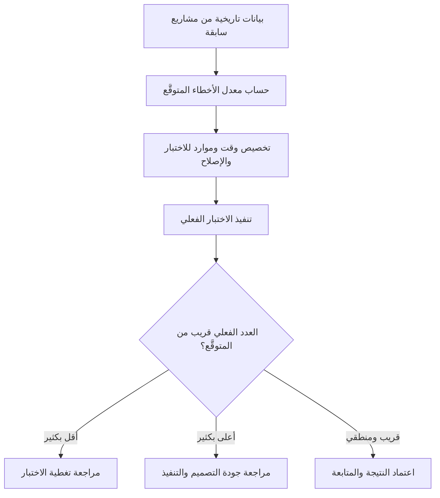

# معدل الأخطاء المتوقَّع (Expected Bug Rate)
> [!info] تعريف مختصر
> معدل الأخطاء المتوقَّع (Expected Bug Rate) هو تقدير مسبق لعدد الأخطاء (Bugs) التي يُرجَّح ظهورها في مرحلة اختبار معيّنة أو لكل وحدة عمل (مثل كل 100 سطر كود أو كل قصة مستخدم)، بناءً على بيانات تاريخية من مشاريع سابقة مشابهة.

## الشرح العلمي والاحترافي
- لا يوجد كود خالٍ من الأخطاء بشكل مطلق؛ لذلك تحاول فرق ضمان الجودة ([[Quality Assurance]]) وضع رقم واقعي تقريبي لعدد الأخطاء المتوقعة في كل ميزة أو إصدار (Release)، بدلاً من التفاجؤ لاحقاً.
- يُبنى هذا المعدل عادة من بيانات تاريخية: مثلاً "في آخر 5 إصدارات، ظهر بمعدل 3 أخطاء لكل قصة مستخدم متوسطة الحجم بعد الإطلاق للعميل".
- يُستخدم المعدل كمرجع (Baseline) لتقييم صحة عملية الاختبار: فإذا وُجدت أخطاء أقل بكثير من المتوقَّع، قد يعني ذلك أن الاختبار لم يكن كافياً وليس أن الجودة ممتازة؛ وإذا وُجدت أخطاء أكثر بكثير، فهذا مؤشر على مشكلة أعمق في التصميم أو التنفيذ.
- يرتبط مباشرة بمؤشرات أخرى مثل معدل الأخطاء المُفلِتة ([[Escaped Defect Rate]])، الذي يقيس الأخطاء التي وصلت فعلاً للمستخدم رغم الاختبار، ونسبة إعادة العمل ([[Rework Percentage]])، التي تقيس الجهد الإضافي الناتج عن إصلاح تلك الأخطاء.
- يساعد مديري المشاريع في التخطيط الواقعي: تخصيص وقت كافٍ في الجدول الزمني لمرحلة الإصلاح (Bug Fixing) بدلاً من افتراض أن الاختبار سيمر دون أي مشاكل.
- كلما زاد تعقيد الميزة (مثل التكامل مع أنظمة دفع خارجية) ارتفع المعدل المتوقَّع منطقياً، وهذا يُدخَل في حسابات التقدير.

## أين ومتى يُستخدم
- يُستخدم في مرحلة التخطيط قبل بدء الاختبار (Test Planning) لتحديد كمية الموارد والوقت اللازمين لفرق ضمان الجودة وضبط الجودة ([[QA vs QC]]).
- يظهر في تقارير ما بعد الإصدار (Release Report) للمقارنة بين العدد الفعلي والعدد المتوقَّع من الأخطاء.
- يُفيد في اختبار الانحدار ([[Regression Testing]]) والاختبار القائم على المخاطر ([[Risk-Based Testing]]) لتحديد أولوية المناطق الأكثر عرضة للأخطاء.
- يُستخدم أيضاً عند التفاوض مع العميل أو الإدارة حول جدول الإطلاق، لتبرير وجود "مرحلة استقرار" (Stabilization Phase) بعد الإطلاق مباشرة.

## مثال وسيناريو تطبيقي
> [!example] سيناريو
> شركة تطوّر تطبيق حجز مواعيد طبية، وتاريخياً كل ميزة جديدة متوسطة الحجم تنتج ما بين 4 إلى 6 أخطاء يكتشفها فريق الاختبار قبل الإطلاق، وحوالي خطأ واحد يُفلت للمستخدم النهائي.
> عند تطوير ميزة "تذكير المواعيد عبر رسائل نصية"، قدّر مدير الجودة معدلاً متوقَّعاً من 5 أخطاء بناءً على هذا التاريخ، وخصّص يومين إضافيين في الجدول الزمني لإصلاحها.
> بعد الاختبار، ظهر خطأ واحد فقط! بدلاً من الاحتفال، شكّ فريق الجودة في كفاية الاختبار، فأعادوا مراجعة حالات الاختبار (Test Cases) واكتشفوا أنهم لم يغطّوا سيناريو "فشل إرسال الرسالة بسبب انقطاع الشبكة"، فأضافوا اختباراً جديداً اكتشف خطأً حرجاً كان سيصل للمستخدمين.

## خطوات أو مخطّط
1. جمع بيانات تاريخية من مشاريع أو إصدارات سابقة مشابهة في الحجم والتعقيد.
2. حساب متوسط عدد الأخطاء لكل وحدة قياس (قصة مستخدم، ميزة، أو ألف سطر كود).
3. تعديل الرقم حسب تعقيد الميزة الحالية (ميزات التكامل الخارجي أو الدفع غالباً أعلى خطورة).
4. تحديد المعدل المتوقَّع كمرجع رسمي قبل بدء الاختبار.
5. المقارنة بعد انتهاء الاختبار: إذا كان الفعلي أقل بكثير، مراجعة تغطية الاختبار؛ إذا كان أعلى بكثير، مراجعة جودة التصميم والتنفيذ.

## ⚠️ مفاهيم خاطئة شائعة
> [!warning]
> - الاعتقاد أن معدل الأخطاء المتوقَّع رقم ثابت يصلح لكل المشاريع؛ في الحقيقة يختلف حسب حجم الفريق، خبرته، تعقيد التقنية، ونوع المشروع.
> - الظن أن عدد أخطاء أقل من المتوقَّع دائماً خبر جيد؛ قد يعني ببساطة أن الاختبار كان ضعيفاً ولم يكتشف المشاكل الحقيقية.
> - الخلط بين معدل الأخطاء المتوقَّع ومعدل الأخطاء المُفلِتة ([[Escaped Defect Rate]])؛ الأول تقدير مسبق قبل الاختبار، والثاني قياس فعلي بعد وصول المنتج للمستخدم.

## ❌ ممارسات خاطئة في المشاريع
> [!failure]
> - تجاهل حساب أي معدل متوقَّع والاعتماد فقط على "الشعور" بأن الاختبار كافٍ. التجنب: توثيق بيانات الأخطاء من كل مشروع لبناء مرجع تاريخي يُستخدم في المشاريع القادمة.
> - الضغط على فريق الاختبار لتقليل عدد الأخطاء المُبلَّغ عنها كي "يبدو" الإصدار جيداً. التجنب: تقييم الجودة بناءً على تغطية الاختبار الفعلية لا على عدد الأخطاء الظاهر فقط.
> - استخدام معدل من مشروع مختلف تماماً في التقنية أو الحجم دون تعديل. التجنب: تعديل الرقم دائماً حسب خصائص المشروع الحالي وتعقيده الفعلي.

## 🔗 مصطلحات ومفاهيم ذات صلة
[[Quality Assurance]] | [[QA vs QC]] | [[Escaped Defect Rate]] | [[Regression Testing]] | [[Risk-Based Testing]] | [[Rework Percentage]] | [[Severity vs Priority]] | [[Reopen]] | [[20 - Quality Management]]
