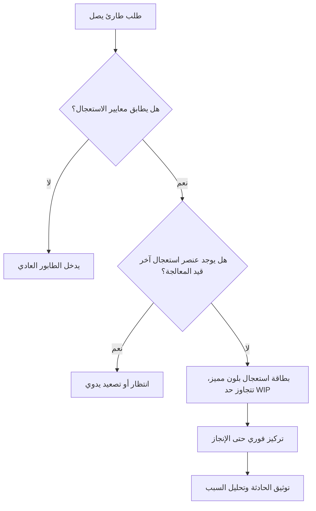

# فئة الاستعجال (Expedite Class)

> [!info] تعريف مختصر
> فئة الاستعجال (Expedite Class) هي تصنيف خاص لعناصر العمل في كانبان (Kanban) يُمنح لمهام حرجة جداً يجب أن تتجاوز الطابور العادي وتُنفَّذ فوراً، مع تجاوز حدود العمل الجاري (WIP Limit) بشكل استثنائي ومحدود.

## الشرح العلمي والاحترافي
- في أنظمة كانبان الناضجة، لا تُعامَل كل المهام بنفس الأولوية؛ تُقسَّم عناصر العمل إلى فئات خدمة (Classes of Service) مثل: العادية (Standard)، الثابتة الموعد (Fixed Date)، المعجَّلة (Expedite)، وأحياناً غير الملموسة (Intangible).
- فئة الاستعجال مخصصة لحالات نادرة وحرجة فعلاً: عطل يوقف الإنتاج، ثغرة أمنية خطيرة، أو التزام تعاقدي طارئ.
- القاعدة الذهبية: يُسمح عادة بعنصر استعجال واحد فقط في كل مرحلة من مراحل سير العمل في وقت واحد؛ إذا وصل عنصر استعجال ثانٍ، يجب انتظار خروج الأول أو معالجته يدوياً بقرار واعٍ.
- تُعرَض بطاقة الاستعجال بلون مميز (غالباً أحمر) على لوحة المهام (Task Boards) لتلفت الانتباه فوراً.
- الفكرة الإحصائية وراءها: السماح بتجاوز غير محدود لحد العمل الجاري (WIP Limit) يُبطل فائدة النظام كله وفق قانون ليتل (Little's Law)؛ لذا يُقيَّد الاستثناء بعدد ونطاق صارمين حتى لا يتحول "الاستعجال" إلى القاعدة.
- كل مرة يُستخدم فيها هذا المسار، تتأخر عناصر أخرى في الطابور، لذا يجب أن يكون هذا مفهوماً وصريحاً (انظر [[Explicit Policies]]) ومعلناً لكل الفريق وأصحاب المصلحة.

## أين ومتى يُستخدم
- يُستخدم في منهجية كانبان ([[03 - Kanban]]) وفي هجين سكرمبان ([[Scrum-ban]])، خاصة في فرق الدعم والعمليات (Ops) وفرق SRE.
- يُلجأ إليه عند حادثة إنتاج حرجة (Incident)، أو طلب Hotfix عاجل، أو مطلب قانوني/أمني لا يحتمل التأجيل.
- لا يُستخدم لأي طلب "مهم" من مدير أو عميل؛ بل فقط للحالات التي تحقق معايير واضحة مسبقة التعريف ضمن سياسات الفريق الصريحة.

## مثال وسيناريو تطبيقي
> [!example] في شركة "نجم التقنية" لتطبيقات الدفع، توقفت بوابة الدفع فجأة صباح الأحد مانعةً كل عمليات الشراء. أنشأ فريق العمليات بطاقة كانبان بفئة "استعجال" ووضعها في أعلى عمود "قيد التنفيذ" مباشرة، متجاوزةً حد العمل الجاري البالغ 3 مهام. توقف المطورون عن أي عمل آخر مؤقتاً وركّزوا على إصلاح البوابة (Hotfix)، وأُغلقت الحادثة خلال 40 دقيقة. بعد الحل، عاد الفريق لعمله الطبيعي، وسُجِّلت الحادثة في سجل المشاكل (Issue Log) لتحليل السبب الجذري لاحقاً (Root Cause Analysis).

## خطوات أو مخطّط
1. حدِّد معايير واضحة ومسبقة لما يُعتبر "استعجالاً" ضمن سياسات الفريق الصريحة (Explicit Policies).
2. عند وصول طلب طارئ، تحقّق أنه يطابق المعايير فعلاً وليس مجرد إلحاح شخصي.
3. أنشئ بطاقة مميزة اللون وضعها في أعلى العمود الحالي، متجاوزاً حد العمل الجاري باستثناء واحد فقط.
4. أوقف الفريق (أو جزءاً منه) عن مهامه الحالية للتركيز على العنصر المعجَّل حتى إنجازه.
5. بعد الإغلاق، وثِّق الحادثة وراجع سبب حدوثها لمنع تكرارها.

## ⚠️ مفاهيم خاطئة شائعة
> [!warning]
> - الاعتقاد أن فئة الاستعجال تعني "تسريع كل مهمة يطلبها شخص مهم"؛ في الواقع هي مخصصة لحالات حرجة موضوعية محددة مسبقاً.
> - الظن أنها تلغي حد العمل الجاري تماماً؛ الصحيح أنها استثناء ضيق ومحدود بعدد واحد عادة، لا بابٌ مفتوح.
> - نسيان أن استخدامها له كلفة حقيقية: كل استعجال يؤخر عناصر أخرى، فليست "مجانية".

## ❌ ممارسات خاطئة في المشاريع
> [!failure]
> - السماح بعدة عناصر استعجال في نفس الوقت حتى تصبح هي القاعدة لا الاستثناء؛ التجنب: الالتزام الصارم بعدد استثناءات محدود ومُتفق عليه.
> - عدم توثيق سبب الاستعجال بعد حله، فيتكرر نفس النوع من الحوادث دون تعلّم؛ التجنب: ربط كل استعجال بتحليل جذري (Root Cause Analysis) إلزامي.
> - ترك معايير الاستعجال غامضة فيستغلها أي شخص لتمرير طلبه؛ التجنب: كتابة سياسة صريحة ومكتوبة يوافق عليها الفريق كله.

## 🔗 مصطلحات ومفاهيم ذات صلة
[[Explicit Policies]] | [[WIP Limit]] | [[Little's Law]] | [[Kanban Card Structure]] | [[Blocker]] | [[Hotfix]] | [[Issue Log]] | [[Root Cause Analysis]] | [[03 - Kanban]] | [[Replenishment]]
