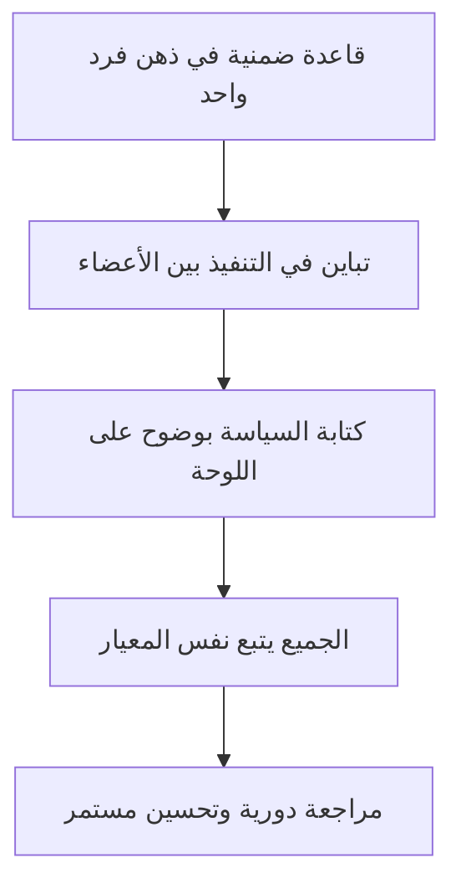

# جعل السياسات صريحة (Explicit Policies)

> [!info] تعريف مختصر
> جعل السياسات صريحة (Explicit Policies) هو أحد الممارسات الأساسية الست في كانبان (Kanban)، ويعني كتابة قواعد سير العمل بوضوح وجعلها مرئية للجميع، بدلاً من تركها ضمنية في رؤوس الأفراد أو تختلف باختلاف الشخص المنفِّذ.

## الشرح العلمي والاحترافي
- الفكرة الأساسية: أي قاعدة تحكم كيفية تحرك العمل يجب أن تكون مكتوبة ومرئية، لا "معروفة بالتقليد" أو محفوظة في ذهن شخص واحد فقط.
- تشمل السياسات الصريحة أموراً مثل: تعريف "منجز" (Definition of Done) لكل عمود، حدود العمل الجاري (WIP Limit) لكل مرحلة، معايير سحب مهمة جديدة (Pull System)، ومعايير فئة الاستعجال (Expedite Class).
- الهدف هو تقليل الخلاف والتفسير الشخصي: عندما يسأل عضو جديد "متى تُعتبر هذه المهمة جاهزة للاختبار؟" يجب أن يكون الجواب مكتوباً على اللوحة أو في مستند مشترك، لا "اسأل فلاناً".
- تُعرض عادة كملاحظات مرفقة بأعمدة لوحة المهام (Task Boards)، أو في مستند مرجعي واحد يعمل كمصدر وحيد للحقيقة (Single Source of Truth).
- تُحسِّن الشفافية الجذرية (Radical Transparency) داخل الفريق، وتقلل الاعتماد على الذاكرة الفردية أو السلطة الشخصية لأحد الأعضاء، وهذا يرتبط بمبدأ القيادة الخادمة (Servant Leadership) وتمكين الفريق (Empowerment).
- توفر أساساً موضوعياً لتحسين العمليات: عندما تتغير السياسة، يمكن قياس أثر التغيير بدقة لأن القاعدة القديمة والجديدة موثقتان بوضوح.

## أين ومتى يُستخدم
- ركيزة أساسية في كانبان ([[03 - Kanban]])، وتُطبَّق منذ اللحظة الأولى لإنشاء لوحة المهام.
- تُستخدم أيضاً في أي فريق (سكرَم أو سكرمبان) عند تعريف "جاهز" (Definition of Ready) و"منجز" (Definition of Done) وحدود فئات الاستعجال.
- تُراجَع دورياً في اجتماعات التحسين المستمر (مثل Retrospective أو Gemba Walk) لتحديث القواعد بناءً على الخبرة الفعلية.

## مثال وسيناريو تطبيقي
> [!example] في فريق دعم فني لشركة "أفق للحلول"، كان كل موظف يقرر بنفسه متى يعتبر تذكرة الدعم "جاهزة للإغلاق"، فبعضهم يغلقها بمجرد الرد وبعضهم ينتظر تأكيد العميل. أدى هذا لتذبذب في رضا العملاء (NPS). اجتمع الفريق وكتب سياسة صريحة على اللوحة: "لا تُغلق أي تذكرة إلا بعد تأكيد صريح من العميل أو مرور 48 ساعة دون رد". بعد شهر، انخفضت نسبة إعادة فتح التذاكر (Reopen) بشكل ملحوظ لأن الجميع أصبح يتبع نفس المعيار المكتوب بدلاً من الاجتهاد الشخصي.

## خطوات أو مخطّط
1. اجمع الفريق وحدِّد القرارات المتكررة التي تُتَّخذ بشكل مختلف من شخص لآخر.
2. صِغ كل قرار كقاعدة واضحة ومكتوبة (مثال: "يُسحَب عنصر جديد فقط عند توفر مساحة ضمن حد WIP").
3. اعرض السياسات على لوحة المهام نفسها أو في مستند مرجعي يسهل الوصول إليه.
4. درِّب الأعضاء الجدد على هذه السياسات كجزء من التهيئة.
5. راجع السياسات دورياً وحدِّثها بناءً على البيانات الفعلية، لا الانطباع.

## ⚠️ مفاهيم خاطئة شائعة
> [!warning]
> - الاعتقاد أن السياسات الصريحة تعني بيروقراطية ثقيلة ومستندات طويلة؛ في الواقع الهدف هو الوضوح البسيط، وقد تكون جملة واحدة على بطاقة.
> - الظن أن كتابة السياسة مرة واحدة تكفي للأبد؛ الصحيح أنها كائن حي يُراجَع مع نضج الفريق وتغير الظروف.
> - الخلط بينها وبين إجراءات التشغيل الموحدة الرسمية (SOP)؛ السياسات الصريحة في كانبان أبسط وأقرب لقواعد سير العمل اليومية.

## ❌ ممارسات خاطئة في المشاريع
> [!failure]
> - ترك القواعد "معروفة ضمنياً" دون كتابتها، فيختلف التنفيذ من عضو لآخر ويصعب تدريب الأعضاء الجدد؛ التجنب: كتابة كل قاعدة متكررة فور ملاحظة الاختلاف حولها.
> - كتابة سياسات معقدة جداً لا يقرأها أحد؛ التجنب: تبسيط الصياغة لجملة أو جملتين واضحتين لكل قاعدة.
> - كتابة السياسة ثم تجاهلها عملياً عند الضغط؛ التجنب: معاملة السياسة المكتوبة كالتزام فعلي لا كديكور على اللوحة.

## 🔗 مصطلحات ومفاهيم ذات صلة
[[03 - Kanban]] | [[Definition of Done]] | [[Definition of Ready]] | [[Pull System]] | [[WIP Limit]] | [[Expedite Class]] | [[Single Source of Truth]] | [[Radical Transparency]] | [[Team Working Agreement]] | [[SOP]]
