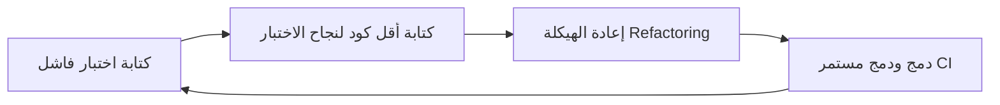

# البرمجة القصوى (Extreme Programming)

> [!info] تعريف مختصر
> البرمجة القصوى (Extreme Programming - XP) هي منهجية Agile هندسية تركّز على الجودة الفنية للكود من خلال ممارسات صارمة مثل البرمجة الثنائية (Pair Programming)، التطوير الموجَّه بالاختبار (Test-Driven Development)، والتكامل المستمر، بهدف تمكين التسليم المتكرر السريع دون التضحية بجودة الكود.

## الشرح العلمي والاحترافي
- ابتكرها Kent Beck في أواخر التسعينيات، وهي من أوائل المنهجيات التي شكّلت أساس بيان Agile ([[Agile Manifesto]])، لكنها تتميز بأنها الأكثر تحديدًا من ناحية "الممارسات الهندسية" العملية، بينما يركّز Scrum أكثر على الأدوار والأحداث الإدارية.
- تقوم على خمس قيم أساسية: التواصل (Communication)، البساطة (Simplicity)، التغذية الراجعة (Feedback)، الشجاعة (Courage)، والاحترام (Respect).
- أبرز ممارساتها:
  - **البرمجة الثنائية (Pair Programming)**: مبرمجان يعملان على نفس الشيفرة على نفس الجهاز، أحدهما يكتب (Driver) والآخر يراجع ويفكر استراتيجيًا (Navigator)، لرفع الجودة وتوزيع المعرفة.
  - **التطوير الموجَّه بالاختبار (Test-Driven Development - TDD)**: كتابة اختبار فاشل أولاً، ثم كتابة أقل كود ممكن لينجح الاختبار، ثم إعادة هيكلة الكود (Refactoring).
  - **التكامل المستمر ([[CI and CD]])**: دمج الكود إلى الفرع الرئيسي عدة مرات يوميًا مع تشغيل الاختبارات آليًا في كل مرة.
  - **الملكية الجماعية للكود (Collective Code Ownership)**: أي عضو في الفريق يمكنه تعديل أي جزء من الكود دون الحاجة لإذن مالك محدد.
  - **معايير الترميز الموحّدة (Coding Standards)** و**إعادة الهيكلة المستمرة (Continuous Refactoring)** للحفاظ على نظافة الكود دون تغيير سلوكه الخارجي.
  - **وتيرة عمل مستدامة (Sustainable Pace)**: العمل بساعات معقولة دون إرهاق مزمن، لأن الإرهاق يقتل الجودة على المدى الطويل.
- هدف XP النهائي هو تقليل تكلفة التغيير (انظر [[Cost-of-Change Curve]]) عبر الزمن، بحيث تبقى إضافة أو تعديل الميزات رخيصة نسبيًا حتى في مراحل متأخرة من المشروع، بفضل جودة الكود العالية وشبكة الاختبارات الآلية.

## أين ومتى يُستخدم
- تُستخدم في فرق التطوير التقني نفسها (على مستوى الفريق الهندسي)، وغالبًا كطبقة "هندسية" تُدمَج تحت إطار إداري أوسع مثل Scrum (يُسمى أحيانًا Scrumban أو ببساطة "Scrum مع ممارسات XP").
- تُلجأ إليها الفرق التي تعاني من تراكم الديون التقنية ([[Technical Debt]]) أو من هشاشة الكود التي تجعل كل تغيير بسيط يكسر شيئًا آخر.
- مناسبة بشكل خاص للمشاريع ذات المتطلبات المتغيرة بسرعة، لأن ممارساتها (TDD، CI، إعادة الهيكلة) تجعل الكود قابلاً للتغيير الآمن باستمرار.
- شائعة في المنتجات الرقمية طويلة العمر (SaaS) حيث تُبنى الميزات فوق بعضها لسنوات، وتصبح جودة الكود الأساسية عامل بقاء حرج.

## مثال وسيناريو تطبيقي
> [!example] فريق تطوير في شركة "مسار" لبرمجيات المحاسبة كان يعاني من أن أي تعديل بسيط في وحدة الفواتير يستغرق أيامًا بسبب هشاشة الكود القديم وغياب الاختبارات. تبنّى الفريق ممارسات XP: بدأ كل مطوّر جديد بكتابة اختبار فاشل قبل أي كود (TDD)، وطُبّقت البرمجة الثنائية على أي تعديل في وحدة الفواتير الحساسة تحديدًا.
> بعد ثلاثة أشهر، ارتفعت تغطية الاختبارات الآلية من 20% إلى 75%، وأصبح خط أنابيب CI/CD يدمج ويختبر الكود أكثر من 15 مرة يوميًا. عندما طلب العميل ميزة جديدة (خصم ضريبي متعدد المستويات)، استغرق تنفيذها يومين فقط بدلاً من الأسبوع المتوقع سابقًا، لأن شبكة الاختبارات منحت الفريق الثقة لتعديل الكود القديم دون خوف من كسره.

## خطوات أو مخطّط
1. كتابة اختبار فاشل يصف السلوك المطلوب (TDD).
2. كتابة أقل كود ممكن لينجح الاختبار.
3. إعادة هيكلة الكود لتحسين بنيته دون تغيير سلوكه (Refactoring).
4. دمج الكود إلى الفرع الرئيسي باستمرار مع تشغيل الاختبارات آليًا (CI).
5. العمل بالبرمجة الثنائية على الأجزاء الحساسة أو المعقدة.
6. تكرار الدورة لكل ميزة جديدة، مع الحفاظ على وتيرة عمل مستدامة.

## ⚠️ مفاهيم خاطئة شائعة
> [!warning]
> - الاعتقاد بأن البرمجة الثنائية تعني إنتاجية أقل لأن شخصين يعملان على مهمة واحدة؛ الدراسات والممارسة تُظهر أنها ترفع الجودة وتقلل الأخطاء وتنشر المعرفة، مما يعوّض بطء السرعة الظاهرية على المدى الطويل.
> - الخلط بين XP وScrum؛ Scrum إطار إداري يحدد الأدوار والأحداث (مثل [[06 - Scrum Master]] و[[08 - Sprint Planning]])، بينما XP مجموعة ممارسات هندسية يمكن دمجها داخل أي إطار Agile بما فيه Scrum.
> - الظن بأن TDD يعني كتابة كل الاختبارات الممكنة قبل البدء بالكود؛ في الواقع الدورة قصيرة جدًا: اختبار واحد صغير، ثم كود، ثم إعادة هيكلة، وتكرار ذلك باستمرار.

## ❌ ممارسات خاطئة في المشاريع
> [!failure]
> - تطبيق البرمجة الثنائية على كل المهام دون تمييز، حتى المهام الروتينية البسيطة، مما يستنزف طاقة الفريق دون فائدة تناسب التكلفة. التجنب: تخصيص البرمجة الثنائية للأجزاء المعقدة أو الحساسة أو أثناء تدريب أعضاء جدد.
> - تبنّي TDD شكليًا بكتابة اختبارات بعد الكود لا قبله فقط لإرضاء مقياس التغطية، فتفقد الممارسة فائدتها الحقيقية في توجيه التصميم. التجنب: الالتزام الفعلي بكتابة الاختبار أولاً، وتكرار الدورة على مهام صغيرة جدًا.
> - إهمال إعادة الهيكلة المستمرة بحجة ضيق الوقت، فيتراكم الدين التقني ([[Technical Debt]]) رغم وجود اختبارات. التجنب: تخصيص وقت منتظم لإعادة الهيكلة كجزء لا يتجزأ من كل مهمة، لا كنشاط منفصل يُؤجَّل.

## 🔗 مصطلحات ومفاهيم ذات صلة
[[CI and CD]] | [[Docs as Code]] | [[Technical Debt]] | [[Cost-of-Change Curve]] | [[Sustainable Pace]] | [[Agile Manifesto]] | [[Regression Testing]] | [[01 - Agile]] | [[02 - Scrum]]
