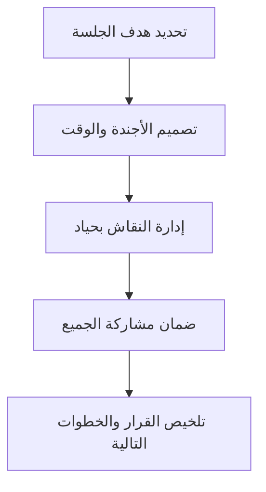

# الميسّر (Facilitator)
> [!info] تعريف مختصر
> الميسّر (Facilitator) شخص يقود اجتماعًا أو ورشة عمل بحياد، دون فرض رأيه، بهدف مساعدة المجموعة على الوصول إلى قرار أو نتيجة واضحة بأقل وقت وأكبر مشاركة. عمله يُسمى التيسير (Facilitation).

## الشرح العلمي والاحترافي
الميسّر ليس صاحب القرار ولا الخبير الذي يقدّم الحلول، بل هو "مدير للعملية" (Process Manager) وليس "مدير للمحتوى" (Content Manager). مهمته تصميم وإدارة الطريقة التي تتفاعل بها المجموعة، لا فرض إجابة معينة.
- من مهامه الأساسية: تحديد هدف الجلسة بوضوح مسبقًا، ضمان مشاركة الجميع (وليس فقط الأصوات الأعلى)، إدارة الوقت، وتلخيص القرارات والخطوات التالية في نهاية الجلسة.
- في Scrum، غالبًا ما يقوم [[06 - Scrum Master]] بدور الميسّر في فعاليات مثل [[08 - Sprint Planning]] و[[10 - Sprint Retrospective]]، لكنه يظل حياديًا: لا يقرر ماذا يُبنى (ذلك دور [[05 - Product Owner]]) ولا كيف تُحل المشكلة تقنيًا (ذلك دور الفريق).
- التيسير الجيد يعتمد على أدوات وتقنيات محددة: الأسئلة المفتوحة، التصويت السريع (Dot Voting)، تقسيم المجموعة لنقاشات فرعية، واستخدام لوحات بصرية لتنظيم الأفكار.
- الفرق الجوهري بين الميسّر والمدير: المدير يتخذ القرار نيابة عن الفريق، بينما الميسّر يساعد الفريق على اتخاذ قراره بنفسه — وهذا يرتبط بمفهوم [[Empowerment]] و[[Servant Leadership]].

## أين ومتى يُستخدم
- في جميع فعاليات Scrum: [[07 - Daily Standup]]، [[08 - Sprint Planning]]، [[09 - Sprint Review]]، [[10 - Sprint Retrospective]].
- في ورش [[Backlog Refinement]] لمساعدة الفريق على تفصيل وتوضيح متطلبات جديدة.
- في جلسات حل النزاعات بين أعضاء الفريق أو بين فِرق مختلفة.
- في ورش التخطيط الاستراتيجي أو جلسات العصف الذهني (Brainstorming) عبر المشروع.
- عند الحاجة لجمع فريق متعدد التخصصات ([[Cross-functional Team]]) لاتخاذ قرار جماعي معقّد.

## مثال وسيناريو تطبيقي
> [!example] في شركة "دِلتا سوفت"، انقسم فريق التطوير حول اختيار قاعدة بيانات جديدة: نصفهم يفضّل PostgreSQL والنصف الآخر MongoDB، والنقاش تحوّل إلى جدال شخصي دون تقدم. طلبوا من ليلى، وهي ميسّرة داخلية متمرسة، إدارة جلسة لمدة ساعة. لم تُبدِ ليلى رأيها التقني إطلاقًا؛ بدل ذلك كتبت على السبورة معايير القرار (الأداء، سهولة التوسع، خبرة الفريق الحالية)، وطلبت من كل فريق فرعي تقييم كل خيار وفق هذه المعايير على أوراق لاصقة (Sticky Notes)، ثم جمعت النتائج بصريًا أمام الجميع. خلال 45 دقيقة، توصّل الفريق بنفسه إلى قرار توافقي (PostgreSQL لتوافقه الأفضل مع بنيتهم الحالية) دون أن تفرض ليلى الإجابة، وشعر الطرفان أن قرارهما مسموع ومحترم.

## خطوات أو مخطّط
1. حدّد هدف الجلسة والنتيجة المتوقعة بوضوح قبل بدء الاجتماع.
2. صمّم الأجندة والوقت المخصص لكل جزء (Timeboxing).
3. افتتح الجلسة بتوضيح القواعد الأساسية (مثل: احترام الوقت، لا مقاطعة).
4. أدر النقاش بحياد: اطرح أسئلة، لا إجابات؛ وزّع فرصة الحديث بعدل بين الجميع.
5. لخّص القرارات والخطوات التالية بوضوح في نهاية الجلسة، ووثّقها.

## ⚠️ مفاهيم خاطئة شائعة
> [!warning]
> - الاعتقاد أن الميسّر يجب أن يكون خبيرًا تقنيًا في موضوع الجلسة: دوره إدارة العملية، وليس تقديم الحلول التقنية.
> - الخلط بين الميسّر والمدير: الميسّر لا يتخذ القرار نيابة عن المجموعة، بل يساعدها على الوصول إليه بنفسها.
> - الاعتقاد أن التيسير يعني "إدارة اجتماع فقط بلا هدف"؛ التيسير الجيد يتطلب تحضيرًا مسبقًا دقيقًا وهدفًا واضحًا.

## ❌ ممارسات خاطئة في المشاريع
> [!failure]
> - ميسّر يتدخل برأيه التقني في منتصف النقاش، فيفقد حياده ويتوقف الفريق عن التفكير المستقل — الحل: الالتزام الصارم بدور إدارة العملية فقط، وطرح الأسئلة بدل الإجابات.
> - عقد جلسة تيسير بلا أجندة أو هدف واضح، فتتحول لنقاش عشوائي بلا نتيجة — الحل: تحضير أجندة زمنية واضحة قبل الجلسة بيوم على الأقل.
> - السماح لصوت واحد أو شخصية مهيمنة بالسيطرة على كامل النقاش — الحل: استخدام تقنيات توزيع مشاركة عادلة مثل الجولة المتساوية (Round-Robin) أو التصويت الصامت.

## 🔗 مصطلحات ومفاهيم ذات صلة
- [[06 - Scrum Master]]
- [[Servant Leadership]]
- [[Empowerment]]
- [[Backlog Refinement]]
- [[10 - Sprint Retrospective]]
- [[08 - Sprint Planning]]
- [[Active Listening]]
- [[Timeboxing]]

> [!tip] 💡 إثراء عملي — كورس لعبة العقل
> إجراء التيسير الكامل لحلّ صراع بين طرفين — أربع خطوات وبروتوكول إغلاق: [[Displacement Strategy]] و[[08 - الإزاحة والأسئلة المعايرة]].
