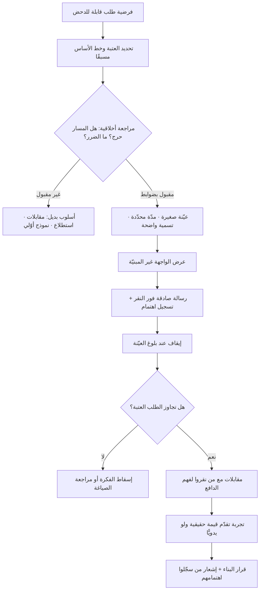

# اختبار الباب المزيّف (Fake Door Test)

> [!info] تعريف مختصر
> تجربة اكتشاف تُعرَض فيها **واجهة ميزة غير مبنيّة** — زرّ، بطاقة، خيار في القائمة، صفحة تسعير — لقياس عدد من يحاولون استخدامها فعلًا، فيُستدلّ بذلك على حجم الطلب قبل إنفاق أسابيع التطوير. سُمّي كذلك لأنه باب مرسوم على الجدار: من يطرقه يُظهر نيّته، ثم يُبلَّغ أن الميزة قيد التطوير. قوّته أنه يقيس **سلوكًا فعليًّا** لا رأيًا معلنًا، وهو فارق حاسم لأن الناس يبالغون كثيرًا في وصف اهتمامهم حين يُسألون مباشرة. وضعفه أنه يقيس **جاذبية الوعد** لا **قيمة المنتج**، وأنه ينطوي على إشكال أخلاقي حقيقي لأنه يوهم المستخدم بوجود شيء غير موجود — وهذا الإشكال ليس تفصيلًا هامشيًّا بل هو المحدّد الرئيس لشروط استخدامه.

## الشرح العلمي والاحترافي
- **المبدأ المعرفي: النيّة المعلنة مقابل السلوك المُكلف**: حين تسأل مستخدمًا «هل تريد هذه الميزة؟» فالإجابة مجانية له، ومصحوبة عادةً برغبة في المجاملة، ومبنيّة على تخيّل موقف مستقبلي يصعب التنبّؤ به. أما النقر على زر داخل سياق العمل الحقيقي فهو فعل له كلفة صغيرة لكن حقيقية: انقطاع عن المهمّة الجارية. هذه الكلفة الصغيرة هي ما يمنح الإشارة قيمتها. لهذا يُصنَّف الاختبار ضمن أساليب **قياس الطلب السلوكي** لا ضمن استطلاعات الرأي.
- **صوره العملية المتدرّجة**: (١) **زرّ داخل المنتج** يقود إلى رسالة «هذه الميزة قيد التطوير — هل تودّ إشعارك عند إطلاقها؟». (٢) **صفحة هبوط** تصف منتجًا أو خطّة غير موجودة وتقيس التسجيلات. (٣) **بند في قائمة التسعير** لقياس الاستعداد للدفع لا مجرّد الاهتمام. (٤) **إعلان لميزة** يقيس النقر. وتتفاوت هذه الصور في قوّة الإشارة: الاستعداد لإدخال بيانات دفع إشارة أقوى بمراتب من مجرّد نقرة.
- **ما يقيسه فعلًا وما لا يقيسه**: يقيس **الطلب الظاهر عند نقطة الدخول** — أي كم شخصًا وجد الوعد جذابًا بما يكفي للنقر. لا يقيس: هل سيستخدم الميزة مرارًا؟ هل ستحلّ مشكلته فعلًا؟ هل ستحسّن الاحتفاظ؟ هل تستحقّ كلفة صيانتها؟ ارتفاع النقر قد يعكس **فضولًا** أو **غموضًا في التسمية** لا رغبة حقيقية. لذلك تُقرأ نتيجته كإشارة أولية ضمن سلسلة تحقّق لا كحكم نهائي.
- **الفرق الحاسم بينه وبين [[MVP]]**: المنتج الأدنى الصالح **يقدّم قيمة حقيقية** ولو محدودة، ويسمح بقياس الاستخدام المتكرّر والاحتفاظ. الباب المزيّف **لا يقدّم شيئًا** ويقيس نيّة الدخول فقط. الخلط بينهما يقود إلى اتخاذ قرارات استثمار كبيرة بناءً على إشارة ضحلة. الترتيب السليم: باب مزيّف لفرز الأفكار ← نموذج أوّلي أو تجربة مُصغَّرة ← منتج أدنى صالح ← قياس أثر.
- **الإشكال الأخلاقي — لبّ المسألة**: الاختبار يقوم على **إخبار المستخدم بشيء غير صحيح** ولو ضمنًا: أن الميزة موجودة. وهذا يمسّ ثقة المستخدم، وهي أثمن أصل لا يظهر في أي ميزانية. ويشتدّ الضرر بحسب: كمّية الجهد الذي بذله المستخدم قبل اكتشاف الزيف، وأهمية المهمّة التي انقطع عنها، ومدى تكرار الممارسة، وطبيعة القطاع. وقد أثارت حالات معلنة في صناعة البرمجيات جدلًا واسعًا حين اكتشف مستخدمون أن أزرارًا عُرضت لهم لم تكن تقود إلى شيء، ووُصف ذلك بأنه استخدام للمستخدمين كموضوع تجربة دون علمهم.
- **الضوابط التي تجعله مقبولًا**: أهمّها **الشفافية الفورية والصادقة** عند النقر — رسالة واضحة تقول إن الميزة غير متاحة بعد وإن ملاحظته تساعد في تحديد الأولويات، لا رسالة خطأ مبهمة ولا صفحة معطّلة توهم بعطل تقني. ثم **عدم استدراج أي جهد أو بيانات لا لزوم لها**، و**عدم استخدامه في المسارات الحرجة** (دفع، صحة، بيانات قانونية، طوارئ)، و**تعويض معنوي أو عملي** كإشعار عند الإطلاق أو أولوية وصول، و**تحديد عيّنة صغيرة ومدّة قصيرة** بدل تعريض قاعدة المستخدمين كلها، و**التوقف فور بلوغ حجم العيّنة**. الاختبار المصمّم بهذه الضوابط يقترب من كونه استطلاع اهتمام صادقًا، والمصمّم بدونها يقترب من الخداع.
- **حدّ فاصل يجب عدم تجاوزه**: هناك فرق بين «ميزة قيد التطوير — أخبرنا إن كانت تهمّك» وبين استدراج المستخدم لإدخال بيانات دفع فعلية أو بيانات شخصية حسّاسة لمنتج لا وجود له. الأول اختبار طلب، والثاني يقترب من تضليل تجاري تترتّب عليه تبعات نظامية وسمعية — خصوصًا مع التزامات حماية البيانات في [[PDPL]] بشأن جمع بيانات لغرض غير الغرض المعلن.
- **مسألة الصلاحية الإحصائية**: النتيجة بلا **خطّ أساس** لا معنى لها. نسبة نقر 4% ليست عالية ولا منخفضة بذاتها؛ تُقاس بالمقارنة مع عناصر مماثلة في الموضع نفسه. كما أن الموضع البصري (Placement) والتسمية يؤثّران في النتيجة تأثيرًا قد يفوق أثر الفكرة نفسها؛ زرّ بارز في الشاشة الرئيسة سيتفوّق على ميزة أهم مدفونة في القائمة الثالثة. ولهذا تُثبَّت هذه المتغيّرات أو تُقارَن الأفكار في المواضع نفسها.

## أين ومتى يُستخدم
- **في فرز قائمة أفكار كبيرة قبل الاستثمار**: كمرحلة أولى رخيصة ضمن [[Product Discovery]] لتقليص عشرين فكرة إلى ثلاث تستحقّ بحثًا أعمق.
- **داخل مسار الاكتشاف المتوازي**: كأداة تجربة سريعة ضمن [[Dual-Track Agile]] وضمن الحلول المُعلَّقة في [[Opportunity Solution Tree]].
- **في اختبار الاستعداد للدفع لا الاهتمام فقط**: بعرض خطّة أو باقة غير موجودة لقياس من يصل إلى شاشة الدفع، ضمن [[Customer and Market Validation]].
- **قبل التوسّع في سوق أو شريحة جديدة**: عبر صفحة هبوط تقيس الطلب قبل بناء أي شيء، وهو من أدوات [[Lean Startup]] الكلاسيكية في اختبار فرضية القيمة.
- **كإجراء وقائي ضد تضخّم المنتج**: بجعل إثبات الطلب شرطًا مسبقًا لأي ميزة جديدة، وهو من أنجع علاجات [[Feature Creep]].
- **في تحديد ترتيب أولويات متقاربة**: حين تتساوى فكرتان في تقدير الأثر ضمن [[RICE Prioritization]]، فيحسم الطلب المقيس ما عجز التقدير عن حسمه.
- **مقترنًا بالقياس السلوكي**: إذ لا معنى للاختبار بلا بنية أحداث سليمة توفّرها [[Product Analytics]].

## مثال وسيناريو تطبيقي
> [!example] تطبيق سعودي لتوصيل الطلبات يخدم نحو 90,000 مستخدم نشط شهريًّا. طُرحت ثلاث أفكار متنافسة على خارطة الطريق، وقُدّر لكل منها 8–10 أسابيع تطوير: (أ) الطلب الجماعي مع الأصدقاء وتقسيم الفاتورة، (ب) الاشتراك الشهري بتوصيل مجاني، (ج) الجدولة المسبقة للطلبات.
> بدل الاختيار بالنقاش، صُمّم اختبار باب مزيّف بضوابط متّفق عليها مسبقًا: عرض على **عيّنة عشوائية 5% فقط** من المستخدمين، ولمدة **10 أيام**، وفي **الموضع نفسه** لكل فكرة (بطاقة أسفل شاشة السلة) لتحييد أثر الموضع، وبعد كل نقرة تظهر رسالة صريحة: «هذه الميزة قيد الدراسة ولم تُطلق بعد. سجّل اهتمامك ونُشعرك أولًا عند إطلاقها» مع زر تسجيل اختياري وحقل ملاحظة واحد غير إلزامي. ومُنع جمع أي بيانات إضافية.
> النتائج بعد 10 أيام (من نحو 4,500 مستخدم لكل فكرة):
> - الطلب الجماعي: نقر 2.1% — سجّل اهتمامًا منهم 31%.
> - الاشتراك الشهري: نقر 9.4% — سجّل اهتمامًا منهم 68%، ووصل إلى شاشة تفاصيل السعر 71% ممّن نقروا.
> - الجدولة المسبقة: نقر 6.8% — لكن نسبة تسجيل الاهتمام 22% فقط، وكشفت الملاحظات النصّية أن كثيرين ظنّوا أنها تتبّع للطلب الحالي لا جدولة مستقبلية.
> القراءة الصحيحة: الاشتراك هو الأقوى إشارةً؛ والجدولة نتيجتها **ملوّثة بسوء فهم التسمية** ولا يصحّ إسقاطها بناءً على هذا الاختبار، بل تُعاد تجربتها بتسمية أوضح؛ والطلب الجماعي ضعيف الطلب في هذا السياق.
> ما فعله الفريق بعدها — وهو الجزء الذي تهمله فرق كثيرة: لم يعتبر الاشتراك مثبتًا. أجرى 8 مقابلات مع من سجّلوا اهتمامًا، فتبيّن أن الدافع الأساسي ليس التوفير بل **التخلّص من مفاجأة رسوم التوصيل المتغيّرة**. ثم شُغّلت تجربة اشتراك يدوية بالكامل (تفعيل يدوي وخصم يدوي) على 200 مشترك لمدة شهر لقياس الاستخدام الحقيقي والاحتفاظ قبل بناء أي بنية تقنية. وأُشعر جميع من سجّلوا اهتمامًا عند الإطلاق فعلًا — وهو التزام اعتبره الفريق شرطًا أخلاقيًّا لا خيارًا تسويقيًّا.

## خطوات أو مخطّط
1. صياغة الفرضية بدقة وبصيغة قابلة للدحض: «نتوقّع أن تتجاوز نسبة التفاعل مع هذه الميزة عتبة كذا لدى الشريحة كذا».
2. تحديد **العتبة وخط الأساس** مسبقًا بالمقارنة مع عناصر مماثلة في الموضع نفسه — قبل رؤية أي بيانات.
3. مراجعة أخلاقية صريحة: ما الضرر المحتمل؟ هل المسار حرج؟ ما نصّ الرسالة التي سيراها المستخدم؟ ما التعويض؟
4. تحديد حجم العيّنة والمدّة، وقصر التعرّض على شريحة صغيرة لا على قاعدة المستخدمين كلها.
5. تصميم الواجهة والتسمية بوضوح تام لتجنّب تلوّث النتيجة بسوء الفهم، واختبار التسمية على 3–5 أشخاص قبل الإطلاق.
6. كتابة رسالة ما بعد النقر بصدق ووضوح، مع خيار تسجيل الاهتمام وحقل ملاحظة اختياري واحد.
7. تشغيل التجربة وإيقافها عند بلوغ العيّنة أو المدّة المحدّدة، دون تمديد بحثًا عن نتيجة مُرضية.
8. قراءة النتيجة مع الملاحظات النوعية معًا، والتمييز بين ضعف الطلب وضعف الصياغة.
9. متابعة الإشارة القوية ببحث أعمق: مقابلات مع من نقروا، ثم تجربة تقدّم قيمة حقيقية ولو يدويًّا.
10. الوفاء بالوعد: إشعار من سجّلوا اهتمامًا عند الإطلاق، أو إبلاغهم بوضوح إن أُسقطت الفكرة.
11. توثيق القرار وسببه في [[Decision Log]] سواء نُفّذت الفكرة أم لا.

## ⚠️ مفاهيم خاطئة شائعة
> [!warning]
> - **«ارتفاع النقر يعني أن الميزة ناجحة»**: النقر يقيس جاذبية **الوعد** ولحظة الفضول، لا قيمة الاستخدام المتكرّر. كثير من الميزات عالية النقر انهار استخدامها بعد أسبوعين من الإطلاق الحقيقي.
> - **«هو نوع من الـ MVP»**: الفرق جوهري: [[MVP]] يقدّم قيمة حقيقية ويسمح بقياس الاحتفاظ؛ الباب المزيّف لا يقدّم شيئًا ويقيس نيّة الدخول فقط. لا يصحّ بناء قرار استثمار كبير على الثاني وحده.
> - **«لا ضرر ما دامت الرسالة مهذّبة»**: الضرر يتناسب مع الجهد المبذول وأهمية المهمّة. مستخدم انقطع عن مهمّة عاجلة ليكتشف أن الباب مرسوم سيشعر بأنه استُغِلّ، مهما كانت الرسالة لطيفة.
> - **«يصلح لأي ميزة»**: لا يصلح إطلاقًا في المسارات الحرجة — الدفع، الصحة، الالتزامات القانونية، البيانات الحسّاسة، حالات الطوارئ. في هذه المجالات الكلفة الأخلاقية والنظامية تفوق أي قيمة تعلّم.
> - **«النتيجة رقم موضوعي محايد»**: النتيجة رهينة الموضع والتسمية وتوقيت العرض والشريحة المعروض عليها. تغيير موضع الزرّ وحده قد يضاعف النسبة أو ينصّفها دون أي علاقة بالفكرة.
> - **«ضعف النقر يعني رفض الفكرة»**: قد يعني أن التسمية غير مفهومة، أو أن الموضع غير مرئي، أو أن الشريحة خاطئة. الإسقاط الفوري لفكرة بناءً على اختبار واحد سيئ الصياغة خسارة صامتة.
> - **«تكراره على المستخدمين أنفسهم مقبول»**: تكرار التعرّض للأبواب المزيّفة يُنتج تعلّمًا عكسيًّا: يتوقّف المستخدمون عن النقر على أي جديد، فتفسد أداة القياس نفسها ويُستنزف رصيد الثقة.

## ❌ ممارسات خاطئة في المشاريع
> [!failure]
> - **الخطأ: إظهار رسالة خطأ مبهمة أو صفحة فارغة بعد النقر بدل توضيح صريح** → **لماذا يضرّ**: يظنّ المستخدم أن المنتج معطوب، فيتضرّر انطباعه عن الجودة كلها وقد يفتح تذكرة دعم → **الحل**: رسالة صريحة تقول إن الميزة قيد الدراسة، مع خيار تسجيل الاهتمام وشكر واضح.
> - **الخطأ: تشغيل الاختبار على قاعدة المستخدمين كاملة** → **لماذا يضرّ**: يعرّض عشرات الآلاف لتجربة مخيّبة مقابل معلومة تكفيها عيّنة صغيرة، ويضخّم الضرر بلا مقابل معرفي → **الحل**: أصغر عيّنة تحقّق دلالة كافية، ولأقصر مدّة ممكنة، مع إيقاف فوري عند بلوغ الهدف.
> - **الخطأ: طلب بيانات دفع أو بيانات شخصية حسّاسة لمنتج غير موجود** → **لماذا يضرّ**: يتجاوز حدود اختبار الطلب إلى تضليل تجاري، ويخالف مبدأ تحديد الغرض في [[PDPL]] → **الحل**: اقتصر على قياس النيّة، واختبر الاستعداد للدفع بأساليب مشروعة كطلب حجز مبكّر معلَن بوضوح.
> - **الخطأ: مقارنة أفكار مُختبَرة في مواضع مختلفة من الواجهة** → **لماذا يضرّ**: تقارن أثر الموضع لا أثر الفكرة، فتفوز الفكرة الأبرز عرضًا لا الأجدر → **الحل**: ثبّت الموضع والتوقيت والشريحة، وغيّر متغيّرًا واحدًا فقط.
> - **الخطأ: تمديد مدّة الاختبار حتى تظهر نتيجة مُرضية** → **لماذا يضرّ**: يحوّل التجربة إلى بحث عن تأكيد، والنتيجة تصبح ضجيجًا مُفسَّرًا لا دليلًا → **الحل**: التزم بالمدّة والعيّنة المحدّدتين سلفًا، وسجّل النتيجة كما هي في [[Decision Log]].
> - **الخطأ: عدم إشعار من سجّلوا اهتمامهم عند الإطلاق أو عند الإلغاء** → **لماذا يضرّ**: إخلاف صريح بوعد معلن، ويُفقد الفريق قدرته على تشغيل أي تجربة مستقبلية بمصداقية → **الحل**: احتفظ بقائمة المهتمّين وأشعرهم في الحالتين، واعتبر ذلك جزءًا من تعريف انتهاء التجربة.
> - **الخطأ: الانتقال من نتيجة الاختبار مباشرة إلى البناء الكامل** → **لماذا يضرّ**: يُبنى منتج على إشارة سطحية دون فهم الدافع، فيخيب الاستخدام بعد الإطلاق ويصير الاختبار مبرّرًا لقرار خاطئ → **الحل**: اجعله المرحلة الأولى فقط، وأتبعه بمقابلات ثم بتجربة تقدّم قيمة حقيقية ولو مُشغَّلة يدويًّا.

## 🔗 مصطلحات ومفاهيم ذات صلة
[[MVP]] | [[Product Discovery]] | [[Continuous Discovery]] | [[Customer and Market Validation]] | [[Opportunity Solution Tree]] | [[RICE Prioritization]] | [[Pilot Launch]] | [[PDPL]] | [[Decision Log]] | [[Lean Startup]] | [[Dual-Track Agile]] | [[Feature Creep]] | [[Product Analytics]]
