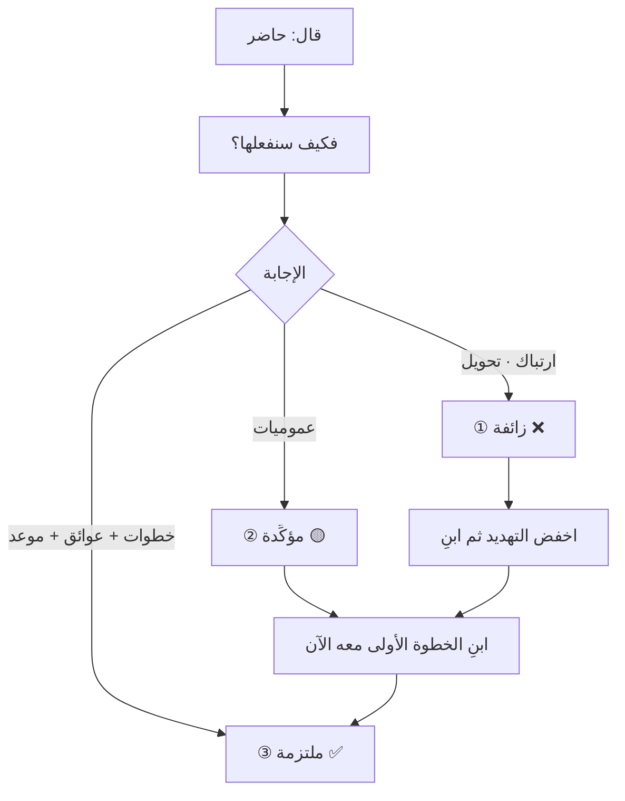

# «نعم» الزائفة وأنواع الموافقة الثلاثة (Fake Yes)
> [!info] تعريف مختصر
> «نعم» الزائفة موافقة لفظية غرضها **الهروب من الموقف** لا التنفيذ. وهي أحد ثلاثة أنواع لكلمة «حاضر»: **الزائفة** (هروب) · **المؤكِّدة** (موافقة على الفكرة لا على التنفيذ — وأخطرها) · **الملتزمة** (موافقة يتبعها فعل). والسؤال الكاشف الوحيد بينها: **«فكيف سنفعلها؟»**

## الشرح العلمي والاحترافي
هذه أكثر مشكلة تُكلّف الفرق ولا تُرى: **التزامات لا يعلم أحد أنّها لم تُعقَد.** وتُنتج ما يُسمّى **الالتزامات الوهمية (Phantom Commitments)** و**السلام الزائف (False Peace)** — انسجامًا ظاهريًّا يُخفي عدم تنفيذ.

| النوع | ما يجري داخله | العلامات | ما يُنتجه |
|---|---|---|---|
| **① الزائفة** | هروب من الموقف | ردّ فوري بلا وقفة · حركة جسدية · نظر متنقّل · «طبعًا، أكيد» | التزامات وهمية · [[Technical Debt\|دَين تقني]] |
| **② المؤكِّدة** | موافقة على **الفكرة** لا التنفيذ | «كلامك صحيح» · «منطقي» — **بلا ضمير المتكلّم** | خطط لا تُنفَّذ |
| **③ الملتزمة** | موافقة + تصوّر للتنفيذ | يُفصّل الخطوات · يذكر عائقًا · يسأل عن تبعيّة · يُحدّد موعدًا | **تنفيذ** |

**والنوع الثاني هو الأخطر — لا الأوّل — لأنّه يبدو نجاحًا.** الشخص لم يهرب: ناقش، وتحاجّ، ثم اقتنع بصدق. وأنت تخرج مطمئنًّا لأنّك **أقنعته**، وهو مطمئنّ لأنّه **اقتنع**. ولا أحد يكذب. والفجوة أنّ **الاقتناع الفكري ليس التزامًا تنفيذيًّا**: «كلامك صحيح» حكم على الفكرة، لا وصف لما سيفعله هو.

**والعلامة اللغوية الفارقة:** المؤكِّدة تخلو من ضمير المتكلّم؛ والملتزمة تحويه — «سأبدأ بـ…» · «أحتاج من فلان…» · «سأعرف يوم كذا…».

## أين ومتى يُستخدم
- عند إغلاق أيّ بند إجرائي في تخطيط سبرنت أو اجتماع استعادي أو مراجعة.
- بعد اتّفاق مع مورّد أو قسم آخر على تسليم بيني.
- في كلّ لحظة تسمع فيها «حاضر» وتشعر بالارتياح — وهي اللحظة التي يجب أن تتوقّف فيها.

## مثال وسيناريو تطبيقي
> [!example] في تخطيط السبرنت يقول مطوّر: «تمام، سأُنهي التكامل هذا السبرنت.» فتسأل: «فكيف سنفعلها؟» فيقول: «عادي، سأشتغل عليه وأشوف.» — **إجابة خالية من كلّ علامات الالتزام**: لا خطوة أولى، ولا تبعيّة، ولا موعد وسيط. والخطأ الشائع هنا التصعيد («ما معنى «سأشوف»؟ أريد خطّة») فتحصل على خطّة **مُصطنَعة** لإرضائك. والصحيح ثلاث خطوات: **①** اخفض التهديد وامنح مخرجًا — «وهل ترى شيئًا قد يُعطّلنا في هذا التكامل؟» **②** ابنِ الخطوة الأولى **معه** — «ما رأيك أن نبدأ بالتأكّد من توثيق الواجهة؟» **③** أغلِق على **شيء صغير وقريب** — «فلنعرف يوم الأربعاء هل الواجهة كافية.» فالالتزام الصغير المُوفَّى به يبني القدرة على الكبير؛ والكبير المُخلَف يُدمّرها.

## خطوات أو مخطّط
1. **لا تُغلق بندًا على «حاضر». أغلقه على «كيف».**
2. اسأل بصيغة بناء لا تشكيك: «ممتاز — فما أوّل خطوة، ومتى نتوقّع أن نرى شيئًا؟»
3. صنّف الإجابة: خطوات وعوائق وموعد ← ملتزمة · عموميات ← مؤكِّدة · ارتباك وتحويل ← زائفة.
4. **مؤكِّدة؟** ابنِ الخطوة الأولى معه الآن في الاجتماع.
5. **زائفة؟** اخفض التهديد أوّلًا بسؤال يُتيح «لا»، ثم ابنِ الخطوة.
6. وثّق: من · ماذا · متى · وتاريخ مراجعة.

## ⚠️ مفاهيم خاطئة شائعة
> [!warning]
> - **ليست كذبًا ولا سوء نيّة.** «نعم» الزائفة **استجابة تهديد** من نوع الهروب أو الاسترضاء — انظر [[Fight Flight Freeze]]. ومعالجتها بوصفها مشكلة أخلاقية تُفاقمها.
> - **ليست مسؤولية قائلها وحده.** المساءلة على المدير في النهاية؛ والأهمّ أنّها **عَرَض لا مرض**: بيئة تُعاقب قول «لا» تُنتجها بنيويًّا مهما تكرّر السؤال الكاشف.
> - **علامات الجسد مؤشّرات لا أدلّة.** دقّة البشر في كشف الخداع من العلامات غير اللفظية قريبة من المصادفة (DePaulo et al., 2003). استخدمها **لتوجيه سؤالك لا لبناء حكمك**.

## ❌ ممارسات خاطئة في المشاريع
> [!failure]
> - **الاكتفاء بـ«حاضر»** — والفرح بها؛ وهي أخطر ما في بيئة العمل.
> - **صياغة الأسئلة طلبًا لـ«نعم»** («هل ستُنهيه غدًا؟») بدل إتاحة «لا» («هل هناك ما قد يُعطّل إنهاءه غدًا؟») — والثانية تُتيح الرفض **وتستخرج المخاطر** معًا.
> - **تشخيص الأفراد بدل فحص البيئة** — اختبار صحّة البيئة سؤال واحد: **متى كانت آخر مرّة قال فيها أحد من فريقك «لا» في اجتماع ولم يُكلّفه ذلك شيئًا؟** إن لم تكن هناك إجابة، فالمشكلة نظامية.
> - **بند إجرائي بلا مالك ولا تاريخ ولا مراجعة** — يتحوّل إلى التزام وهميّ خلال أسبوعين مهما كانت «نعم» ملتزمة يوم قيلت.

## 🔗 مصطلحات ومفاهيم ذات صلة
[[Psychological Safety]] | [[Positive Refusal]] | [[Psychological Reactance]] | [[Fight Flight Freeze]] | [[Technical Debt]] | [[Decision Log]] | [[Definition of Done]] | [[Team Working Agreement]] | [[Sponsor]]

> [!tip] 💡 إثراء عملي — كورس لعبة العقل
> بروتوكول التحقّق، وقلب صياغة السؤال، ولماذا المؤكِّدة أخطر من الزائفة: [[06 - قوّة لا وأنواع نعم الثلاثة]].
