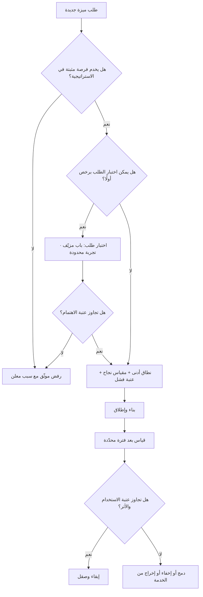

# تضخّم الميزات (Feature Creep)

> [!info] تعريف مختصر
> التراكم التدريجي للميزات في المنتج عبر الزمن حتى يصير عبء التعقيد والصيانة أكبر من القيمة التي تضيفها الإضافات. كل ميزة على حدة تبدو مبرَّرة ومطلوبة من أحدهم، لكن المجموع يُنتج منتجًا ثقيلًا على المستخدم (يصعب تعلّمه واستخدامه) وعلى الفريق (يبطّئ كل تغيير لاحق ويضخّم كلفة الاختبار). العلّة ليست في وجود ميزات كثيرة بحدّ ذاته، بل في أن **الإضافة قرار سهل والحذف قرار شبه مستحيل**، فينمو المنتج في اتجاه واحد فقط. وتضخّم الميزات ظاهرة **مستوى المنتج عبر عدة إصدارات**، وهو ما يميّزه عمّا يشبهه من مصطلحات.

## الشرح العلمي والاحترافي
- **التمييز الدقيق عن [[Scope Creep]]**: زحف النطاق ظاهرة **مستوى المشروع الواحد**؛ يعني توسّع نطاق متّفق عليه أثناء التنفيذ دون مرور بضبط التغيير، فتتضرّر الجداول والميزانية. تضخّم الميزات ظاهرة **مستوى المنتج عبر دورة حياته كلها**؛ وقد يحدث بنطاق منضبط تمامًا وموافقات سليمة في كل مرة: عشرة مشاريع كل واحد منها التزم نطاقه بدقّة، والنتيجة منتج متخم. باختصار: زحف النطاق خلل في **حوكمة التغيير**، وتضخّم الميزات خلل في **استراتيجية المنتج والقدرة على الرفض**.
- **التمييز الدقيق عن [[Gold Plating]]**: الطلاء الذهبي هو أن **يضيف المنفّذ** تحسينات لم يطلبها أحد لأنه يراها إتقانًا، فيصرف جهدًا خارج المتطلَّب. تضخّم الميزات في الأغلب نتاج **طلبات حقيقية من أطراف حقيقية** (عملاء، مبيعات، إدارة) تمّت الموافقة عليها رسميًّا. أي أن الطلاء الذهبي إفراط في **العمل غير المطلوب**، والتضخّم إفراط في **قبول المطلوب**. الأول يُعالَج بانضباط الفريق ووضوح [[Definition of Done]]، والثاني لا يُعالَج إلا باستراتيجية ومعايير رفض معلنة.
- **الآلية التي تجعله شبه حتمي — لا مؤامرة بل حوافز**: طلب الميزة يأتي دائمًا مصحوبًا بقصّة عميل ملموسة وبضغط زمني، بينما كلفتها الحقيقية موزّعة على المستقبل ومجهولة الوجه: بطء لاحق، اختبارات إضافية، حالات حافّة، شاشات مزدحمة. فحين تُقارَن **منفعة مؤكّدة الآن** بـ**كلفة مؤجّلة مبهمة**، يفوز القبول دائمًا. وهذا الانحياز البنيوي هو ما يجعل التضخّم ينشأ حتى في فرق منضبطة وذكيّة.
- **الكلفة غير الخطّية للتعقيد**: إضافة الميزة العاشرة ليست بكلفة الأولى. كل ميزة جديدة تحتمل التفاعل مع ما سبقها، فينمو عدد التفاعلات الممكنة أسرع بكثير من عدد الميزات. عمليًّا يظهر ذلك في تضخّم مصفوفة [[Regression Testing]]، وتكاثر [[Edge Cases]]، وارتفاع [[Expected Bug Rate]]، وتباطؤ [[Cycle Time]] لكل عمل لاحق حتى لو لم يمسّ الميزة الجديدة أصلًا.
- **الأثر على المستخدم: كلفة الاختيار لا كلفة الوجود**: الميزة الزائدة لا تؤذي من لا يستخدمها فحسب بالمساحة، بل بزيادة الحمل الإدراكي على الجميع — قائمة أطول، إعدادات أكثر، مسار أساسي مدفون بين خيارات ثانوية. وكثيرًا ما يرصد الفريق أن الميزة الجديدة "تُستخدم" (بنسبة صغيرة) بينما تراجع في الوقت نفسه إتمام المهمّة الأساسية للمنتج. لذلك يُقاس أثر أي ميزة على **المسار الأساسي** لا على نفسها فقط، وهو ما تكشفه [[Product Analytics]].
- **العلاقة بالدَّين التقني**: التضخّم يولّد [[Technical Debt]] من نوع خاص يصعب سداده — لا كود رديء يمكن إعادة كتابته، بل **التزامات وظيفية** تجاه مستخدمين فعليين. كل ميزة مُطلقة تصير عقدًا ضمنيًّا، وإزالتها تتطلّب هجرة وإشعارًا وربما خسارة عملاء. لهذا تكون كلفة التراجع عن ميزة أعلى بكثير من كلفة عدم بنائها، بما ينسجم مع منطق [[Cost-of-Change Curve]].
- **مؤشّرات التشخيص المبكّرة**: نسبة عالية من الميزات لا تتجاوز عتبة استخدام معتبرة بعد ربع كامل من الإطلاق؛ ارتفاع مستمر في زمن دورة العمل مع ثبات حجم الفريق؛ تزايد أسئلة الدعم عن "أين أجد…"؛ ارتفاع نسبة العمل المصروف على الصيانة مقابل التطوير الجديد؛ وطول قائمة الإعدادات والخيارات بوصفها تسوية دائمة عن قرارات لم تُحسم.
- **العلاج ليس رفض كل شيء، بل جعل الحذف عملية مشروعة**: الفرق الناضجة تُنشئ مسارًا صريحًا لإخراج الميزات من الخدمة (Deprecation) بمعايير معلنة، وتعامله كعمل ذي قيمة يُخطَّط له في خارطة الطريق لا كترف. وبدون هذا المسار يبقى المنتج نظامًا **أحادي الاتجاه** ينمو حتى ينهار تحت وزنه.

## أين ومتى يُستخدم
- **عند ترتيب أولويات الـ Backlog**: بوصفه معيار رفض صريح، بالاستناد إلى [[MoSCoW Prioritization]] و[[RICE Prioritization]] و[[WSJF]] بدل مبدأ «من طلب أولًا».
- **في تحليل نوع الميزة قبل بنائها**: عبر [[Kano Model]] للتمييز بين ميزة أساسية وميزة أداء وميزة إبهار — إذ إن تكديس ميزات الإبهار هو أسرع طرق التضخّم.
- **في تشخيص فرق تنتج كثيرًا بلا أثر**: التضخّم هو العَرَض الظاهر لمرض [[Feature Factory]]، حيث يُقاس النجاح بعدد المُنجَز لا بتغيّر السلوك.
- **في مراجعة النطاق وحمايته**: بالتوازي مع [[Out of Scope]] و[[Scope Freeze]] عند اقتراب موعد الإطلاق.
- **في احتساب الكلفة الحقيقية للمنتج**: عند تقدير [[TCO]]، لأن كل ميزة تحمل كلفة تشغيل وصيانة ودعم مستمرّة لا كلفة بناء لمرة واحدة.
- **في حوكمة الاكتشاف قبل التسليم**: عبر [[Continuous Discovery]] و[[Opportunity Solution Tree]] لضمان أن كل ميزة تخدم فرصة مثبتة لا رغبة معزولة.
- **في صياغة معايير الرفض المؤسسية**: من خلال [[Product Principles]] و[[Explicit Policies]] التي تجعل «لا» قرارًا مؤسسيًّا لا موقفًا شخصيًّا من مدير المنتج.

## مثال وسيناريو تطبيقي
> [!example] شركة خليجية تقدّم نظامًا لإدارة العيادات الصغيرة. أُطلق المنتج بأربع وظائف أساسية: الحجز، الملف الطبي، الفوترة، التقارير. خلال 3 سنوات، ولأن فريق المبيعات كان يعد كل عميل كبير بميزة مخصّصة لإغلاق الصفقة، وصل عدد الميزات المعلَنة إلى 71 ميزة، وعدد خيارات الإعدادات إلى 140 خيارًا.
> بدأت الأعراض تتراكم: زمن إصدار أي تعديل بسيط ارتفع من 6 أيام إلى 19 يومًا رغم أن حجم الفريق تضاعف؛ وارتفعت نسبة الأخطاء المكتشفة بعد الإطلاق؛ وصار تدريب العيادة الجديدة يستغرق 4 جلسات بدل جلسة واحدة؛ وبلغت نسبة تذاكر الدعم من نوع «أين أجد الخيار…» ما يقارب ثلث التذاكر.
> أجرى الفريق مراجعة استخدام مبنيّة على بيانات فعلية لآخر 90 يومًا: **43 ميزة من 71 استخدمها أقل من 2% من العيادات النشطة**، و11 ميزة منها لم يستخدمها أحد إطلاقًا خلال الفترة كاملة. وتبيّن أن 9 من هذه الميزات بُنيت أصلًا لعميل واحد، سبعة منهم لم يعودوا مشتركين.
> اتُّخذ قرار برنامج تقليم على ربعين: أُلغيت 11 ميزة صفرية الاستخدام فورًا؛ ووُضعت 18 ميزة تحت إشعار إخراج من الخدمة لمدة 90 يومًا مع إبلاغ المستخدمين القلائل ومسار بديل لكل حالة؛ ودُمجت 6 ميزات متقاربة في واحدة؛ وأُخفيت 14 ميزة متقدّمة خلف وضع "متقدّم" بدل إظهارها للجميع.
> النتائج التي رصدها الفريق بعد ربعين: زمن الدورة عاد إلى 9 أيام، وانخفضت تذاكر «أين أجد» إلى أقل من 10% من التذاكر، وارتفعت نسبة العيادات الجديدة التي تُصدر أول فاتورة في اليوم الأول من 38% إلى 64%. لم تُبنَ ميزة واحدة جديدة في هذين الربعين؛ التحسّن كله جاء من الحذف والدمج والإخفاء. والدرس الأهم أن الشركة ربطت بعدها كل وعد تعاقدي بميزة مخصّصة بموافقة مدير المنتج، وأدرجت مراجعة تقليم دورية ضمن دورة التخطيط.

## خطوات أو مخطّط
1. بناء جرد كامل للميزات القائمة مع مالك ومقياس استخدام لكل واحدة عبر [[Product Analytics]].
2. تصنيف كل ميزة إلى: أساسية للمهمّة، داعمة، هامشية، ميتة — مع الاستناد إلى بيانات لا انطباعات.
3. تقدير كلفة البقاء لكل ميزة هامشية: صيانة، اختبار انحدار، دعم، حمل إدراكي على الواجهة.
4. تحديد الإجراء لكل ميزة: إبقاء، دمج، إخفاء خلف وضع متقدّم، إخراج من الخدمة، حذف فوري.
5. إعلان مسار إخراج من الخدمة بمهلة واضحة وبديل صريح وإشعار للمستخدمين المتأثّرين.
6. تثبيت معايير قبول جديدة لأي ميزة قادمة: الفرصة التي تخدمها، المقياس الذي ستحرّكه، وعتبة الفشل التي تُلغى عندها.
7. اشتراط اختبار طلب رخيص قبل البناء الكامل — عبر [[Fake Door Test]] أو [[Pilot Launch]] أو نطاق [[MVP]] مصغّر.
8. جدولة مراجعة تقليم دورية كل ربع، وتخصيص حصّة قدرة ثابتة للحذف والصيانة لا للبناء فقط.

## ⚠️ مفاهيم خاطئة شائعة
> [!warning]
> - **الخلط بينه وبين زحف النطاق**: [[Scope Creep]] توسّع غير مضبوط داخل **مشروع واحد** أثناء تنفيذه ويؤذي الجدول والميزانية. تضخّم الميزات تراكم عبر **عمر المنتج كله** وقد يحدث بموافقات نظامية سليمة تمامًا. علاج الأول ضبط التغيير، وعلاج الثاني استراتيجية ومعايير رفض.
> - **الخلط بينه وبين الطلاء الذهبي**: [[Gold Plating]] عمل زائد **لم يطلبه أحد** يضيفه المنفّذ من تلقائه. التضخّم في الغالب استجابة لطلبات مطلوبة فعلًا ومعتمدة رسميًّا — ولهذا هو أخطر وأصعب في الاعتراف به.
> - **«كثرة الميزات ميزة تنافسية»**: جدول مقارنة أطول يفيد في العرض التقديمي، لكن قرار الشراء والاستمرار يُحسم بأداء المهمّة الأساسية. منتجات كثيرة خسرت أمام منافس أبسط يؤدّي المهمّة الجوهرية بوضوح أعلى.
> - **«الميزة التي لا يستخدمها أحد لا تكلّف شيئًا»**: تكلّف فعلًا — اختبار انحدار في كل إصدار، توافقًا عند كل ترقية، مساحة في الواجهة، فرعًا في الكود يجب مراعاته، وسطرًا في التوثيق والتدريب.
> - **«التضخّم مشكلة تصميم واجهة تُحلّ بإخفاء الخيارات»**: الإخفاء يخفّف الحمل الإدراكي فقط، ولا يزيل كلفة الصيانة ولا هشاشة النظام. هو تسكين مفيد لا علاج.
> - **«المسؤول عنه مدير المنتج وحده»**: التضخّم نتاج نظام حوافز كامل — مبيعات تُكافأ على إغلاق الصفقة، وإدارة تُطمئنها كثرة المُنجَز، وفرق تُقاس بعدد المسلَّم. تغيير السلوك يبدأ بتغيير ما يُقاس ويُكافأ.
> - **«الحل هو تجميد الميزات نهائيًّا»**: الجمود يقتل المنتج كما يقتله الترهّل. المطلوب معدّل إضافة منضبط مقرون بمعدّل حذف حقيقي، لا توقّف.

## ❌ ممارسات خاطئة في المشاريع
> [!failure]
> - **الخطأ: بناء ميزة مخصّصة لكل عميل كبير لإغلاق الصفقة** → **لماذا يضرّ**: يحوّل المنتج إلى مجموعة أنظمة مخصّصة متشابكة، وترث الشركة كلفة صيانتها الأبدية حتى بعد رحيل العميل الذي طلبها → **الحل**: اشترط موافقة مدير المنتج على أي وعد تعاقدي بميزة، وافصل بين ما يدخل المنتج الأساسي وما يُنفَّذ كخدمة مدفوعة منفصلة.
> - **الخطأ: قبول الطلبات بمنطق «من طلب أولًا» أو «من صوته أعلى»** → **لماذا يضرّ**: تنتقل سلطة تحديد أولويات المنتج إلى أكثر أصحاب المصلحة إلحاحًا لا إلى أكثرهم أثرًا → **الحل**: إطار أولويات معلن ومُطبَّق بلا استثناء ([[RICE Prioritization]] أو [[WSJF]])، وسجلّ قرارات في [[Decision Log]].
> - **الخطأ: إطلاق الميزة دون تعريف مسبق لعتبة نجاح ولا لتاريخ مراجعة** → **لماذا يضرّ**: تدخل الميزة المنتج بلا شرط خروج، فتبقى إلى الأبد بصرف النظر عن قيمتها → **الحل**: لكل ميزة عند اعتمادها: المقياس المستهدف، والعتبة، وتاريخ المراجعة، والإجراء المتفق عليه عند عدم بلوغ العتبة.
> - **الخطأ: إضافة خيار إعدادات كلما اختلف الفريق حول سلوك افتراضي** → **لماذا يضرّ**: كل خيار مؤجَّل هو قرار لم يُتخذ، ومضاعفة لمسارات الاختبار وحالات الدعم → **الحل**: اجعل الافتراض قرارًا مبنيًّا على بيانات؛ ولا تُتاح الخيارات إلا حين يثبت وجود شريحتين متعارضتين حقيقيتين.
> - **الخطأ: عدم تخصيص أي قدرة للحذف والصيانة في خطة الربع** → **لماذا يضرّ**: يصبح التقليم عملًا "متطوَّعًا به" لا يحدث أبدًا، ويتحوّل [[Technical Debt]] إلى فائدة مركّبة → **الحل**: احجز نسبة ثابتة معلنة من قدرة كل ربع للتقليم والصيانة، وعاملها كالتزام لا كفائض.
> - **الخطأ: قياس إنتاجية الفريق بعدد الميزات المُطلقة** → **لماذا يضرّ**: يخلق حافزًا مباشرًا للتضخّم ويعاقب من يقترح الحذف → **الحل**: قِس النتائج السلوكية والتجارية وفق [[Outcome vs Output]]، واحتفِ علنًا بالميزات المحذوفة كما بالمُضافة.
> - **الخطأ: تأجيل الرفض بصيغة «سنضعها في الـ Backlog»** → **لماذا يضرّ**: يتحوّل الـ Backlog إلى مقبرة وعود تُنبش دوريًّا وتستهلك وقت المراجعة، ويؤجّل صدمة الرفض بدل معالجتها → **الحل**: ارفض صراحةً واذكر السبب والمعيار؛ الرفض الواضح أرحم وأنفع من قائمة انتظار وهمية.

## 🔗 مصطلحات ومفاهيم ذات صلة
[[Scope Creep]] | [[Gold Plating]] | [[Feature Factory]] | [[Technical Debt]] | [[Kano Model]] | [[MoSCoW Prioritization]] | [[RICE Prioritization]] | [[WSJF]] | [[Out of Scope]] | [[TCO]] | [[Cost-of-Change Curve]] | [[Product Analytics]] | [[Product Principles]] | [[Fake Door Test]]
