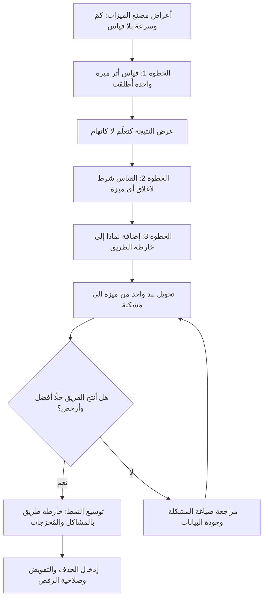

# مصنع الميزات (Feature Factory)

> [!info] تعريف مختصر
> "مصنع الميزات" (Feature Factory) نمط مضادّ (Anti-pattern) تنظيمي تتحوّل فيه فرق المنتج والتطوير إلى خطّ إنتاج (Assembly Line) وظيفته دفع أكبر عدد ممكن من الميزات إلى الإصدار، بحيث يصير مقياس النجاح هو **عدد ما أُطلق وسرعة إطلاقه**، لا **الأثر الذي أحدثه ما أُطلق**. المصطلح شاع في أدبيات إدارة المنتجات الرقمية لوصف مؤسّسات تعمل بجهد كبير وتسلّم كثيرًا، لكنها لا تعرف — ولا تسأل — ما إذا كان ما سلّمته قد غيّر شيئًا فعليًا لدى المستخدم أو في نتائج العمل. جوهر المشكلة ليس كسل الفريق، بل نظام قياس يكافئ النشاط (Activity) ويتجاهل الأثر (Impact).

## الشرح العلمي والاحترافي
- **التعريف البنيوي**: مصنع الميزات ليس صفة أخلاقية تُلصق بفريق مُقصّر، بل وصف لـ**نظام حوافز**. حين تكون المخرجات الوحيدة المرئية للإدارة هي عدد الميزات وتواريخ التسليم، فإنّ أي فريق عاقل سيُحسّن أداءه في ما يُقاس به — أي في الكمّ والسرعة — ويهمل ما لا يُقاس، أي القيمة. النمط إذن نتيجة منطقية لبيئة، لا خللًا فرديًّا.
- **الفرق عن العمل الصحّي**: الفريق السليم ينتج ميزات أيضًا؛ الفارق أن الميزة عنده **وسيلة مفترَضة** لتحقيق [[Outcome vs Output|مُخرَج]] محدّد، تخضع للاختبار وقد تُلغى إن لم تثبت جدواها. أما في مصنع الميزات فالميزة **غاية بذاتها**، ووجودها في الإصدار هو الدليل الوحيد على "النجاح".
- **الجذر المعرفي**: النمط يقوم على مغالطة الاستبدال (Substitution) — استبدال سؤال صعب ("هل خلقنا قيمة؟") بسؤال سهل ("هل سلّمنا في الموعد؟"). السؤال الثاني له إجابة قاطعة وفورية ورخيصة، والأوّل يتطلّب أدوات قياس وصبرًا وتحمّل احتمال أن تكون الإجابة "لا".
- **علاقته بعقلية المشروع**: مصنع الميزات هو الامتداد الطبيعي لعقلية المشروع (Project Mindset) حين تُطبَّق على منتج مستمرّ. في المشروع، النجاح = تسليم نطاق متّفق عليه ضمن وقت وكلفة؛ وهذا معيار مشروع تمامًا لمشروع حقيقي، لكنه يصبح مُضلّلًا حين يُسقط على منتج حيّ يُفترض أن يتعلّم ويتكيّف. راجع [[Product Thinking]] و[[Product Maturity]].
- **موقعه من سلّم النضج**: النمط يقع عمليًّا في المستويين الأوّل والثاني من [[Product Maturity|نضج المنتج]]: خارطة طريق مكتوبة وتواريخ معلنة، لكن بلا وصول للعميل ولا للبيانات ولا تفويض بالقرار.

### الأعراض التشخيصية
هذه العلامات هي الأداة العملية للتشخيص؛ وجود اثنين أو ثلاثة منها لا يعني بالضرورة مصنع ميزات، لكن اجتماع أغلبها يعني ذلك بدرجة عالية من الوثوق:
1. **لا أحد يقيس ما أُطلق بعد إطلاقه**: تنتهي حياة الميزة إداريًّا لحظة نشرها. لا لوحة متابعة، ولا مراجعة بعد أسبوعين، ولا سؤال عن [[Adoption|معدّل التبنّي]].
2. **لا تُحذف ميزات أبدًا**: المنتج يكبر في اتجاه واحد فقط. غياب الحذف دليل قاطع على غياب القياس، لأن من يقيس يكتشف حتمًا ما لا يُستخدَم.
3. **خارطة الطريق قائمة ميزات بتواريخ**: [[15 - Roadmap|خارطة الطريق]] جدول من صفّين — "ماذا" و"متى" — بلا عمود ثالث اسمه "لماذا" أو "أيّ مشكلة نحلّ".
4. **النقاش يدور حول "متى" لا حول "لماذا"**: اجتماعات الحالة كلّها عن الالتزام بالجدول، وأسئلة الجدوى إمّا لا تُطرح أو تُعامَل كتعطيل.
5. **الفرق تُقاس بالسرعة والالتزام بالجدول**: مؤشّرات مثل [[Velocity|السرعة]] أو نسبة الالتزام بتعهّدات السباق تتحوّل من أداة تخطيط داخلية إلى مقياس أداء إداري — وهو ما يفسدها فورًا.
6. **العمل يصل إلى الفريق كحلول جاهزة لا كمشاكل**: يُسلَّم للفريق "ابنِ هذه الشاشة" بدل "هذه فئة من المستخدمين تتعثّر هنا، فما الحلّ؟". هذا يُلغي عمليًّا وظيفة الاكتشاف ([[Product Discovery]]).
7. **لا أحد يستطيع قول "لا" لطلب**: كل طلب من مسؤول تنفيذي أو عميل كبير أو فريق مبيعات يدخل الباكلوغ آليًّا. غياب صلاحية الرفض هو العَرَض الأخطر، لأنه يعني غياب استراتيجية أصلًا: من يقبل كل شيء لم يختر شيئًا.

### لماذا ينشأ هذا النمط
- **سهولة قياس النشاط مقابل صعوبة قياس الأثر**: عدد الميزات المُطلقة رقم متاح مجّانًا وفوريًّا؛ أما أثرها فيحتاج بنية تحليلات، وتعريفًا متّفقًا عليه للنجاح، وفترة انتظار. المؤسّسات تميل بطبعها إلى المقياس المتاح لا إلى المقياس الصحيح.
- **ضغط أصحاب المصلحة**: حين يُقيَّم [[Sponsor|الراعي]] أو المدير التنفيذي على "ما الذي أنجزه فريقك هذا الربع؟"، فإن قائمة ميزات ملموسة تبدو إجابة أقوى من "تعلّمنا أن فرضيتين من ثلاث كانت خاطئة، فأوقفناهما ووفّرنا الجهد".
- **عقلية المشروع في سياق منتج**: التمويل والتخطيط السنويان يفرضان تحديد النطاق مسبقًا لسنة كاملة، فيتحوّل النطاق المُقدَّر إلى وعد تعاقدي يستحيل التراجع عنه حتى لو تبدّلت المعطيات.
- **غياب الوصول للعميل والبيانات**: فريق لا يرى المستخدم ولا الأرقام لا يملك أساسًا مادّة لمناقشة القيمة، فلا يتبقّى أمامه سوى مناقشة الجدول.
- **الخوف من الظهور بمظهر غير المنتِج**: في ثقافة تُقاس بالانشغال، يبدو التوقّف للتفكير أو القياس ترفًا يصعب تبريره.

### الكلفة المتراكمة
- **تضخّم المنتج (Feature Bloat)**: كل ميزة تُضاف ولا تُحذف ترفع التعقيد الإدراكي للمستخدم وكلفة الصيانة معًا؛ فيصير المنتج أثقل وأصعب في الاستخدام كلما "تحسّن" وفق مقياس المصنع.
- **[[Technical Debt|الدين التقني]]**: السرعة المفروضة تُدفع من ميزانية الجودة. كل دورة تسليم متعجّلة تضيف اختصارات معمارية، فتتباطأ الدورات اللاحقة، فيزداد الضغط، فتزداد الاختصارات — حلقة تعزيز ذاتي.
- **تآكل المعنى وإنهاك الفرق**: أخطر الكلف وأقلّها ظهورًا في التقارير. الفريق الذي لا يعرف أثر عمله يفقد الدافع الداخلي، فيتحوّل المهندس والمصمّم إلى منفّذين. النتيجة المعتادة: ارتفاع دوران الموظّفين وفقدان أفضل الكفاءات أوّلًا، لأنها الأقدر على الرحيل.
- **العمى الاستراتيجي**: بلا قياس، تفقد المؤسّسة حلقة التغذية الراجعة التي تصحّح مسارها، فتستثمر سنوات في اتجاه لا تملك دليلًا على صوابه.
- **الهدر المباشر**: من المعروف في ممارسة المنتج أن نسبة معتبرة من الميزات المُطلقة تبقى قليلة الاستخدام أو غير مستخدَمة؛ وفي مصنع الميزات لا تُكتشف هذه النسبة أبدًا لأنها لا تُقاس.

## أين ومتى يُستخدم
- **في التشخيص التنظيمي**: يُستخدم المصطلح كعدسة لتقييم صحّة فرق المنتج قبل إدخال أي إطار عمل جديد؛ فإدخال [[02 - Scrum|سكرم]] أو [[Shape Up]] في مصنع ميزات ينتج غالبًا "مصنع ميزات أسرع" لا فريقًا مُمكَّنًا.
- **عند مراجعة خارطة الطريق**: يُستدعى المفهوم لتبرير الانتقال من خارطة طريق بالميزات إلى خارطة طريق بالمشاكل والمُخرَجات.
- **في تصميم أنظمة القياس والحوافز**: عند صياغة [[OKR]] أو [[KPI]]، يُستعمل المفهوم كاختبار: هل نتائجنا الرئيسية مكتوبة كنواتج (أُطلق كذا) أم كمُخرَجات (تغيّر كذا)؟
- **في محادثات الترقية والتفويض**: يُستخدم لتوضيح أن ضعف أداء دور مدير المنتج قد يكون نقص شرط مؤسّسي لا نقص كفاءة فردية (انظر [[Product Maturity]]).
- **في مراجعات ما بعد الإطلاق**: يُستدعى لتثبيت عادة سؤال "ماذا تغيّر؟" في [[09 - Sprint Review|مراجعة السباق]] بدل الاكتفاء بعرض ما بُني.

## مثال وسيناريو تطبيقي
> [!example] فريق منتج في شركة برمجيات خدمية (SaaS) يعمل بدورات من أسبوعين، ويعرض في نهاية كل ربع شريحة عنوانها "أنجزنا 27 ميزة هذا الربع" — رقم يرتفع كل ربع ويُستقبَل بالتصفيق. خارطة الطريق ملفّ جدولي فيه عمودان: اسم الميزة، وتاريخ الإطلاق. مصدر البنود: طلبات فريق المبيعات وملاحظات الإدارة العليا، وكلّها تدخل مباشرة إلى [[13 - Backlog|الباكلوغ]] لأنه "لا يمكن رفض طلب عميل كبير".
> عند تعيين مديرة منتج جديدة، بدأت بخطوة واحدة صغيرة: اختارت ميزة واحدة أُطلقت قبل ثلاثة أشهر — لوحة تقارير متقدّمة استغرقت بناءها ستة أسابيع — وطلبت من فريق البيانات رقمًا واحدًا فقط: كم حسابًا فتح اللوحة أكثر من مرّة خلال شهر؟ جاءت النتيجة صادمة للجميع: نسبة ضئيلة جدًّا من الحسابات النشطة، ومعظمها فتحها مرّة واحدة ولم يعد.
> لم تستخدم المديرة الرقم لتوجيه اللوم، بل عرضته كسؤال: "ما الذي كنّا نظنّه ولم يتحقّق؟". تبيّن في نقاش تلاه مع خمسة عملاء أن المشكلة الحقيقية لم تكن غياب لوحة تقارير، بل صعوبة تصدير البيانات إلى الأدوات التي يستخدمها العملاء أصلًا — وهو حلّ أبسط بكثير من اللوحة.
> بعد ذلك أصبح "رقم أثر واحد بعد أربعة أسابيع" شرطًا في تعريف الإنجاز ([[Definition of Done]]) لكل ميزة كبيرة، ثم أُعيدت كتابة خارطة الطريق للربع التالي بأربع مشاكل مصاغة كمُخرَجات بدل أربع عشرة ميزة. لم تنخفض إنتاجية الفريق؛ انخفض عدد الميزات المُطلقة — وارتفع عدد الميزات التي تُستخدَم فعلًا.

## خطوات أو مخطّط
الخروج من مصنع الميزات لا يكون بقرار انقلابي ("من اليوم نحن مؤسّسة موجّهة بالمُخرَجات")، لأن هذا يصطدم فورًا بحوافز قائمة وعقود ووعود. الطريق الواقعي تدريجي، وكل خطوة فيه تُنتج الدليل الذي يجعل الخطوة التالية ممكنة:
1. **قِس ميزة واحدة بعد إطلاقها**: اختر ميزة واحدة أُطلقت مؤخّرًا، وحدّد لها مقياسًا واحدًا بسيطًا (تبنّي، تكرار استخدام، أو تحسّن في مهمّة محدّدة)، واحصل على الرقم. لا تطلب صلاحيات ولا تغييرًا في العملية — هذه الخطوة قابلة للتنفيذ داخل أي مؤسّسة تقريبًا.
2. **اعرض النتيجة كتعلّم لا كاتّهام**: صياغة النتيجة كـ"ما الذي افترضناه ولم يصحّ؟" تحمي المبادرة من أن تُقرأ كنقد للإدارة، وهي شرط بقاء التجربة.
3. **اجعل القياس شرطًا للإغلاق**: أضف إلى [[Definition of Done|تعريف الإنجاز]] بندًا: لا تُعتبر أي ميزة كبيرة مكتملة قبل تحديد مقياس أثرها **قبل** البناء ومراجعته **بعد** الإطلاق بمدّة متّفق عليها.
4. **أضف عمود "لماذا" إلى خارطة الطريق**: أبقِ الميزات كما هي أوّلًا، واكتفِ بإضافة المشكلة والمُخرَج المستهدف لكل بند. هذا يكشف بلا مواجهة أيّ البنود بلا مبرّر واضح.
5. **حوّل بندًا واحدًا من ميزة إلى مشكلة**: اختر بندًا وأعد صياغته كمشكلة مفتوحة، واترك للفريق اختيار الحلّ. حين يأتي الحلّ أرخص وأسرع من الميزة الأصلية، يكون لديك برهان عملي لا نظرية.
6. **اربط التقارير بلغة الأثر**: انقل تقارير الربع من "أنجزنا كذا ميزة" إلى "تحرّك هذا المؤشّر بهذا المقدار، وهذا ما تعلّمناه، وهذا ما أوقفناه".
7. **أدخل الحذف كممارسة مشروعة**: خصّص مراجعة دورية للميزات قليلة الاستخدام، واحذف أو أخفِ ما لا يُستعمل. الحذف الأوّل هو اللحظة التي يصير فيها التحوّل حقيقيًّا.
8. **فاوض على صلاحية الرفض**: بعد تراكم الأدلّة، تصير مناقشة تفويض القرار للفريق مبنيّة على سجلّ نتائج، لا على مطالبة مبدئية.

## ⚠️ مفاهيم خاطئة شائعة
> [!warning]
> - **الظنّ أن مصنع الميزات يعني فريقًا كسولًا أو ضعيفًا**: العكس هو الشائع؛ فرق مصانع الميزات من أكثر الفرق إنهاكًا وانشغالًا. المشكلة في اتجاه الجهد لا في مقداره، ولذلك لا يُعالَج النمط بمزيد من الضغط.
> - **الاعتقاد بأن العلاج هو تبنّي إطار عمل رشيق**: تركيب [[02 - Scrum|سكرم]] أو [[Kanban|كانبان]] فوق نظام حوافز يكافئ عدد الميزات يُنتج مصنعًا أسرع وأكثر انتظامًا، لا فريقًا موجّهًا بالأثر. الإطار يُنظّم التدفّق ولا يُصلح معيار النجاح.
> - **الخلط بين رفض مصنع الميزات ورفض التسليم السريع**: نقد النمط ليس دعوة للبطء أو للتحليل المُطوَّل؛ التسليم المتكرّر السريع أداة ممتازة **للتعلّم** — بشرط أن يعقبه قياس.
> - **افتراض أن كل ميزة يطلبها العميل تمثّل قيمة مؤكّدة**: طلب العميل مؤشّر على وجود مشكلة، لا وصفة للحلّ الأمثل. التنفيذ الحرفي لكل طلب هو أحد أسرع الطرق إلى تضخّم المنتج.
> - **الظنّ أن الخروج من النمط يحتاج صلاحيات كبيرة أوّلًا**: الخطوة الأولى (قياس ميزة واحدة) لا تحتاج تفويضًا؛ والتفويض غالبًا نتيجة لتراكم الأدلّة لا شرط مسبق لها.
> - **اعتبار كل مؤسّسة تعمل بهذا النمط مخطئة بالضرورة**: شركة خدمات تنفّذ نطاقًا تعاقديًّا محدّدًا سلفًا قد يكون التسليم وفق النطاق هو معيارها الصحيح فعلًا. الخطأ يقع حين يُطبَّق هذا المعيار على منتج يُفترض أن يتعلّم ويتكيّف.

## ❌ ممارسات خاطئة في المشاريع
> [!failure]
> - **قياس أداء الفرق بعدد الميزات المُطلقة أو بسرعة السباق**: تحويل مقياس تخطيط داخلي إلى مقياس أداء إداري يدفع الفرق إلى تضخيم التقديرات وتفتيت العمل وتجاهل الجودة. الحل: أبقِ مقاييس التدفّق أدوات داخلية للفريق فقط، واجعل تقييم الأداء مرتبطًا بمُخرَجات محدّدة ومتّفق عليها مسبقًا.
> - **خارطة طريق مكتوبة كقائمة ميزات مع تواريخ ملتزم بها لسنة كاملة**: تُجمّد القرارات عند لحظة كان فيها المعلوم أقلّ ما يكون، وتجعل التراجع عن فرضية خاطئة يبدو إخفاقًا إداريًّا. الحل: خارطة طريق بثلاثة آفاق زمنية، محدّدة قريبًا وواسعة بعيدًا، مصاغة بالمشاكل والمُخرَجات لا بأسماء الشاشات.
> - **إغلاق الميزة عند النشر دون أي مراجعة لاحقة**: يُفقد الفريق حلقة التغذية الراجعة ويتراكم في المنتج ما لا يُستخدَم. الحل: بند إلزامي في [[Definition of Done|تعريف الإنجاز]] يشترط مقياس أثر مُعرَّفًا قبل البناء ومراجعة مجدولة بعد الإطلاق.
> - **قبول كل طلب من المبيعات أو الإدارة دون مفاضلة**: باكلوغ بلا رفض ليس أولويّات بل قائمة انتظار أبدية، تُخفي غياب الاستراتيجية خلف مظهر الاستجابة. الحل: آلية مفاضلة معلنة تربط كل طلب بمُخرَج ومقارنة صريحة بما سيُؤجَّل مقابله.
> - **معاقبة الفرق على "فشل" الميزة بعد قياسها**: أسرع طريقة لقتل ثقافة القياس هي جعل نتائجها خطرة على من يعلنها؛ فيتوقّف الجميع عن القياس أو يتلاعبون بالمقاييس. الحل: افصل بين تقييم جودة **القرار** (هل كانت الفرضية معقولة والتجربة رخيصة؟) وتقييم **النتيجة**، وكافئ التعلّم السريع وإيقاف ما لا يعمل.
> - **إضافة تفاصيل وتحسينات غير مطلوبة لملء وقت الفريق**: صورة من [[Gold Plating|التذهيب]] تنشأ من افتراض أن الفريق يجب أن يكون منشغلًا دائمًا. الحل: اجعل السعة الفائضة تذهب إلى الاكتشاف وسداد [[Technical Debt|الدين التقني]] والقياس، لا إلى إضافات تجميلية.
> - **الإبلاغ عن النجاح بلغة المُخرجات المُسلَّمة فقط في تقارير الحالة**: يمنح أصحاب المصلحة صورة زائفة عن التقدّم ويؤخّر اكتشاف الانحراف. الحل: اجعل قسم "الأثر" و"ما أوقفناه ولماذا" جزءًا ثابتًا من كل تقرير حالة إلى جانب قسم الإنجازات.

## 🔗 مصطلحات ومفاهيم ذات صلة
[[Outcome vs Output]] | [[Product Thinking]] | [[Adoption]] | [[Gold Plating]] | [[15 - Roadmap]] | [[Technical Debt]] | [[Business Impact]] | [[OKR]]

> [!tip] 💡 إثراء عملي — كورس الإنتاجية
> مصنع الميزات بوصفه الاسم السلوكي لتوزيع تدفّق مشوّه، ومقياس «الميزات المهجورة»: [[01 - من المشروع إلى المنتج]].
