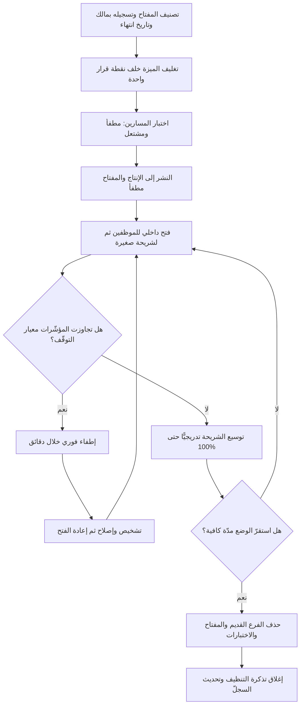

# مفاتيح تفعيل الميزات (Feature Flags)

> [!info] تعريف مختصر
> آليّة برمجية تجعل سلوك النظام قابلًا للتغيير **وقت التشغيل** دون الحاجة إلى نشر إصدار جديد: يُغلَّف الكود الجديد داخل شرط يقرأ قيمة مفتاح خارجي، فإن كان المفتاح مُطفأً بقي الكود موجودًا في الإنتاج لكنه غير مرئي للمستخدم، وإن كان مُشغّلًا ظهر — كليًّا أو لشريحة محدّدة. الأثر الجوهري لهذه الآلية أنها **تفصل النشر (Deployment) عن الإصدار (Release)**: النشر حدث تقني يضع الكود على الخوادم، والإصدار قرار تجاري يجعل الميزة متاحة للمستخدم؛ وحين ينفصلان يصبح إيقاف ميزة معطوبة قرارًا يُنفَّذ في ثوانٍ بتبديل قيمة، لا عملية [[Rollback]] كاملة بكل مخاطرها.

## الشرح العلمي والاحترافي
- **الفصل بين النشر والإصدار هو المكسب الأساسي، وليس "التجريب"**: في النموذج التقليدي كل شيء في الحزمة المنشورة يصبح حيًّا لحظة النشر، فيتحوّل كل نشر إلى حدث عالي المخاطر يتطلّب نوافذ صيانة و[[Go or No-Go Decision]] ثقيلًا. مع المفاتيح، يُنشر الكود مطفأً مرارًا وبهدوء، ثم يُتَّخذ قرار الإظهار منفصلًا. هذا هو ما يجعل [[CI and CD]] ممكنًا عمليًّا في المنتجات الكبيرة: الدمج المستمر لا يعني إظهارًا مستمرًا.
- **المفاتيح أنواع لا نوع واحد، وخلطها هو أصل الفوضى**: التصنيف المتداول في أدبيات هندسة البرمجيات يميّز بين: (١) **مفاتيح إصدار (Release Toggles)** قصيرة العمر تخفي عملًا غير مكتمل، (٢) **مفاتيح تشغيل (Ops Toggles)** يستخدمها فريق التشغيل لإطفاء وظيفة مكلفة تحت الضغط وهي أقرب إلى صمّام أمان دائم، (٣) **مفاتيح تجربة (Experiment Toggles)** تقسّم المستخدمين لقياس أثر، (٤) **مفاتيح تصريح/انتقاء (Permission Toggles)** تفتح وظائف لفئة معيّنة كعملاء مؤسسيين أو مستخدمين تجريبيين. لكلٍّ عمر متوقّع مختلف ومالك مختلف وسياسة تنظيف مختلفة، والفشل الشائع هو معاملتها جميعًا بالطريقة نفسها.
- **بُعدا التصنيف: العمر والديناميكية**: المفتاح الذي يعيش أيامًا يختلف جذريًّا عن المفتاح الذي يعيش سنوات؛ والمفتاح الذي يتغيّر مرة واحدة يختلف عن الذي يتغيّر لكل طلب (Request) حسب هوية المستخدم. المفاتيح قصيرة العمر وثابتة التقييم يمكن أن تكون بدائية (ملف إعدادات)، أما المفاتيح طويلة العمر ديناميكية التقييم فتحتاج خدمة إدارة مفاتيح، وسجلّ تدقيق، وصلاحيات.
- **المفتاح نقطة قرار في وقت التشغيل، لا تعليق كود**: الفرق العملي أن تفرّع المفتاح يجب أن يكون **قابلًا للاختبار** في كلتا الحالتين. اختبار مسار واحد فقط يعني أنك تشحن مسارًا لم يُختبر أبدًا، وهو أخطر من عدم وجود المفتاح.
- **الأثر على بنية الكود ونظافته**: أفضل الممارسات المنشورة تنصح بإبقاء التفرّع في **حافة النظام** لا في عمقه — أي أن يُقرأ المفتاح في نقطة واحدة عالية المستوى تختار تنفيذًا كاملًا (استراتيجية/واجهة)، بدل نثر عشرات `if (flag)` في طبقات المنطق. التصميم الأول يُنظَّف بحذف سطر، والثاني يترك ندوبًا في كل ملف.
- **الدين التقني الذي تولّده المفاتيح إن لم تُنظَّف**: هذه هي التكلفة الحقيقية التي تُغفَل عند التبنّي. كل مفتاح حيّ يضاعف نظريًّا عدد مسارات التنفيذ الممكنة؛ عشرة مفاتيح مستقلّة تعني حتى ١٬٠٢٤ تركيبة سلوكية، ولا أحد يختبرها كلها. النتائج المتراكمة: **(أ)** كود ميّت لا يجرؤ أحد على حذفه لأن أحدًا لا يعرف هل المفتاح ما زال مستخدمًا، **(ب)** استحالة إعادة إنتاج الأعطال لأن حالة النظام لدى المستخدم المتضرّر غير معروفة، **(ج)** انفجار مصفوفة الاختبار وتحوّل [[Regression Testing]] إلى تخمين، **(د)** أعطال ناتجة عن **تفاعل** مفتاحين كلٌّ منهما سليم منفردًا، **(هـ)** تجميد فعلي لإعادة الهيكلة لأن كل تعديل يخشى كسر فرع مطفأ منذ سنة، **(و)** بطء بسيط لكنه تراكمي إن كان تقييم المفاتيح يستدعي خدمة خارجية في المسار الحسّاس. ولهذا يُعدّ المفتاح المنسيّ صورة كلاسيكية من [[Technical Debt]]: قرض قصير الأجل يُسدَّد بالحذف، فإن لم يُسدَّد تراكمت فوائده على شكل هشاشة.
- **الانضباط المضادّ: المفتاح يولد وله تاريخ وفاة**: الممارسة الناضجة تشترط عند إنشاء أي مفتاح إصدار: مالكًا بالاسم، وتاريخ انتهاء متوقّعًا، وبند تنظيف في الـ Backlog يُنشأ مع المفتاح لا بعده. بعض الفرق تجعل تجاوز التاريخ يُفشل بناء المشروع أو يفتح تذكرة تلقائيًّا — والفكرة أن الحذف سلوك افتراضي لا مبادرة تطوّعية.
- **بُعد الحوكمة والأمان**: مفتاح يفتح وظيفة ماليّة أو يكشف بيانات هو في حقيقته **صلاحية إنتاجية**، لذا يجب أن يخضع لسجلّ تدقيق (من غيّره؟ متى؟ من أي حساب؟) ولمبدأ الفصل بين الصلاحيات، وأن يُدرَج في [[Decision Log]] حين يكون تغييره قرارًا تجاريًّا لا تقنيًّا.

## أين ومتى يُستخدم
- **لتمكين التسليم المستمر مع عمل غير مكتمل**: الفرق التي تدمج على فرع رئيسي واحد تحتاج المفاتيح لإخفاء الميزة نصف الجاهزة، فتتجنّب فروعًا طويلة العمر تتحوّل إلى كوابيس دمج — وهذا العمود الفقري لخطوط [[CI and CD]].
- **في الطرح المتدرّج للمستخدمين**: المفاتيح هي البنية التحتية التي يقوم عليها [[Progressive Delivery]]، إذ تحدّد قواعد الاستهداف من يرى الميزة (نسبة مئوية، دولة، شريحة).
- **كصمّام أمان تشغيلي أثناء [[Hypercare]]**: خلال أيام ما بعد الإطلاق يبقى مفتاح الإطفاء جاهزًا، فيتحوّل العطل الحرج من حادثة تستدعي [[Hotfix]] مستعجلًا إلى تبديل يخفض [[MTTR]] إلى دقائق.
- **في [[Pilot Launch]] وربط الميزة بفرع محدّد**: تُفتح الميزة لفرع أو فريق واحد داخل قواعد استهداف واضحة بدل بناء نسخة منفصلة من النظام.
- **عند خدمة عملاء مؤسسيين بعقود مختلفة**: مفاتيح التصريح تفتح وحدات وظيفية حسب الباقة، وهنا يكون المفتاح جزءًا دائمًا من المنتج لا دَينًا — بشرط أن يُصنَّف كذلك صراحةً.
- **في حماية النظام تحت الحمل**: إطفاء وظائف ثانوية مكلفة (تقارير، توصيات) للحفاظ على الوظائف الحرجة هو تطبيق مباشر لمبدأ [[Graceful Degradation]].
- **حين يتعارض جاهزية التقنية مع توقيت السوق**: الكود جاهز لكن الحملة التسويقية بعد أسبوعين — يُنشر مطفأً ويُفتح في لحظة الإطلاق ضمن خطة [[Go-to-Market]] دون نشر تحت ضغط.

## مثال وسيناريو تطبيقي
> [!example] شركة تقنية مالية في الرياض تطلق طريقة سداد جديدة داخل تطبيقها الذي يخدم نحو 800,000 مستخدم نشط شهريًّا. الفريق يعمل بأسلوب النشر المستمر (٤ إلى ٦ عمليات نشر أسبوعيًّا)، لذا وُضعت الميزة كاملة خلف مفتاح `new_payment_rail` مع قواعد استهداف بالنسبة المئوية.
> **الأسبوع الأول**: نُشر الكود ست مرات والمفتاح مطفأ. لم يرَ أحد شيئًا، ولم يتحوّل أي نشر إلى حدث. جرى التحقق داخليًّا بتشغيل المفتاح لحسابات الموظفين فقط (٤٢ حسابًا) في بيئة الإنتاج نفسها.
> **يوم الإطلاق**: فُتح المفتاح لـ 1% من المستخدمين. بعد 40 دقيقة أظهرت لوحة المراقبة ارتفاع نسبة فشل عمليات السداد في هذه الشريحة من 0.4% إلى 3.1%، وهو تجاوز لمعيار التوقّف المتّفق عليه مسبقًا (2%). أُطفئ المفتاح خلال 90 ثانية من قرار المناوب. عدد المستخدمين المتأثّرين فعليًّا: نحو 210 عملية فاشلة، بدل ما كان يمكن أن يكون عشرات الآلاف لو أُطلقت الميزة للجميع.
> **التشخيص**: مهلة استجابة (Timeout) قصيرة جدًّا مع بوّابة الدفع في ساعات الذروة. أُصلحت، ونُشرت، وأُعيد الفتح تدريجيًّا: 1% ← 5% ← 25% ← 100% على ستة أيام، مع رصد النسبة نفسها عند كل حلقة.
> **ما حدث بعد ثلاثة أشهر — الجزء المهمّ**: بقي المفتاح موجودًا في الكود بعد وصوله 100%. وبعد ستة أشهر، أراد مهندس جديد إعادة هيكلة وحدة السداد فوجد **١٩ مفتاحًا حيًّا** في المسار نفسه، سبعة منها بلغت 100% منذ أكثر من ثلاثة أشهر، وثلاثة لا يعرف أحد في الفريق الحالي سبب وجودها لأن أصحابها غادروا. تعطّلت إعادة الهيكلة أسبوعين كاملين في مجرّد **تحقيق أثري** لتحديد أي الفروع ميّت. بعدها فرض الفريق سياسة: كل مفتاح إصدار يُنشأ ومعه تذكرة حذف مجدولة خلال 30 يومًا من بلوغه 100%، ولوحة أسبوعية تعرض «المفاتيح المتقادمة». انخفض العدد الحيّ من 19 إلى 4 خلال ربع واحد، وكلها مفاتيح تشغيلية دائمة مصنَّفة صراحةً.

## خطوات أو مخطّط
1. صنّف المفتاح قبل كتابته: إصدار مؤقّت، أم تشغيل دائم، أم تجربة، أم تصريح؟ لأن التصنيف يحدّد العمر والمالك وسياسة الحذف.
2. سجّل المفتاح في سجلّ مركزي: الاسم، الغرض، المالك بالاسم، تاريخ الانتهاء المتوقّع، معيار النجاح الذي يسمح بفتحه.
3. صمّم نقطة القرار في حافة النظام: قراءة واحدة عالية المستوى تختار سلوكًا كاملًا، لا شروطًا منثورة في العمق.
4. حدّد **السلوك الافتراضي عند فشل قراءة المفتاح** — يجب أن يعود النظام إلى المسار القديم الآمن لا أن يتعطّل.
5. اختبر المسارين معًا: الحالة المطفأة والحالة المشتعلة، وأدرجهما في [[Regression Testing]].
6. انشر والمفتاح مطفأ، وتحقّق من أن النشر لم يغيّر شيئًا مرئيًّا.
7. افتح تدريجيًّا وفق خطة [[Progressive Delivery]] مع معيار توقّف رقمي معلن عند كل حلقة.
8. راقب خلال [[Hypercare]]، وأبقِ صلاحية الإطفاء بيد المناوب دون الحاجة إلى موافقات متسلسلة.
9. بعد بلوغ 100% واستقراره: احذف الفرع الميّت والمفتاح والاختبارات المرتبطة بالحالة القديمة، وأغلق التذكرة.
10. راجع دوريًّا (شهريًّا) لوحة المفاتيح المتقادمة، واعتبر كل مفتاح تجاوز عمره المخطّط بندًا معلنًا من [[Technical Debt]].

## ⚠️ مفاهيم خاطئة شائعة
> [!warning]
> - **«المفتاح يعني أن الميزة أُطلقت»**: النشر خلف مفتاح مطفأ ليس إصدارًا ولا يستحقّ إعلانًا ولا يُحتسب في مؤشّرات التبنّي ([[Adoption]]). الإصدار يبدأ لحظة رؤية أول مستخدم حقيقي للميزة، لا لحظة وصول الكود إلى الخادم.
> - **«وجود مفتاح يغني عن الاختبار»**: المفتاح يقلّل **مدّة** الضرر لا **احتمال** وقوعه. ميزة معطوبة خلف مفتاح ما زالت تعطب كل من يراها حتى لحظة الإطفاء، والاعتماد عليه بديلًا عن [[Quality Assurance]] ينقل الاختبار إلى المستخدم.
> - **«المفاتيح والفروع البرمجية شيء واحد»**: الفرع يعزل الكود قبل الدمج، والمفتاح يعزل السلوك بعد الدمج. المفتاح يُقلّل ألم الدمج لأنه يسمح بالدمج المبكّر؛ فمن يستخدم الاثنين معًا لفترات طويلة يجمع عيوبهما لا مزاياهما.
> - **«الإطفاء يعيد الحالة إلى ما كانت عليه دائمًا»**: هذا صحيح للسلوك، وغير صحيح للبيانات. إن كتب المسار الجديد صيغة بيانات لا يفهمها المسار القديم، فالإطفاء يكشف بيانات تالفة. لذلك تُصمَّم تغييرات المخطّط لتكون متوافقة في الاتّجاهين قبل الاعتماد على المفتاح، تمامًا كما في تخطيط [[Rollback]].
> - **«كل مفتاح دَين تقني يجب حذفه»**: مفاتيح التشغيل ومفاتيح التصريح جزء مشروع ودائم من بنية المنتج. الدَّين هو المفتاح **المؤقّت الذي تجاوز غرضه**، لا المفتاح بذاته. الخلط يدفع فرقًا إلى حذف صمّامات أمان تحتاجها.
> - **«المفاتيح شأن هندسي داخلي لا يخصّ إدارة المشروع»**: بل هي أداة إدارة مخاطر ونطاق: تفصل الالتزام بتاريخ النشر عن الالتزام بتاريخ الإتاحة، وتغيّر معنى [[Feature Freeze]] و[[Definition of Done]] معًا.

## ❌ ممارسات خاطئة في المشاريع
> [!failure]
> - **إنشاء مفتاح بلا مالك ولا تاريخ انتهاء** → لأن التنظيف عمل لا يطالب به أحد ولا يظهر للعميل، فيُؤجَّل إلى الأبد حتى يصبح الكود شبكة فروع ميتة لا يجرؤ أحد على لمسها → **الحل**: امنع إنشاء مفتاح دون حقلي المالك وتاريخ الانتهاء، وأنشئ تذكرة الحذف في اللحظة نفسها التي يُنشأ فيها المفتاح.
> - **نثر شروط المفتاح في عشرات المواضع داخل طبقات المنطق** → يجعل الحذف عملية جراحية عالية الخطورة بدل حذف سطر، فيتحوّل التنظيف نفسه إلى مصدر أعطال → **الحل**: اجعل التفرّع في نقطة واحدة عالية المستوى تختار تنفيذًا كاملًا، وراجع ذلك في مراجعة الكود.
> - **الاكتفاء باختبار المسار المشتعل** → يُشحن المسار المطفأ وهو غير مختبَر، فينكشف عطله في أسوأ لحظة ممكنة: عند الإطفاء الطارئ أثناء حادثة → **الحل**: اشترط تغطية اختبارية للحالتين، وأدرج سيناريو «إطفاء تحت الضغط» في تدريبات الجاهزية.
> - **جعل تغيير المفتاح في الإنتاج يمرّ بسلسلة موافقات إدارية** → يلغي ميزته الجوهرية وهي السرعة، ويرفع [[MTTR]] إلى ساعات فيصير المفتاح ديكورًا → **الحل**: فوّض صلاحية الإطفاء مسبقًا للمناوب ضمن حدود معلنة، واجعل التوثيق لاحقًا في [[Decision Log]] لا شرطًا مسبقًا.
> - **استخدام المفاتيح لإخفاء غياب الجاهزية بدل تأجيل العمل** → تتراكم ميزات نصف مكتملة في الإنتاج بلا اختبار ولا صيانة، وتتحوّل قاعدة الكود إلى مقبرة نوايا → **الحل**: اربط كل مفتاح إصدار بخطة فتح ذات تاريخ؛ فإن لم توجد خطة فالميزة لا تُدمج أصلًا.
> - **إطلاق تجربة قياس عبر مفتاح دون تثبيت الشريحة لكل مستخدم** → يتنقّل المستخدم بين تجربتين فتتلوّث نتائج القياس ويُتّخذ قرار خاطئ بناءً على بيانات لا معنى لها → **الحل**: اربط قرار الشريحة بمعرّف ثابت للمستخدم، وثبّت التخصيص طوال مدّة التجربة.
> - **قراءة المفتاح من خدمة خارجية داخل المسار الحسّاس دون قيمة احتياطية** → عطل في خدمة المفاتيح يصير عطلًا كاملًا في المنتج، فتتحوّل أداة تقليل المخاطر إلى نقطة فشل واحدة → **الحل**: خزّن القيم محليًّا مع تحديث دوري، وحدّد سلوكًا افتراضيًّا آمنًا عند تعذّر القراءة.
> - **إبقاء مفاتيح تفتح وظائف ماليّة أو بيانات حسّاسة بلا سجلّ تدقيق ولا صلاحيات** → يصبح تبديل قيمة واحدة قادرًا على كشف بيانات أو تعطيل ضوابط دون أثر يُراجَع → **الحل**: عامل هذه المفاتيح معاملة الصلاحيات الإنتاجية: صلاحية مقيّدة، وسجلّ لكل تغيير، ومراجعة دورية.

## 🔗 مصطلحات ومفاهيم ذات صلة
[[Progressive Delivery]] | [[Rollback]] | [[Hypercare]] | [[Pilot Launch]] | [[Go or No-Go Decision]] | [[Feature Freeze]] | [[Technical Debt]] | [[CI and CD]] | [[Graceful Degradation]] | [[Hotfix]] | [[MTTR]] | [[Staging vs Production Environment]] | [[Regression Testing]] | [[Sunset and Deprecation]] | [[Post-Launch Review]]
