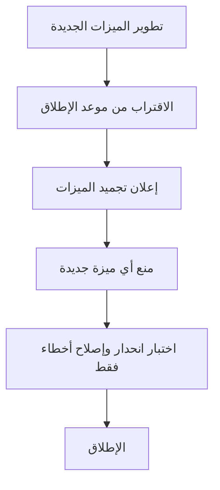

# تجميد الميزات (Feature Freeze)

> [!info] تعريف مختصر
> تجميد الميزات (Feature Freeze) هو نقطة زمنية في المشروع يتوقف بعدها إضافة أي ميزة جديدة إلى الإصدار الحالي، ويقتصر العمل بعدها على إصلاح الأخطاء والتحسينات الطفيفة استعداداً للإطلاق.

## الشرح العلمي والاحترافي
- الهدف من تجميد الميزات هو منح الفريق فترة استقرار قبل الإطلاق، يُركَّز فيها الجهد على اختبار ما هو موجود بدلاً من إضافة تعقيد جديد قد يُدخِل أخطاءً غير متوقعة.
- يختلف عن تجميد الكود (Code Freeze) الذي يمنع أي تعديل في الكود نهائياً؛ تجميد الميزات أخف حدة، إذ يسمح بإصلاح الأخطاء (Bug Fixes) لكن يمنع الميزات الجديدة (New Features).
- يهم هذا المفهوم لأنه يقلل من نطاق المخاطر (Risk) قرب الإطلاق؛ فكل ميزة جديدة تُضاف متأخراً تحمل احتمال ظهور أخطاء غير مختبرة بشكل كافٍ.
- يرتبط مباشرة بمفهوم زحف النطاق ([[Scope Creep]])، إذ يُعتبر تجميد الميزات أداة رسمية لمنع الزحف في اللحظات الأخيرة قبل الإصدار.
- عادة ما يُعلن عنه رسمياً في اجتماع أو رسالة للفريق بأكمله، ليكون الجميع على علم بأن أي طلب ميزة جديدة سيُؤجَّل للإصدار التالي.

## أين ومتى يُستخدم
- يُطبَّق عادة في المشاريع ذات الإصدارات الدورية (Releases) الكبيرة، سواء في الشلال ([[04 - Waterfall]]) أو في أجايل عند الاستعداد لإطلاق كبير.
- يُعلَن عنه عند الاقتراب من موعد إطلاق مهم، مثل إصدار تطبيق جديد للمتاجر أو نسخة رئيسية من نظام.
- يُستخدم بالتوازي مع بيئات الإنتاج والتجهيز ([[Staging vs Production Environment]]) حيث يبدأ الفريق باختبار القبول ([[UAT]]) على نسخة مجمّدة الميزات.
- يظهر أيضاً في سياقات الالتزام بموعد إطلاق أو عدم الإطلاق ([[Go or No-Go Decision]]) كخطوة تسبق القرار النهائي.

## مثال وسيناريو تطبيقي
> [!example] سيناريو
> فريق تطبيق "توصيلة" يستعد لإطلاق النسخة 3.0 يوم 1 أغسطس. في 15 يوليو، أعلن مدير المنتج تجميد الميزات (Feature Freeze) رسمياً عبر قناة الفريق على Slack.
> بعد هذا التاريخ، رفض الفريق طلب أحد المديرين لإضافة ميزة "الدفع بالتقسيط" لأنها لم تكن جاهزة، وأُجِّلت للنسخة 3.1 القادمة بدلاً من المخاطرة بتأخير الإطلاق أو إدخال أخطاء جديدة.
> خلال الأسبوعين المتبقيين، ركّز الفريق فقط على اختبار الانحدار ([[Regression Testing]]) وإصلاح الأخطاء الحرجة التي ظهرت في اختبار القبول ([[UAT]])، ما سمح بإطلاق النسخة في موعدها دون مفاجآت.

## خطوات أو مخطّط
1. تحديد تاريخ التجميد: يُحدَّد بالتنسيق مع تاريخ الإطلاق المستهدف، مع ترك وقت كافٍ للاختبار بعده.
2. الإعلان الرسمي: إبلاغ كل أصحاب المصلحة وأعضاء الفريق بتاريخ التجميد وما يعنيه بالضبط.
3. مراجعة الميزات قيد التطوير: تحديد أي الميزات ستدخل ضمن الإصدار الحالي وأيها يُؤجَّل للإصدار التالي.
4. تطبيق التجميد: رفض أو تأجيل أي طلب ميزة جديدة بعد التاريخ المحدد، مهما كان مصدره.
5. التركيز على الاستقرار: تحويل جهد الفريق بالكامل نحو اختبار الانحدار وإصلاح الأخطاء الحرجة فقط.
6. الإطلاق: بعد التأكد من استقرار النسخة، تتم عملية الإطلاق للإنتاج.

## ⚠️ مفاهيم خاطئة شائعة
> [!warning]
> - الخلط بين تجميد الميزات (Feature Freeze) وتجميد الكود (Code Freeze)؛ الأول يمنع الميزات الجديدة فقط، بينما الثاني يمنع أي تعديل تقريباً حتى إصلاحات الأخطاء الطفيفة.
> - الاعتقاد بأن التجميد يعني توقف العمل كلياً؛ في الواقع العمل يستمر بكثافة لكنه يتركّز على الاختبار وإصلاح الأخطاء لا على الإضافة.
> - الظن أن تاريخ التجميد قابل للتفاوض بسهولة لكل طلب "عاجل"؛ كثرة الاستثناءات تُفقِد التجميد فائدته الأساسية في تحقيق الاستقرار.

## ❌ ممارسات خاطئة في المشاريع
> [!failure]
> - السماح باستثناءات متكررة لإدخال ميزات "بسيطة" بعد التجميد، مما يُعيد المشروع لحالة عدم استقرار قبل الإطلاق مباشرة. التجنب: الالتزام الصارم بالتجميد إلا لحالات طارئة موثّقة رسمياً.
> - عدم إبلاغ كل أصحاب المصلحة بتاريخ التجميد، فيفاجأ بعضهم برفض طلباتهم المتأخرة. التجنب: إعلان تاريخ التجميد مبكراً وبوضوح لكل الأطراف المعنية.
> - تجميد الميزات دون خطة واضحة لما سيحدث للميزات المؤجَّلة، مما يخلق ارتباكاً حول أولويات الإصدار القادم. التجنب: توثيق الميزات المؤجَّلة فوراً في المخزون المتراكم ([[13 - Backlog]]) للإصدار التالي.

## 🔗 مصطلحات ومفاهيم ذات صلة
[[Scope Creep]] | [[Staging vs Production Environment]] | [[UAT]] | [[Regression Testing]] | [[Go or No-Go Decision]] | [[Hotfix]] | [[13 - Backlog]] | [[Sign-off]]
