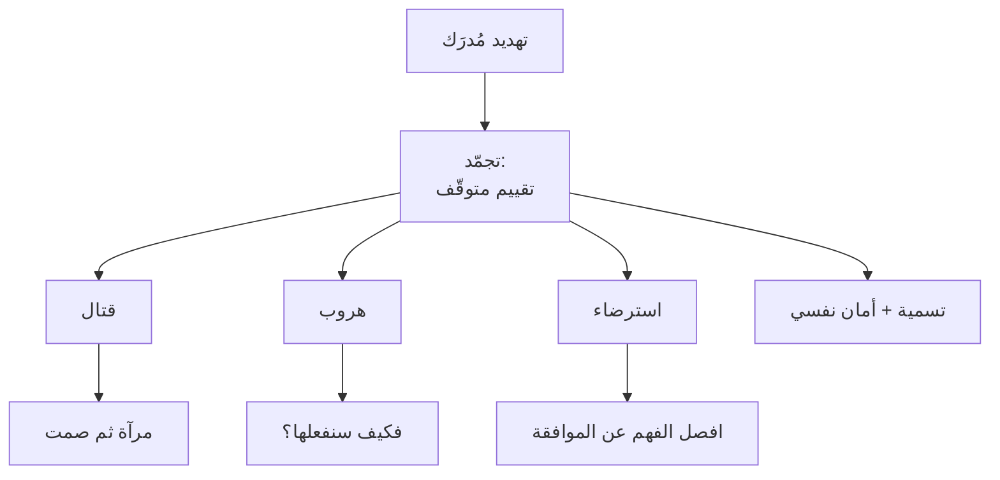

# استجابة القتال أو الهروب أو التجمّد (Fight, Flight, Freeze)
> [!info] تعريف مختصر
> أنماط الاستجابة التلقائية للتهديد المُدرَك: **القتال** (هجوم واتّهام) · **الهروب** (موافقة سريعة ثم اختفاء) · **التجمّد** (صمت وانسحاب) — ويُضاف إليها رابع وثيق الصلة ببيئة العمل: **الاسترضاء (Fawn)** — نزع التهديد بالخضوع والتنازل.

## الشرح العلمي والاحترافي
صاغ **والتر كانون (Walter Cannon)** مصطلح *fight-or-flight* عام 1915. وأُضيف **التجمّد** لاحقًا، وهو في الحقيقة **يسبق** الاثنين لا يتلوهما: حالة يقظة متوقّفة يُقيَّم فيها التهديد قبل اختيار الاستجابة. وأضاف **بيت ووكر (Pete Walker)** في *Complex PTSD* (2013) استجابة **الاسترضاء**.

**والتصنيف تشخيصي لا وصفي — لكلّ استجابة علامات وتدخّل مختلف:**

| الاستجابة | ما تراه | ما يُقال | التفسير الخاطئ | **التدخّل** |
|---|---|---|---|---|
| **القتال** | صوت مرتفع · مقاطعة · **تعميم** · اتّهام | «كلّ ما يأتينا منكم معطوب» | «شخص عدواني» | [[Mirroring\|مرآة]] قصيرة ثم صمت |
| **الهروب** | «حاضر» سريعة · تغيير موضوع · اختفاء بعد الاجتماع | «تمام، سنُنفّذ» | **«موافقة والتزام»** | **«فكيف سنفعلها؟»** |
| **التجمّد** | صمت · كاميرا مغلقة · ذراعان مطويتان · نظر إلى الأرض | «ما زلتُ أعمل عليها» | «غير مهتمّ» | [[Labeling\|تسمية]] تصف الشيء لا الشخص + أمان نفسي |
| **الاسترضاء** | تنازل فوري · اعتذار غير مبرَّر · تخلٍّ عن تقدير | «حسنًا، سنُلغي جيرا» | «تعاون ومرونة» | تدرّب على الثبات؛ افصل الفهم عن الموافقة |

**وأخطرها في بيئة العمل ليست القتال بل الهروب** — لأنّها **الوحيدة التي تبدو نجاحًا**: المُقاتِل يُنبّهك بصوته، والمتجمّد بصمته، أمّا الهارب فيقول «حاضر» ويُغادر، فتُغلق الاجتماع مطمئنًّا وتكتشف بعد أسبوع أنّ شيئًا لم يحدث. انظر [[Fake Yes]].

**والاسترضاء إضافة مهمّة** لأنّه الوصف الدقيق لما يُسمّى في أدبيات الإدارة «التنازل إرضاءً للآخرين»؛ **وتصنيفه استجابة تهديد يُغيّر علاجه**: لا يُعالَج بالتوعية بل بالتدرّب على الأداء تحت استثارة، شأنه شأن القتال والهروب.

## أين ومتى يُستخدم
- تشخيص سلوك مفاجئ في اجتماع قبل الحكم على صاحبه.
- تفسير لماذا لا يُنفَّذ ما يُتَّفق عليه (هروب) وسط انسجام ظاهري.
- فهم موقف من «يتعاون دائمًا» ثم يُقرأ ضعفًا (استرضاء).
- تصميم تدخّل مناسب لكلّ نمط بدل معاملة الجميع بالطريقة نفسها.

## مثال وسيناريو تطبيقي
> [!example] في اجتماع واحد ظهرت ثلاث استجابات: **قائد فريق يصرخ** «هذا الطلب انتحار تقني» (قتال) · **مطوّر يقول «تمام، سأُنهيه هذا السبرنت»** بلا وقفة ولا تفصيل (هروب) · **ومختبِرة صامتة تمامًا** لم تُبدِ رأيًا رغم أنّ الأمر يخصّها (تجمّد). ومدير أدار الثلاثة بالطريقة نفسها — «أرجو أن نبقى هادئين ونُركّز» — **فلم يُعالَج شيء**. والصحيح ثلاثة تدخّلات: مرآة للأوّل («انتحار تقني؟») · سؤال كاشف للثاني («فكيف سنفعلها؟») · وتسمية للثالثة تصف الموقف لا الشخص، ثم لقاء فردي بعدها.

## خطوات أو مخطّط
1. **صنّف الاستجابة** من علاماتها قبل أن تُفسّر السلوك.
2. **لا تُفسّرها سمة**: من يهرب ليس «غير ملتزم»، ومن يتجمّد ليس «غير مهتمّ».
3. **اختر التدخّل المطابق** من الجدول.
4. **ابحث عن المُطلِق**: تهديد · نقد · غموض متطلّبات · ضغط زمني.
5. **إن كان المُطلِق نظاميًّا فعالجه على مستواه** — الغموض يُعالَج بمعايير قبول لا بمهارة تواصل.

## ⚠️ مفاهيم خاطئة شائعة
> [!warning]
> - **ليست اختيارات ولا سمات شخصية.** استجابات تلقائية تختلف بالموقف؛ فمن يُقاتل مع زميل قد يتجمّد أمام مدير.
> - **الاسترضاء ليس نضجًا ولا تعاونًا.** التنازل بلا دراسة **استجابة تهديد** لا قرارًا؛ والفرق أنّ القرار يسبقه فحص للمفاضلة.
> - **عتبة الاستجابة تختلف بين الأفراد** وتتأثّر بالنوم والحالة الصحّية والتاريخ مع بيئات عمل سابقة — **فلا قاعدة زمنية واحدة تصلح للجميع**.

## ❌ ممارسات خاطئة في المشاريع
> [!failure]
> - **قراءة الهروب التزامًا** — أخطر خطأ إداري في هذا الباب؛ وعلاجه سؤال واحد: «فكيف سنفعلها؟».
> - **معالجة التجمّد بالسؤال المباشر** («لماذا لا تتكلّم؟») — يُقرأ اتّهامًا فيُعمّق الانسحاب.
> - **مكافأة الاسترضاء** — من يتنازل دائمًا يُشكَر، فيتعلّم الفريق أنّ الثبات مُكلِف؛ وهذا يُنتج [[Fake Yes|«نعم» زائفة]] بنيويًّا.
> - **تجاهل المُطلِقات النظامية** — إن كان نصف ما تراه ناتجًا عن غموض متطلّبات وضغط زمني، فأنت تُدير أعراضًا أسبوعيًّا.

## 🔗 مصطلحات ومفاهيم ذات صلة
[[Amygdala Hijack]] | [[Fake Yes]] | [[Labeling]] | [[Mirroring]] | [[Psychological Safety]] | [[Tactical Silence]] | [[SCARF Model]] | [[Ruinous Empathy]] | [[Tactical Empathy]]

> [!tip] 💡 إثراء عملي — كورس لعبة العقل
> الجدول التشخيصي الكامل، ولماذا أخطرها الهروب: [[02 - بيولوجيا اللحظة - اللوزة والقشرة الجبهية]].
