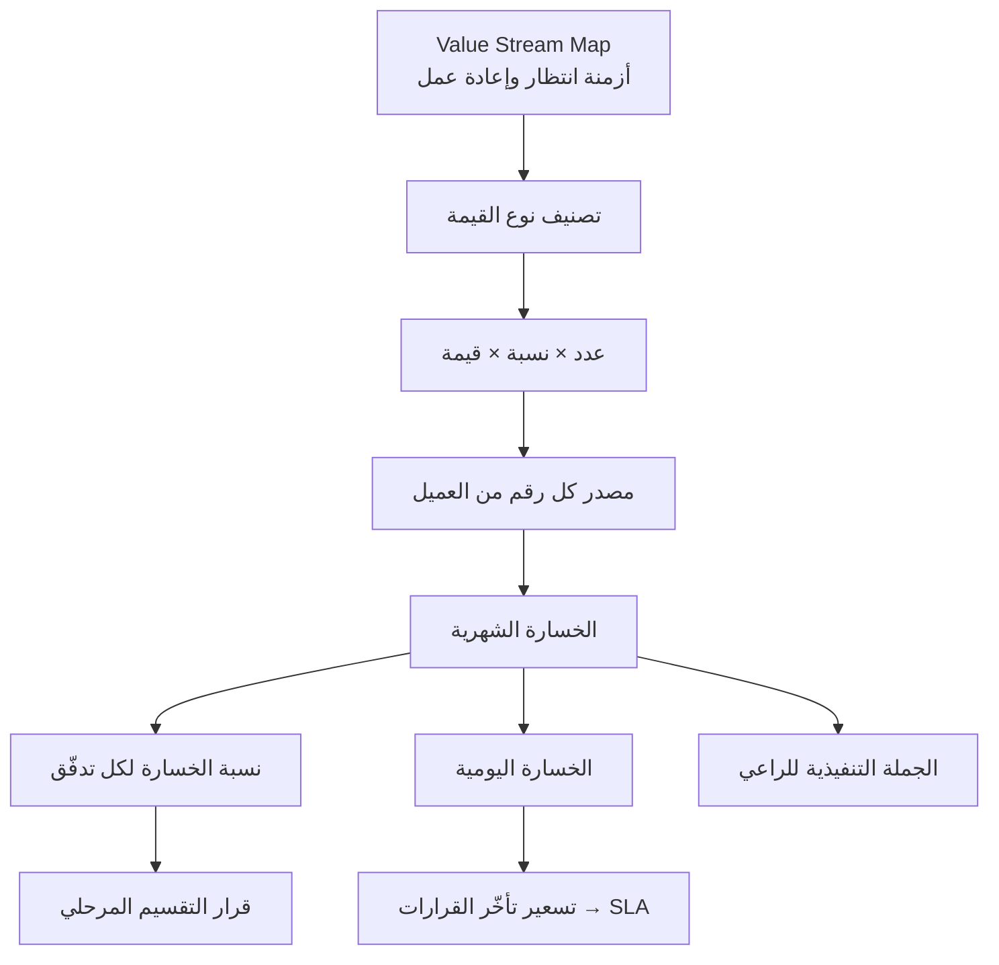

# تحليل الخسارة المالية (Financial Loss Analysis)

> [!info] تعريف مختصر
> **تحليل الخسارة المالية** أداة تحوّل الألم التشغيلي — التأخير، والأخطاء، وإعادة العمل، وضعف التدفّق — إلى **رقم بالعملة لكل شهر**. غرضه ليس المحاسبة بل **تغيير لغة النقاش**: من «النظام سيحسّن العمليات» إلى «الوضع الحالي يكلّفكم مبلغاً محدّداً شهرياً». وهو الأداة التي تجعل الإدارة العليا تتّخذ قراراً، لأن **الإدارة لا تقرّر بناءً على المميزات بل بناءً على الأثر المالي**.

## الشرح العلمي والاحترافي

- **الصيغة الجامعة**: كل خسارة تشغيلية يمكن اشتقاقها من ثلاثة عوامل فقط:
  **الخسارة = عدد × نسبة × قيمة**
  والفن كلّه في اختيار العوامل الثلاثة اختياراً **قابلاً للتصديق ومسنوداً بمصدر لدى العميل**.

- **الأنواع الأربعة للقيمة وطرق حسابها**:
  | نوع القيمة | المعادلة |
  |---|---|
  | **`Revenue`** — إيراد ضائع | عدد العملاء × نسبة التأثير × قيمة الطلب |
  | **`Cost Reduction`** — تكلفة زائدة | عدد العمليات × نسبة التوفير × تكلفة العملية |
  | **`Efficiency`** — كفاءة مهدورة | الوقت الموفَّر × عدد العمليات × تكلفة الساعة |
  | **`Risk Reduction`** — خطر متحقّق | عدد الأخطاء × نسبة التقليل × تكلفة الخطأ |

- **لماذا الرقم الشهري لا السنوي؟** الرقم السنوي أضخم وأكثر إبهاراً، لكن الشهري **أقوى تفاوضياً** لأنه يجعل التأخير ملموساً: «كل شهر تأخير في الإطلاق يكلّفكم كذا». وهذه هي [[Cost of Delay]] بلغة العميل — إذ ينقلب السؤال من «كم يكلّف المشروع؟» إلى **«كم يكلّف عدم المشروع؟»**.

- **متى نستخدمه ومتى نستخدم [[WSJF]]؟** الأداتان تحلّان مشكلة الأولوية بطريقتين:
  | استخدم `WSJF` | استخدم التقدير المالي |
  |---|---|
  | لا توجد بيانات مالية | القرار مهمّ ومصيري |
  | تريد ترتيباً سريعاً | العميل يعترض |
  | تعمل مع الفريق | تحتاج إقناعاً قوياً |
  
  أي أن **`WSJF` أداة داخلية للفريق، والتقدير المالي أداة خارجية للإدارة**. وهما لا يتعارضان: ترتّب داخلياً بـ`WSJF` وتُقنع خارجياً بالريال.

- **الربط بتدفّقات القيمة**: كل بند خسارة يجب أن يُنسب إلى [[Value Stream|تدفّق قيمة]] محدّد، لأن هذا هو ما يحوّل التحليل من عرض تقديمي إلى قرار تقسيم مرحلي. فإذا كانت 75% من الخسارة تتركّز في تدفّقين، صار واضحاً ما تحويه المرحلة الأولى — وصارت حجّة التقسيم مالية لا مجرّد «تقليل مخاطر».

- **الفرق عن `Business Case` التقليدي**: دراسة الجدوى تحسب **العائد على الاستثمار** بافتراضات مستقبلية طويلة المدى وتخضع للجدل. أمّا هذا التحليل فيقيس **نزيفاً حالياً قائماً** يمكن التحقّق منه من سجلّات العميل نفسه. والفرق في قابلية التصديق هائل: الأول يَعِد بمكسب، والثاني يصف خسارة واقعة.

- **الخطر الكامن — الرقم غير المُصدَّق**: أضعف نقطة في الأداة أن أرقامها قد تُخترع لتبرير الميزانية. وكل رقم هنا يجب أن يكون له **مصدر لدى العميل**: تقرير مبيعات، سجلّ مرتجعات، محضر جرد، كشف رواتب. والرقم بلا مصدر ينقلب عليك في أول اجتماع مع المالية.

## أين ومتى يُستخدم
- عند **عرض المشروع على الإدارة العليا** أو مواجهة اعتراض على الميزانية أو المدّة.
- بعد رسم [[Value Stream|تدفّقات القيمة]] مباشرة — لأن أزمنة الانتظار المرصودة هناك هي مادّة الحساب هنا.
- في **تبرير التقسيم المرحلي**: إظهار أي مرحلة تعالج أي نسبة من الخسارة.
- عند **التفاوض على تسريع القرارات**: تحويل «كل يوم تأخير» إلى رقم يومي يجعل [[SLA]] القرارات مطلباً مالياً لا إجرائياً.
- في **تقرير تحقّق القيمة بعد الإطلاق**: مقارنة الخسارة المقدَّرة بالوفر الفعلي.
- عند **ترتيب المزايا** حين يكون الخلاف مع الإدارة لا مع الفريق.

## مثال وسيناريو تطبيقي
> [!example] شركة توزيع — من أربعة بنود إلى قرار
> | البند | طريقة الحساب | الخسارة الشهرية |
> |---|---|---|
> | تأخّر الطلبات | 300 طلب/يوم × 10% تأخير × 3,000 (متوسط الطلب) | **90,000** |
> | فروق المخزون | من سجلّ الجرد والهدر | **60,000** |
> | إعادة الفواتير | عدد الفواتير المعادة × تكلفة المعالجة | **30,000** |
> | إعادة العمل | ساعات مهدورة × تكلفة الساعة | **20,000** |
> | **الإجمالي** | | **200,000 شهرياً** |
>
> **الجملة التنفيذية المصاغة للراعي:** «من خلال تحليل التدفّق الحالي، أكبر نقطة مؤثّرة هي ضعف دورة الطلب إلى التحصيل ودقّة المخزون، وتكلّفكم تقريباً **200 ألف شهرياً**. لذلك نوصي بالتركيز أولاً على التدفّقات التي تقلّل هذه الخسارة مباشرة.»
>
> **ما فعله الرقم:**
> 1. **حسم قرار التقسيم**: البندان الأولان (90k + 60k = 150k) يمثّلان **75% من الخسارة** ويعالجهما كلاهما في المرحلة الأولى. فصارت حجّة التقسيم مالية لا نظرية.
> 2. **حسم نقاش المدّة**: 200,000 ÷ 30 = **6,600 ريال يومياً**. فصار كل يوم تأخير في قرار العميل قابلاً للتسعير — وهذا ما جعل `SLA` القرارات يُوقَّع فعلاً بعد رفضه مرّتين.
> 3. **غيّر جمهور المشروع**: تحوّل من مشروع «تقنية المعلومات» إلى مشروع يتابعه الرئيس التنفيذي للعمليات شخصياً.

## خطوات أو مخطّط
1. حدّد بنود الألم من [[Value Proposition Canvas]] و[[Value Stream|خرائط التدفّق]].
2. صنّف كل بند إلى نوع القيمة الأربعة (إيراد / تكلفة / كفاءة / خطر).
3. لكل بند حدّد العوامل الثلاثة: عدد × نسبة × قيمة.
4. **اطلب مصدر كل رقم من العميل** ووثّقه في الجدول.
5. احسب الخسارة الشهرية لكل بند ثم الإجمالي.
6. انسب كل بند إلى تدفّق القيمة المسؤول عنه.
7. احسب نسبة الخسارة التي تعالجها كل مرحلة.
8. اشتقّ الخسارة اليومية لاستخدامها في نقاشات التصعيد.
9. صُغ جملة تنفيذية واحدة بلغة الإدارة لا بلغة التحليل.

## ⚠️ مفاهيم خاطئة شائعة
> [!warning]
> - **الخلط بينه ودراسة الجدوى**: الجدوى تَعِد بمكسب مستقبلي، وهذا يصف نزيفاً حالياً قابلاً للتحقّق.
> - **الظنّ بأن الدقّة شرط**: التقدير المعقول المسنود بمصدر أنفع من الدقّة المستحيلة. المطلوب رتبة المقدار لا الرقم الحسابي.
> - **افتراض أن كل الخسارة ستزول**: النظام يغطّي نسبة من الألم لا كلّه — راجع [[Pain Gain Coverage Matrix]] قبل الوعد بأي وفر.
> - **استخدامه بديلاً عن [[WSJF]]**: الأداتان لجمهورين مختلفين؛ إحداهما للفريق والأخرى للإدارة.
> - **عرض الرقم السنوي وحده**: يُبهر ولا يُحرّك. الشهري واليومي هما ما يصنعان الإلحاح.

## ❌ ممارسات خاطئة في المشاريع
> [!failure]
> - **اختراع الأرقام لتبرير الميزانية**: ينهار في أول مراجعة مع المالية ويهدم مصداقية المشروع كلّه. الحلّ: عمود «مصدر الرقم» إلزامي بجانب كل بند.
> - **عرض الخسارة دون ربطها بالمرحلة التي تعالجها**: يترك السؤال «وماذا سنجني في المرحلة الأولى؟» بلا جواب. الحلّ: جدول توزيع الخسارة على المراحل.
> - **الوعد بإزالة الخسارة كاملة**: يخالف واقع التغطية الجزئية ويولّد خيبة. الحلّ: اربط كل بند بنسبة تغطيته المتوقّعة.
> - **إهمال حساب الخسارة اليومية**: يحرمك من أقوى أداة لتسريع القرارات. الحلّ: اشتقّها واستخدمها في كل تصعيد.
> - **عدم مراجعة الأرقام بعد الإطلاق**: يجعل التحليل عرضاً تقديمياً لا أداة قياس. الحلّ: أدرج مقارنة المقدَّر بالفعلي في تقرير تحقّق القيمة.

## 🔗 مصطلحات ومفاهيم ذات صلة
[[Cost of Delay]] | [[WSJF]] | [[Value Stream]] | [[Pain Gain Coverage Matrix]] | [[Value Proposition Canvas]] | [[SLA]] | [[07 - Financial Loss Analysis]]
