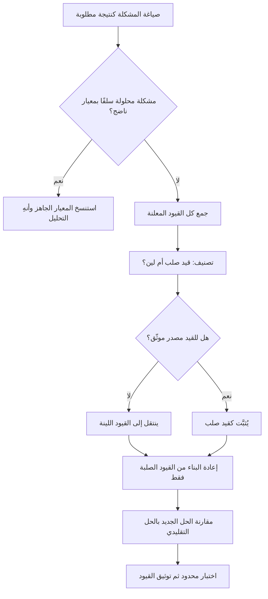

# التفكير من المبادئ الأولى (First Principles Thinking)

> [!info] تعريف مختصر
> منهج تفكير يقوم على تفكيك المشكلة إلى أصغر الحقائق التي لا يمكن ردّها إلى ما هو أبسط منها — حقائق فيزيائية، أو قيود تعاقدية، أو أرقام تكلفة أوّلية، أو متطلّبات لا مفرّ منها — ثم إعادة بناء الحل انطلاقًا من هذه الحقائق وحدها، بدل استنساخ ما يفعله الآخرون أو ما اعتاد الفريق فعله. نقيضه هو **التفكير بالقياس (Reasoning by Analogy)**: «نفعلها هكذا لأن الجميع يفعلها هكذا». التفكير من المبادئ الأولى أداة باهظة معرفيًّا، لذلك لا يُستحق إطلاقه إلا حيث تكون الأعراف السائدة مشكوكًا فيها أو الرهان كبيرًا؛ أما في المشكلات المحلولة سلفًا فهو مضيعة صريحة للوقت.

## الشرح العلمي والاحترافي
- **الأصل الفلسفي**: الفكرة قديمة في تاريخ الفلسفة، وتُنسب في جذورها إلى أرسطو الذي تحدّث عن «المبدأ الأول» بوصفه الأساس الأوّل المعروف بذاته الذي لا يُشتقّ من شيء سابق عليه. ثم صار المنهج ركيزة في الفيزياء والرياضيات: أن تشتقّ النتيجة من البديهيات والقوانين الأساسية بدل الاعتماد على نتائج مجرّبة سابقة. وفي الهندسة تُستخدم عبارة «حساب من المبادئ الأولى» بمعنى تقدير قيمة انطلاقًا من الفيزياء والمواد الخام، لا من سعر السوق أو أرقام مورّد.
- **الخصم الحقيقي ليس الجهل بل التشبيه**: أغلب قراراتنا اليومية تُتّخذ بالقياس على حالات مشابهة — وهذا في الغالب اختصار عقلاني نافع. لكن التشبيه يحمل معه **افتراضات ضمنية غير مفحوصة**: يفترض أن الظرف الذي أنتج الحل السابق ما زال قائمًا. حين تتغيّر التقنية أو التكلفة أو التنظيم، يبقى الحل قائمًا بلا مبرّر، ويتحوّل من ممارسة إلى عرف، ومن عرف إلى «قانون طبيعة» في ذهن الفريق.
- **آلية العمل: تفكيك ثم إعادة بناء**: الخطوة الأولى هي فصل الحقائق عن الاستنتاجات المتراكمة فوقها. تُكتب كل جملة يقولها الفريق ثم يُسأل عنها: هل هذه حقيقة قابلة للتحقّق (قيد قانوني، رقم عقد، حدّ فيزيائي)، أم استنتاج ورثناه؟ ما يصمد للسؤال يبقى، وما لا يصمد يُرفع من الطاولة. ثم يُعاد بناء الحل من الحقائق الصامدة فقط — وقد يخرج الحل مطابقًا للحل التقليدي، وهذه ليست نتيجة فاشلة بل تأكيد مكلف لكنه موثوق.
- **الأداة اللغوية المصاحبة: سؤال «لماذا» المتكرّر**: التفكيك يتقدّم عمليًّا بسلسلة أسئلة «لماذا هذا القيد قائم؟» حتى نبلغ إجابة لا تُختزل. يتقاطع هذا مع منطق [[Root Cause Analysis]] لكن الوجهة مختلفة: تحليل السبب الجذري يبحث في **الماضي** عن سبب عطل وقع، والتفكير من المبادئ الأولى يبحث في **الحاضر** عن أي القيود حقيقي قبل تصميم المستقبل.
- **التمييز الحاسم: القيد الصلب مقابل القيد اللين**: مخرج الجلسة الأنفع هو جدول قيود مصنّفة. القيد الصلب لا يمكن كسره بأي ميزانية (قانون، فيزياء، تشريع حماية بيانات كـ[[PDPL]]، سقف زمني تعاقدي). القيد اللين يبدو صلبًا لكنه في الحقيقة قابل للتفاوض أو الشراء أو إعادة التصميم (توقّع إدارة، عادة فريق، نطاق مفترض، أداة قديمة). أغلب المكاسب الكبيرة تأتي من اكتشاف أن قيدًا اعتُبر صلبًا هو لين.
- **متى يكون المنهج مضيعة للوقت — وهذا جوهر إتقانه**: التفكير من المبادئ الأولى مُكلف في الوقت والانتباه ورأس المال السياسي. ولا يُستحق حين تكون المشكلة **محلولة سلفًا** ومعروفة الحل ومتوفّرة له معايير ناضجة: تصميم نظام مصادقة، أو اختيار صيغة تاريخ، أو بناء قناة نشر آلي ([[CI and CD]])، أو ترتيب اجتماع مراجعة. إعادة اشتقاق هذه الأمور من الصفر تُنتج حلولًا أضعف من الجاهز، وتستهلك الوقت الذي كان يجب أن يُصرف على المشكلة الفريدة في مشروعك. القاعدة العملية: **استعمل المنهج على 5% من القرارات التي تحكم 80% من النتيجة، واستنسخ المعايير الناضجة في الباقي بلا خجل**.
- **العلاقة بالتقدير والتسعير**: من أنفع تطبيقاته العملية «التقدير من الأسفل إلى الأعلى انطلاقًا من مكوّنات حقيقية» بدل التقدير بالقياس على مشروع سابق. المقارنة بين التقديرين نفسها ذات قيمة: الفجوة بينهما تكشف أين تختبئ الافتراضات، وتُغذّي فهمك لـ[[Estimation Variance]].
- **حدوده المعرفية**: المنهج لا يحمي من الخطأ إذا كانت «الحقائق الأساسية» التي بنيت عليها ناقصة أو مغلوطة. تفكيك دقيق فوق قاعدة معلومات خاطئة يُنتج ثقة زائفة أشدّ خطرًا من الحدس. ولذلك يُقرَن دائمًا بمرحلة تحقّق من الأرقام المستخدمة، وبفحص [[Confirmation Bias]] لدى من قاد الجلسة — إذ يسهل أن يُستعمل «التفكيك» غطاءً لتبرير حلّ مُتّخذ سلفًا.

## أين ومتى يُستخدم
- **عند صياغة المشكلة قبل البحث عن حل** ([[Problem Statement]]): لفصل ما يُطلب فعلًا عمّا افتُرض أنه مطلوب، وكثيرًا ما يتقلّص النطاق إلى نصفه بمجرّد هذا الفصل.
- **عند مراجعة تكلفة مرتفعة أو جدول زمني مستحيل** ([[Iron Triangle]]): بدل التفاوض على النسب، يُفكَّك مصدر التكلفة إلى بنوده الأولية ليُعرف أي بند حقيقي وأيّها موروث.
- **في تحدّي الافتراضات المسجّلة** ([[Assumption Mapping]]) و[[RAID Log]]: كل افتراض عالي الأثر يُعاد اشتقاقه من مبادئه بدل قبوله بحكم التكرار.
- **عند تقييم بديل تقني أو مورّد** ([[Vendor Lock-in]], [[TCO]]): لبناء نموذج تكلفة من المكوّنات الحقيقية بدل مقارنة عروض الأسعار المعروضة فقط.
- **في تحديد نطاق [[MVP]] و[[Non-Goals]]**: للوصول إلى أقل ما يحقّق النتيجة فعلًا، لا إلى نسخة مصغّرة من منتج المنافس.
- **عند تعثّر مزمن لا تنفع معه التحسينات التدريجية**: حين تفشل موجات [[Kaizen]] المتتالية في تحريك المؤشّر، فالغالب أن الخلل في التصميم الأساسي لا في التنفيذ، وهنا يُستدعى التفكيك الكامل.

## مثال وسيناريو تطبيقي
> [!example] جهة حكومية في الخليج تصدر تصريحًا تجاريًّا للمنشآت الصغيرة. الزمن المعلن لإصدار التصريح 21 يوم عمل، والشكاوى متراكمة. الفريق طلب ميزانية إضافية لتوظيف 6 موظفي إدخال بيانات، بحجّة أن «الحجم كبير» — وهو حل بالقياس على ما فعلته إدارة مجاورة قبل عامين.
> عقد مدير المشروع جلسة تفكيك من المبادئ الأولى مدّتها نصف يوم، وسأل سؤالًا واحدًا: **ما الحد الأدنى الفيزيائي والقانوني لهذه العملية؟** فُكّكت الرحلة إلى 14 خطوة، ثم صُنّفت:
> — قيود صلبة: تحقّق الهوية من سجل وطني (استجابة النظام 2 ثانية)، وموافقة بلدية للأنشطة ذات الأثر المكاني فقط (وهي 12% من الطلبات)، ومدّة سداد رسوم بحدّ أقصى 24 ساعة.
> — قيود لينة اتّضح أنها ليست قانونية: «اعتماد مدير الإدارة على كل طلب» (وُجد أنه تعميم داخلي قديم صدر بعد حادثة مفردة سنة سابقة)، و«طباعة الملف وتوقيعه ورقيًّا» (لا يشترطه أي نص)، و«انتظار دفعة أسبوعية للمعالجة الجماعية» (عادة تشغيلية).
> مجموع الزمن الفعلي للقيود الصلبة: أقلّ من يوم عمل واحد للطلب النمطي. أي أن 20 يومًا من أصل 21 كانت انتظارًا لا معالجة — وهو ما تؤكّده حسابات [[Flow Efficiency]].
> النتيجة: أُلغي الاعتماد الورقي، وحُوِّل اعتماد المدير إلى عيّنة رقابية لاحقة بنسبة 10%، وأُوقفت الدفعات الأسبوعية لصالح المعالجة الفورية. انخفض الزمن المعلن إلى 3 أيام عمل دون توظيف شخص واحد. والمهم أن الفريق سجّل في [[Decision Log]] القيود الصلبة الثلاثة، لأنها صارت الأساس الذي تُقاس عليه أي مقترحات تسريع مستقبلية.

## خطوات أو مخطّط
1. اكتب المشكلة بصيغة نتيجة مطلوبة، لا بصيغة حل مقترح («نريد إصدار التصريح خلال 3 أيام»، لا «نريد نظامًا جديدًا»).
2. افحص أولًا: هل هذه مشكلة محلولة سلفًا لها معيار ناضج؟ إن كانت كذلك، أوقف المنهج واستنسخ المعيار.
3. استخرج كل الجمل التي يقولها الفريق عن القيود، وضعها في قائمة واحدة بلا نقاش.
4. صنّف كل قيد: صلب (قانون · فيزياء · عقد · حد تقني حقيقي) أو لين (عادة · توقّع · أداة · تعميم داخلي).
5. اطلب لكل قيد صلب **مصدرًا موثّقًا**؛ ما لا مصدر له ينتقل تلقائيًّا إلى خانة اللين.
6. أعد بناء الحل من القيود الصلبة وحدها، متجاهلًا الشكل الحالي للعملية تمامًا.
7. قارن الحل الجديد بالحل التقليدي، وقدّر الفارق في الكلفة والزمن والمخاطرة.
8. اختبر ما يمكن اختباره بتجربة محدودة ([[Pilot Launch]]) قبل التعميم، ووثّق القيود الصلبة في [[Decision Log]] لتُصبح مرجعًا لاحقًا.

## ⚠️ مفاهيم خاطئة شائعة
> [!warning]
> - **أنه يعني رفض كل ما هو قائم**: المنهج لا يفترض أن الحل التقليدي خاطئ، بل يفترض أنه **غير مبرَّر حتى يُبرَّر**. كثير من الجلسات تنتهي بتأكيد الحل القائم، وهذه نتيجة ناجحة لأنها حوّلت عادة إلى قرار واعٍ.
> - **الخلط بينه وبين العصف الذهني**: العصف الذهني يوسّع فضاء الأفكار، والتفكير من المبادئ الأولى يضيّق فضاء الافتراضات. الأول يولّد بدائل، والثاني يهدم قيودًا وهمية. استعمال أحدهما مكان الآخر يُنتج إما فوضى بلا قرار أو تحليلًا بلا خيال.
> - **افتراض أنه منهج للأفراد العباقرة فقط**: أقوى تطبيقاته جماعية ومملّة: جدول قيود، ومصادر موثّقة، وسؤال «لماذا» يُكرَّر بانضباط. الجزء الصعب ليس الذكاء بل الإذن التنظيمي بالسؤال عن قيود وضعها شخص أعلى رتبة.
> - **الظنّ بأنه يُلغي الحاجة إلى البيانات والخبرة**: بالعكس، جودة مخرجاته دالّة مباشرة على دقّة الحقائق المُدخلة؛ ومن يفكّك دون معرفة بالمجال يُعيد اختراع أخطاء معروفة. الخبرة تحدّد أي القيود يستحق الفحص أصلًا.
> - **أنه يصلح لكل قرار**: تطبيقه على القرارات الصغيرة أو المتكرّرة يشلّ الفريق. القاعدة أن الكلفة المعرفية يجب أن تتناسب مع أثر القرار وقابليّته للتراجع ([[Reversible vs Irreversible Decisions]]).
> - **اعتبار مخرجه يقينًا**: تفكيك دقيق فوق معلومات ناقصة يُنتج ثقة أعلى من المستحقّ. المخرج فرضية أفضل تأسيسًا، لا حقيقة، ويظلّ خاضعًا للمعايرة ([[Calibration]]) والاختبار.

## ❌ ممارسات خاطئة في المشاريع
> [!failure]
> - **استخدام المصطلح شعارًا لتبرير قرار مُتّخذ سلفًا**: يُعقد اجتماع «تفكير من المبادئ الأولى» ونتيجته معروفة مسبقًا، فيُنتقى من الحقائق ما يدعمها. الحل: اكتب النتيجة التي تتوقّعها قبل الجلسة في ورقة مغلقة، وسجّل في [[Decision Log]] ما نقضته الجلسة لا ما أكّدته فقط.
> - **قبول القيود بلا مصدر**: تُقال جملة «الجهة التنظيمية لا تسمح بذلك» فتُغلق المناقشة سنوات دون أن يقرأ أحد النص. الحل: اجعل «رابط أو رقم مادة أو بند عقد» شرطًا لبقاء أي قيد في خانة الصلب.
> - **تفكيك كل شيء في مشروع ذي جدول ضاغط**: يستهلك المنهج الوقت الذي كان يجب أن يذهب للتنفيذ، فيتحوّل التحليل إلى شلل. الحل: حدّد سلفًا قرارين أو ثلاثة عالية الأثر تُطبَّق عليها الطريقة، وأدرج الباقي تحت المعايير الجاهزة.
> - **إعادة اختراع مكوّنات ناضجة داخليًّا** (مصادقة، تشفير، جدولة مهام، تدويل): يُنتج ديونًا تقنية دائمة ([[Technical Debt]]) وثغرات أمنية. الحل: اقصر التفكيك على ما يميّز منتجك فعلًا، واعتمد الحلول المعيارية فيما عداه.
> - **إهمال البعد التنظيمي للقيد اللين**: يُكتشف أن قيدًا ليس قانونيًّا، فيُلغى فورًا دون التفاوض مع من وضعه، فيعود بعد شهر أقوى مما كان. الحل: عامِل إزالة أي قيد لين على أنها تغيير تنظيمي يحتاج راعيًا ([[Sponsor]]) ومسارًا معتمدًا ([[Change Request]]).
> - **الاكتفاء بالجلسة دون اختبار**: يخرج الفريق بتصميم جديد جذّاب نظريًّا ويُطلقه دفعة واحدة. الحل: حوّل مخرج التفكيك إلى فرضية ([[Hypothesis]]) واختبرها بأرخص وسيلة ممكنة قبل الالتزام الكامل.
> - **تجاهل معدّلات الأساس التاريخية**: يُبنى تقدير «نظيف» من الصفر يتجاهل أن مشاريع مشابهة تأخّرت دائمًا. الحل: قابِل مخرج التفكيك دائمًا بـ[[Base Rate]] التاريخي، وفسّر أي فجوة كبيرة بينهما قبل اعتمادها.

## 🔗 مصطلحات ومفاهيم ذات صلة
[[Base Rate]] | [[Knightian Uncertainty]] | [[Reversible vs Irreversible Decisions]] | [[Calibration]] | [[Data Informed vs Data Driven]] | [[Problem Statement]] | [[Root Cause Analysis]] | [[Assumption Mapping]] | [[Working Backwards]] | [[Estimation Variance]]
