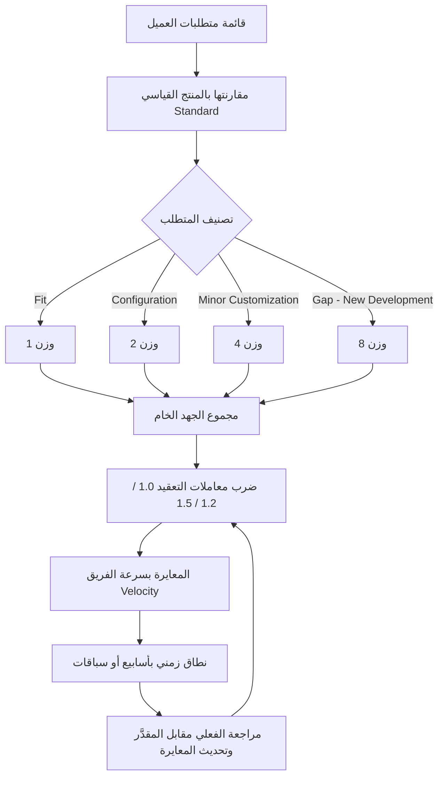

# تحليل الملاءمة والفجوة (Fit-Gap Analysis)

> [!info] تعريف مختصر
> تحليل الملاءمة والفجوة (Fit-Gap Analysis) أسلوب منهجي يُقارَن فيه كل متطلب من متطلبات العميل بما يغطّيه المنتج القياسي (Standard) أصلًا، ثم يُصنَّف المتطلب إلى: مغطّى بالكامل (Fit)، أو يُحقَّق بالإعدادات (Configuration)، أو يحتاج تعديلًا بسيطًا (Minor Customization)، أو يمثّل فجوة تستدعي تطويرًا جديدًا (Gap – New Development). وفي تقدير مشاريع الأنظمة المؤسسية (ERP) يُبنى على هذا التصنيف مقياس جهد نسبي (1 / 2 / 4 / 8)، يُضرَب في معاملات التعقيد المحيطة، ثم يُعايَر بسرعة الفريق الفعلية ([[18 - Velocity]]) ليُترجَم إلى أسابيع أو سباقات، ويُقدَّم كنطاق لا كرقم واحد.

## الشرح العلمي والاحترافي
- **الفكرة الأساسية**: في مشاريع المنتجات الجاهزة (ERP، CRM، أنظمة الموارد البشرية) لا يبدأ التطوير من الصفر، بل من قاعدة جاهزة. لذلك فإن السؤال التقديري الصحيح ليس "كم يومًا يستغرق تنفيذ هذا المتطلب؟" بل "كم يبعد هذا المتطلب عن المنتج القياسي (Standard)؟". هذا التحوّل في السؤال هو جوهر Fit-Gap.
- **التصنيف الرباعي**:
  - **Fit (مغطّى)**: المتطلب موجود في المنتج القياسي كما هو، ولا يحتاج سوى التحقق والعرض (Demo) والتوثيق.
  - **Configuration (إعدادات)**: يُحقَّق عبر ضبط معلمات النظام (Parameters، Workflows، Approval Matrix، تقارير جاهزة) دون كتابة كود.
  - **Minor Customization (تعديل بسيط)**: يحتاج امتدادًا محدودًا: حقل إضافي، تعديل نموذج طباعة، قاعدة تحقق (Validation Rule)، تقرير مشتق.
  - **Gap – New Development (تخصيص جديد)**: لا يوجد له مقابل في المنتج، ويستلزم تصميمًا وتطويرًا واختبارًا كاملًا، وغالبًا صيانة مستقبلية عند الترقية (Upgrade Impact).
- **مقياس الجهد النسبي (1 / 2 / 4 / 8)**: يُسنَد لكل تصنيف وزن نسبي متضاعف — Fit = 1، Configuration = 2، Minor Customization = 4، Gap = 8. التضاعف مقصود: هو يعكس أن كل قفزة في التصنيف تعني قفزة في المجهول لا زيادة خطية، وهو المنطق نفسه المستخدم في [[Relative Estimation]] و[[12 - Story Points]].
- **معاملات التعقيد (Complexity Factors)**: حجم البناء وحده لا يكفي، فالصعوبة المحيطة تضاعف الجهد. تُطبَّق معاملات على أربعة محاور شائعة: `Integration` (التكامل مع أنظمة خارجية)، `Data/Migration` (ترحيل بيانات وتنظيفها)، `Dependencies` (الاعتماد على فرق أو موردين أو قرارات خارجية)، `Criticality` (حساسية المتطلب: مالي، قانوني، تشغيلي حرج). ولكل محور ثلاث درجات تقريبية: **1.0** (لا أثر) / **1.2** (أثر متوسط) / **1.5** (أثر مرتفع).
- **صيغة الحساب**: `جهد المتطلب = الوزن الأساسي × Integration × Data × Dependencies × Criticality`. مثال: متطلب Gap (8) مع تكامل مرتفع (1.5) وحساسية مالية (1.2) والباقي محايد ⇒ 8 × 1.5 × 1.2 = **14.4 وحدة جهد**.
- **المعايرة المرجعية (Reference Calibration)**: مجموع وحدات الجهد رقم مجرّد لا معنى زمنيًا له حتى يُعايَر. تتم المعايرة بقسمة المجموع على سرعة الفريق التاريخية ([[18 - Velocity]])، أي عدد وحدات الجهد التي يُنجزها الفريق فعليًا في سباق واحد، مستخرَجة من مشاريع سابقة مشابهة لا من التمنّي.
- **تقديم النطاق لا الرقم**: تُضرب النتيجة في حدّين (مثلًا ‎−15%‎ و‎+35%‎ حسب درجة نضج المتطلبات) لينتج نطاق مثل "‎14 إلى 20 أسبوعًا"، لأن التقدير الواحد يُقرأ حتمًا كالتزام. هذا هو المعنى العملي لـ[[Estimation Variance]] وللعامل الواقعي [[Reality Factor]].
- **ممارسة معيارية في بيوت ERP**: الأسلوب مستقر ومعتمد لدى كبار مزوّدي الأنظمة المؤسسية بأسماء مكافئة — Oracle تستخدمه ضمن منهجيات التنفيذ باسم Fit-Gap Analysis صراحةً، وSAP تستخدم المفهوم نفسه تحت مسمّى Fit-to-Standard / Delta Design في منهجية Activate. الاختلاف في التسمية لا في الجوهر.
- **لماذا هو أفضل من التقدير بالأيام مباشرة**: لأنه يفصل **حجم البناء** (كم نبني؟) عن **صعوبة المحيط** (في أي بيئة نبني؟). التقدير باليوم يخلط الاثنين في رقم واحد غير قابل للتفكيك ولا للمراجعة ولا للتعلّم؛ أما فصلهما فيسمح بمناقشة كل عامل على حدة مع العميل، وبتحسين المعايرة بعد كل مشروع، وبإظهار سبب ارتفاع التكلفة (التكامل مثلًا) بدل الاكتفاء برقم كبير غير مبرَّر.

## أين ومتى يُستخدم
- في مرحلة ما قبل التعاقد وإعداد العروض الفنية والمالية (RFP / Proposal) لمشاريع ERP وCRM، حيث يُطلب تقدير حجم وكلفة التنفيذ قبل توفّر تصميم تفصيلي.
- في ورش المتطلبات (Fit-Gap Workshops / Fit-to-Standard Workshops) مع مستخدمي العمل، حيث يُعرض المنتج القياسي مباشرة ويُصنَّف كل متطلب أمام المشاركين لحظيًا.
- عند تحديد نطاق المشروع (Scope Baseline) وبناء سجل الفجوات (Gap Register) الذي يصبح لاحقًا مرجعًا لإدارة التغيير والمطالبات.
- عند مقارنة بدائل الحلول: أي منتج جاهز يحقق أعلى نسبة Fit وأقل عدد Gaps هو الأقل خطرًا وكلفة على المدى الطويل، حتى لو كان سعر ترخيصه أعلى.
- في التخطيط للإصدارات والسباقات، لتحويل الفجوات المصنَّفة إلى عناصر في [[13 - Backlog]] مرتّبة حسب القيمة والمخاطر.
- عند التفاوض على تقليص النطاق: التصنيف يجعل من السهل إظهار أن حذف ثلاثة متطلبات من فئة Gap يوفّر أكثر بكثير من حذف عشرين متطلبًا من فئة Fit.

## مثال وسيناريو تطبيقي
> [!example] شركة تنفيذ ERP تلقّت طلبًا من مجموعة تجزئة لتطبيق نظام مبيعات ومخازن يضم 120 متطلبًا. بدل تقدير كل متطلب بالأيام، عقد الفريق ورشة Fit-Gap استغرقت أسبوعين وصنّف المتطلبات كالتالي: 70 متطلب Fit (وزن 1)، 30 متطلب Configuration (وزن 2)، 15 متطلب Minor Customization (وزن 4)، و5 متطلبات Gap (وزن 8).
> الجهد الخام = (70×1) + (30×2) + (15×4) + (5×8) = 70 + 60 + 60 + 40 = **230 وحدة**.
> ثم طُبّقت معاملات التعقيد: الفجوات الخمس كلها تتطلب تكاملًا مع بوابة دفع ونظام ولاء خارجي (`Integration` = 1.5)، واثنتان منها تمسّان الفوترة الضريبية (`Criticality` = 1.2)، بينما يحمل ترحيل بيانات 40 ألف صنف من النظام القديم معامل `Data/Migration` = 1.5 على متطلبات المخازن. بعد التطبيق ارتفع الإجمالي إلى **≈ 310 وحدات**.
> جاءت المعايرة من مشروعين سابقين مشابهين: الفريق ينجز فعليًا نحو 20 وحدة جهد في السباق الواحد (سباقان في الشهر). ⇒ 310 ÷ 20 ≈ **15.5 سباق ≈ 8 أشهر**.
> قدّم مدير المشروع النتيجة للعميل كنطاق صريح: **"‎7 إلى 10 أشهر، بثقة 80%، مشروط بتثبيت متطلبات التكامل قبل السباق الرابع"**، مع جدول يبيّن أن 5 متطلبات فقط (4% من العدد) تستهلك نحو ربع الجهد الكلي. نتيجة ذلك، اختار العميل تأجيل ثلاث فجوات إلى مرحلة ثانية، فانخفض النطاق الزمني إلى 5–7 أشهر — وهو نقاش لم يكن ليحدث لو قُدِّم رقم واحد بالأيام.

## خطوات أو مخطّط
1. جمع المتطلبات وتفكيكها إلى بنود قابلة للتصنيف الفردي (لا عناوين عامة مثل "إدارة المخازن").
2. عرض المنتج القياسي (Standard Demo) على مستخدمي العمل لتحديد ما هو مغطّى فعلًا قبل أي نقاش تقديري.
3. تصنيف كل متطلب إلى Fit / Configuration / Minor Customization / Gap بقرار مشترك بين المستشار الوظيفي والعميل.
4. إسناد الوزن النسبي لكل تصنيف وفق المقياس 1 / 2 / 4 / 8، وجمع الجهد الخام.
5. تطبيق معاملات التعقيد (`Integration`, `Data/Migration`, `Dependencies`, `Criticality`) بقيم 1.0 / 1.2 / 1.5 لكل متطلب.
6. معايرة الإجمالي بسرعة الفريق التاريخية ([[18 - Velocity]]) لتحويل وحدات الجهد إلى سباقات أو أسابيع.
7. تحويل الناتج إلى **نطاق** (حد أدنى وحد أعلى) مع ذكر الافتراضات والمخاطر التي يقوم عليها.
8. مراجعة المعايرة بعد كل مرحلة بمقارنة الجهد الفعلي بالمقدَّر، وتحديث معاملات الشركة المرجعية للمشاريع القادمة.

## ⚠️ مفاهيم خاطئة شائعة
> [!warning]
> - **الظن بأن Fit-Gap تحليل وظيفي فقط لا أداة تقدير**: كثيرون يستخدمونه لتحديد النطاق ثم يعودون للتقدير بالأيام، فيهدرون أهم مخرجاته وهو مقياس الجهد النسبي القابل للمعايرة.
> - **اعتبار المتطلب "Fit" لمجرد وجود شاشة تشبهه في النظام**: الملاءمة تعني تطابق العملية التجارية كاملة بمخرجاتها وضوابطها، لا تشابه الواجهة. هذا الخطأ هو المصدر الأول لانفجار النطاق لاحقًا.
> - **الاعتقاد بأن الأوزان (1/2/4/8) قيم مطلقة صالحة لكل الفرق**: هي أوزان نسبية داخلية، ومعناها الزمني لا يظهر إلا بعد المعايرة بسرعة الفريق نفسه؛ نقلها بين شركتين دون إعادة معايرة يفسدها.
> - **الخلط بين المعاملات وحساب هامش الربح**: معاملات التعقيد تصف صعوبة تقنية حقيقية، وليست وسيلة لتضخيم العرض المالي؛ خلط الغرضين يفقد النموذج مصداقيته أمام الفريق الفني.
> - **افتراض أن نسبة Fit عالية تعني مشروعًا سهلًا**: مشروع بنسبة ملاءمة 90% قد يفشل إذا كانت الـ10% المتبقية تمسّ العمليات الأكثر حساسية في العمل.

## ❌ ممارسات خاطئة في المشاريع
> [!failure]
> - **إجراء Fit-Gap بعد توقيع العقد وتثبيت السعر**: يحوّل التحليل من أداة تسعير إلى محضر توثيق للخسائر. الحل: جعل ورشة Fit-Gap مرحلة مدفوعة ومستقلة (Discovery / Assessment) تسبق التزام السعر الثابت.
> - **تقدير الفجوات (Gaps) بالأيام مباشرة تحت ضغط المبيعات**: يخلط حجم البناء بصعوبة المحيط ويُنتج أرقامًا لا يمكن الدفاع عنها لاحقًا. الحل: الالتزام بمسار الوزن ثم المعاملات ثم المعايرة، وإظهار الاشتقاق كاملًا في العرض.
> - **استخدام سرعة نظرية أو "مثالية" في المعايرة**: مثل افتراض إنجاز 30 وحدة في السباق بينما السجل التاريخي يقول 20، فتنهار الخطة من السباق الثالث. الحل: اشتقاق [[18 - Velocity]] من بيانات فعلية لمشاريع مشابهة، ومراجعتها كل سباقين.
> - **تقديم رقم واحد قاطع للعميل بدل نطاق**: يتحوّل التقدير فورًا إلى وعد تعاقدي ويُلغي أي اعتراف بعدم اليقين. الحل: عرض نطاق مع مستوى ثقة وقائمة افتراضات صريحة، وربط تضييق النطاق بتثبيت المتطلبات.
> - **إهمال أثر التخصيص على الترقيات المستقبلية**: تُقدَّر كلفة بناء الفجوة مرة واحدة وتُتجاهل كلفة صيانتها عند كل تحديث للمنتج. الحل: إضافة كلفة دورة حياة (Upgrade Impact) لكل بند Gap ضمن دراسة الجدوى.
> - **عدم تحديث المعايرة بعد انتهاء المشروع**: يبقى النموذج ثابتًا رغم تغيّر الفريق والمنتج. الحل: مراجعة ختامية تقارن المقدَّر بالفعلي وتضبط الأوزان والمعاملات للمشروع التالي.

## 🔗 مصطلحات ومفاهيم ذات صلة
[[Reality Factor]] | [[18 - Velocity]] | [[Relative Estimation]] | [[Estimation Variance]] | [[12 - Story Points]] | [[Value Stream]] | [[Original Estimate]]
