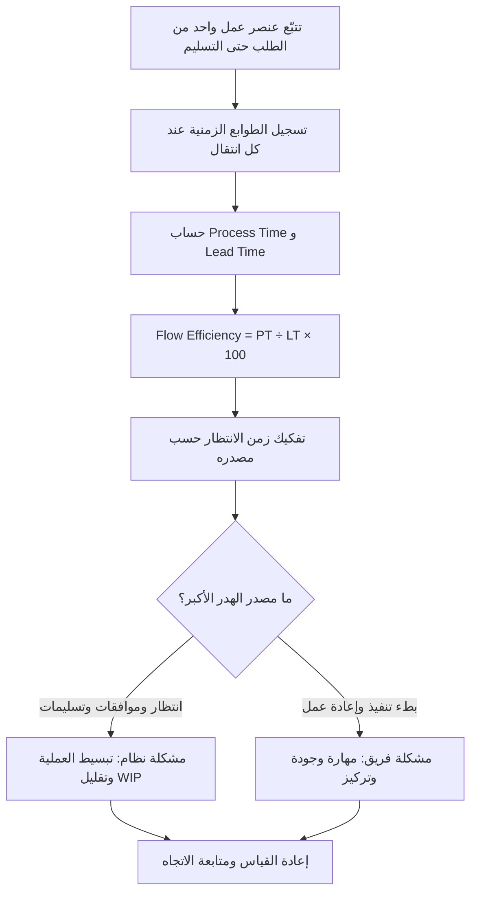

# كفاءة التدفّق (Flow Efficiency)

> [!info] تعريف مختصر
> كفاءة التدفّق (Flow Efficiency) مقياس يُظهر النسبة المئوية من الزمن الكلي لعنصر العمل التي قُضيت في عمل فعلي مُضيف للقيمة، مقابل الزمن الذي قضاه العنصر منتظرًا. تُحسب بالمعادلة: **Process Time ÷ Lead Time × 100**. وهي واحدة من أكثر المقاييس صدمةً في إدارة المشاريع، لأنها تكشف أن الغالبية العظمى من زمن التسليم ليست عملًا أصلًا، بل انتظارًا مخبّأً بين المراحل.

## الشرح العلمي والاحترافي
- **المعادلة**: `Flow Efficiency = (Process Time ÷ Lead Time) × 100`. حيث `Process Time` (يُسمّى أحيانًا Touch Time أو Work Time) هو مجموع الأزمنة التي كان فيها العنصر بين يدي شخصٍ يعمل عليه فعلًا، و`Lead Time` هو الزمن الكلي من لحظة دخول العنصر إلى النظام حتى تسليمه للمستفيد — بكل ما فيه من انتظار وتوقّف.
- **الفرق الجوهري بين زمن العمل الفعلي وزمن الانتظار**: زمن العمل الفعلي هو ما يراه المدير عادةً في التقديرات ([[Estimation]] بالساعات أو [[12 - Story Points]])، أما زمن الانتظار فهو ما لا يظهر في أي خطة: انتظار المراجعة، انتظار الموافقة، انتظار توفّر بيئة اختبار، انتظار ردّ من قسم آخر، انتظار دورة نشر أسبوعية، انتظار أن يفرغ أحدهم من مهمة أخرى. هذا الانتظار غير مرئي لأنه لا "يُكلّف" ساعات عمل أحد، لكنه يستهلك زمن العميل كاملًا.
- **الطبيعة الرياضية للمقياس**: بما أن `Lead Time = Process Time + Wait Time`، فإن كفاءة التدفّق لا يمكن أن تتجاوز 100% أبدًا، وكل نقصان عنها هو انتظار خالص. لذلك يُعدّ المقياس أداة تشخيصية أكثر منه أداة أداء: هو لا يقول "كم أنتجنا"، بل "أين ضاع الزمن".
- **سلّم التقييم المعياري** المستخدم في أدبيات [[Lean]] و[[Kanban]]:
  - **أكثر من 40%**: ممتاز — نظام Lean حقيقي، نادر جدًا في الواقع، ويستلزم غالبًا فرقًا صغيرة مستقلة بلا تبعيات خارجية.
  - **25–40%**: جيد — نظام منضبط، حدود عمل جارٍ ([[WIP Limits]]) مطبّقة، وسلاسل موافقات قصيرة.
  - **10–25%**: ضعيف — النظام يعمل، لكن ثلاثة أرباع الزمن على الأقل انتظار.
  - **1–10%**: سيّئ — الانتظار هو القاعدة والعمل هو الاستثناء.
  - **أقل من 1%**: كارثي — العنصر يمكث في النظام أسابيع مقابل ساعات عمل معدودة.
- **الحقيقة الصادمة**: عند القياس الأول، تجد أغلب المؤسسات نفسها **تحت 15%**، وكثير منها تحت 5%. هذا ليس دليلًا على كسل الفرق، بل على أن النظام مصمَّم — دون قصد — لإنتاج الانتظار: تسليمات متعددة بين الأقسام، موافقات متسلسلة، وطوابير عمل جارٍ ممتلئة.
- **علاقته بقانون ليتل** ([[Little's Law]]): زيادة العمل الجاري (WIP) تُطيل `Lead Time` بينما يبقى `Process Time` ثابتًا تقريبًا، فتنهار كفاءة التدفّق. لذلك أسرع طريقة لتحسين المقياس ليست العمل بجهد أكبر، بل **تقليل عدد العناصر المفتوحة في الوقت نفسه**.
- **ما لا يقيسه المقياس**: كفاءة التدفّق لا تقيس جودة العمل ولا قيمته. يمكن أن يكون لديك تدفّق كفؤ جدًا لبناء منتج لا يريده أحد ([[Outcome vs Output]]). لذلك يُقرأ دائمًا مع مقاييس القيمة، لا بديلًا عنها.

## أين ومتى يُستخدم
- في **رسم خرائط تدفّق القيمة** ([[Value Stream Mapping]])، حيث تُحسب كفاءة التدفّق لكل مرحلة ولكامل السلسلة لتحديد أين يتراكم الانتظار.
- عند **تشخيص بطء التسليم** قبل اتخاذ قرار التوظيف: إذا كانت الكفاءة 5%، فإضافة أفراد جدد تحسّن الـ 5% فقط وتزيد الانتظار في الـ 95% الباقية.
- في **مراجعات نظام Kanban** الدورية، كمؤشر رئيسي بجانب [[Lead Time]] و[[Throughput]] لتقييم صحة التدفّق لا إنتاجية الأفراد.
- عند **تبرير الاستثمار في الأتمتة أو تبسيط الموافقات** أمام الإدارة: رقم مثل "98% من زمننا انتظار" أقوى بكثير من شكوى عامة عن البيروقراطية.
- في **تحليل ما بعد الحادثة أو تأخّر إصدار**، للتفريق بين تأخّر سببه صعوبة العمل وتأخّر سببه بنية العملية.

## مثال وسيناريو تطبيقي
> [!example] فريق تطوير في شركة تأمين قاس رحلة طلب تغيير واحد (Change Request) من لحظة استلامه حتى وصوله للمستخدم.
> **زمن المعالجة الفعلي (Process Time)**: تحليل المتطلب 20 دقيقة، كتابة الكود 45 دقيقة، مراجعة الكود 15 دقيقة، اختبار يدوي 10 دقائق، نشر 5 دقائق = **95 دقيقة ≈ 1.58 ساعة**.
> **زمن الانتظار (Wait Time)**: انتظار دور المحلل 14 ساعة، انتظار تفرّغ المطوّر 22 ساعة، انتظار مراجع الكود 19 ساعة، انتظار بيئة الاختبار 12 ساعة، انتظار نافذة النشر الأسبوعية 14 ساعة = **81 ساعة**.
> **الحساب**: `Lead Time = 1.58 + 81 ≈ 82.58 ساعة`، و`Flow Efficiency = 1.58 ÷ 82.58 × 100 ≈ **1.8%**`.
> النتيجة: **98.2% من زمن العميل كان هدرًا خالصًا**. الاستنتاج الإداري كان صادمًا: حتى لو ضاعف الفريق سرعته البرمجية مرتين (95 دقيقة → 47 دقيقة)، لتحسّن الزمن الكلي بأقل من 1%. أما إلغاء نافذة النشر الأسبوعية وتقصير انتظار المراجعة وحدهما فوفّرا 33 ساعة — أي تحسّنًا يقارب 40% من الزمن الكلي دون تغيير سطر واحد في طريقة عمل المطوّرين.

## خطوات أو مخطّط
1. اختر عنصر عمل واحدًا مكتملًا (لا متوسطًا نظريًا) وتتبّع رحلته الكاملة من الطلب إلى التسليم.
2. سجّل الطوابع الزمنية عند كل انتقال حالة: متى دخل الطابور، متى بدأ العمل عليه، متى توقّف، متى انتقل للمرحلة التالية.
3. اجمع كل فترات العمل الفعلي للحصول على `Process Time`، واحسب `Lead Time` كفارق بين تاريخ الطلب وتاريخ التسليم.
4. طبّق المعادلة `Process Time ÷ Lead Time × 100` وقارن الناتج بسلّم التقييم.
5. **لا تتوقف عند الرقم**: فكّك زمن الانتظار حسب مصدره، وصنّفه إلى فئتين:
   - **مشاكل النظام**: انتظار الموافقات، التسليمات بين الأقسام، نوافذ النشر، انتظار الموارد المشتركة، تبعيات خارجية ([[Dependencies]]).
   - **مشاكل الفريق**: بطء التنفيذ، إعادة العمل ([[Rework Percentage]]) بسبب سوء الجودة، تعدّد المهام المفتوحة، نقص المهارة.
6. عالج المصدر الأكبر أولًا — وهو في الغالبية الساحقة من الحالات مشكلة نظام لا مشكلة فريق.
7. أعد القياس بعد دورتين أو ثلاث، وتتبّع الاتجاه لا الرقم المطلق.

## ⚠️ مفاهيم خاطئة شائعة
> [!warning]
> - **الظن بأن كفاءة تدفّق منخفضة تعني فريقًا كسولًا**: العكس هو الشائع — الفرق المشغولة جدًا غالبًا ما تكون كفاءة تدفّقها الأسوأ، لأن انشغال الجميع بمهام متعددة هو بالضبط ما يخلق الطوابير.
> - **السعي إلى 100%**: كفاءة تدفّق قريبة من 100% تعني نظامًا بلا أي مرونة، وأي اضطراب بسيط فيه يُسبّب انهيارًا. الهدف واقعيًا هو رفع الرقم من 5% إلى 25–40%، لا بلوغ الكمال.
> - **الخلط بينها وبين استغلال الموارد (Resource Utilization)**: رفع نسبة انشغال الأفراد إلى 100% يخفض كفاءة التدفّق، لأن الأفراد المشغولين تمامًا لا يستطيعون استلام العمل فور وصوله فيطول الانتظار.
> - **اعتبار الرقم وحده كافيًا**: نسبة عالية دون تحليل مصدر الهدر تُخفي المشكلة. القيمة الحقيقية للمقياس تأتي من التمييز بين مشاكل النظام ومشاكل الفريق بعد حسابه.
> - **اعتبارها مقياس أداء فردي**: كفاءة التدفّق خاصية للنظام، وربطها بتقييم الأفراد يدفعهم إلى التلاعب بالطوابع الزمنية لا إلى إصلاح العملية.

## ❌ ممارسات خاطئة في المشاريع
> [!failure]
> - **الاستجابة لكفاءة تدفّق منخفضة بتوظيف مزيد من الأفراد**: إضافة أشخاص إلى نظام تكون فيه 95% من الزمن انتظارًا تزيد العمل الجاري وتُطيل الطوابير فتنخفض الكفاءة أكثر. الحل: عالج الانتظار أولًا (تقليل WIP، تقصير الموافقات، إزالة التسليمات)، ثم أعد تقييم الحاجة إلى التوظيف.
> - **قياس كفاءة التدفّق مرة واحدة في ورشة عمل ثم نسيانها**: يتحوّل المقياس إلى تمرين توعوي بلا أثر. الحل: أدرجه ضمن مقاييس التدفّق الدورية بجانب [[Lead Time]] و[[Cycle Time]]، وراجع اتجاهه كل شهر.
> - **عدم تسجيل الطوابع الزمنية لحالات الانتظار في أداة إدارة العمل**: بدون أعمدة صريحة مثل "في انتظار المراجعة" أو "جاهز للنشر"، يصبح زمن الانتظار غير قابل للقياس أصلًا. الحل: اجعل حالات الانتظار مرئية كأعمدة مستقلة على لوحة [[Kanban]] بدل إخفائها داخل حالة "قيد التنفيذ".
> - **تحميل الفريق مسؤولية هدر يسببه النظام**: مطالبة المطوّرين بالإسراع بينما مصدر التأخير هو موافقة مدير يستغرق ثلاثة أيام. الحل: صنّف الهدر إلى نظام مقابل فريق قبل أي حديث عن الأداء، وارفع مشاكل النظام لمن يملك صلاحية تغييرها.
> - **تحسين مرحلة واحدة سريعة أصلًا**: تسريع مرحلة الاختبار من 10 إلى 5 دقائق بينما الانتظار قبلها 19 ساعة تحسينٌ بلا معنى. الحل: طبّق مبدأ [[Bottleneck]] وحسّن المرحلة صاحبة أكبر زمن انتظار حصريًا.

## 🔗 مصطلحات ومفاهيم ذات صلة
[[Value Stream]] | [[Value Stream Mapping]] | [[Lead Time]] | [[Cycle Time]] | [[Bottleneck]] | [[Little's Law]] | [[Throughput]] | [[Value-Added vs Non-Value-Added vs Pure Waste]] | [[Time to Value]]

> [!tip] 💡 إثراء عملي — كورس الإنتاجية
> كفاءة التدفّق داخل منظومة المقاييس الستة، ونقاط القياس `t0`–`t4`، وتشخيص رقم منخفض تشخيصًا صحيحًا: [[06 - مقاييس التدفّق الستة]] و[[09 - التشخيص العملي - قراءة الأرقام]].
