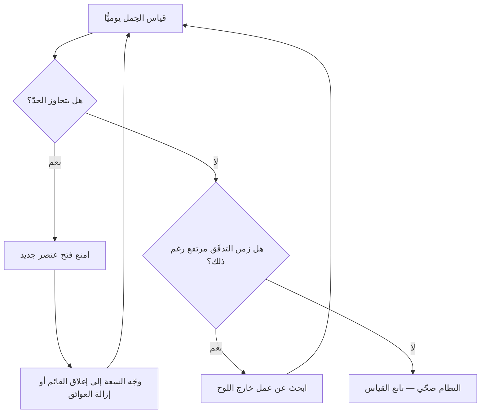

# حِمل التدفّق (Flow Load)

> [!info] تعريف مختصر
> حِمل التدفّق (Flow Load) هو **عدد عناصر العمل النشِطة في النظام في لحظة قياس بعينها** — أي التي بدأ العمل عليها ولم تصل بعدُ إلى المستخدم. وهو أحد [[06 - مقاييس التدفّق الستة|مقاييس التدفّق الستة]]، ويقابل مفهوم **العمل قيد التنفيذ (WIP)** في [[03 - Kanban|كانبان]]. والتمييز الجوهري: حِمل التدفّق هو **القياس**، بينما [[WIP Limit|حدّ العمل قيد التنفيذ]] هو **الضابط** الذي ينظّمه.

## الشرح العلمي والاحترافي
- **الصيغة**: عدد العناصر التي تحقّق فيها الشرط `بدأ التنفيذ ≤ لحظة القياس < الوصول إلى الإنتاج`. ويُقاس بلقطة يومية للوح العمل، لا بمتوسّط شهري — لأنّ قيمته التشخيصية في **النمط اليومي** لا في الرقم المجمَّع.
- **علاقته بزمن التدفّق عبر [[Little's Law|قانون ليتل]]**: $\text{زمن التدفّق} = \dfrac{\text{حِمل التدفّق}}{\text{معدّل الإنجاز}}$. أي أنّ مضاعفة عدد العناصر المفتوحة **تضاعف** زمن وصول كلّ عنصر، مع بقاء معدّل الإنجاز ثابتًا. وهذه أهمّ نتيجة عملية في الموضوع كلّه: **البطء الظاهر غالبًا ليس بطء عمل بل كثرة عناصر مفتوحة.**
- **قاعدة الحدّ الابتدائية**: يوصي عرف كانبان بأن يكون الحدّ **عدد أفراد الفريق ناقص واحد** (`n − 1`). ومنطقها أنّ حدًّا مساويًا لعدد الأفراد يمنح كلّ فرد عنصره الخاصّ فيختفي حافز التعاون على الإغلاق؛ والنقصان بواحد يُجبر شخصًا على الانضمام إلى عمل قائم بدل فتح جديد.
- **الحدّ لكلّ عمود لا للوح**: هذه أكثر التفاصيل إهمالًا. الحدّ الكلّي يسمح بتكدّس كلّ العمل أمام محطّة واحدة دون أن يظهر أيّ خرق؛ أمّا الحدّ لكلّ حالة فيجعل [[Bottleneck|الاختناق]] مرئيًّا فورًا — العمود الذي يمتلئ باستمرار هو القيد.
- **الأنماط التي يكشفها**:
  - **حِمل ثابت ضمن الحدّ** ← نظام صحّي.
  - **حِمل يتجاوز الحدّ باستمرار** ← الحدّ غير محترم أو غير واقعي.
  - **حِمل يرتفع أوّل الدورة ولا ينخفض حتى نهايتها** ← نمط «افتح كلّ شيء»، وهو الأخطر: يُدمّر زمن التدفّق و[[Flow Predictability|قابلية التنبّؤ]] و[[Alignment|التوافق]] معًا.
  - **حِمل مرتفع في عمود واحد فقط** ← حدّدتَ القيد بدقّة.
  - **حِمل منخفض جدًّا مع زمن تدفّق مرتفع** ← عمل يجري **خارج اللوح** ولا يُسجَّل.
- **لماذا يرتفع الحِمل بلا وعي؟** لأنّ فتح عنصر جديد **مجزٍ نفسيًّا وفوريًّا** (شعور بالبدء)، بينما إغلاق عنصر قائم يتطلّب مواجهة عقبة. ولأنّ الفرد المعطَّل يبدو غير منتج، فيبدأ شيئًا آخر ليبدو مشغولًا. وكلا الدافعين فردي معقول ونتيجته الجماعية كارثية.

## أين ومتى يُستخدم
- عند تشخيص **بطء التسليم** رغم انشغال الجميع — وهو العَرَض الأشيع.
- في **الوقوف اليومي**: مراجعة سريعة للحِمل مقابل الحدّ قبل السماح بفتح عنصر جديد.
- عند **ضبط لوحة كانبان** أوّل مرّة: تحديد حدّ مبدئي لكلّ عمود ثم معايرته تجريبيًّا.
- عند **قراءة [[06 - مقاييس التدفّق الستة|مقاييس التدفّق]] مجتمعة**: الحِمل هو المتغيّر الأسهل تحكّمًا، وضبطه يُصلح زمن التدفّق تلقائيًّا.
- في **تحليل انهيار [[Flow Predictability|قابلية التنبّؤ]]**: حِمل مرتفع يفسّر «دخلنا بعشرين قصّة ولم تُغلَق واحدة في اليوم الثامن».

## مثال وسيناريو تطبيقي
> [!example] فريق من خمسة أفراد يدخل سبرنتًا بعشرين عنصرًا.
> **ما حدث:** خلال ثلاثة أيّام صار **خمسة عشر عنصرًا قيد التنفيذ**. وفي اليوم الثامن من أصل عشرة، **لم يكتمل عنصر واحد**.
> **القراءة:** بقانون ليتل، بمعدّل إنجاز نظري 8 عناصر/سبرنت وحِمل 15، يصير زمن التدفّق المتوقّع نحو **ضعف طول السبرنت** — أي أنّ اكتمال أيّ عنصر داخل السبرنت صار مستحيلًا رياضيًّا لا تنظيميًّا.
> **التدخّل:** خفض الحدّ إلى **4** (5 − 1)، ومنع فتح جديد قبل إغلاق قائم.
> **النتيجة بعد سبرنتين:** انخفض وسيط زمن التدفّق من 13 يومًا إلى 6، وارتفعت قابلية التنبّؤ من 40% إلى 78%، و**بقيت سرعة التدفّق كما هي تقريبًا** — لأنّ الفريق لم يكن يعمل أقلّ، بل كان يوزّع جهده على عناصر لا تُغلَق.

## خطوات أو مخطّط
1. صنّف حالات لوحك إلى **نشِطة** و**انتظار**، وحدّد أيّها يُحتسَب ضمن الحِمل.
2. خذ **لقطة يومية** لعدد العناصر النشِطة لمدّة أسبوعين قبل وضع أيّ حدّ — لتعرف خطّ الأساس.
3. ضع حدًّا مبدئيًّا **لكلّ عمود**، ابدأ بـ`n − 1` للعمود الرئيس.
4. أعلِن **سياسة صريحة**: عند بلوغ الحدّ، لا يُفتَح جديد؛ من فرغ ينضمّ إلى عنصر قائم أو يزيل عائقًا.
5. راقب أثر ذلك على [[Cycle Time|زمن التدفّق]] و[[Throughput|معدّل الإنجاز]] لدورتين.
6. **عاير الحدّ**: إن بقي الفريق معطّلًا كثيرًا ارفعه واحدًا؛ وإن بقي زمن التدفّق مرتفعًا اخفضه واحدًا.
7. راجع **[[WIP Aging|عمر العناصر المفتوحة]]** يوميًّا — فهو المخطّط الوحيد الذي يُنبئ بالمستقبل بدل وصف الماضي.

## ⚠️ مفاهيم خاطئة شائعة
> [!warning]
> - **الخلط بين حِمل التدفّق وحدّ العمل قيد التنفيذ**: الأوّل قياس والثاني قاعدة. ويمكن أن يوجد حِمل بلا حدّ (وهو الوضع الشائع)، ولا معنى لحدّ بلا قياس يكشف خرقه.
> - **الظنّ بأنّ خفض الحِمل يخفض الإنتاجية**: العكس هو الشائع — خفض الحِمل يرفع معدّل الإنجاز لأنّه يقلّل تبديل السياق والانتظار المتبادل.
> - **اعتبار الحِمل المنخفض دليل صحّة دائمًا**: حِمل 3 لفريق من 7 مع زمن تدفّق مرتفع يعني غالبًا أنّ العمل يجري **خارج اللوح**.
> - **وضع حدّ واحد للوح كلّه**: يُخفي الاختناق تمامًا، ويجعل المقياس بلا فائدة تشخيصية.
> - **معاملة الحدّ قاعدة مقدّسة**: الحدّ فرضية تُعايَر بالتجربة، لا رقمًا نهائيًّا. والحدّ الأوّل دائمًا خاطئ — والمهمّ أن يوجد ثمّ يُضبَط.

## ❌ ممارسات خاطئة في المشاريع
> [!failure]
> - **فتح كلّ عناصر السبرنت في يومه الأوّل**: يُنتج نمط «افتح كلّ شيء» فينهار زمن التدفّق وقابلية التنبّؤ معًا. الحلّ: سياسة سحب — لا يبدأ عنصر إلّا حين تتوفّر سعة فعلية.
> - **الالتفاف على الحدّ بإبقاء العمل خارج اللوح**: يجعل كلّ المقاييس كاذبة. الحلّ: قاعدة صريحة — **ما ليس على اللوح غير موجود**، ورصد أسبوع كامل لكلّ ما يشغل الفريق فعلًا.
> - **قياس الحِمل شهريًّا**: يُفقده قيمته التشخيصية لأنّ النمط اليومي هو المهمّ. الحلّ: لقطة يومية ولو يدوية.
> - **رفع الحدّ عند كلّ شكوى تعطيل**: يعالج العَرَض ويُلغي الأداة. الحلّ: عالج سبب التعطيل نفسه (تبعيّة، موافقة، مهارة نادرة).
> - **ربط الحِمل بتقييم الأفراد**: يدفع إلى إخفاء العمل بدل تنظيمه. الحلّ: يُقرَأ على مستوى النظام فقط.

## 🔗 مصطلحات ومفاهيم ذات صلة
[[WIP Limit]] | [[WIP Aging]] | [[Little's Law]] | [[Cycle Time]] | [[Throughput]] | [[Flow Efficiency]] | [[Flow Predictability]] | [[Bottleneck]] | [[Context Switching Cost]] | [[Pull System]] | [[06 - مقاييس التدفّق الستة]]
