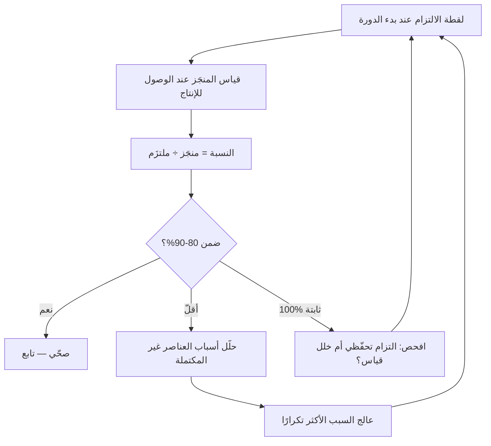

# قابلية التنبّؤ بالتدفّق (Flow Predictability)

> [!info] تعريف مختصر
> قابلية التنبّؤ بالتدفّق هي **نسبة عناصر العمل المنجَزة إلى العناصر التي التزم الفريق بإنجازها** في دورة محدّدة. وهي أحد [[06 - مقاييس التدفّق الستة|مقاييس التدفّق الستة]]، ووظيفتها الإجابة عن سؤال واحد تسأله كلّ إدارة: **هل يمكن الاعتماد على وعودنا؟** والقيمة الحقيقية للمقياس ليست في الرقم نفسه، بل في أنّه **يفتح تحقيقًا في أسباب الانحراف** بدل أن يُنتج لومًا.

## الشرح العلمي والاحترافي
- **الصيغة**: $P = \dfrac{\text{عدد العناصر المنجَزة}}{\text{عدد العناصر الملتزَم بها}} \times 100\%$. وتُحسَب بعدد العناصر لا بـ[[12 - Story Points|نقاط القصة]] — لأنّ النقاط قابلة للتضخيم ذاتيًّا، بينما العدّ محايد.
- **شرط الصحّة الحاسم**: يجب أن تُلتقَط قائمة الالتزام **آليًّا عند بدء الدورة**. فإن قُرِئت من اللوح في نهايتها، دخلها كلّ ما أُضيف أثناءها، وصار المقياس يقيس نفسه بنفسه ويُنتج نسبًا مرتفعة زائفة.
- **النطاق الصحّي 80–90%، لا 100%**. وهذا يخالف الحدس الإداري. فقابلية تنبّؤ 100% مستمرّة تعني أحد أمرين: إمّا **التزام بأقلّ من القدرة** (هدر سعة مستتر)، وإمّا **خلل في القياس**. والفريق الذي يلتزم بما يضمن إنجازه لا يمارس تخطيطًا بل تأمينًا ذاتيًّا.
- **الرقم المنخفض ليس إدانة**: في أوّل تعاون بين أفراد فريق جديد يكون 50% رقمًا طبيعيًّا تمامًا، لأنّ **التقدير ممارسة تُتقَن بالتكرار** لا مهارة فطرية. والاستخدام الصحيح للرقم أن يُتبَع بسؤال: *ما مشكلات تقديرنا؟* لا بسؤال: *لماذا فشلتم؟*
- **الأسباب الجذرية الأشيع للانحراف**، وكلٌّ له علاج مختلف:

| السبب | العلاج |
|---|---|
| متطلّبات دخلت غير مكتملة | تشديد [[Definition of Ready]] |
| عيوب إنتاج استهلكت سعة غير مخطّطة | تخصيص سعة عيوب بـ[[Percentiles and Median vs Average\|المئين 85]] |
| [[Technical Debt\|دَين تقني]] مرتفع | رفع حصّة الدَّين في توزيع السعة |
| [[Flow Load\|حِمل تدفّق]] مرتفع | خفض [[WIP Limit\|حدّ العمل قيد التنفيذ]] |
| [[Dependency\|تبعيّات]] لم تُكتشَف | حقل تبعيّات إلزامي قبل التخطيط |
| عمل يدخل داخل الدورة | قاعدة الإدخال مقابل الإخراج |

- **علاقتها بـ[[Tuckman's Stages of Group Development|مراحل تكوين الفريق]]**: الفريق في مرحلة التشكّل أو العصف يُنتج قابلية تنبّؤ منخفضة بطبيعته. لكنّ العصف **له سبب** يمكن تحديده وعلاجه — وأشيعه غموض حدود الصلاحية.
- **ما لا يقيسه**: لا يقيس **قيمة** ما أُنجِز ولا **جودته**. ففريق ينجز 100% من التزامه بأشياء لا يستخدمها أحد يبلغ قابلية تنبّؤ ممتازة وقيمة صفرية.

## أين ومتى يُستخدم
- في **الحوار الأوّل مع الإدارة** حول أداء الفريق — لأنّه أسهل المقاييس فهمًا لغير التقنيّين.
- عند **بناء وعد خارجي** (موعد إطلاق، حملة تسويقية، التزام تعاقدي): قابلية التنبّؤ هي التي تحدّد هامش الأمان الواجب.
- في **[[10 - Sprint Retrospective|الاستعادة]]**: قراءة الرقم ثم تحليل سبب الانحراف، لا الاكتفاء بعرضه.
- عند **تقييم أثر تدخّل** (خفض الحِمل، تشديد تعريف الجاهزية): قابلية التنبّؤ من أسرع المقاييس استجابةً.
- في **تشخيص ثقافة الخوف**: قابلية تنبّؤ 100% ثابتة مع سرعة منخفضة مؤشّر على أنّ الفريق يحمي نفسه.

## مثال وسيناريو تطبيقي
> [!example] فريق يدخل الخطّة بعشرين عنصرًا ويُنهي خمسة عشر.
> **الحساب:** `15 ÷ 20 = 75%`.
> **الاستخدام الخاطئ:** «قابلية التنبّؤ 75%، يجب أن ترتفع إلى 95%» — وهو ضغط يُنتج التزامًا بأقلّ من القدرة في الدورة القادمة، فيرتفع الرقم وتنخفض السرعة، ولا يتحسّن شيء.
> **الاستخدام الصحيح:** في الاستعادة، يُسأل عن العناصر الخمسة التي لم تكتمل: عنصران بسبب متطلّب غير واضح، وواحد بسبب تبعيّة على فريق آخر، واثنان بسبب عيوب إنتاج مفاجئة.
> **القرارات الناتجة:** (١) إضافة شرط «مقياس نجاح محدّد» إلى تعريف الجاهزية؛ (٢) حقل تبعيّات إلزامي؛ (٣) تخصيص سعة عيوب بالمئين 85 من بيانات ستّة سبرنتات.
> **النتيجة بعد ثلاث دورات:** 88% — ومصحوبةً بسرعة ثابتة، أي أنّ التحسّن حقيقي لا تحفّظي.

## خطوات أو مخطّط
1. اضبط أداة العمل على **التقاط لقطة الالتزام آليًّا** عند بدء الدورة.
2. احسب النسبة بعدد العناصر عند وصولها **الإنتاج** لا عند إغلاق التذكرة.
3. ارسم الاتّجاه عبر **ستّ دورات على الأقلّ** قبل أيّ استنتاج — دورتان ضجيج.
4. لكلّ عنصر لم يكتمل، سجّل **سببًا واحدًا** من قائمة مغلقة (لا نصًّا حرًّا).
5. جمّع الأسباب وعالج **الأكثر تكرارًا** فقط.
6. أعلِن **النطاق الصحّي 80–90%** صراحةً للفريق وللإدارة، ليُفهَم أنّ 100% ليست الهدف.
7. راقب **الإشارة المعكوسة**: ارتفاع قابلية التنبّؤ مع انخفاض [[Throughput|معدّل الإنجاز]] = التزام تحفّظي لا تحسّن.

## ⚠️ مفاهيم خاطئة شائعة
> [!warning]
> - **اعتبار 100% هدفًا**: تعني غالبًا التزامًا بأقلّ من القدرة أو خللًا في التقاط الالتزام.
> - **الخلط بينها وبين [[18 - Velocity|السرعة]]**: السرعة تقيس **الحجم**، وقابلية التنبّؤ تقيس **الوفاء بالوعد**. ويمكن أن ترتفع إحداهما وتنخفض الأخرى.
> - **قراءة الرقم المنخفض إدانةً**: في أوّل تعاون بين أفراد جدد يكون 50% طبيعيًّا؛ فالتقدير ممارسة تُتقَن بالتكرار.
> - **استخدامها لمقارنة فريقين**: لا معنى للمقارنة لأنّ الالتزام معياره داخلي لكلّ فريق. تُقارَن بنفسها عبر الزمن.
> - **الظنّ بأنّها تقيس الجودة أو القيمة**: لا تفعل. فريق ينجز 100% من التزامه بأشياء عديمة النفع يبلغ رقمًا ممتازًا.

## ❌ ممارسات خاطئة في المشاريع
> [!failure]
> - **جعلها مؤشّر أداء يُكافأ عليه**: تفعيل مباشر لـ[[Goodhart's Law|قانون غودهارت]] — يلتزم الفريق بالأقلّ ليضمن الرقم. الحلّ: تُقرَأ للحوار لا للمحاسبة، مع إعلان النطاق الصحّي.
> - **قراءة قائمة الالتزام من اللوح في نهاية الدورة**: يجعل المقياس يقيس نفسه. الحلّ: لقطة آلية عند البداية.
> - **الاكتفاء بعرض الرقم بلا تحليل أسباب**: يُنتج ضغطًا بلا معلومة. الحلّ: قائمة أسباب مغلقة تُملأ لكلّ عنصر لم يكتمل.
> - **الاستنتاج من دورتين**: تباين طبيعي يُقرأ اتّجاهًا. الحلّ: ستّ دورات على الأقلّ.
> - **معاقبة فريق على انحراف سببه إدخال عمل من الإدارة داخل الدورة**: يقتل مصداقية المقياس كلّها. الحلّ: تُستبعَد العناصر المُدخَلة من حساب الالتزام، ويُسجَّل عددها مؤشّرًا منفصلًا.

## 🔗 مصطلحات ومفاهيم ذات صلة
[[Flow Load]] | [[Flow Efficiency]] | [[Throughput]] | [[18 - Velocity]] | [[Definition of Ready]] | [[Goodhart's Law]] | [[Tuckman's Stages of Group Development]] | [[Psychological Safety]] | [[Percentiles and Median vs Average]] | [[06 - مقاييس التدفّق الستة]]
