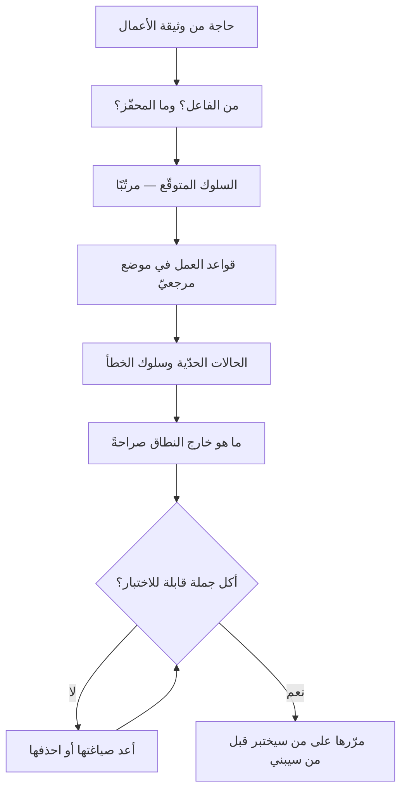

# المواصفات الوظيفية (Functional Specification)

> [!info] تعريف مختصر
> **المواصفات الوظيفية** وثيقةٌ تصف **ما يفعله النظام**: سلوكه الظاهر، ومدخلاته ومخرجاته، وقواعد العمل التي يطبّقها، وحالاته وانتقالاته، وما يقع عند الخطأ. تصف **السلوك لا البناء** — فليست تصميمًا تقنيًّا، وليست [[Quality Attributes|سمات جودة]] تصف **كيف** يؤدّي، وليست [[BRD|وثيقة أعمال]] تقول **لماذا** يُبنى.
> **ومعيارها الوحيد الذي يفصل الجيّد من الإنشاء:** أن تُقرأ كل جملة فيها ويُسأل — **كيف أختبر هذه؟** فما لا يُختبر ليس مواصفة بل نيّة حسنة.

## الشرح العلمي والاحترافي

**وموضعها من عائلة الوثائق** — وهو أوّل ما يلتبس:

| الوثيقة | تجيب عن | مثالها |
|---|---|---|
| [[BRD\|وثيقة متطلبات الأعمال]] | **لماذا؟** — الحاجة والمبرّر | «تنخفض مكالمات الدعم عن حالة الطلب» |
| **المواصفات الوظيفية** | **ماذا يفعل النظام؟** — سلوكه | «عند تغيّر حالة الطلب يُرسَل إشعار خلال دقيقتين، ويُسجَّل التغيّر في سجلّ الطلب» |
| [[Quality Attributes\|سمات الجودة]] | **بأيّ جودة؟** | «95٪ من الإشعارات تصل في أقلّ من 30 ثانية» |
| التصميم التقني | **كيف يُبنى؟** | «طابور رسائل، ومحاولة إعادة ثلاث مرّات بتباعد أُسّي» |

**وحدّ هذه العائلة يختلف باختلاف المؤسّسة، وهذا واقعٌ يُذكر لا يُخفى:** ففي بعضها تكون المواصفات الوظيفية قسمًا داخل [[Software Requirements Specification|كرّاسة متطلبات البرمجيات]] يقابله قسم غير وظيفي، وفي بعضها وثيقةً مستقلّة، وفي الفرق الرشيقة تتوزّع على [[11 - User Stories|قصص المستخدم]] ومعايير قبولها. **والمهمّ ليس اسم الوثيقة بل أن يكون للسلوك موضعٌ واحد مرجعيّ** — فالمشكلة العملية ليست في تعدّد الأسماء، بل في أن يكون السلوك موصوفًا في ثلاثة مواضع متعارضة.

**وما تحتويه المواصفة الجيّدة** ستّة عناصر، وأكثرها إهمالًا الثلاثة الأخيرة:

1. **الفاعل والمحفّز:** من يبدأ، وبأيّ فعل.
2. **السلوك المتوقّع:** ماذا يفعل النظام، مرتّبًا.
3. **قواعد العمل:** الشروط والحسابات والصلاحيات — وهذه هي التي تُنسى فتُستنبط من الكود لاحقًا.
4. **الحالات الحدّية** ([[Edge Cases|الحالات الحافّة]]): ما وراء [[Happy Path|المسار السعيد]].
5. **سلوك الخطأ:** ماذا يرى المستخدم، وما الذي يُسجَّل، وهل يُعاد المحاولة.
6. **ما هو [[Out of Scope|خارج النطاق]] صراحةً**، وهذا أرخص بندٍ فيها وأكثرها منعًا للنزاع.

**ولغة الإلزام تُضبط:** «يجب» لما هو ملزم، و«ينبغي» لما هو مفضَّل، و«يجوز» لما هو اختياري. **والخلط بينها أشيع سبب لنزاع القبول**، لأن كل طرف يقرؤها بحسب مصلحته. والقاعدة العملية: **ما لن تردّ التسليم لأجله فليس «يجب»**.

**وأشيع خللٍ بنيويّ فيها أن تصف الواجهة بدل السلوك.** فالجملة «تظهر قائمة منسدلة فيها المدن» **قرارُ تصميم** لا سلوكٌ مطلوب؛ والسلوك أن «يختار المستخدم مدينةً من المدن المخدومة، ولا يُقبل غيرها». **والفرق عمليّ:** الأولى تمنع المصمّم من إيجاد حلّ أفضل وتُلزمه بما ليس مطلوبًا، والثانية تصف ما يجب أن يتحقّق وتترك الكيفية لأهلها.

## أين ومتى يُستخدم

- **في العقود والإسناد الخارجي**، حيث تكون هي مرجع القبول والردّ ([[Outsourcing|أنماط التوريد]]).
- **في الأنظمة المنظَّمة** التي يُطلب فيها أثرٌ موثَّق لسلوك النظام (مالية · صحية · حكومية).
- **في التكاملات بين الأنظمة**، فسلوك الحدود بين طرفين لا تحمله قصّة مستخدم واحدة.
- **في قواعد العمل المعقّدة** — احتساب ضريبة، أو استحقاق خصم، أو صلاحيات — إذ تحتاج موضعًا واحدًا مرجعيًّا لا تفاصيل موزّعة.
- **في تسليم نظام قائم إلى فريق جديد**، فهي ما يمنع أن يصير الكود هو الوثيقة الوحيدة.

> [!warning] متى لا تُستخدَم؟
> - **في منتج ما يزال يُكتشف.** وصف سلوكٍ لم يُختبر بعدُ مع مستخدم إنفاقٌ على ما سيتغيّر؛ وموضعه [[Product Discovery|الاكتشاف]] و[[Prototype|النموذج الأوّلي]].
> - **بديلًا عن الحوار.** الوثيقة المفصّلة التي تُسلَّم إلى الفريق بلا نقاش تُنتج ما كُتب لا ما أُريد.
> - **في تفصيل الواجهة.** لها أدواتها — النموذج والتصميم — والمواصفة تصف السلوك.
> - **حين تكفي القصّة ومعايير قبولها.** فلا تُصنع وثيقة لِما تحمله بطاقة.

## مثال وسيناريو تطبيقي

> [!example] «منصّة عافية» — الميزة سُلّمت كما كُتبت، وردّها العميل
> **ما كُتب:** «يستطيع المريض إلغاء الموعد.»
> **ما بُني:** زرّ إلغاء يعمل. مطابقٌ للمكتوب تمامًا.
> **ما رُدّ لأجله:** ستّة أسئلة لم تكن في الوثيقة، وكلّها قواعد عمل أو حالات حدّية:
> 1. أيُلغى الموعد قبل ساعة من وقته؟ وقبل دقيقة؟
> 2. أتُسترجَع الرسوم؟ وبأيّ قاعدة؟
> 3. ماذا يقع للموعد الملغى — أيُتاح للغير فورًا؟
> 4. أيُشعَر الطبيب؟ ومتى؟
> 5. أيُلغي المرافقُ موعدَ من يرافقه؟
> 6. ماذا يرى المريض إن فشل الإلغاء لانقطاع الاتّصال؟
> **وأين وقع الخلل:** لا الفريق خالف الوثيقة، ولا العميل طلب ما لم يكتبه. **بل وُصفت القدرة ولم يُوصف السلوك** — والقواعد الستّ اتُّخذت في الكود قرارًا ضمنيًّا، اتّخذها مطوّر واحد بلا أن يعلم أنه يقرّر.
> **ما نفع:** أُعيدت كتابة البند في أربعة عشر سطرًا — قاعدة، وحالة حدّية، وسلوك خطأ — **فصار كل سطر منها اختبارًا**، ومرّ القبول من أوّل مرّة.
> **الدرس:** الجملة القصيرة لا تعني نطاقًا صغيرًا، بل **قرارات مؤجَّلة** — والمؤجَّل يُقرّره من يكتب الكود، في الوقت الذي لا يملك فيه سؤال أحد.

## خطوات أو مخطّط

1. **ابدأ من الحاجة لا من الشاشة**: ما الذي يريد الفاعل أن يتحقّق؟
2. **صِف السلوك في صيغة قابلة للاختبار** — و[[Given When Then|صيغة «إذا · عندما · فإن»]] أداة مباشرة لذلك.
3. **استخرج قواعد العمل** في موضع مستقلّ يُرجع إليه، فهي أكثر ما يتكرّر بين الميزات.
4. **اكتب الحالات الحدّية وسلوك الخطأ**، وهما نصف المواصفة الحقيقية.
5. **اذكر ما هو خارج النطاق** صراحةً.
6. **اضبط لغة الإلزام**، واحذف كل «يجب» لن تردّ التسليم لأجله.
7. **مرّرها على من سيختبرها قبل من سيبنيها** — فمن يكتب الاختبار أوّل من يكتشف ما لا يُختبر.

## ⚠️ مفاهيم خاطئة شائعة

> [!warning]
> - **الخلط بينها وبين التصميم التقني.** هي **ماذا**، وذاك **كيف**؛ وإقحام «كيف» فيها يقيّد الحلّ بلا سبب.
> - **حسبانها كرّاسة المتطلبات كاملة.** الكرّاسة تضمّ الوظيفيّ وغير الوظيفيّ؛ وهذه الشقّ الأوّل — انظر [[Quality Attributes|سمات الجودة]].
> - **الظنّ بأن أجايل تُلغيها.** بل تُوزّعها على القصص ومعايير القبول؛ **والقواعد المعقّدة تبقى محتاجة إلى موضع مرجعيّ واحد** مهما كانت المنهجية.
> - **الظنّ بأن طولها دليل جودتها.** المعيار قابلية الاختبار لا عدد الصفحات؛ وأربعة عشر سطرًا تُختبر خيرٌ من أربع صفحات إنشاء.
> - **وصف الواجهة بدل السلوك** — انظر أعلاه، وهي أشيع خلل بنيويّ فيها.
> - **الاكتفاء بالمسار السعيد.** فالنظام إنّما يُختبر عند الحالات الحدّية، وهي التي تُردّ لأجلها التسليمات.

## ❌ ممارسات خاطئة في المشاريع

> [!failure]
> - **كتابة القدرة بدل السلوك** («يستطيع المستخدم الإلغاء») — فتُترك القرارات لمن يكتب الكود. **الحلّ:** قاعدة، وحالة حدّية، وسلوك خطأ لكل قدرة.
> - **تركها بلا مالك يحدّثها** — فتتباعد عن النظام حتى تصير مضلّلة، وهذا أسوأ من غيابها. **الحلّ:** مالك واحد، وتحديثها جزء من [[Definition of Done|تعريف الاكتمال]].
> - **إغفال «خارج النطاق»** — فيصير كل ما لم يُذكر محلَّ تفاوض عند التسليم. **الحلّ:** بند استثناءات صريح.
> - **إطلاق «يجب» على كل شيء** — فلا يُعرف ما يوقف القبول. **الحلّ:** ثلاث درجات إلزام مضبوطة.
> - **كتابتها بعد البناء لتوثيقه** — فتصير وصفًا لما وقع لا معيارًا يُحاكم إليه. **الحلّ:** تُكتب قبله ولو موجزة، وتُحدَّث بعده.
> - **تسليمها إلى المنفّذ بلا جلسة** — فيُبنى ما فُهم لا ما قُصد. **الحلّ:** جلسة أسئلة قبل البدء، وما ظهر فيها يُدوَّن في الوثيقة نفسها.

## 🔗 مصطلحات ومفاهيم ذات صلة

[[Quality Attributes]] | [[Software Requirements Specification]] | [[BRD]] | [[PRD]] | [[Out of Scope]] | [[Scope Statement]] | [[Given When Then]] | [[Edge Cases]] | [[Happy Path]] | [[11 - User Stories]] | [[RTM]] | [[UAT]] | [[Outsourcing]]
