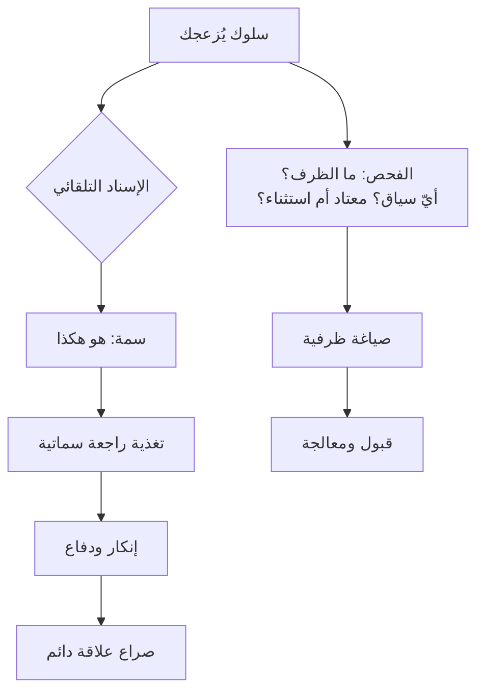

# خطأ الإسناد الأساسي (Fundamental Attribution Error)
> [!info] تعريف مختصر
> ميل تلقائي إلى تفسير سلوك الآخرين بـ**سماتهم الشخصية** وتفسير سلوكنا نحن بـ**ظروفنا**. فتأخّرك أنت «بسبب الزحام»، وتأخّره هو «لأنّه غير منضبط».

## الشرح العلمي والاحترافي
صاغه **لي روس (Lee Ross)** عام 1977. وله وجه مكمّل يُسمّى **فارق الفاعل والمُلاحِظ (Actor-Observer Bias)**: نحن نرى **ظرفنا** من الداخل ولا نرى ظرف غيرنا، فنملأ الفراغ بالسمة.

**والأثر العملي الأخطر في إدارة المشاريع** أنّه يُحوّل [[Task vs Relationship Conflict|صراع المهمّة إلى صراع علاقة]]: خلاف تقني يتكرّر بلا حسم، فيُعيد الطرفان تفسير سلوك بعضهما بالسمات — ويتحوّل «هو يرى المشكلة من زاوية أخرى» إلى «هو شخص عنيد». **وهذه هي اللحظة التي يصير فيها العائق المؤقّت حاجزًا دائمًا.**

**ويُفسّر أيضًا** لماذا تُنكَر التسمية المُسنَدة وتُقبَل التسمية الظرفية:

| الصياغة | نوع الإسناد | ما يحدث |
|---|---|---|
| «يبدو أنّ**ك** خائف» | **سماتي** | يعرف من الداخل أنّه غير صحيح لأنّه يرى ظرفه ← **يُنكر**: «لستُ خائفًا» |
| «يبدو أنّ **هناك** خوفًا» | **ظرفي** | يُطابق تجربته من الداخل ← **يُوافق ويُكمل** |

**فقاعدة «هناك لا أنت» في [[Labeling|التسمية]] ليست لطفًا لغويًّا** — إنّها مواءمة للطريقة التي يرى بها الإنسان نفسه.

## أين ومتى يُستخدم
- كلّ حكم على أداء أو سلوك عضو فريق.
- تحليل سبب فشل تسليم أو حادثة إنتاج — انظر [[Blameless Postmortem]].
- صياغة تغذية راجعة أو تسمية.
- مراجعة صراع متكرّر بين قسمين.

## مثال وسيناريو تطبيقي
> [!example] مطوّر يُسلّم متأخّرًا للمرّة الثالثة. **الإسناد التلقائي:** «غير منضبط ولا يُقدّر المواعيد» — فتُصاغ التغذية الراجعة على هذا الأساس، فيُنكر ويُدافع، وتُصنَّف الحادثة «موقف شخصي». **والفحص الظرفي:** يتبيّن أنّ الثلاثة تأخّرات كلّها في بنود تعتمد على فريق آخر لا يستجيب، وأنّ البنود المستقلّة سُلِّمت في مواعيدها. **فالسبب في نظام التبعيّات لا في انضباطه** — وكان الإسناد السماتي سيُخفي المشكلة الحقيقية سنة كاملة، ويُفقد الفريق مطوّرًا كفؤًا.
> **والاختبار العملي البسيط:** هل السلوك يظهر في **كلّ** سياق، أم في سياق بعينه؟ الظهور في سياق واحد مؤشّر ظرفي قويّ.

## خطوات أو مخطّط
1. **قبل أن تحكم، اسأل: ما الظرف الذي لا أراه؟**
2. **افحص السياق:** أيظهر السلوك في كلّ الحالات أم في حالات بعينها؟
3. **افحص التكرار:** معتاد أم استثناء؟ — انظر [[Task vs Relationship Conflict]].
4. **صُغ بلغة ظرفية**: «هناك…» لا «أنتَ…».
5. **وثّق الحوادث بتواريخ** — فالذاكرة متحيّزة: نتذكّر السلبيّ أكثر، ونتذكّر ما يُؤكّد انطباعنا القائم.

## ⚠️ مفاهيم خاطئة شائعة
> [!warning]
> - **ليس دعوة إلى تبرير كلّ شيء.** بعض السلوكيات **نمط** فعلًا؛ والفحص الظرفي يسبق الحكم ولا يُلغيه.
> - **يعمل في الاتّجاه المعاكس أيضًا** — نُسند نجاح غيرنا إلى الظروف («كان محظوظًا») ونجاحنا إلى قدرتنا.
> - **يشتدّ تحت الضغط** — حين ترتفع الاستثارة تتراجع القدرة على التفكير في منظور الآخر، فيقفز الإسناد السماتي.

## ❌ ممارسات خاطئة في المشاريع
> [!failure]
> - **تقييم أداء مبنيّ على انطباع متراكم** بلا حوادث موثّقة بتواريخ — يُكرّس التحيّز ويُقدّمه بوصفه ملاحظة.
> - **تحليل حادثة إنتاج بسؤال «من فعل؟»** بدل «ما الذي جعل هذا ممكنًا في نظامنا؟» — انظر [[Blameless Postmortem]].
> - **صياغة التسميات والتغذية الراجعة بلغة السمات** — تُنتج إنكارًا حتى لو كانت دقيقة.
> - **الاستنتاج من حادثة واحدة** — والمعيار المفقود: **معتاد أم استثناء؟** وجوابه يحتاج توثيقًا لا ذاكرة.

## 🔗 مصطلحات ومفاهيم ذات صلة
[[Labeling]] | [[Task vs Relationship Conflict]] | [[Cognitive Bias]] | [[Blameless Postmortem]] | [[Nonviolent Communication]] | [[Root Cause Analysis]] | [[Cognitive Reappraisal]] | [[Confirmation Bias]]

> [!tip] 💡 إثراء عملي — كورس لعبة العقل
> لماذا تُنكَر «أنتَ خائف» وتُقبَل «هناك خوف»، والطبقات الأربع للصراع: [[04 - التسمية - صناعة الجملة المحايدة]] و[[07 - إدارة الصراع - الطبقات الأربع والصراعات الخمسة]].
