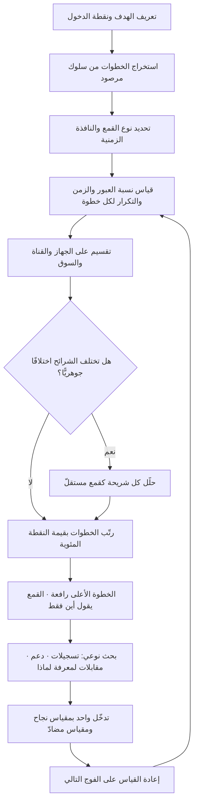

# تحليل القمع (Funnel Analysis)

> [!info] تعريف مختصر
> أسلوب يفكّك رحلة يُفترض أن يقطعها المستخدم إلى خطوات مرتّبة، ثم يقيس **كم دخل كل خطوة، وكم خرج منها إلى التالية، وكم سقط**. سُمّي قمعًا لأن العدد يضيق كلّما تقدّمنا. قوّته أنه يحوّل شكوى مبهمة («التحويل ضعيف») إلى **موضع محدّد** يمكن أن يعمل عليه فريق هذا الأسبوع، ويحوّل التحسين إلى حساب أثر واضح: خطوة تُسرّب 60% من المرور هي أعلى رافعة في النظام. وحدّه الجوهري أنه **يقول أين يسقط الناس ولا يقول لماذا**؛ فالسبب يأتي من تسجيلات الجلسات، ومقابلات المستخدمين، وقراءة الرسائل الواردة — لا من الأعمدة الهابطة.

## الشرح العلمي والاحترافي
- **الأصل والمنشأ.** الفكرة أقدم من التحليلات الرقمية بكثير؛ جذورها في نماذج مراحل الشراء في أدبيات الإعلان والبيع منذ أواخر القرن التاسع عشر (سلسلة: انتباه ← اهتمام ← رغبة ← فعل)، وهي النماذج التي شاع تصويرها لاحقًا على شكل قمع مبيعات. ومع ظهور تتبّع الأحداث في الويب والتطبيقات، تحوّل النموذج الوصفي إلى أداة قياس دقيقة تُحسَب فيها نسب الانتقال بين الخطوات بالبيانات لا بالانطباع.
- **العنصر الحاسم: نسبة الانتقال لا العدد المطلق.** الخطأ الشائع النظر إلى ارتفاع الأعمدة؛ والقراءة الصحيحة تركّز على **نسبة كل خطوة إلى ما قبلها** (Step Conversion) إلى جانب **النسبة الكلّية من أول خطوة إلى آخرها**. الخطوة التي تفقد أكبر **نسبة** هي محلّ الخلل، حتى لو كان عددها المطلق صغيرًا؛ ومقارنتها بمعيار داخلي (نفس الخطوة قبل ثلاثة أشهر) أوثق من مقارنتها بمعايير قطاعية عامّة.
- **ثلاثة أرقام لكل خطوة لا رقم واحد.** القمع الناضج يقيس عن كل خطوة: **نسبة العبور**، و**الزمن حتى العبور** (التأخّر قبل الخروج علامة تردّد أو ارتباك)، و**نسبة التكرار داخل الخطوة** (المحاولات الفاشلة، رسائل الخطأ). خطوتان بنسبة عبور 80% إحداهما تُعبَر في 12 ثانية والأخرى في 4 دقائق مع ثلاث محاولات ليستا سواء إطلاقًا.
- **القمع المغلق مقابل المفتوح.** في **القمع المغلق (Closed)** يُحتسَب المستخدم فقط إن مرّ بالخطوات بالترتيب وضمن نافذة زمنية محدّدة؛ وفي **المفتوح (Open)** يُحتسَب دخوله الخطوة أيًّا كان مساره. الأول أدقّ سببيًّا والثاني أقرب إلى الواقع لأن المستخدمين نادرًا ما يسيرون في خطّ مستقيم. اختيار النوع والنافذة الزمنية يغيّر النتيجة تغييرًا كبيرًا، ولذلك يجب أن يُعلَن مع كل قمع.
- **الحدّ الأول: القمع يفترض خطّية غير موجودة.** الرحلة الحقيقية شبكة لا خطّ: المستخدم يقارن، يخرج، يعود من قناة أخرى، يستشير زميلًا، يُتمّ الشراء على جهاز مختلف. القمع يفرض على هذه الفوضى شكلًا مرتّبًا، ويعامل كل خروج «سقوطًا» وإن كان تأجيلًا واعيًا. لذلك يُقرأ إلى جانب [[User Journey Map]] الذي يصف الرحلة كما هي لا كما نتمنّاها.
- **الحدّ الثاني: لا يفسّر السبب.** انخفاض العبور في خطوة الدفع قد يعني: خطأ تقني، أو رسوم مفاجئة، أو انعدام ثقة، أو غياب وسيلة دفع محلّية، أو نيّة شرائية ضعيفة أصلًا. الأرقام متطابقة والأسباب متباعدة والعلاجات متناقضة. ولذلك القاعدة العملية: **القمع يحدّد أين تحفر، والبحث النوعي يخبرك بماذا تحفر.**
- **الحدّ الثالث: يُقاس على من وصل فقط.** القمع لا يرى من لم يدخل أصلًا، ولا يرى **جودة** من عبر. تحسين نسبة العبور بتخفيف شروط الخطوة قد يرفع الرقم ويُنتج عملاء أسوأ — وهو تطبيق مباشر لـ[[Goodhart's Law]]، وعلاجه [[Counter Metric]] يقيس جودة من عبر لا عددهم فقط.
- **الحدّ الرابع: التجميع يخدع.** قمع واحد لكل المستخدمين يمزج أجهزة وقنوات وأسواقًا. قد تكون نسبة العبور الكلّية مستقرّة بينما انهارت على الهاتف وارتفعت على سطح المكتب فتعادلتا، وقد ينقلب اتّجاه المقارنة كلّيًّا عند التجميع كما في [[Simpson's Paradox]]. القراءة الدنيا: القمع مقسّمًا على الجهاز والقناة.
- **العلاقة بـ[[Cohort Analysis]].** القمع يقيس **العبور خلال رحلة قصيرة**، والفوج يقيس **البقاء عبر الزمن**. أقوى استخدام يجمعهما: قمع محسوب لكل فوج شهري، فيظهر أي خطوة تحديدًا تدهورت في الدفعات الجديدة، ومتى بدأ التدهور.
- **حساب الرافعة قبل العمل.** قبل اختيار الخطوة التي تُصلَح، تُحسب **قيمة النقطة المئوية** في كل خطوة: كم مستخدمًا إضافيًّا يصل إلى النهاية لو تحسّنت هذه الخطوة 5 نقاط؟ وغالبًا تكون الخطوات العليا (ذات الحجم الأكبر) أعلى عائدًا رغم أن الخطوات الدنيا تبدو أسوأ نسبةً — وهذا ترتيب أولويات كمّي يشبه منطق [[RICE Prioritization]].

## أين ومتى يُستخدم
- **في تحسين التسجيل والإعداد**: لتحديد الحقل أو الشاشة التي تُسقط أكبر نسبة، وهو المدخل المباشر لتقصير [[Time to Value]].
- **في مسار الشراء والدفع**: لتحديد أثر رسوم الشحن أو وسائل الدفع أو التحقّق، ولقياس أثر كل تعديل عليها.
- **في تشخيص ضعف [[Adoption]] لميزة جديدة**: قمع من «شاهد الميزة» إلى «جرّبها» إلى «كرّرها»، فيتبيّن إن كانت المشكلة اكتشافًا أم فهمًا أم قيمة.
- **في المبيعات المؤسّسية**: قمع المراحل من العميل المحتمل إلى الإغلاق، مع قياس زمن المكوث في كل مرحلة بوصفه مؤشّرًا متقدّمًا للإيراد ([[Leading and Lagging Indicators]]).
- **في تصميم التجارب واختبار الفرضيات ([[Hypothesis]] و[[Fake Door Test]])**: القمع يحدّد الخطوة موضع الفرضية ويوفّر مقياس النجاح قبل التجربة.
- **في تشخيص انهيار مفاجئ في الأداء**: قمع مقسّم على الإصدار والجهاز يميّز بسرعة بين خلل تقني وتغيّر سلوكي.
- **في مسارات العمليات الداخلية**: قمع لطلب موافقة أو تعيين موظف أو فتح حساب يكشف مكان الاختناق ([[Bottleneck]]) تمامًا كما يفعل في المنتج.
- **مع [[Root Cause Analysis]]**: القمع يوفّر نقطة الدخول المحدّدة التي يبدأ منها البحث عن السبب الجذري، فيمنع التحليل من التشتّت.

## مثال وسيناريو تطبيقي
> [!example] متجر إلكتروني إماراتي لقطع غيار السيارات. الشكوى المعروضة في الاجتماع الشهري: «نسبة التحويل من الزيارة إلى الطلب 1.4% وهي منخفضة». ثلاثة اقتراحات متنافسة على الطاولة: تخفيض الأسعار، وإعادة تصميم الصفحة الرئيسة، وزيادة الإنفاق الإعلاني.
> بدل الاختيار بالانطباع، بُني القمع على بيانات شهر كامل (نافذة مغلقة 24 ساعة):
> | الخطوة | العدد | نسبة العبور | متوسّط الزمن |
> |---|---|---|---|
> | زيارة الموقع | 412,000 | — | — |
> | عرض صفحة منتج | 168,900 | 41% | 38 ث |
> | إضافة إلى السلّة | 47,300 | 28% | 1:12 |
> | بدء الدفع | 21,800 | 46% | 2:40 |
> | إدخال بيانات الشحن | 19,900 | 91% | 1:05 |
> | إتمام الدفع | 5,770 | **29%** | 4:20 |
> النسبة الكلّية: 1.4%. لكن التفكيك يُظهر أن الخطوة الأسوأ بفارق كبير هي **إتمام الدفع (29%)**، ومعها أطول زمن مكوث (4:20) — تركيبة تدلّ على احتكاك لا على عزوف. لا واحد من الاقتراحات الثلاثة كان يعالجها.
> عند التقسيم انكشف المزيد: على سطح المكتب نسبة إتمام الدفع 52%، وعلى الهاتف **19%** — والهاتف يمثّل 74% من المرور. أي أن الرقم الكلّي كان متوسّطًا يخفي مسارين مختلفين تمامًا.
> **القمع أوقف التحليل هنا**: عرف الفريق «أين» ولم يعرف «لماذا». فأُجريت ثلاث خطوات نوعية: مشاهدة 40 تسجيل جلسة على الهاتف، وقراءة 60 محادثة دعم في اليوم نفسه، وخمس مقابلات قصيرة ([[User Interview]]). ظهرت ثلاثة أسباب متمايزة: ① رمز التحقّق البنكي يفتح نافذة تُخرج المستخدم من التطبيق ولا تعيده، ② مبلغ الشحن لا يظهر إلا في هذه الخطوة الأخيرة فيتغيّر الإجمالي فجأة، ③ لوحة المفاتيح تحجب زرّ التأكيد على شاشات بعينها.
> **حساب الرافعة قبل التنفيذ**: رفع إتمام الدفع على الهاتف من 19% إلى 35% كان يعني نحو 2,700 طلب إضافي شهريًّا، مقابل نحو 700 طلب من تحسين خطوة عرض المنتج بالمقدار نفسه — فتحدّد الترتيب كمّيًّا.
> نُفّذت ثلاثة إصلاحات مقابلة، وأُضيف مقياس مضادّ: **نسبة الإرجاع خلال 14 يومًا (ألّا تتجاوز 6%)** حتى لا يُشترى التحويل بإخفاء معلومات. النتيجة بعد ستّة أسابيع: إتمام الدفع على الهاتف 41%، النسبة الكلّية 2.6%، الإرجاع 5.4%.

## خطوات أو مخطّط
1. عرّف **الهدف النهائي** للقمع بحدث واحد لا لبس فيه، وحدّد نقطة الدخول التي يبدأ منها العدّ.
2. اكتب الخطوات الوسيطة من واقع سلوك مرصود لا من مخطّط التصميم المثالي؛ راجعها بتسجيلات جلسات حقيقية.
3. اختر نوع القمع (مغلق أم مفتوح) والنافذة الزمنية، وأعلنهما مع كل تقرير لأن النتيجة تعتمد عليهما.
4. احسب لكل خطوة: نسبة العبور، والزمن حتى العبور، ومعدّل التكرار أو الأخطاء داخلها.
5. قسّم القمع على الجهاز والقناة والسوق قبل أي استنتاج، وابحث عن انقلاب في الاتّجاه بين الشرائح.
6. رتّب الخطوات بـ**قيمة النقطة المئوية** لا بسوء النسبة، لتحديد أعلى رافعة أثر فعلية.
7. انتقل إلى البحث النوعي لتفسير «لماذا»: تسجيلات، محادثات دعم، مقابلات — ولا تصمّم حلًّا قبل ذلك.
8. صمّم تدخّلًا واحدًا قابلًا للقياس، وأعلن مقياس نجاح ومقياسًا مضادًّا لجودة من عبر، ثم أعد قياس القمع على الفوج التالي.

## ⚠️ مفاهيم خاطئة شائعة
> [!warning]
> - **«القمع يفسّر سبب السقوط»**: لا يفعل ولا يدّعي. هو أداة تحديد موقع؛ والسبب يأتي من مصادر نوعية. القفز من الرقم إلى الحلّ مباشرة أشيع خطأ في استخدامه وأكثرها كلفة.
> - **«الخطوة ذات النسبة الأسوأ هي الأولى بالإصلاح»**: ليس بالضرورة. خطوة عليا ضخمة الحجم بتحسّن صغير قد تفوق خطوة دنيا سيّئة النسبة قليلة الحجم. القرار يُحسم بقيمة النقطة المئوية لا بلون الخلية.
> - **«رحلة المستخدم خطّية كما في القمع»**: القمع تبسيط مفيد لا وصف أمين. من يخرج ليقارن ثم يعود بعد ثلاثة أيام يُحسب «ساقطًا» في قمع بنافذة 24 ساعة رغم أنه اشترى.
> - **«ارتفاع نسبة العبور مكسب دائمًا»**: قد يكون شراءً للرقم بإخفاء معلومة أو تخفيف شرط، فيرتدّ في صورة إرجاع أو شكاوى أو انسحاب لاحق. تُقرأ نتيجة القمع دائمًا مع حارس جودة.
> - **«قمع واحد يكفي المنتج كلّه»**: لكل نيّة مستخدم قمع مختلف؛ خلط الباحث المتصفّح بالمشتري صاحب النيّة يُنتج نسبًا لا تعني شيئًا لأي منهما.
> - **«القمع بديل عن تحليل الأفواج»**: مختلفان في السؤال. القمع «هل عبروا؟» والفوج «هل بقوا؟». منتج بقمع ممتاز واحتفاظ منهار يبدو ناجحًا في القمع وحده.
> - **«الأرقام الصغيرة في أسفل القمع تُقرأ كما الكبيرة»**: عند العشرات فقط، تكفي تقلّبات عشوائية لتغيير النسبة تغييرًا يبدو دراماتيكيًّا؛ يجب التحقّق من كفاية الحجم قبل الاستنتاج.

## ❌ ممارسات خاطئة في المشاريع
> [!failure]
> - **الخطأ: بناء خطوات القمع من مخطّط التصميم بدل السلوك الفعلي.** لماذا يضرّ: يُنتج قمعًا لمسار لا يسلكه أحد، فتُعالَج خطوات وهمية بينما الاختناق الحقيقي خارج النموذج. الحل: اشتقّ الخطوات من أحداث مرصودة فعلًا، وراجعها بتسجيلات جلسات قبل اعتمادها.
> - **الخطأ: قراءة القمع مجمّعًا دون تقسيم.** لماذا يضرّ: يُخفي انهيارًا في شريحة كبيرة خلف متوسّط مطمئن، وقد يقلب الاتّجاه تمامًا ([[Simpson's Paradox]]). الحل: اجعل التقسيم على الجهاز والقناة إلزاميًّا في تعريف التقرير لا خيارًا اختياريًّا.
> - **الخطأ: تصميم الحل فور رؤية الخطوة السيّئة.** لماذا يضرّ: يُنفَق ربع كامل على إعادة تصميم شاشة بينما السبب خلل تقني في وسيلة دفع واحدة. الحل: اجعل خطوة البحث النوعي شرطًا إجرائيًّا بين اكتشاف الخطوة وكتابة أي بند في الـBacklog.
> - **الخطأ: مطاردة نسبة التحويل بوصفها هدفًا مفردًا مربوطًا بحافز.** لماذا يضرّ: يدفع إلى أنماط مضلّلة وإخفاء تكاليف وضغط شرائي، فيرتفع الرقم وينخفض الاحتفاظ والثقة. الحل: اقرن هدف التحويل بحارس جودة (إرجاع، إلغاء، شكاوى) عبر [[Counter Metric]].
> - **الخطأ: إهمال الزمن ومعدّل الأخطاء داخل الخطوة.** لماذا يضرّ: خطوة تعبرها الأغلبية بعد أربع محاولات تبدو سليمة بنسبة العبور وحدها، وهي أسوأ نقطة في التجربة. الحل: أضف الزمن ومحاولات الفشل ورسائل الخطأ إلى تعريف كل خطوة.
> - **الخطأ: مقارنة نسب القمع بمعايير قطاعية عامّة.** لماذا يضرّ: تختلف التعريفات ومصادر المرور والنوافذ الزمنية اختلافًا يجعل المقارنة بلا معنى، وقد تُطمئن فريقًا يجب أن يقلق. الحل: قارن بنفسك عبر الزمن وبين الشرائح، واستخدم أفواجك السابقة أساسًا للمقارنة.
> - **الخطأ: تجاهل جودة المرور الداخل إلى القمع.** لماذا يضرّ: انخفاض النسبة قد يكون سببه حملة جلبت جمهورًا غير مستهدَف لا عيبًا في المنتج، فيُعاد تصميم ما لا خلل فيه. الحل: افحص تركيب المصادر قبل إعلان تدهور، واقرأ القمع لكل قناة على حدة.
> - **الخطأ: بناء القمع مرّة واحدة ثم تركه.** لماذا يضرّ: يتغيّر المنتج والأحداث المتتبَّعة فيصير القمع يقيس خطوات لم تعد موجودة، ويُتّخذ قرار على بيانات ميّتة. الحل: راجع تعريفات الأحداث مع كل إصدار كبير، واضبط ملكية القمع لدى شخص معلوم.

## 🔗 مصطلحات ومفاهيم ذات صلة
[[KPI]] | [[North Star Metric]] | [[Outcome vs Output]] | [[Cohort Analysis]] | [[Simpson's Paradox]] | [[Counter Metric]] | [[Vanity Metrics]] | [[Goodhart's Law]] | [[Leading and Lagging Indicators]] | [[Percentiles and Median vs Average]] | [[Product Analytics]] | [[User Journey Map]] | [[User Interview]] | [[Root Cause Analysis]] | [[Bottleneck]]
