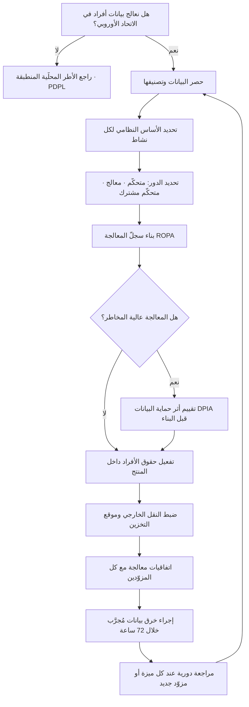

# اللائحة العامّة لحماية البيانات (GDPR)

> [!info] تعريف مختصر
> لائحة أوروبية لحماية البيانات الشخصية، اعتُمدت عام 2016 وبدأ تطبيقها في **25 مايو 2018**، وحلّت محلّ توجيه حماية البيانات الأوروبي لعام 1995. تنظّم كل معالجة للبيانات الشخصية لأفراد داخل الاتحاد الأوروبي والمنطقة الاقتصادية الأوروبية، وتقوم على فكرة مركزية: المعالجة **ممنوعة أصلًا** ما لم يوجد أساس نظامي يبيحها. وأهمّ ما جعلها معيارًا عالميًّا لا إقليميًّا أمران: أثرها خارج الحدود (تنطبق على شركة في أي بلد إذا استهدفت أفرادًا في أوروبا)، وسقف غراماتها المرتفع الذي يبلغ 20 مليون يورو أو 4% من الإيراد السنوي العالمي، أيّهما أعلى.

## الشرح العلمي والاحترافي
- **الفكرة المؤسِّسة — الأساس النظامي للمعالجة (Lawful Basis)**: لا يجوز معالجة أي بيانات شخصية إلا استنادًا إلى أحد ستّة أسس محدّدة: الموافقة، أو تنفيذ عقد، أو التزام قانوني، أو حماية مصالح حيوية، أو مهمّة ذات مصلحة عامّة، أو المصلحة المشروعة للمُتحكّم. وأشهر خطأ هنا افتراض أن الموافقة هي الأساس الوحيد أو الأفضل، بينما هي في الواقع الأهشّ لأنها قابلة للسحب في أي وقت وتشترط أن تكون حرّة ومحدّدة ومستنيرة ولا لبس فيها.
- **مبادئ المعالجة السبعة**: المشروعية والنزاهة والشفافية، تحديد الغرض، **تقليل البيانات** (اجمع الحدّ الأدنى اللازم لا كل ما تستطيع)، الدقّة، تحديد مدّة الاحتفاظ، النزاهة والسرّية، والمساءلة. والمبدأ الأخير هو الأثقل عمليًّا: لا يكفي أن تكون ممتثلًا، بل يجب أن **تستطيع إثبات امتثالك بالوثائق** — ومن هنا صار [[ROPA]] التزامًا لا ترفًا تنظيميًّا.
- **حقوق أصحاب البيانات ثمانية**: العلم، والوصول، والتصحيح، والمحو (المعروف إعلاميًّا بـ«الحق في النسيان»)، وتقييد المعالجة، **ونقل البيانات (Portability)** أي استلامها بصيغة منظَّمة قابلة للقراءة آليًّا ونقلها إلى مزوّد آخر، والاعتراض، وعدم الخضوع لقرار آلي بالكامل له أثر قانوني أو أثر بالغ مماثل. والحق الأخير هو الأوثق صلة بمنتجات الذكاء الاصطناعي، لأنه يقيّد أنظمة القرار الآلي في التوظيف والائتمان والتأمين ويستلزم تدخّلًا بشريًّا ذا معنى وحقّ اعتراض.
- **مواعيد صارمة تصنع فرق التنفيذ**: الردّ على طلب صاحب البيانات خلال **شهر** (قابل للتمديد شهرين في الحالات المعقّدة)، والإبلاغ عن خرق البيانات إلى الجهة الرقابية خلال **72 ساعة** من العلم به، وإبلاغ الأفراد أنفسهم دون تأخير غير مبرّر إن كان الخطر عليهم مرتفعًا. هذه المواعيد تفرض بناء قدرات تشغيلية داخل المنتج لا مجرّد سياسات مكتوبة.
- **الخصوصية بالتصميم وبالإعداد الافتراضي (Privacy by Design and by Default)**: التزام صريح بأن تُدمج ضمانات الخصوصية في تصميم النظام من بدايته، وأن يكون الإعداد الافتراضي هو الأكثر تحفّظًا (أقلّ جمع، أضيق مشاركة، أقصر احتفاظ) دون أن يضطرّ المستخدم لضبط شيء.
- **تقييم أثر حماية البيانات (DPIA)**: إلزامي قبل أي معالجة عالية المخاطر — كالمراقبة الممنهجة واسعة النطاق، أو معالجة فئات خاصّة من البيانات (صحّية، بيومترية، عقائدية)، أو التقييم الآلي المنهجي للأفراد. وهو عمليًّا أقرب ما يكون إلى سجلّ مخاطر متخصّص يسبق البناء ([[Risk Register]]).
- **المقارنة الدقيقة مع [[PDPL]] السعودي** — التشابه في البنية كبير لأن النظام السعودي استفاد من التجربة العالمية، لكن الفروق التي تغيّر قرارات المشروع محدّدة:

| الوجه | GDPR | [[PDPL]] السعودي |
|---|---|---|
| الجهة والنطاق | لائحة اتحاد أوروبي تنفّذها جهات رقابية وطنية؛ تنطبق على أفراد داخل الاتحاد | نظام سعودي تشرف عليه الهيئة السعودية للبيانات والذكاء الاصطناعي (SDAIA)؛ يطبَّق على معالجة بيانات أفراد داخل المملكة ولو من جهة خارجها |
| الأثر خارج الحدود | صريح وواسع (استهداف أفراد أو رصد سلوكهم) | قائم أيضًا حين تخصّ المعالجة أشخاصًا داخل المملكة |
| الأصل في النقل الخارجي | مسموح مع ضمانات (قرار كفاية · [[Standard Contractual Clauses]] · قواعد مؤسسية) | الأصل المعالجة داخل المملكة، والنقل استثناء مشروط — انظر [[Data Residency]] |
| الموافقة | أحد ستّة أسس، وليست الأفضل بالضرورة | دور بارز للموافقة الصريحة مع استثناءات محدّدة |
| مسؤول حماية البيانات | إلزامي في حالات محدّدة بالنصّ | يُشترط في حالات تحدّدها اللوائح والضوابط التنفيذية |
| نقل البيانات (Portability) | حقّ صريح ومفصّل | معالَج ضمن حقوق الوصول والحصول على البيانات |
| سقف الجزاء | حتى 20 مليون يورو أو 4% من الإيراد العالمي | غرامات مالية بسقوف محدّدة نظامًا، مع عقوبة مشدّدة على إفشاء البيانات الحسّاسة |
| التسويق المباشر | منظَّم بقواعد أوروبية إضافية إلى جانب اللائحة | منظَّم داخل النظام وضوابطه التنفيذية |

  والخلاصة العملية للفريق: **الامتثال لأحدهما لا يعني الامتثال للآخر تلقائيًّا**، لكن بناء المنتج على المستوى الأعلى من الاثنين في كل بند يقلّل العمل المكرّر جذريًّا. والفارق الأهمّ عمليًّا لفريق سعودي يخدم عملاء أوروبيين هو **اتجاه التقييد**: النظام السعودي يشدّد على بقاء البيانات بالداخل، واللائحة الأوروبية تشدّد على شروط الخروج من الاتحاد — وقد يتقاطع الاثنان في منتج واحد فيفرضان فصلًا جغرافيًّا للبيانات لا مجرّد سياسة موحّدة.
- **الأدوار والمسؤولية التعاقدية**: تبني اللائحة التزاماتها على تمييز حادّ بين المتحكّم والمعالج ([[Controller vs Processor]])، وتوجب بينهما عقد معالجة بيانات (DPA) يحدّد الغرض والمدّة والتعليمات وضوابط الأمن وشروط الاستعانة بمعالجين من الباطن. ومن أخطر ما يغفله مديرو المنتجات أن كل أداة طرف ثالث في المنتج تحتاج هذا العقد.

## أين ومتى يُستخدم
- **عند دخول سوق أوروبية أو استقبال أول عميل أوروبي**: حتى لو كانت الشركة كلّها في الرياض، فوجود مستخدمين في الاتحاد يستدعي التقييم — وهذا أكثر ما يُفاجَأ به فريق نموّ يظنّ الأمر بعيدًا عنه.
- **في تصميم المنتج ومتطلباته ([[PRD]] و[[Software Requirements Specification]])**: حقوق المستخدم تتحوّل إلى ميزات فعلية: شاشة تصدير البيانات، وتدفّق حذف الحساب، ولوحة إدارة الموافقات، وسجلّ تدقيق للوصول.
- **في مراجعة الموردين ([[Vendor Management]])**: قبل اعتماد أي مزوّد يعالج بيانات نيابةً عنك، تُطلب اتفاقية معالجة بيانات وقائمة المعالجين من الباطن وموقع التخزين وآليات النقل مثل [[Standard Contractual Clauses]].
- **في توثيق المعالجة ([[ROPA]]) وتقييم الأثر**: بوصفهما دليلَي المساءلة الأساسيين أمام أي جهة رقابية أو تدقيق عميل.
- **في اختيار البنية السحابية والمناطق ([[Data Residency]])**: قرار موقع الاستضافة يتقاطع مع شروط النقل خارج الاتحاد وشروط بقاء البيانات محلّيًّا في السوق الخليجية.
- **في مشاريع الذكاء الاصطناعي**: تدريب النماذج على بيانات المستخدمين، والقرارات الآلية، وإرسال محتوى المستخدم إلى نماذج خارجية — كلّها معالجات تحتاج أساسًا نظاميًّا وشفافية، وتشتدّ أهمّيتها في أنظمة [[Retrieval-Augmented Generation]] التي تسترجع وثائق قد تحوي بيانات شخصية.

## مثال وسيناريو تطبيقي
> [!example] شركة برمجيات سعودية تبيع منصّة توظيف للشركات، ولديها 140 عميلًا في الخليج. وقّعت عقدها الأول مع شركة في ألمانيا، فأرسل فريق العميل استبيان امتثال من 60 سؤالًا قبل التوقيع النهائي. كشف الاستبيان خمس فجوات:
> ① المنصّة تخزّن السير الذاتية **إلى الأبد** بلا سياسة احتفاظ، بينما ينصّ مبدأ تحديد المدّة على حذفها أو إخفاء هويتها بعد انتهاء الغرض.
> ② تحتوي المنصّة ميزة «ترتيب آلي للمرشّحين» تعطي كل متقدّم درجة من 100 وتُخفي من هم دون 60 من واجهة مسؤول التوظيف — وهو اقتراب مباشر من القرار الآلي المؤثّر الذي يستوجب شفافية وتدخّلًا بشريًّا ذا معنى وحقّ اعتراض.
> ③ خانة الموافقة على «تلقّي عروض تسويقية» كانت **مؤشَّرة مسبقًا** في نموذج التسجيل، والموافقة المؤشَّرة سلفًا ليست موافقة صحيحة.
> ④ لا يوجد سجلّ [[ROPA]] ولا اتفاقيات معالجة بيانات مع أي من مزوّدي الخدمات الثمانية المدمجين في المنصّة.
> ⑤ تُخزَّن كل البيانات في منطقة سحابية واحدة خارج الاتحاد الأوروبي دون أي ضمان نقل.
> خطّة المعالجة استغرقت 11 أسبوعًا: سياسة احتفاظ افتراضية 24 شهرًا مع حذف آلي وإشعار مسبق، وتحويل الترتيب الآلي من فلترة تُخفي المرشّحين إلى **ترتيب استرشادي** يرى فيه مسؤول التوظيف كل المتقدّمين مع شرح مبسّط لعوامل الدرجة وإمكانية تجاوزها، وإلغاء التأشير المسبق وفصل موافقة التسويق عن قبول الشروط، وبناء سجلّ معالجة كامل وتوقيع اتفاقيات معالجة مع المزوّدين الثمانية (اضطرّت الشركة لاستبدال اثنين رفضا توقيعها)، وإنشاء مثيل منفصل داخل الاتحاد لعملاء أوروبا مع بقاء العملاء الخليجيين على البنية المحلّية تلبيةً لـ[[PDPL]] في آنٍ واحد.
> النتيجة غير المتوقّعة: الشركة استخدمت الملفّ نفسه لاحقًا للفوز بعميل حكومي سعودي طلب أدلّة حوكمة بيانات، فتحوّل ما بدأ كعبء امتثال لسوق واحدة إلى أصل تجاري قابل لإعادة الاستخدام.

## خطوات أو مخطّط
1. تحديد ما إذا كانت اللائحة تنطبق أصلًا: هل تُستهدَف بمنتجك جمهور داخل الاتحاد أو يُرصد سلوكه؟
2. حصر البيانات الشخصية المُعالَجة وتصنيفها، وتمييز الفئات الخاصّة الحسّاسة عن غيرها.
3. تحديد الأساس النظامي لكل نشاط معالجة على حدة — لا أساس واحد لكل المنتج.
4. تحديد دورك في كل نشاط: متحكّم أم معالج أم متحكّم مشترك ([[Controller vs Processor]]).
5. بناء سجلّ [[ROPA]] وربط كل نشاط بغرضه ومدّة احتفاظه ومستقبليه وموقع تخزينه.
6. إجراء تقييم أثر (DPIA) لكل معالجة عالية المخاطر قبل البناء لا بعده.
7. تحويل حقوق الأفراد إلى قدرات فعلية في المنتج والعمليات، بزمن استجابة يفي بمهلة الشهر.
8. ضبط النقل خارج الاتحاد بآلية مشروعة، وتوثيق موقع كل نسخة ونسخة احتياطية ([[Data Residency]]).
9. توقيع اتفاقيات معالجة بيانات مع كل المزوّدين، ومراجعة معالجيهم من الباطن.
10. بناء إجراء خرق بيانات مُجرَّب يضمن الإبلاغ خلال 72 ساعة، وتدريب الفريق عليه دوريًّا.

## ⚠️ مفاهيم خاطئة شائعة
> [!warning]
> - **«اللائحة تخصّ الشركات الأوروبية فقط»**: النطاق يتبع **موقع الأفراد** لا موقع الشركة. شركة خليجية تبيع اشتراكات لمستخدمين في أوروبا تدخل في النطاق ولو لم تطأ قدمها القارّة.
> - **«الموافقة تحلّ كل شيء»**: الموافقة أحد ستّة أسس وأضعفها استقرارًا. الاعتماد عليها في معالجة لا غنى عنها لتشغيل الخدمة (كالفوترة) خطأ تصميمي، لأن سحبها يوقف وظيفة أساسية بينما الأساس الصحيح لها هو تنفيذ العقد.
> - **«نافذة الكوكيز تعني أننا ممتثلون»**: النافذة أصغر جزء ظاهر من التزام واسع لا يُرى: سجلّ المعالجة، ومدد الاحتفاظ، وعقود المزوّدين، وأمن البيانات، وحقوق الأفراد. وكثير من النوافذ نفسها غير سليمة أصلًا لأنها لا تتيح الرفض بسهولة القبول ذاتها.
> - **«الحقّ في المحو مطلق»**: الحقّ مقيّد باستثناءات مهمّة، أبرزها وجود التزام قانوني بالاحتفاظ — كحفظ الفواتير لأغراض ضريبية. فحذف الحساب لا يعني بالضرورة محو كل أثر للبيانات.
> - **«[[PDPL]] نسخة عربية من GDPR»**: تشابه بنيوي واضح، لكن الفروق فعلية وتغيّر التصميم: اتجاه القيد على النقل الخارجي، ودور الموافقة، وسقوف الجزاء، والجهة الرقابية، وآليات الضمان المعتمدة. الامتثال بأحدهما لا يُغني عن تقييم الآخر.
> - **«الغرامة القصوى هي المتوقّعة عند أي مخالفة»**: السقف حدّ أعلى، والجهات الرقابية تراعي طبيعة المخالفة وجسامتها وتعاون المؤسسة وتاريخها. لكن الكلفة الحقيقية غالبًا ليست الغرامة بل تعطّل الصفقات: عميل مؤسسي واحد يوقف التعاقد بسبب فجوة امتثال قد يكلّف أكثر من أي جزاء.

## ❌ ممارسات خاطئة في المشاريع
> [!failure]
> - **الخطأ**: جمع كل حقل بيانات ممكن «لأنه قد ينفع لاحقًا». **لماذا يضرّ**: يخالف مبدأ تقليل البيانات مباشرة، ويوسّع سطح الخطر عند أي اختراق، ويرفع كلفة الامتثال والتخزين بلا عائد. **الحل**: اربط كل حقل بغرض مكتوب في [[PRD]]، واحذف كل حقل بلا غرض معلن.
> - **الخطأ**: بناء حقوق الأفراد كإجراء يدوي يقوم به موظّف عبر رسائل بريد وأوامر قاعدة بيانات. **لماذا يضرّ**: لا يصمد أمام مهلة الشهر عند ارتفاع الطلبات، ويترك آثارًا في أنظمة فرعية منسيّة. **الحل**: اجعل التصدير والحذف قدرة مبنيّة في المنتج تشمل كل الأنظمة الفرعية، وقِس زمن استجابتها.
> - **الخطأ**: تشغيل ميزة ذكاء اصطناعي على بيانات المستخدمين دون تحديث الأساس النظامي وإشعار الخصوصية. **لماذا يضرّ**: يمثّل غرضًا جديدًا للمعالجة لم يُخطَر به المستخدم، وقد يقع تحت قواعد القرار الآلي. **الحل**: عامل كل استخدام جديد للبيانات كنشاط معالجة مستقل: أساس نظامي، وتقييم أثر، وتحديث للإشعار، وتسجيل في [[ROPA]].
> - **الخطأ**: افتراض أن المزوّد السحابي مسؤول عن الامتثال. **لماذا يضرّ**: المزوّد معالج غالبًا، والمسؤولية أمام المستخدم تبقى على المتحكّم — أي عليك. **الحل**: افهم حدود نموذج المسؤولية المشتركة، ووقّع اتفاقية معالجة بيانات صريحة، وراجع قائمة المعالجين من الباطن.
> - **الخطأ**: تجاهل بيئات الاختبار والتحليلات والسجلّات في نطاق الامتثال. **لماذا يضرّ**: أشدّ التسريبات وقعت من نسخ إنتاج في بيئات اختبار ضعيفة الحماية أو من سجلّات تحوي حقولًا شخصية. **الحل**: بيانات مُصطنَعة أو مقنّعة، وتنقية الحقول الشخصية من السجلّات عند المصدر.
> - **الخطأ**: عدم اختبار إجراء الإبلاغ عن خرق البيانات إطلاقًا. **لماذا يضرّ**: مهلة 72 ساعة قصيرة جدًّا حين يبدأ الفريق ببناء الإجراء لحظة وقوع الحادث. **الحل**: تمرين محاكاة دوري (Tabletop) بأدوار محدّدة وقنوات تصعيد جاهزة، مثل تمارين التعافي المرتبطة بـ[[RTO and RPO]].
> - **الخطأ**: معاملة الامتثال كمشروع لمرّة واحدة ينتهي بشهادة. **لماذا يضرّ**: كل ميزة جديدة ومزوّد جديد وسوق جديدة تغيّر خريطة المعالجة، فيتقادم التوثيق بصمت. **الحل**: اجعل مراجعة أثر الخصوصية جزءًا من تعريف الجاهزية ([[Definition of Ready]]) لأي ميزة تمسّ بيانات المستخدمين.

## 🔗 مصطلحات ومفاهيم ذات صلة
[[PDPL]] | [[Controller vs Processor]] | [[ROPA]] | [[Standard Contractual Clauses]] | [[Data Residency]] | [[KYC]] | [[Risk Register]] | [[Governance]] | [[Vendor Management]] | [[Retrieval-Augmented Generation]]
