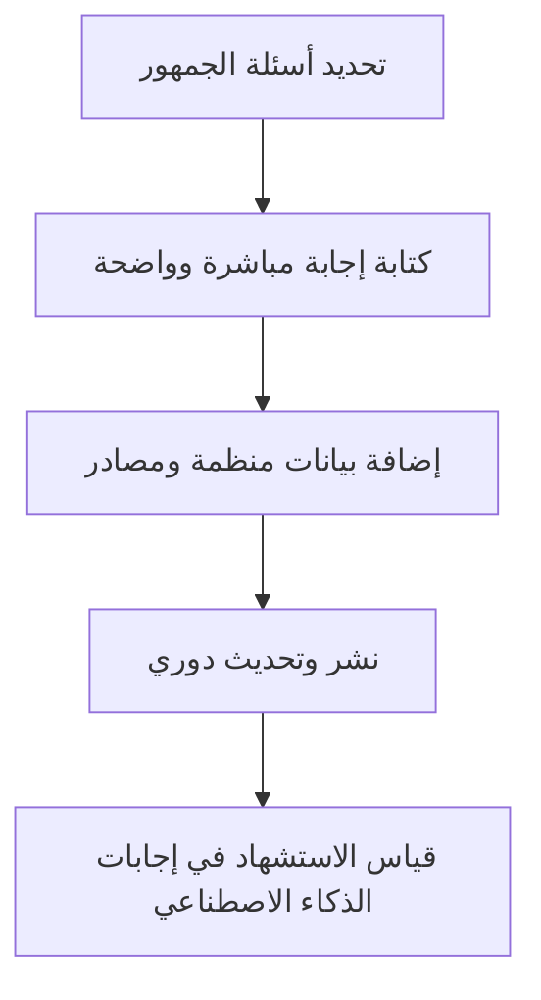

# تهيئة المحتوى لمحركات الذكاء الاصطناعي (GEO)

> [!info] تعريف مختصر
> تهيئة المحتوى لمحركات الذكاء الاصطناعي (Generative Engine Optimization - GEO) هي مجموعة ممارسات لكتابة وهيكلة المحتوى بحيث تفهمه محركات الذكاء الاصطناعي التوليدية (مثل ChatGPT وGemini ونتائج [[AI Overviews]] في جوجل) وتستشهد به أو تلخّصه في إجاباتها المباشرة للمستخدمين، بدلاً من الاكتفاء بالظهور كرابط في نتائج بحث تقليدية.

## الشرح العلمي والاحترافي
- تقليدياً، اهتم أصحاب المواقع بتحسين محركات البحث (SEO) ليظهر موقعهم في أعلى نتائج جوجل كرابط يضغط عليه المستخدم. أما GEO فهدفه مختلف: أن يقتبس محرك الذكاء الاصطناعي من المحتوى مباشرة عند توليد إجابة، حتى لو لم يزر المستخدم الموقع نهائياً.
- تعمل محركات الذكاء الاصطناعي عبر تلخيص عدة مصادر ودمجها في إجابة واحدة (يُسمى هذا أحياناً "الإجابة الصفرية النقرة" Zero-Click Answer). لذلك يجب أن يكون المحتوى واضح البنية، مقسّماً إلى فقرات وعناوين قصيرة، ويجيب مباشرة عن سؤال محدد بلغة دقيقة وقابلة للاقتباس.
- من الممارسات الأساسية في GEO: كتابة تعريفات واضحة في بداية كل قسم، استخدام البيانات المنظّمة (Structured Data / Schema Markup)، ذكر مصادر وأرقام موثوقة، وتجنّب الحشو والغموض الذي يصعب على النموذج تلخيصه بدقة.
- يرتبط GEO ارتباطاً وثيقاً بمعايير [[YMYL]] (المواضيع التي تؤثر على صحة الناس أو مالهم أو سلامتهم)؛ فمحركات الذكاء الاصطناعي أكثر حذراً في الاستشهاد بمحتوى في هذه المواضيع ما لم يكن موثوقاً وواضح المصدر.
- يهم هذا المصطلح مديري المشاريع الرقمية والمحتوى لأن قنوات اكتساب الزوار تتغيّر: جزء متزايد من الجمهور يحصل على إجاباته من الذكاء الاصطناعي مباشرة، فتغيب مقاييس الزيارات التقليدية ويجب قياس الظهور والاستشهاد بدلاً من ذلك.

## أين ومتى يُستخدم
- يُستخدم في مشاريع التسويق الرقمي والمحتوى، وتحديداً عند التخطيط لاستراتيجية محتوى موقع أو مدونة أو توثيق منتج يريد أصحابه الظهور في إجابات الذكاء الاصطناعي.
- يُدمج عادة ضمن نموذج [[Hub and Spoke Content Model]] عند بناء بنية محتوى شاملة حول موضوع رئيسي وموضوعات فرعية مترابطة.
- يُلجأ إليه في مراحل التخطيط لمحتوى موقع جديد أو إعادة هيكلة محتوى قائم، وغالباً بالتوازي مع فريق تحسين محركات البحث التقليدي (SEO) لا كبديل عنه.

## مثال وسيناريو تطبيقي
> [!example] سيناريو ملموس في مشروع برمجي حقيقي
> شركة "تِرا سوفت" تطلق منصة SaaS لإدارة الفواتير، وتلاحظ أن عدد الزيارات العضوية لمدونتها انخفض 15% رغم عدم تغيّر ترتيبها في جوجل. يكتشف فريق التسويق أن المستخدمين يحصلون على إجابات أسئلتهم (مثل "كيف أحسب الضريبة المضافة على فاتورة؟") مباشرة من ChatGPT دون زيارة الموقع.
> يعيد الفريق كتابة 20 مقالة رئيسية: يضع تعريفاً واضحاً في أول فقرتين، يضيف جداول Schema Markup للأسئلة الشائعة، ويذكر أرقاماً ومصادر رسمية (كنسبة الضريبة الرسمية في كل دولة).
> بعد شهرين، يلاحظ الفريق أن روابط الموقع بدأت تظهر كمصدر مذكور ضمن إجابات Gemini وAI Overviews عند البحث عن هذه الأسئلة، وارتفعت طلبات التجربة المجانية القادمة من هذه الإجابات بنسبة 25%.

## خطوات أو مخطّط
1. تحديد الأسئلة الشائعة التي يطرحها الجمهور المستهدف فعلياً (بحث كلمات مفتاحية وأسئلة).
2. كتابة إجابة مباشرة وواضحة لكل سؤال في بداية القسم المخصص له، بلغة بسيطة وقابلة للاقتباس.
3. إضافة بيانات منظّمة (Schema Markup) وعناوين فرعية واضحة تسهّل على النموذج تحليل الصفحة.
4. ذكر مصادر وأرقام موثوقة، وتحديث المحتوى دورياً لضمان دقته وحداثته.
5. قياس الظهور في إجابات الذكاء الاصطناعي (عبر أدوات رصد الاستشهادات) بدلاً من الاكتفاء بمقاييس الزيارات فقط.

## ⚠️ مفاهيم خاطئة شائعة
> [!warning]
> - الظن أن GEO بديل كامل عن SEO التقليدي؛ في الحقيقة هما متكاملان، والمحتوى الجيد لمحركات البحث غالباً أساس جيد لمحركات الذكاء الاصطناعي أيضاً.
> - الاعتقاد أن حشو الكلمات المفتاحية يحسّن الظهور في إجابات الذكاء الاصطناعي؛ العكس صحيح، فالنماذج تفضّل اللغة الطبيعية الواضحة على الحشو.
> - الافتراض أن النتائج تظهر فوراً؛ تحسين GEO يحتاج أسابيع أو أشهر لأن النماذج تُحدّث فهرستها للمحتوى بشكل دوري وليس لحظياً.

## ❌ ممارسات خاطئة في المشاريع
> [!failure]
> - كتابة مقالات طويلة وغامضة دون إجابة مباشرة وواضحة، فيصعب على النموذج اقتباسها. التجنب: وضع الإجابة المختصرة والمباشرة في أول فقرتين من كل قسم.
> - إهمال قياس الأثر بعد التحسين، فلا يعرف الفريق هل نجحت الجهود أم لا. التجنب: تحديد [[KPI]] واضحة مثل عدد مرات الاستشهاد أو الزيارات القادمة من روابط الذكاء الاصطناعي.
> - نسخ محتوى من مصادر أخرى دون إضافة قيمة أو مصداقية، مما يقلل ثقة النموذج بالمصدر. التجنب: الاستثمار في محتوى أصلي مدعوم بأرقام وبيانات حقيقية من فريق المشروع نفسه.

## 🔗 مصطلحات ومفاهيم ذات صلة
[[AI Overviews]] | [[YMYL]] | [[Hub and Spoke Content Model]] | [[KPI]] | [[NPS]] | [[Outcome vs Output]] | [[21 - Stakeholder Communication]]
