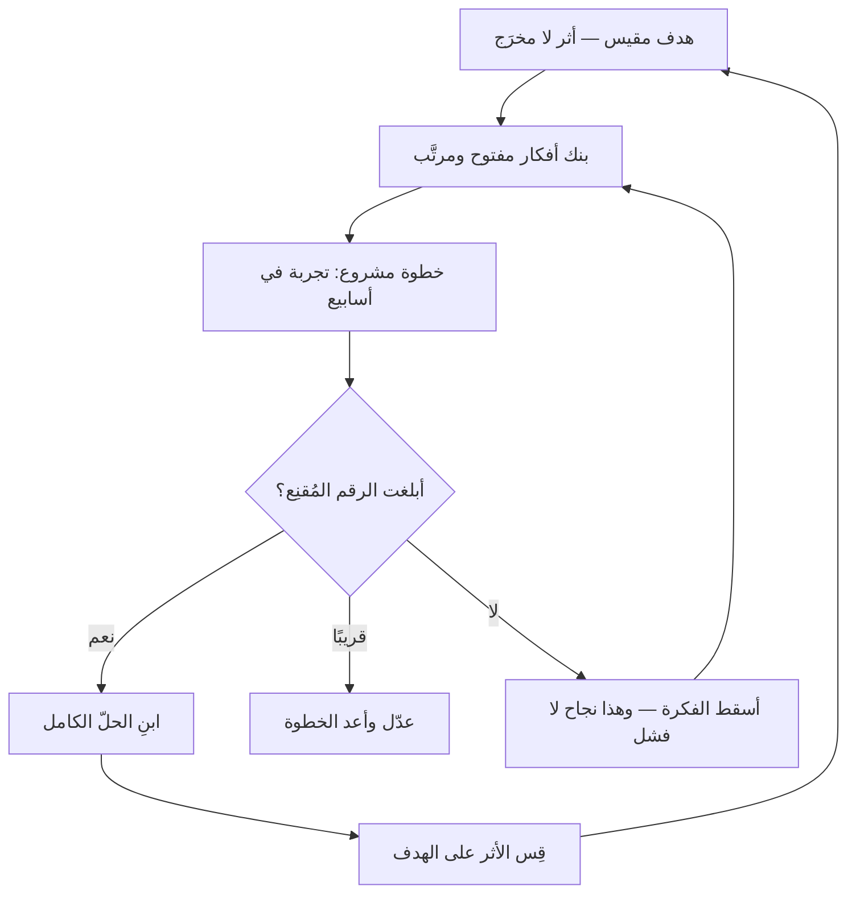

# التخطيط بأربع طبقات (GIST)

> [!info] تعريف مختصر
> **GIST** نموذج تخطيط للمنتج صاغه **إيتمار جيلاد (Itamar Gilad)**، يستبدل بخارطة الطريق ذات المواعيد أربعَ طبقات لكلٍّ منها إيقاع تغيّر خاصّ: **الأهداف (Goals)** — الأثر المطلوب، ويتغيّر سنويًّا أو ربعيًّا؛ **الأفكار (Ideas)** — الطرق المحتملة لبلوغه، وتتغيّر باستمرار؛ **خطوات المشاريع (Step-Projects)** — تجارب صغيرة تختبر الفكرة في أسابيع؛ **المهامّ (Tasks)** — تفاصيل التنفيذ، وتتغيّر يوميًّا. **والفكرة الحاكمة التي يقوم عليها كلّه:** أن خارطة الطريق التقليدية تفشل لأنها تُجمّد الطبقات الأربع عند إيقاع واحد — فتُلزمك بفكرةٍ اليوم بموعدٍ بعد ثمانية أشهر، وأنت لم تختبرها بعد.

## الشرح العلمي والاحترافي

### 1. الطبقات الأربع وإيقاعاتها

| الطبقة | تجيب عن | كم تعمّر؟ | من يملكها |
|---|---|---|---|
| **الأهداف** | أي أثر نريد أن نُحدثه؟ | سنة إلى ربع | القيادة ومالك المنتج |
| **الأفكار** | بأي الطرق قد نبلغه؟ | تتراكم وتُرتَّب باستمرار | الجميع — والعدد بالعشرات |
| **الخطوات** | ما أصغر ما يختبر هذه الفكرة؟ | أسابيع | الفريق |
| **المهامّ** | ماذا ننفّذ هذا الأسبوع؟ | أيام | الفريق |

**والعمود الثالث هو موضع الإضافة كلّه.** فالنموذج لا يخترع طبقات لم تكن؛ إنما يقول إن الطبقات الأربع كانت موجودة دائمًا وإنما كانت **تُدار بإيقاع واحد**، وأن ذلك مصدر أكثر آلام التخطيط.

### 2. لماذا تفشل خارطة الطريق ذات المواعيد؟

لأنها تحوّل الطبقة الثانية إلى التزام: تُكتب قائمة ميزات بمواعيد، فتصير **الأفكار وعودًا**. وثمن ذلك ثلاثة:

1. **يُقاس النجاح بالتسليم لا بالأثر** — فالميزة التي سُلّمت في موعدها ولم يستعملها أحد تُحسَب نجاحًا ([[Outcome vs Output|المخرَج والأثر]]).
2. **يصير التعلّم خسارةً** — فإن ظهر أن الفكرة لا تعمل، صار إسقاطها إخلافًا لوعد لا اكتشافًا نافعًا.
3. **تُغلَق قناة الأفكار** — فالخارطة الممتلئة إلى الربع الرابع لا موضع فيها لفكرةٍ أفضل تظهر في الثاني.

وعلاج GIST ليس إلغاء التخطيط بل **رفع الالتزام طبقةً واحدة**: يُلتزم بالهدف، وتبقى الأفكار مرشَّحة تُختبر وتُرتَّب.

### 3. «خطوة المشروع» هي القلب

الطبقة الثالثة أصعب الأربع تطبيقًا، لأنها تطلب ما لا تعوّده الفرق: أن تُقسَّم الفكرة الكبيرة إلى **تجارب تُنتج معرفةً** لا إلى أجزاء تُنتج مقدارًا من الميزة.

- **التقسيم المعتاد:** «نبني ثلث النظام هذا الربع.» — وهذا جزءٌ لا يُعلّمك شيئًا حتى يكتمل الثلاثة.
- **خطوة المشروع:** «نطرح النسخة اليدوية لمئة مستخدم أسبوعين، ونقيس كم منهم عاد.» — وهذه تُنتج جوابًا قابلًا للفعل قبل بناء الأكثر.

**والشرط فيها ثلاثة:** أن تكتمل في أسابيع لا أشهر، وأن يُكتب **قبلها** ما الذي سيُقاس وما الرقم الذي يُقنع، وأن يكون إسقاط الفكرة بعدها نتيجةً مقبولة لا فشلًا.

### 4. موضعه من جيرانه

يلتقي GIST مع أدوات قائمة في المستودع، ولا يُغني عنها ولا تُغني عنه:

- **[[OKR|الأهداف والنتائج الرئيسية]]** تسكن طبقة الأهداف وتصلح لها مباشرةً.
- **[[Now-Next-Later Roadmap|خارطة الآن والتالي واللاحق]]** تحلّ المشكلة نفسها بأداة أخرى: تُبقي الخارطة وتنزع منها المواعيد. وGIST يذهب أبعد فيفصل التجربة عن الفكرة.
- **[[Opportunity Solution Tree|شجرة الفرص والحلول]]** تُفصّل ما بين الهدف والفكرة: أي **الفرص** التي تربط بينهما، وهو ما يمرّ عليه GIST سريعًا.
- **[[Prioritization|ترتيب الأولويات]]** موضعه بنك الأفكار، و[[ICE Scoring]] هو الأداة التي يقترحها جيلاد له بعينه.

## أين ومتى يُستخدم

- في فرق المنتج التي تُطالَب بخارطة طريق سنوية وهي تعمل في مجال يتغيّر أسرع من ذلك.
- حين يكون العطل المتكرّر: «سلّمنا كل ما وعدنا به، ولم يتحرّك أي مؤشّر».
- عند بناء بنك أفكار مشترك يُرتَّب دوريًّا بدل قائمة ميزات مغلقة.
- في التخطيط الربعي، بأن يُلتزم بالأهداف وتُعرض الأفكار مرشّحةً لا موعودًا بها.
- عند تدريب فريق على تصميم التجارب: الطبقة الثالثة هي التمرين العملي على ذلك.

## مثال وسيناريو تطبيقي

> [!example] سيناريو ملموس
> منصّة تعليمية، وخارطة طريقها للربع تقول: **«إطلاق نظام الشارات والنقاط — يونيو.»**
>
> **بصيغة GIST:**
>
> - **الهدف:** رفع نسبة من يكمل المسار التعليمي من 21% إلى 30% خلال ربعين.
> - **الأفكار (تسع في البنك، مرتّبة):** الشارات والنقاط · تذكير أسبوعي بالبريد · تقسيم الدروس الطويلة · مجموعة دراسة · شهادة إتمام · إظهار تقدّم الزملاء · استئناف من آخر موضع · تبسيط الدرس الأوّل · مكالمة ترحيب.
> - **خطوة المشروع الأولى** (وليست الفكرة الأعلى ترتيبًا، بل الأرخص اختبارًا): تذكير أسبوعي يدويّ لثلاثمئة متعلّم أسبوعين. **وما سيُقاس:** فرق نسبة الإكمال. **وما يُقنع:** ثلاث نقاط مئوية.
> - **النتيجة:** ارتفعت النسبة 6 نقاط. فبُني التذكير آليًّا في أسبوعين.
> - **ثم خطوة ثانية:** نسخة يدوية بسيطة من الشارات لمئتين. **والنتيجة:** فرقٌ دون نقطة واحدة، وهو أقلّ من حدّ الإقناع.
>
> **فالفكرة التي كانت خارطة الطريق تعِد بها في يونيو أُسقطت في مارس بكلفة أسبوعين** بدل ربع كامل. ولاحظ أن الوعد لم يُخلَف: لم يكن الوعد بالشارات قطّ، بل برفع نسبة الإكمال — **وقد ارتفعت**.

## خطوات أو مخطّط

1. اكتب هدفًا واحدًا مقيسًا للربع أو الربعين، بأثرٍ لا بمخرَج.
2. افتح بنك أفكار مشتركًا لا يُغلق، ولا تلتزم بشيء منه.
3. رتّب الأفكار بمعيار معلن — والأرخص اختبارًا يسبق الأعلى قيمةً غالبًا.
4. صمّم لكل فكرة **خطوة مشروع** تكتمل في أسابيع، واكتب قبلها ما يُقاس وما الرقم المُقنِع.
5. نفّذ الخطوة، ثم قرّر: نمضي، أم نعدّل، أم نُسقط الفكرة.
6. لا تبنِ الحلّ الكامل إلا لفكرة اجتازت خطوتها.
7. راجع الطبقات بإيقاعاتها: الأهداف ربعيًّا، والأفكار أسبوعيًّا، والخطوات عند انتهاء كلٍّ منها.

## ⚠️ مفاهيم خاطئة شائعة

> [!warning]
> - **حسبانه إلغاءً للتخطيط.** بل هو تخطيط أشدّ انضباطًا: هدفٌ مقيس، وتجاربُ مصمَّمة، وحدُّ إقناعٍ يُكتب قبل النتيجة. والذي أُلغي هو **الوعد بميزة لم تُختبر**.
> - **الظنّ أن «الخطوة» جزءٌ من الميزة.** بل هي تجربة تُنتج معرفةً؛ وثلث النظام ليس خطوةً لأنه لا يجيب عن سؤال قبل اكتمال الثلاثة.
> - **الخلط بين الفكرة والهدف.** «إطلاق الشارات» فكرة، و«رفع نسبة الإكمال» هدف. وأشيع خلل في التخطيط أن تُكتب الأفكار في خانة الأهداف فتصير غاياتٍ لا وسائل.
> - **الظنّ أنه بديل عن [[OKR]].** بل يسكن OKR طبقته الأولى، والنموذج يصف ما تحتها.
> - **حسبان إسقاط الفكرة فشلًا.** فالإسقاط بعد تجربة رخيصة هو **الناتج المطلوب** في نصف الحالات؛ والفريق الذي لا يُسقط شيئًا لا يختبر شيئًا.

## ❌ ممارسات خاطئة في المشاريع

> [!failure]
> - **تسمية الميزات «أهدافًا»** ثم إعلان النجاح بتسليمها — وهي خارطة الطريق القديمة بمصطلحات جديدة.
> - **تصميم الخطوة بلا كتابة الرقم المُقنِع مسبقًا**، فيُقرأ أي ناتج تصديقًا للفكرة بعد التنفيذ.
> - **تحويل بنك الأفكار إلى مقبرة**: يُملأ ولا يُرتَّب ولا يُنقّى، فيصير عبئًا يتجنّبه الفريق.
> - **إبقاء الالتزام الخارجي بالميزات** بينما يُدار الداخل بـGIST، فيقع الفريق بين نظامين — والحلّ إعادة صياغة ما يُوعَد به الخارج أهدافًا، لا مسك الطرفين.
> - **إطالة خطوة المشروع حتى تصير مشروعًا**، فتفقد خاصّيتها الوحيدة: أن يكون إسقاطها رخيصًا.

## 🔗 مصطلحات ومفاهيم ذات صلة

[[OKR]] | [[Now-Next-Later Roadmap]] | [[Opportunity Solution Tree]] | [[Outcome vs Output]] | [[Prioritization]] | [[ICE Scoring]] | [[Hypothesis]] | [[MVP]] | [[Product Discovery]] | [[Assumption Mapping]] | [[Product Vision]] | [[Product Strategy]] | [[15 - Roadmap]] | [[22 - Outputs and Outcomes]]
