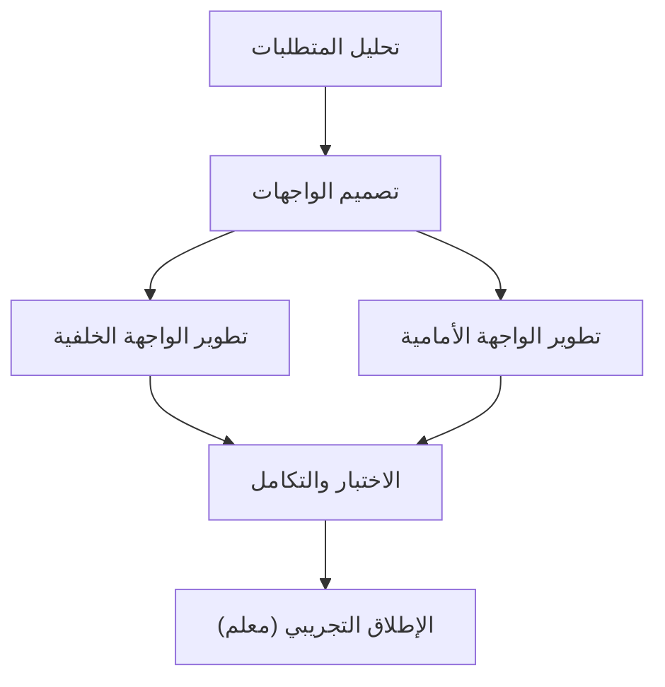

# مخطط جانت (Gantt Chart)
> [!info] تعريف مختصر
> مخطط جانت هو رسم بياني يُمثّل الجدول الزمني للمشروع، حيث تظهر المهام كأشرطة أفقية على محور الزمن، توضّح تاريخ بدء كل مهمة وانتهائها، وتُظهر الترابط بين المهام (Dependencies) وتقدّم العمل الفعلي.

## الشرح العلمي والاحترافي
- ابتكره هنري جانت (Henry Gantt) في مطلع القرن العشرين، وأصبح الأداة الأكثر شيوعًا لتصور الجداول الزمنية في إدارة المشاريع التقليدية.
- كل شريط أفقي يمثل مهمة واحدة؛ طول الشريط يعكس مدتها الزمنية، وموقعه على المحور الأفقي يعكس تاريخ البداية والنهاية.
- تُرسم الأسهم بين الأشرطة لتوضيح الاعتماديات ([[Dependency]])، مثل "لا يمكن بدء مهمة ب قبل انتهاء مهمة أ" (Finish-to-Start).
- يُستخدم مخطط جانت لتحديد المسار الحرج ([[Critical Path]])، أي سلسلة المهام التي يؤدي أي تأخير فيها إلى تأخير المشروع بأكمله.
- تُظهر بعض النسخ الحديثة من المخطط "المعالم" ([[Milestone]]) كنقاط ماسية على الخط الزمني، ونسبة الإنجاز داخل كل شريط.
- يختلف عن مخططات أخرى مثل مخطط الاحتراق ([[17 - Burndown Chart]]) الذي يقيس العمل المتبقي وليس الجدول الزمني بالتفصيل.

## أين ومتى يُستخدم
- يُستخدم بكثافة في منهجية الشلال ([[04 - Waterfall]]) والمشاريع الهندسية والإنشائية التي تتطلب تخطيطًا تفصيليًا مسبقًا لكل مهمة.
- مفيد أيضًا كأداة "عرض تنفيذي" (Executive View) حتى في المشاريع الرشيقة، لتوضيح الجدول الزمني العام والمعالم الرئيسية لأصحاب المصلحة الذين لا يتابعون تفاصيل السبرنتات.
- يُستخدم في مرحلة التخطيط لبناء الجدول الزمني الأولي، ثم يُحدَّث دوريًا أثناء التنفيذ لمقارنة التقدم الفعلي بالمخطط.
- أدوات مثل Microsoft Project وJira (بإضافات) وTrello وAsana توفر إمكانية إنشاء مخططات جانت تلقائيًا من قائمة المهام.

## مثال وسيناريو تطبيقي
> [!example] في مشروع بناء موقع تجارة إلكترونية لشركة "متجري"، أنشأ مدير المشروع مخطط جانت يبدأ في 1 أغسطس وينتهي في 30 نوفمبر. تضمّن المخطط: "تحليل المتطلبات" (أسبوعان، 1-14 أغسطس)، "تصميم واجهات المستخدم" (3 أسابيع، تبدأ بعد انتهاء التحليل)، "تطوير الواجهة الخلفية" و"تطوير الواجهة الأمامية" (يعملان بالتوازي لمدة 6 أسابيع)، ثم "الاختبار والتكامل" (أسبوعان)، وأخيرًا معلم "الإطلاق التجريبي" في 25 نوفمبر. عندما تأخر تصميم واجهات المستخدم أسبوعًا بسبب تعديلات العميل، أظهر مخطط جانت فورًا أن هذا التأخير سيؤثر على تاريخ الإطلاق لأن التصميم يقع على المسار الحرج، فقرر مدير المشروع تشغيل مهمتي التطوير الأمامي والخلفي بشكل متداخل جزئيًا لتعويض الفارق.

## خطوات أو مخطّط
1. حصر جميع مهام المشروع من هيكل تجزئة العمل (WBS).
2. تقدير مدة كل مهمة والموارد اللازمة لها.
3. تحديد الاعتماديات بين المهام ([[Dependency]]).
4. ترتيب المهام على المحور الزمني وتحديد تواريخ البدء والانتهاء.
5. تحديد المسار الحرج ([[Critical Path]]) والمعالم الرئيسية ([[Milestone]]).
6. تحديث المخطط دوريًا لعكس نسبة الإنجاز الفعلية ومقارنتها بالخطة.

## ⚠️ مفاهيم خاطئة شائعة
> [!warning]
> - الاعتقاد أن مخطط جانت أداة مخصصة فقط لمنهجية الشلال؛ يمكن استخدامه أيضًا كعرض تكميلي في المشاريع الرشيقة لتوضيح الصورة العامة.
> - الظن بأن رسم المخطط مرة واحدة كافٍ؛ في الواقع يجب تحديثه باستمرار وإلا يفقد قيمته كأداة متابعة.
> - الخلط بين طول الشريط (المدة الزمنية) وكمية الجهد الفعلي (Effort)؛ مهمة طويلة زمنيًا قد تتطلب جهدًا قليلًا إذا كانت متقطعة.

## ❌ ممارسات خاطئة في المشاريع
> [!failure]
> - بناء مخطط جانت مفصّل جدًا (مئات المهام الصغيرة) في بداية مشروع غير مؤكد المتطلبات، مما يجعله عديم الفائدة عند أول تغيير. **الحل:** البدء بمستوى تفصيل متوسط وتفصيل المراحل القريبة فقط.
> - عدم تحديد المسار الحرج، فيُهدر الفريق وقتًا في تسريع مهام لا تؤثر على تاريخ التسليم النهائي. **الحل:** تحديد المسار الحرج ([[Critical Path]]) صراحة والتركيز على إدارته.
> - تجاهل تحديث المخطط بعد حدوث تأخيرات فعلية، فيستمر الجميع بالعمل على جدول قديم غير واقعي. **الحل:** جعل تحديث المخطط جزءًا من التقرير الأسبوعي الدوري.

## 🔗 مصطلحات ومفاهيم ذات صلة
[[Critical Path]] | [[Dependency]] | [[Milestone]] | [[Baseline]] | [[17 - Burndown Chart]] | [[04 - Waterfall]] | [[Control Chart]]
