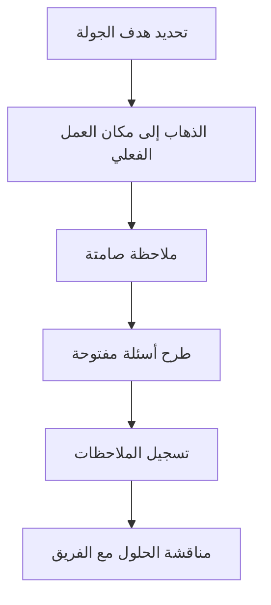

# جولة جيمبا (Gemba Walk)

> [!info] تعريف مختصر
> جولة جيمبا هي ممارسة إدارية مصدرها الفكر الرشيق (Lean) يذهب فيها القائد أو المدير فعلياً إلى "مكان حدوث العمل" (Gemba تعني بالياباني "المكان الحقيقي") لمراقبة العملية عن قرب، بدلاً من الاكتفاء بالتقارير والاجتماعات.

## الشرح العلمي والاحترافي
- الفكرة الجوهرية: أفضل طريقة لفهم مشكلة هي رؤيتها حيث تحدث فعلاً، لا قراءتها في تقرير ملخّص قد يخفي التفاصيل المهمة.
- في بيئة المصانع، يعني هذا الذهاب إلى خط الإنتاج. في تطوير البرمجيات، يعني حضور الاجتماع اليومي (راجع [[07 - Daily Standup]])، مراقبة لوحة كانبان الفعلية، أو الجلوس مع فريق الدعم الفني أثناء تعامله مع تذاكر العملاء.
- الهدف ليس التفتيش أو المحاسبة، بل الفهم والدعم: اكتشاف العقبات الحقيقية (راجع [[Blocker]]، [[Bottleneck]]) التي لا تظهر في التقارير، وطرح أسئلة مثل "ما الذي يعيقك؟" بدلاً من إصدار الأوامر.
- ترتبط جولة جيمبا بمبدأ "القيادة على مستوى كل فرد" (راجع [[Leadership at Every Level]]) و"الشفافية الجذرية" (راجع [[Radical Transparency]])، لأنها تتطلب من القائد الظهور دون سلطة تهديدية، بل بروح الفضول والدعم.
- تُستخدم غالباً بالتزامن مع أدوات تحسين أخرى مثل 5S (راجع [[5S]]) وتحليل الجذر السببي (راجع [[Root Cause Analysis]]).

## أين ومتى يُستخدم
- يستخدمها مديرو المشاريع، القادة التقنيون (Tech Leads)، ومديرو المنتجات بشكل دوري (أسبوعي أو شهري) لفهم واقع العمل.
- مفيدة بشكل خاص عند وجود إشارات على وجود مشكلة (تأخر متكرر، شكاوى عملاء) دون وضوح السبب الجذري.
- تُستخدم أيضاً عند انضمام قائد جديد لفريق أو مشروع، كوسيلة لبناء فهم مباشر بدلاً من الاعتماد فقط على التقارير المكتوبة.

## مثال وسيناريو تطبيقي
> [!example] مديرة المنتج ليلى في شركة "دِلتا سوفت" تلاحظ أن زمن الاستجابة لتذاكر الدعم الفني (راجع [[Lead Time]]) ارتفع من يومين إلى خمسة أيام، دون أن توضح التقارير السبب.
> بدلاً من طلب تقرير إضافي، تقضي ليلى صباح الثلاثاء جالسةً فعلياً مع فريق الدعم الفني، تراقب كيف يستقبلون التذاكر، وتسألهم مباشرة عن أكبر عائق يواجهونه.
> تكتشف أن الفريق يضطر يومياً للانتظار من فريق التطوير للحصول على معلومات تقنية عن أخطاء معقدة، وأن قناة التواصل بينهما غير رسمية وبطيئة.
> بناءً على هذه الملاحظة المباشرة، تنشئ ليلى قناة تواصل مباشرة (Slack channel) بين الفريقين مع نقطة اتصال واحدة (راجع [[SPOC]])، فينخفض زمن الاستجابة إلى يومين خلال أسبوعين.

## خطوات أو مخطّط
1. حدّد الهدف من الجولة (فهم عملية معينة، أو التحقق من مشكلة مُبلَّغ عنها).
2. اذهب فعلياً إلى مكان العمل (اجتماع الفريق، لوحة المهام، غرفة الدعم الفني).
3. راقب بصمت أولاً، دون إصدار أحكام أو أوامر فورية.
4. اطرح أسئلة مفتوحة على الفريق: "ما الذي يعيقكم؟ ما الذي تتمنون تغييره؟"
5. سجّل الملاحظات، ثم ناقشها مع الفريق لاحقاً واقترحوا حلولاً معاً.
6. تابع الأثر في الجولة التالية.

## ⚠️ مفاهيم خاطئة شائعة
> [!warning]
> - الاعتقاد أن جولة جيمبا هي "تفتيش" لمحاسبة الموظفين على الأخطاء؛ في الحقيقة هدفها الفهم والدعم لا العقاب.
> - الظن أنها مجرد "زيارة اجتماعية" بلا هدف؛ يجب أن تكون مركّزة على فهم عملية أو مشكلة محددة.
> - الاكتفاء بجولة واحدة واعتبارها كافية؛ قيمتها الحقيقية تأتي من التكرار المنتظم الذي يبني فهماً تراكمياً وثقة مع الفريق.

## ❌ ممارسات خاطئة في المشاريع
> [!failure]
> - دخول القائد بموقف انتقادي وإصدار أوامر فورية أثناء الجولة، مما يجعل الفريق دفاعياً ويخفي المشكلات الحقيقية مستقبلاً. الحل: الاستماع أولاً، والتعليق أو التصحيح لاحقاً وبشكل بنّاء.
> - إجراء الجولة دون سؤال الفريق عن العقبات، والاكتفاء بالملاحظة البصرية فقط، مما يفوّت معلومات مهمة. الحل: الجمع بين الملاحظة والحوار المباشر.
> - عدم متابعة الملاحظات المُسجَّلة بأي إجراء فعلي، فيفقد الفريق الثقة بجدوى الجولات. الحل: تحويل كل ملاحظة مهمة إلى إجراء تحسين ملموس ومُتابَع.

## 🔗 مصطلحات ومفاهيم ذات صلة
[[Bottleneck]] | [[Blocker]] | [[Root Cause Analysis]] | [[5S]] | [[Kaizen]] | [[Leadership at Every Level]] | [[Radical Transparency]] | [[Value Stream Mapping]] | [[07 - Daily Standup]]
