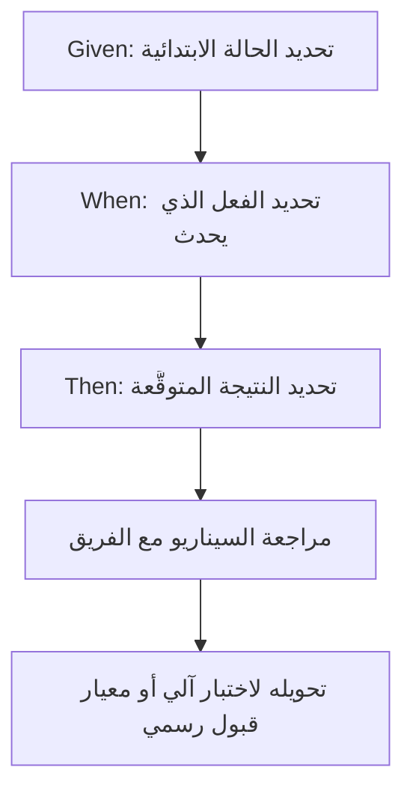

# صيغة إذا عندما فإن (Given When Then)
> [!info] تعريف مختصر
> صيغة "إذا عندما فإن" (Given When Then) هي أسلوب كتابة موحّد لمعايير القبول (Acceptance Criteria) وحالات الاختبار، يقسّم السيناريو إلى ثلاثة أجزاء واضحة: الحالة الابتدائية (Given)، الفعل الذي يحدث (When)، والنتيجة المتوقَّعة (Then).

## الشرح العلمي والاحترافي
- هذه الصيغة جزء أساسي من منهجية التطوير الموجَّه بالسلوك (Behavior-Driven Development واختصاراً BDD)، وهي امتداد للتطوير الموجَّه بالاختبار (Test-Driven Development).
- الفكرة الأساسية: كتابة السيناريوهات بلغة طبيعية مفهومة لغير المبرمجين (صاحب المنتج، العميل، فريق الجودة) مع بقائها دقيقة بما يكفي لتحويلها لاختبار آلي (Automated Test).
- البنية الثابتة:
  - **Given (إذا)**: يصف الحالة أو السياق الابتدائي قبل وقوع الحدث.
  - **When (عندما)**: يصف الفعل أو الإجراء الذي يقوم به المستخدم أو النظام.
  - **Then (فإن)**: يصف النتيجة المتوقَّعة بعد وقوع الفعل.
- تُكتب هذه الصيغة غالباً بلغة Gherkin، وهي لغة نصية بسيطة تُستخدم مع أدوات أتمتة مثل Cucumber أو SpecFlow لتحويل الجملة مباشرة إلى كود اختبار قابل للتنفيذ.
- تُقلّل هذه الصيغة الغموض في تعريف الجاهزية ([[Definition of Ready]]) وتعريف الاكتمال ([[Definition of Done]])؛ فبدلاً من وصف مبهم مثل "يجب أن يعمل تسجيل الدخول بشكل صحيح"، تصبح الجملة سيناريو محدداً وقابلاً للاختبار مباشرة.
- تساعد على كتابة معايير قبول متوافقة مع معايير INVEST ([[INVEST Criteria]])، خصوصاً معيار "قابل للاختبار" (Testable).

## أين ومتى يُستخدم
- يُستخدم عند كتابة قصص المستخدم ([[11 - User Stories]]) وتحديد معايير القبول الخاصة بها، غالباً أثناء تنقيح المتراكم ([[Backlog Refinement]]).
- يُستخدم في اختبار قبول المستخدم ([[UAT]]) لصياغة سيناريوهات واضحة يوقّع عليها العميل قبل تسليم الميزة.
- يُفيد فرق ضمان الجودة ([[Quality Assurance]]) في كتابة حالات اختبار الانحدار ([[Regression Testing]]) بشكل منظم وقابل للتكرار.
- يُستخدم في مشاريع أجايل ([[01 - Agile]]) وسكرَم ([[02 - Scrum]]) أثناء اجتماع تخطيط السبرنت ([[08 - Sprint Planning]]) لضمان فهم مشترك للمتطلبات قبل البدء بالتنفيذ.

## مثال وسيناريو تطبيقي
> [!example] سيناريو
> فريق يطوّر ميزة "سلة التسوق" في متجر إلكتروني. كتب صاحب المنتج قصة مستخدم: "كمستخدم، أريد حذف منتج من السلة، لكي أعدّل طلبي قبل الدفع."
> بدلاً من ترك المعيار غامضاً، كتب الفريق معيار القبول بصيغة Given/When/Then:
> - **Given**: المستخدم مسجّل دخول، والسلة تحتوي على منتجين.
> - **When**: يضغط المستخدم على زر "حذف" بجانب أحد المنتجين.
> - **Then**: يُحذف المنتج من السلة فوراً، ويتحدّث الإجمالي (Total) تلقائياً ليعكس المنتج المتبقي فقط.
> هذا السيناريو كان واضحاً بما يكفي ليكتب مطوّر اختبار آلي (Automated Test) مباشرة، ولصاحب المنتج التحقق منه بصرياً دون الحاجة لقراءة الكود.

## خطوات أو مخطّط
1. تحديد الحالة الابتدائية: ما هو السياق أو الشرط الموجود قبل الحدث (Given).
2. تحديد الفعل: ما الإجراء الذي يقوم به المستخدم أو النظام (When).
3. تحديد النتيجة: ما الذي يجب أن يحدث بعد الفعل مباشرة (Then).
4. مراجعة الجملة مع الفريق والتأكد أنها قابلة للاختبار والقياس بشكل موضوعي.
5. تحويل السيناريو، إذا لزم، إلى اختبار آلي باستخدام أداة مثل Cucumber.

## ⚠️ مفاهيم خاطئة شائعة
> [!warning]
> - الاعتقاد أن هذه الصيغة مخصصة فقط للمبرمجين؛ في الحقيقة صُممت خصيصاً لتكون مفهومة لصاحب المنتج والعميل أيضاً.
> - كتابة أكثر من فعل واحد في جزء "When"، مما يجعل السيناريو مركّباً وصعب الاختبار؛ يجب أن يصف كل سيناريو حدثاً واحداً بوضوح.
> - الخلط بين هذه الصيغة وتعريف الاكتمال ([[Definition of Done]])؛ الصيغة تصف سيناريو محدداً لميزة واحدة، بينما تعريف الاكتمال معيار عام ينطبق على كل المهام في الفريق.

## ❌ ممارسات خاطئة في المشاريع
> [!failure]
> - كتابة سيناريوهات غامضة مثل "Then يعمل النظام بشكل جيد" دون تحديد نتيجة قابلة للقياس. التجنب: كتابة نتيجة محددة وقابلة للتحقق منها فعلياً مثل رقم أو حالة واضحة.
> - كتابة عدد كبير جداً من السيناريوهات المتشابهة دون تغطية الحالات الحدّية ([[Edge Cases]])؛ مما يترك ثغرات حقيقية في الاختبار. التجنب: مراجعة الحالات الحدّية بشكل منفصل عند صياغة السيناريوهات.
> - ترك صياغة السيناريو للمطوّر فقط دون مشاركة صاحب المنتج أو العميل. التجنب: صياغة السيناريوهات في جلسة مشتركة بين صاحب المنتج والفريق التقني لضمان فهم موحّد.

## 🔗 مصطلحات ومفاهيم ذات صلة
[[11 - User Stories]] | [[Definition of Ready]] | [[Definition of Done]] | [[INVEST Criteria]] | [[UAT]] | [[Edge Cases]] | [[Regression Testing]] | [[Quality Assurance]] | [[Backlog Refinement]] | [[Software Requirements Specification]]
