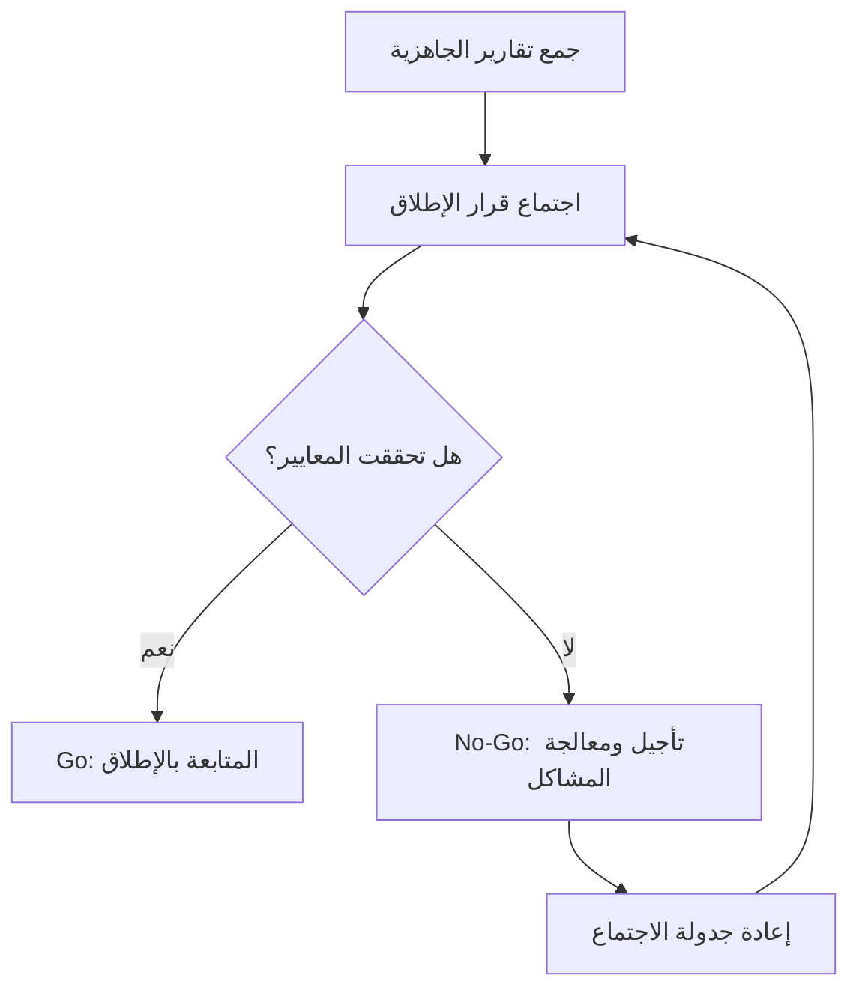

# قرار الإطلاق (Go or No-Go Decision)
> [!info] تعريف مختصر
> قرار الإطلاق هو نقطة قرار رسمية يجتمع فيها أصحاب الشأن (stakeholders) لتحديد ما إذا كان المشروع أو الإصدار (release) جاهزًا للانتقال إلى الخطوة التالية، مثل الإطلاق الفعلي أو النشر (deployment)، أم يجب تأجيله.

## الشرح العلمي والاحترافي
- قرار الإطلاق هو بوابة (gate) تُتخذ فيها الخلاصة النهائية: "Go" بمعنى المتابعة والإطلاق، أو "No-Go" بمعنى التوقف أو التأجيل حتى معالجة المشاكل.
- يُبنى القرار على معايير محددة مسبقًا (readiness criteria) مثل: نتائج الاختبار (UAT، Smoke Testing)، حالة العيوب الحرجة، جاهزية البنية التحتية، خطة الرجوع (rollback plan)، وموافقة أصحاب الشأن.
- الهدف من هذا القرار هو تقليل المخاطر عبر جعل الإطلاق فعلًا واعيًا مبنيًا على أدلة، لا مجرد اتباع الجدول الزمني بشكل أعمى.
- يشارك فيه عادة: مدير المشروع، فريق الجودة (QA)، فريق العمليات (Ops)، مالك المنتج (Product Owner)، وأحيانًا ممثل عن العميل.
- يُوثَّق القرار وأسبابه دائمًا، حتى يكون هناك سجل واضح لمن اتخذ القرار ولماذا، خصوصًا في حال "No-Go".

## أين ومتى يُستخدم
- يُستخدم في منهجية الشلال (Waterfall) قبل الانتقال من مرحلة إلى أخرى، وفي المشاريع الرشيقة (Agile) قبل إطلاق إصدار كبير (major release) أو قبل الانتقال إلى بيئة الإنتاج (Staging vs Production Environment).
- شائع جدًا في المشاريع التي تتضمن مخاطر عالية: تطبيقات مالية، أنظمة صحية، أو أي نظام حيث يكون التراجع عن الإطلاق مكلفًا.
- يُستخدم أيضًا في المشاريع غير التقنية: إطلاق منتج، حدث تسويقي، أو ترحيل بيانات (data migration).

## مثال وسيناريو تطبيقي
> [!example]
> شركة "نُظم" تستعد لإطلاق تحديث كبير لتطبيق بنكي. قبل يومين من الموعد المحدد، يعقد مدير المشروع اجتماع Go/No-Go مع فريق QA وفريق الأمن والعمليات.
> يعرض فريق QA أن اختبارات القبول (UAT) نجحت بنسبة 98%، لكن يبقى عيب واحد "متوسط الخطورة" في شاشة التحويلات الدولية.
> فريق الأمن يؤكد جاهزية الشهادات الرقمية. فريق العمليات يؤكد جاهزية خطة الرجوع (rollback) خلال 15 دقيقة عند الفشل.
> بعد النقاش، يقرر الفريق "No-Go" لأن العيب يمس ميزة حساسة ماليًا، ويُعاد جدولة الإطلاق بعد 3 أيام لإصلاحه واختباره.

## خطوات أو مخطّط
1. تحديد معايير الجاهزية (readiness criteria) مسبقًا قبل موعد الإطلاق بوقت كافٍ.
2. جمع الأدلة والتقارير: نتائج الاختبار، حالة العيوب، جاهزية البنية التحتية.
3. عقد اجتماع Go/No-Go يضم أصحاب الشأن الرئيسيين.
4. مراجعة كل معيار ومقارنته بالحد المطلوب.
5. اتخاذ القرار: Go (متابعة) أو No-Go (تأجيل).
6. توثيق القرار وأسبابه والخطوات التالية.

## ⚠️ مفاهيم خاطئة شائعة
> [!warning]
> - الاعتقاد أن قرار الإطلاق مجرد إجراء شكلي يُوقَّع تلقائيًا؛ في الحقيقة يجب أن يكون قرارًا مبنيًا على بيانات فعلية.
> - الخلط بين "Go/No-Go" وموافقة نهاية المشروع (Sign-off)؛ الأول يخص جاهزية الإطلاق، والثاني يخص قبول التسليم النهائي.
> - الاعتقاد أن "No-Go" فشل شخصي لأحد الفرق؛ في الواقع هو نجاح لعملية إدارة المخاطر لأنه يمنع مشاكل أكبر.

## ❌ ممارسات خاطئة في المشاريع
> [!failure]
> - تحديد معايير الجاهزية بعد الاجتماع لا قبله، مما يجعل القرار عشوائيًا وعاطفيًا. الحل: تحديد المعايير كتابيًا قبل الاجتماع بأسبوع على الأقل.
> - عقد الاجتماع بدون الأشخاص المخوَّلين باتخاذ القرار، فيتحول إلى نقاش بلا نتيجة. الحل: التأكد من حضور أصحاب القرار الفعليين.
> - تجاهل "No-Go" والإطلاق تحت ضغط الجدول الزمني رغم وجود مخاطر معروفة. الحل: التمسك بالمعايير الموضوعية بغض النظر عن الضغط الزمني.

---

## 📄 التطبيق في مشاريع الأنظمة المؤسسية (ERP)

> [!info] عن هذا القسم
> ما سبق هو الإطار العامّ للقرار في إدارة المشاريع. وما يلي إضافة من منهجية [[نظام تشغيل التسليم\|قيادة التسليم]] لمشاريع `ERP`، حيث يتحوّل القرار من بوّابة واحدة إلى **نظام بوّابات** بأربعة قرارات لا اثنين.

### الجملة المؤسِّسة
> **`Go-Live Date` ≠ `Go-Live Readiness`. التاريخ للتخطيط، والقرار للجاهزية.**

### مجالات الجاهزية السبعة

| المجال | سؤال الجاهزية |
|---|---|
| `Business Ready` | هل العمليات معتمدة؟ |
| `Users Ready` | هل المستخدمون مدرَّبون؟ |
| `System Ready` | هل النظام مستقرّ وبلا أخطاء حرجة؟ |
| `Data Ready` | هل البيانات صحيحة ومعتمدة؟ |
| `UAT Ready` | هل نسبة النجاح مقبولة؟ |
| `Support Ready` | هل فريق [[Hypercare\|الرعاية المكثّفة]] جاهز؟ |
| `Rollback Ready` | هل توجد خطة طوارئ **مُختبَرة**؟ |

### البوّابات بجدول عكسي

| البوّابة | التوقيت | الهدف |
|---|---|---|
| `Design Freeze` | **T-60** | منع تغييرات كبيرة |
| `Data Readiness` | **T-30** | بلوغ 80% جاهزية بيانات |
| `UAT Readiness` | **T-14** | بلوغ 85% نجاح اختبار |
| `Go-Live Readiness` | **T-7** | الجاهزية النهائية |
| `War Room` | **T-3** | إدارة مكثّفة |

> [!tip] لماذا عكسي؟
> لأن التاريخ ثابت والجاهزية متغيّرة. الجدول التقدّمي («نبدأ الاختبار في الأسبوع العاشر») يقبل الانزلاق؛ أمّا العكسي فيقول: **«باقٍ 30 يوماً، والبيانات يجب أن تبلغ 80% اليوم»** — فيحوّل كل تأخير إلى إنذار فوري.

### القرار الرباعي لا الثنائي

| القرار | متى؟ |
|---|---|
| **`Go`** | كل الجاهزية محقّقة |
| **`No-Go`** | يوجد خطر يمنع التشغيل |
| **`Conditional Go`** | جاهزية مقبولة **مع شروط مكتوبة قابلة للقياس** |
| **`Controlled Go-Live`** | تاريخ ثابت وضغط قيادي ⇒ لا نلغي القرار بل نستخدمه لتحديد **مستوى** الجاهزية |

> [!important] `Conditional Go` قرار مكتمل لا تهرّب
> ليس وسطاً مائعاً بين نعم ولا، بل قرار بأركان أربعة: **شروط مسمّاة + مالك + مدّة مراقبة + معيار خروج**.
> **الاختبار العملي:** إن لم تستطع كتابة الشرط في سطر قابل للقياس («إغلاق ثلاثة أخطاء كبرى أو توفير حلّ التفافي موثّق»)، فأنت لا تقرّر `Conditional Go` — بل **تُطلق وتتمنّى**.

### `Readiness Race` — حين لا يتغيّر التاريخ ولا النطاق

أصعب موقف يواجه قائد التسليم. والمخرج ليس «مستحيل» ولا «حاضر»، بل نقل التحكّم إلى المتغيّر الثالث:

> **«التاريخ محفوظ والنطاق محفوظ؛ إذاً نتحكّم في الجاهزية — وهذا ما نحتاجه منكم لرفعها.»**

وأدواته: بوّابات مبكّرة · `War Room` · تصعيد يومي · محاكاة إنتاج · [[Data Dry Run]] · رعاية مكثّفة قوية · خطة طوارئ.
> **نحن لا نضمن عدم ظهور مشاكل — لكن نضمن أننا جاهزون للتعامل معها.**

### البيانات هي الخطر الأول

> [!warning] **نحو 70% من مشاكل الإطلاق في مشاريع `ERP` مصدرها البيانات لا الكود.**
> ولهذا [[Data Dry Run|التجربة الجافّة للبيانات]] شرط جاهزية لا نشاط اختياري، وتُنفَّذ **مرّتين على الأقلّ**: الأولى تكشف، والثانية تُثبت أن التنظيف نجح.

### من يملك القرار؟

في [[RACI|مصفوفة المسؤوليات]] لمشاريع `ERP` ينقلب الوضع في صفّ الإطلاق وحده: **المورّد `Responsible` (ينفّذ) والعميل `Accountable` (يُحاسَب)**. لأن قرار الإطلاق يخصّ **من يتحمّل نتيجته على التشغيل** — لا من يُعِدّه.

> [!tip] `Critical Bugs = 0` لا تعني «صفر أخطاء»
> بل **صفر أخطاء مانعة للتشغيل**. والفرق مهنيّ لا تساهلي — وهو ما يجعل `Conditional Go` قراراً مشروعاً في حضور أخطاء «كبرى» غير حرجة.

## 🔗 مصطلحات ومفاهيم ذات صلة
[[Sign-off]] | [[UAT]] | [[Smoke Testing]] | [[Risk Register]] | [[RAG Status]] | [[Staging vs Production Environment]] | [[Pilot Launch]] | [[19 - Risk Management]] | [[Data Dry Run]] | [[Rollback]] | [[Hypercare]] | [[Early Warning Dashboard]] | [[Project Health Report]] | [[Criticality]] | [[RACI]] | [[22 - Go-Live Checklist & Go NoGo]]
