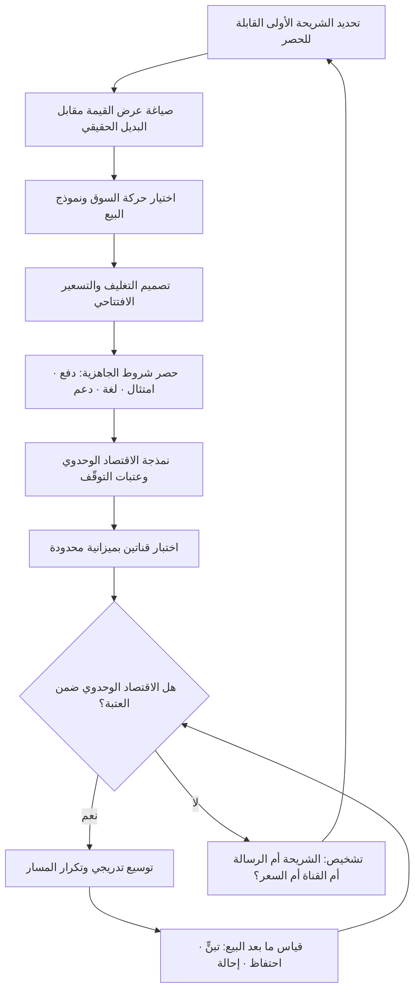

# خطّة الوصول إلى السوق (Go-to-Market)

> [!info] تعريف مختصر
> الخطّة التي تجيب عن سؤال: كيف يصل هذا المنتج إلى هذا العميل تحديدًا، بأي رسالة، عبر أي قناة، بأي سعر، بأي تسلسل زمني، وبأي أدوار داخلية؟ هي ليست خطّة تسويق ولا حملة إطلاق، بل **تصميم لمسار كامل** يبدأ من تعريف الشريحة المستهدفة وينتهي عند تحقّق قيمة فعلية عند العميل وتكرار الشراء. جوهرها قرارات مترابطة لا يمكن اتّخاذ أحدها بمعزل عن الباقي: تغيير القناة يغيّر الكلفة المقبولة لاكتساب العميل، وتغيير السعر يغيّر القناة الممكنة، وتغيير الشريحة يغيّر الرسالة والمنتج نفسه. وحين تفشل خطط الوصول إلى السوق فغالبًا لا يكون السبب ضعف المنتج، بل **عدم اتّساق داخلي** بين هذه القرارات.

## الشرح العلمي والاحترافي
- **الفرق بين الخطّة والحملة**: الحملة حدث مؤقّت له ميزانية وتاريخ انتهاء؛ خطّة الوصول إلى السوق نظام تشغيلي مستمرّ يشمل التسعير والتغليف والقنوات والشراكات وتمكين المبيعات والدعم والتأهيل (Onboarding) وحلقة التغذية الراجعة. الحملة أداة داخل الخطّة، وليست بديلًا عنها. الشركات التي تختزل الأمر في «إطلاق» تنتهي بذروة اهتمام قصيرة يتلوها هبوط، لأن لا شيء بعد الذروة كان مصمَّمًا.
- **العناصر البنيوية**: تُفكَّك الخطّة عادةً إلى (١) الشريحة المستهدفة وتعريف العميل المثالي، (٢) عرض القيمة والرسالة المفارِقة عن البدائل، (٣) نموذج التغليف والتسعير، (٤) القنوات ومسار الوصول، (٥) نموذج البيع وأدوار الفريق، (٦) الشراكات والوسطاء، (٧) الدعم والنجاح بعد البيع، (٨) المقاييس ومعايير الاستمرار أو التوقّف. غياب أي عنصر يظهر لاحقًا كعطل في عنصر آخر: ضعف التأهيل يظهر كـ«مشكلة تسويق» في صورة معدّل ارتداد مرتفع.
- **حركة السوق (Motion) تحدّد بنية الفريق**: هناك حركات متمايزة — البيع القائم على المنتج (Product-Led) حيث يجرّب المستخدم بنفسه ويُقنعه المنتج، والبيع القائم على المبيعات (Sales-Led) حيث تقود صفقة بشرية دورة طويلة، والبيع القائم على التسويق أو المجتمع أو الشركاء. لكل حركة اقتصادها الخاص: حركة قائمة على المنتج لا تحتمل فريق مبيعات ميدانيًّا مكلفًا لعقد صغير، وحركة مؤسّسية لا تنجح بتسجيل ذاتي بلا تفاوض. **اختيار الحركة قبل بناء الفريق** لا العكس.
- **الاقتصاد الوحدوي هو الحَكَم**: التوازن بين كلفة اكتساب العميل (Customer Acquisition Cost) والقيمة المتحقّقة من العميل عبر عمره (Lifetime Value) هو ما يفصل بين خطّة قابلة للتوسيع وأخرى تحرق المال. ويُضاف إليه **زمن استرداد الكلفة (Payback Period)** الذي يحدّد حاجة الشركة إلى السيولة. خطّة تبدو رابحة على المدى الطويل قد تقتل الشركة إن كان استرداد الكلفة يستغرق أطول من قدرتها على التمويل.
- **التسعير الافتتاحي قرار استراتيجي لا رقم**: هناك مقاربتان كلاسيكيتان متعارضتان — **الاختراق (Penetration)** بسعر منخفض لاكتساب حصّة سريعة والاعتماد على التوسّع لاحقًا، و**القشط (Skimming)** بسعر مرتفع يستهدف الشريحة الأقل حساسية للسعر أولًا ثم النزول تدريجيًّا. القرار ليس ماليًّا فقط: السعر إشارة تموضع، ورفعه لاحقًا أصعب بكثير من خفضه، ولا سيما مع العملاء الأوائل الذين يعتبرون سعرهم حقًّا مكتسبًا.
- **التسلسل (Sequencing) أهم مما يبدو**: خطّة الوصول ليست قائمة مهام متوازية بل ترتيبًا مقصودًا. البدء بشريحة ضيّقة جدًّا يمكن الفوز فيها بوضوح، ثم التوسّع إلى شرائح مجاورة، يقلّل تشتّت الرسالة ويرفع كثافة المرجعية (عملاء يوصون بعضهم لأنهم يشبهون بعضهم). التوسّع المبكر على كل الشرائح يبدّد الميزانية ويجعل كل رسالة ضعيفة.
- **جهوزية الأركان الداخلية**: كثير من الخطط تنهار لأن الأجزاء غير التسويقية لم تكن جاهزة: الفوترة لا تدعم طريقة الدفع المحلّية، الدعم لا يغطّي التوقيت المحلّي، الوثائق غير مترجمة ([[Translation Memory]])، الامتثال غير مكتمل ([[PDPL]] أو [[KYC]] في القطاعات المنظَّمة). هذه ليست تفاصيل تنفيذية متأخّرة بل قيود تحدّد تاريخ الإطلاق الممكن أصلًا.
- **الخطّة كفرضية قابلة للإبطال**: في بيئة جديدة، أفضل ما تُعامَل به الخطّة أنها مجموعة رهانات مكتوبة مع معايير مسبقة للحكم عليها. تحديد «ما الذي سيجعلنا نوقف هذه القناة؟» قبل الإنفاق عليها يمنع الاستمرار العاطفي في قناة ميتة، ويحوّل قرار الاستمرار إلى [[Go or No-Go Decision]] مبني على بيانات.

## أين ومتى يُستخدم
- **عند إطلاق منتج جديد بعد التحقّق من السوق**: تبدأ الخطّة حيث ينتهي [[Customer and Market Validation]]، وتترجم إشارات [[Product-Market Fit]] المبكرة إلى مسار قابل للتكرار بدل نجاحات فردية متفرّقة.
- **عند دخول سوق جغرافي جديد**: تُبنى الخطّة فوق تحليل السياق ([[PESTEL]]) وتقدير المسافة عن السوق الأصلي ([[CAGE Framework]])، ويحدّد شكلَها القانوني والتشغيلي اختيارُ نمط الدخول ([[Market Entry Modes]]).
- **عند إطلاق ميزة كبرى داخل منتج قائم**: الميزات المحورية تحتاج خطّة مصغّرة (تمكين الدعم، تحديث التسعير، رسالة للعملاء الحاليين)، وإلا بقيت مبنيّة وغير مستعملة — وهو المقياس الحقيقي المرتبط بـ[[Adoption]].
- **عند تغيير نموذج التسعير أو التغليف**: تغيير الباقات يمسّ العملاء الحاليين والقنوات والعقود، ويحتاج تسلسلًا وحوكمة تغيير صريحة عبر [[Change Request]].
- **قبل التعاقد مع موزّعين أو شركاء قنوات**: تحدّد الخطّة الهامش المتاح للشريك وحدود الحصرية والتزامات التدريب، وهي مدخلات أساسية لـ[[Vendor Management]] وحماية من الارتهان لشريك واحد.
- **في مرحلة ما بعد الإطلاق (٩٠ يومًا الأولى)**: تعمل الخطّة كإطار قياس وتصحيح، تُقرأ فيه مؤشّرات القمع مع مقاييس ما بعد البيع مثل [[NPS]] و[[Time to Value]] لتحديد أين ينكسر المسار فعلًا.

## مثال وسيناريو تطبيقي
> [!example] شركة برمجيات مصرية تقدّم نظامًا لإدارة المخزون للمتاجر الصغيرة، ناجح محلّيًّا (2,100 عميل)، قرّرت دخول السوق السعودي.
> **الخطّة الأولى (الفاشلة):** نُسخت الخطّة المصرية كما هي: تسويق رقمي عبر منصّات التواصل، تسجيل ذاتي على الموقع، سعر شهري 199 ريالًا، دعم عبر البريد الإلكتروني من القاهرة بتوقيت 9–5. أُنفق 380 ألف ريال على الإعلانات خلال 4 أشهر، فجاء 6,400 تسجيل تجريبي، تحوّل منها 41 عميلًا مدفوعًا فقط. كلفة اكتساب العميل الواحد تجاوزت 9,200 ريال مقابل عائد سنوي 2,388 ريالًا — أي خسارة بنيوية لا يمكن إصلاحها بتحسين الإعلان.
> **التشخيص:** أُجريت 22 مقابلة مع مسجّلين لم يتحوّلوا. ظهرت ثلاثة أسباب متكرّرة: (١) لا يربط النظام مع منصّة الفوترة الإلكترونية المطلوبة نظاميًّا، فأي متجر يستخدمه يبقى محتاجًا إلى نظام ثانٍ؛ (٢) لا خيار للدفع بـ[[Cash on Delivery]] أو التحويل البنكي المحلّي، والبطاقات الائتمانية غير مفضّلة لدى شريحة أصحاب المتاجر الصغيرة؛ (٣) القرار في هذه الشريحة نادرًا ما يُتّخذ عبر الإنترنت وحده — المتجر يشتري ممن يزوره أو ممن يوصي به محاسبه.
> **الخطّة الثانية:** ضُيّقت الشريحة من «المتاجر الصغيرة» إلى «متاجر قطع غيار السيارات في الرياض والدمام التي لديها من 2 إلى 5 فروع» — 1,400 منشأة تقريبًا يمكن حصرها. وتغيّرت الحركة من تسجيل ذاتي إلى بيع عبر شركاء: مكاتب محاسبة صغيرة تخدم هذه الشريحة أصلًا وتملك ثقتها، بعمولة 20% للسنة الأولى و10% للتجديد. وأُضيف الربط مع الفوترة الإلكترونية كشرط جاهزية لا كميزة مستقبلية، وأُتيح التحويل البنكي والدفع السنوي المقدَّم بخصم 15%. ورُفع السعر إلى 349 ريالًا شهريًّا مع باقة إعداد لمرّة واحدة بـ1,500 ريال تشمل إدخال بيانات المخزون الأولي — وهي بالضبط العقبة التي كانت توقف التبنّي بعد التسجيل.
> **النتيجة بعد 6 أشهر:** 34 مكتب محاسبة شريكًا، 188 عميلًا مدفوعًا، كلفة اكتساب فعلية 1,470 ريالًا للعميل (عمولة + تدريب الشركاء + تسويق محدود)، وزمن استرداد الكلفة أقل من 5 أشهر. لاحظ أن **المنتج لم يتغيّر جذريًّا**؛ ما تغيّر هو الشريحة والقناة والتسعير وترتيب الجاهزية — أي الخطّة نفسها.
> **قرار مؤجَّل بوعي:** أُجّل التوسّع إلى قطاعات تجزئة أخرى 9 أشهر رغم إغراء الطلب، لأن الفريق أدرك أن رسالة «نحن نفهم قطع الغيار» هي بالضبط ما يجعل الإحالة بين التجار تعمل، وأن تعميم الرسالة مبكرًا سيُضعفها.

## خطوات أو مخطّط
1. تعريف الشريحة الأولى بدقّة تسمح بحصرها عدديًّا، لا بوصف عام كـ«الشركات الصغيرة».
2. صياغة عرض القيمة مقارنةً بالبديل الحقيقي الذي يستخدمه العميل اليوم — بما فيه «لا شيء» وجداول البيانات ([[Jobs to be Done]]).
3. اختيار حركة السوق (منتج / مبيعات / شركاء / مجتمع) بناءً على حجم الصفقة وطول دورة القرار وطبيعة الشريحة.
4. تصميم التغليف والتسعير الافتتاحي، مع تحديد صريح لسياسة الخصم وحدوده ومصير الأسعار التمهيدية لاحقًا.
5. حصر شروط الجاهزية غير التسويقية: الدفع، الفوترة، الامتثال، اللغة، الدعم بالتوقيت المحلّي، والتكاملات الإلزامية.
6. بناء نموذج الاقتصاد الوحدوي المتوقّع: كلفة الاكتساب، القيمة عبر العمر، زمن الاسترداد — وتحديد العتبات التي يتوقّف عندها الإنفاق.
7. اختيار قناتين اثنتين على الأكثر للاختبار الأول، بميزانية محدودة ومعيار حكم مكتوب مسبقًا لكل قناة.
8. تمكين من يواجه العميل: نصوص، أسئلة شائعة، معالجة الاعتراضات، تدريب الشركاء، مسار تصعيد الدعم.
9. تشغيل الإطلاق تدريجيًّا عبر [[Pilot Launch]] قبل التوسّع الكامل، وتوثيق ما تعلّمناه من كل موجة.
10. مراجعة دورية كل 30 يومًا: ما القناة التي نضاعف عليها؟ وما التي نوقفها؟ وما الفرضية التي أُبطلت؟

## ⚠️ مفاهيم خاطئة شائعة
> [!warning]
> - **«الخطّة = الإطلاق»**: يُنظر إلى الأمر كتاريخ في التقويم يليه احتفال. التصحيح: الإطلاق لحظة داخل نظام مستمرّ؛ والمقياس الحقيقي ليس ضجيج يوم الإطلاق بل قابلية تكرار المسار في الشهر الثالث والسادس.
> - **«خطّة واحدة تكفي كل الشرائح»**: شريحة المؤسّسات الكبيرة وشريحة الشركات الصغيرة تختلفان في دورة القرار وعدد أصحاب القرار وحجم الصفقة وتوقّعات الدعم اختلافًا يجعل الخطّة الواحدة مستحيلة عمليًّا. التصحيح: خطّة لكل ثنائي (شريحة × سوق)، مع مشتركات في الرسالة الجوهرية فقط.
> - **«التسعير قرار مالي يُتّخذ في النهاية»**: السعر يحدّد القناة الممكنة، ويحدّد حجم فريق البيع المحتمَل، ويرسل إشارة تموضع قبل أي رسالة تسويقية. التصحيح: عالج التسعير كقرار مبكر مترابط مع القناة والشريحة، وقرّره قبل بناء الفريق لا بعده.
> - **«ضعف النتائج يعني ضعف التسويق»**: الانكسار قد يكون في التأهيل أو في غياب تكامل إلزامي أو في طريقة دفع غير متاحة. التصحيح: شخّص عبر القمع كاملًا خطوة خطوة، لا عبر إجمالي النتيجة.
> - **«الشريحة الأوسع تعني فرصة أكبر»**: اتّساع الشريحة يخفّف الرسالة ويرفع كلفة الاكتساب ويمنع الإحالة بين العملاء لأنهم لا يشبهون بعضهم. التصحيح: ابدأ بأضيق شريحة يمكن الفوز فيها بوضوح، واجعل التوسّع قرارًا مُستحقًّا بعد إثبات التكرار.
> - **«الشراكة قناة رخيصة»**: الشريك يحتاج تدريبًا وأدوات وهامشًا وحماية للحساب ومتابعة، وقد يستغرق تفعيله أشهرًا قبل أول صفقة. التصحيح: احسب كلفة تفعيل الشريك ضمن كلفة الاكتساب، وقِس نشاط الشركاء لا عددهم.
> - **«التوطين يعني ترجمة الواجهة»**: التوطين الحقيقي يشمل طرق الدفع والفوترة والعقود والتوقيت والأعياد وقنوات الدعم المفضّلة وشكل الرسالة نفسه. التصحيح: عامل التوطين كنطاق عمل مستقلّ داخل الخطّة له مالك وميزانية.

## ❌ ممارسات خاطئة في المشاريع
> [!failure]
> - **الخطأ: نسخ خطّة السوق الأصلي حرفيًّا إلى سوق جديد.** لماذا يضرّ: تختلف قنوات الوصول وسلوك الدفع وبنية الوسطاء اختلافًا جذريًّا بين الأسواق، فتُنفق الميزانية على قناة لا يستخدمها المشتري أصلًا. الحل: أعد تشغيل تحليل السياق بأدوات مثل [[PESTEL]] و[[CAGE Framework]]، وأعد اختيار القناة والسعر من الصفر ولو بقي المنتج نفسه.
> - **الخطأ: الإطلاق قبل جاهزية الدفع والامتثال والدعم المحلّي.** لماذا يضرّ: تُهدر ذروة الاهتمام الأولى على تجربة مكسورة، وتُحرق سمعة يصعب استرجاعها لدى العملاء الأوائل الذين هم أهم مصدر إحالة. الحل: اجعل هذه البنود شروط جاهزية إلزامية في [[Definition of Ready]] للإطلاق، لا بنودًا في خارطة طريق لاحقة.
> - **الخطأ: فتح خمس قنوات في وقت واحد بميزانية موزّعة.** لماذا يضرّ: لا تصل أي قناة إلى حجم بيانات كافٍ للحكم، فتبقى كلها «واعدة» بلا قرار، وتُستنزف الميزانية دون تعلّم. الحل: قناتان بحدّ أقصى في كل جولة، بمعيار حكم مكتوب مسبقًا وموعد قرار محدّد.
> - **الخطأ: منح خصومات كبيرة للعملاء الأوائل بلا سياسة مكتوبة ولا تاريخ انتهاء.** لماذا يضرّ: يُثبَّت مرجع سعري منخفض يصعب الخروج منه، وتتلوّث بيانات الاقتصاد الوحدوي فيبدو المسار قابلًا للتوسيع وهو ليس كذلك. الحل: سياسة خصم مكتوبة بسقف وتاريخ انتهاء وشرط مقابل (شهادة، دراسة حالة، التزام مدّة).
> - **الخطأ: قياس النشاط بدل النتيجة (عدد المنشورات، عدد الفعاليات، عدد الشركاء الموقّعين).** لماذا يضرّ: تُصبح التقارير مطمئنة بينما لا يتحرّك أي مقياس تجاري. الحل: اربط كل نشاط بمقياس نتيجة وفق منطق [[Outcome vs Output]]، واحذف ما لا يرتبط بشيء.
> - **الخطأ: عدم تمكين فرق الدعم والمبيعات قبل الإطلاق.** لماذا يضرّ: يواجه العميل رسائل متضاربة عن السعر والقدرات والوعود، فتتولّد توقّعات لا يفي بها المنتج ويرتفع الارتداد المبكر. الحل: مرحلة تمكين إلزامية مع اختبار داخلي قبل الإطلاق، ووثيقة أسئلة واعتراضات واحدة تُعتمد كمرجع وحيد.
> - **الخطأ: عدم تحديد معايير التوقّف مسبقًا.** لماذا يضرّ: يستمرّ الإنفاق على سوق أو قناة لأسباب معنوية أو خوفًا من الاعتراف بالخطأ، فتتراكم الخسائر وتتضخّم كلفة القرار المؤجَّل ([[Cost of Delay]]). الحل: اكتب شروط الإيقاف مع الخطّة نفسها، واجعل مراجعتها بندًا ثابتًا في [[Steering Committee]].

## 🔗 مصطلحات ومفاهيم ذات صلة
[[Market Entry Modes]] | [[PESTEL]] | [[CAGE Framework]] | [[Hofstede Cultural Dimensions]] | [[Cash on Delivery]] | [[Translation Memory]] | [[Product-Market Fit]] | [[Customer and Market Validation]] | [[Pilot Launch]] | [[Time to Value]] | [[Adoption]]
