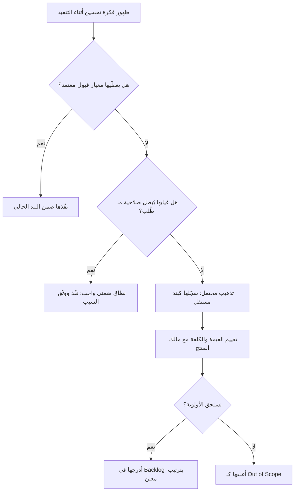

# التذهيب (Gold Plating)

> [!info] تعريف مختصر
> التذهيب (Gold Plating) هو قيام الفريق بإضافة ميزات أو تحسينات أو تفاصيل **لم يطلبها العميل ولم يوافق عليها أحد**، بدافع حسن النيّة أو الحماس الهندسي أو الرغبة في الإبهار. جوهر المشكلة أن العمل الزائد يبدو «هدية مجانية» بينما هو في الحقيقة استهلاك لسعة الفريق ووقت الجدول وميزانية المشروع مقابل قيمة غير مؤكّدة — بل غالبًا معدومة، لأن أحدًا لم يطلبها أصلًا.

## الشرح العلمي والاحترافي
- التذهيب هو **توسيع للنطاق من داخل الفريق** دون مرور بأي مسار موافقة. المطوّر أو المصمّم يرى فرصة لتحسين شيء ما، فينفّذها مباشرة، مقتنعًا بأنه «يقدّم قيمة إضافية» أو «يستبق حاجة العميل».
- **التمييز الحاسم عن [[Scope Creep]]** — وهو أهم ما يجب ضبطه في هذا المفهوم:
  - **زحف النطاق (Scope Creep)** يأتي من **خارج** الفريق: طلبات العميل أو أصحاب المصلحة تتراكم تدريجيًا بعد الاتفاق على النطاق، غالبًا عبر قنوات غير رسمية وبلا تقدير أثرها الزمني والمالي. العميل هنا يعرف أنه يطلب شيئًا جديدًا؛ المشكلة في غياب الحوكمة.
  - **التذهيب (Gold Plating)** يأتي من **داخل** الفريق: لا يوجد طالب أصلًا. العميل لا يعلم بوجود هذا العمل، ولم يقيّم قيمته، وقد لا يريده. المشكلة هنا ليست في الحوكمة فقط بل في غياب معيار قيمة يوقف الفريق عن اختراع عمل لنفسه.
  - الفارق العملي في العلاج: زحف النطاق يُعالَج بمسار [[Change Request]] رسمي، والتذهيب يُعالَج بـ[[Definition of Done]] صارم ومعايير قبول ([[Acceptance Criteria]]) واضحة تحدّد متى يتوقّف العمل على البند.
- **التمييز عن النطاق الضمني المتوقَّع (Implicit Scope)**: ليس كل ما لم يُكتَب حرفيًا في المتطلبات تذهيبًا. التحقّق من صحّة المدخلات، ورسائل الخطأ المفهومة، وحماية كلمة المرور، وإتاحة الوصول الأساسي (Accessibility)، وأداء معقول تحت الحمل المتوقّع — كلها جزء من مستوى الحرفية المتوقَّع، وحذفها عيب لا توفير. المعيار الفاصل هو سؤال بسيط: **هل غياب هذا العنصر يجعل ما طُلب فعلًا غير صالح للاستخدام؟** إن كانت الإجابة نعم فهو نطاق ضمني واجب؛ وإن كانت لا فهو تذهيب حتى يثبت العكس.
- **أضرار التذهيب** ليست مجرد وقت ضائع، بل سلسلة كلفة ممتدة:
  1. **استهلاك السعة (Capacity Drain)**: كل ساعة على ميزة غير مطلوبة هي ساعة مخصومة من بند مطلوب فعلًا، وقد تتحوّل إلى تأخير في الموعد النهائي.
  2. **اتساع سطح الاختبار**: كل مسار جديد يجب اختباره وصيانته وتوثيقه، ويرفع احتمال الأعطال في مسارات لم يطلبها أحد.
  3. **[[Technical Debt]]**: كود إضافي يزيد التعقيد ويربك من يأتي لاحقًا، وقد يعرقل إعادة الهيكلة لأن «هناك ميزة تعتمد عليه».
  4. **صيانة أبدية**: الميزة الزائدة تبقى في المنتج سنوات، تُختبَر في كل إصدار وتُهاجَر في كل تحديث، وقد لا يستخدمها أحد إطلاقًا.
  5. **خطر مضاعف قرب الإطلاق**: إدخال تغيير غير مخطّط في مرحلة الاستقرار يهدّد جاهزية الإصدار كله مقابل قيمة صفرية تقريبًا.
  6. **إرباك تجربة المستخدم**: خيارات أكثر لا تعني تجربة أفضل؛ فالواجهة المزدحمة ترفع العبء الإدراكي وتخفض معدل إتمام المهمة الأصلية.
- **الأسباب الجذرية**:
  - **غياب [[Definition of Done]]**: لا يوجد تعريف متفق عليه لمعنى «انتهى البند»، فيملأ كل فرد الفراغ باجتهاده الشخصي.
  - **غياب معيار القيمة**: لا أحد يسأل «ما الأثر المتوقّع لهذا العمل ومن سيستخدمه؟» قبل التنفيذ، فتُقاس المساهمة بحجم العمل لا بأثره ([[Outcome vs Output]]).
  - **الرغبة في الإثبات**: مطوّر جديد أو فريق يشعر أن جودته تُقاس بالمبادرة، فيضيف ما يُظهر مهارته.
  - **ضعف الحوار مع المستخدم**: حين لا يصل الفريق إلى المستخدم الحقيقي، يستبدل الافتراضات بالتحقّق ويبني «ما يظنّ» أنه مطلوب.
  - **ثقافة تُكافئ الحجم**: تقارير تحتفي بعدد الميزات المُطلقة تدفع الفرق إلى إنتاج ميزات لا إلى إنتاج قيمة.
- في الفكر الرشيق (Lean) يُصنَّف التذهيب بوضوح كنوع من **الهدر (Muda)** ضمن [[Muda, Mura, Muri]] — تحديدًا هدر «المعالجة الزائدة» (Over-processing): بذل جهد يتجاوز ما يقدّره العميل فعلًا.

## أين ومتى يُستخدم
- **في تخطيط السباق ومراجعة البنود**: فحص كل مهمة والتأكد من أن ما سيُنفَّذ يطابق [[Acceptance Criteria]] بلا زيادة مخترَعة.
- **في مراجعات الكود (Code Review)**: كشف الملفات والوحدات التي لا تقابلها متطلبات — سؤال «أي بند يغطّي هذا الجزء؟» هو أسرع مصفاة للتذهيب.
- **عند تفسير تجاوز التقديرات**: حين تستغرق مهمة قُدّرت بيومين خمسة أيام بلا عائق تقني واضح، التذهيب أحد أول الاحتمالات الواجب فحصها.
- **قرب مواعيد الإطلاق ونوافذ التجميد (Code Freeze)**: المرحلة التي يكون فيها التذهيب أعلى مخاطرة وأقل عائدًا على الإطلاق.
- **في تحديد [[MVP]] ونطاق الإصدار الأول**: أخطر مرحلة على الإطلاق، لأن هدف الـ MVP هو التعلّم بأقل بناء ممكن، والتذهيب يقتل هذا الهدف مباشرة.
- **في التعاقدات ذات السعر الثابت**: كل ساعة تذهيب تُخصَم مباشرة من هامش الربح دون أن يدفع العميل مقابلها شيئًا أو يشكر عليها.

## مثال وسيناريو تطبيقي
> [!example] في لوحة تحكم إدارية، كان البند في الـ Backlog صريحًا: **«إضافة فلتر بسيط في قائمة الطلبات للفرز حسب الحالة»**، بتقدير 3 أيام عمل.
> رأى المطوّر أن الفلتر «سيكون أفضل» لو دعم معايير متعدّدة، فأضاف الفلترة حسب التاريخ والعميل والمبلغ والمنطقة. ثم رأى أن المستخدم سيمل من إعادة الضبط، فأضاف **حفظ تفضيلات الفلترة** لكل مستخدم — وهو ما تطلّب جدولًا جديدًا في قاعدة البيانات ونقاط API إضافية. ثم أضاف **تصدير النتائج إلى PDF وExcel** لأن «كل لوحة تحكم محترمة فيها تصدير»، فأدخل مكتبتين خارجيتين جديدتين.
> **الحصيلة الرقمية**: 3 أيام مقدَّرة تحوّلت إلى 13 يوم عمل — أي **أسبوعان زائدان لم يطلبهما أحد**. وارتفعت حالات الاختبار من 6 إلى 34 حالة، ودخلت المكتبتان الجديدتان دورة تحديثات أمنية دائمة.
> **بعد شهرين من الإطلاق**، أظهرت بيانات الاستخدام: الفلترة حسب الحالة استُخدمت 1,840 مرة؛ الفلترة حسب المبلغ 12 مرة؛ حفظ التفضيلات فُعّل من 3 مستخدمين من أصل 210؛ تصدير PDF استُخدم **صفر** مرة.
> **الكلفة الحقيقية**: تأخّرت ميزتان أساسيتان في الإصدار نفسه بسبب استهلاك السعة، وظهر عيبان في الإنتاج داخل مسار حفظ التفضيلات، وبقيت مكتبة PDF تُصان وتُحدَّث لعامين كاملين خدمةً لميزة لم يفتحها أحد. لو طُبِّق [[Definition of Done]] بحرفية، لسُلّم البند في 3 أيام ولطُرحت الأفكار الأخرى كبنود مستقلة تُقيَّم بقيمتها في الـ Backlog.

## خطوات أو مخطّط
1. كتابة [[Acceptance Criteria]] صريحة وقابلة للتحقّق لكل بند قبل بدء التنفيذ.
2. الاتفاق على [[Definition of Done]] على مستوى الفريق، يحدّد ما يجب إنجازه ويحدّد ضمنًا ما لا يجب تجاوزه.
3. توثيق ما هو خارج النطاق ([[Out of Scope]]) صراحةً في وثيقة البند، لا تركه لاستنتاج الفرد.
4. عند ظهور فكرة تحسين أثناء التنفيذ: **لا تُنفَّذ فورًا**، بل تُسجَّل كبند مستقل في الـ Backlog.
5. تقييم البند الجديد بمعيار قيمة واضح: من المستفيد؟ ما الأثر المتوقّع؟ ما كلفته الحقيقية شاملةً الاختبار والصيانة؟
6. عرضه على مالك المنتج ليقرّر ترتيبه بين الأولويات، لا بين ثنايا مهمة أخرى.
7. في مراجعة الكود: مطابقة ما نُفِّذ مع معايير القبول، والاعتراض على أي جزء لا يقابله متطلب.
8. قياس الاستخدام الفعلي للميزات بعد الإطلاق، وحذف ما لا يُستخدم بدل صيانته إلى الأبد.

## ⚠️ مفاهيم خاطئة شائعة
> [!warning]
> - **الخلط بين التذهيب وزحف النطاق**: هما اتجاهان متعاكسان — الزحف يأتي من **خارج** الفريق عبر طلبات العميل، والتذهيب من **داخله** بلا طلب أصلًا. الخلط بينهما يؤدّي إلى علاج خاطئ: مسار موافقات لا يوقف مبادرة داخلية، وتعريف إنجاز لا يوقف طلبًا خارجيًا.
> - **اعتبار كل عمل غير مذكور حرفيًا تذهيبًا**: معالجة الأخطاء والأمان الأساسي والأداء المعقول نطاق ضمني متوقَّع، وإسقاطه بحجّة «لم يُطلب» عيب مهني لا انضباط.
> - **الظن بأن التذهيب يُسعد العميل**: العميل لم يطلبه، ولن يدفع مقابله، وقد ينزعج لأن ما طلبه فعلًا تأخّر بسببه — والقيمة المُدرَكة تعتمد على ما طُلب لا على ما أُضيف.
> - **الاعتقاد بأن الوقت الزائد «مجاني» لأن المطوّر متفرّغ**: الفراغ الظاهري سعة قابلة لاستيعاب بنود ذات قيمة مثبتة، أو لسداد دين تقني قائم، أو لخفض المخاطر.
> - **الخلط بينه وبين جودة الصنعة (Craftsmanship)**: كتابة كود نظيف ومختبَر لما هو مطلوب جودة واجبة؛ أما بناء ما لم يُطلب فلا يتحوّل إلى جودة مهما أُتقن.

## ❌ ممارسات خاطئة في المشاريع
> [!failure]
> - **العمل ببنود فضفاضة بلا معايير قبول**: بند مثل «تحسين شاشة الطلبات» يترك حدود العمل لتقدير المنفّذ، فيتحوّل حتمًا إلى تذهيب. الحل: لا يدخل أي بند في التنفيذ قبل صياغة [[Acceptance Criteria]] قابلة للاختبار ومتفق عليها مع مالك المنتج.
> - **تنفيذ أفكار التحسين فور ظهورها بدل تسجيلها**: يحوّل الـ Backlog إلى واجهة شكلية بينما تُتّخذ قرارات الأولوية فعليًا داخل محرّر الكود. الحل: قاعدة صارمة — كل فكرة تصبح بندًا مستقلًا يُقيَّم علنًا، ولا تُنفَّذ داخل مهمة أخرى.
> - **مكافأة الفرق على حجم ما تنتجه لا على أثره**: تقارير تحتفي بعدد الميزات تُنتج ثقافة تُشجّع التذهيب صراحةً. الحل: ربط التقييم بمقاييس أثر فعلي على المستخدم، وقياس معدل استخدام كل ميزة بعد الإطلاق.
> - **بناء [[MVP]] مُذهَّب**: إضافة تحسينات كمالية إلى نسخة هدفها الأساسي اختبار فرضية يهدر أسابيع قبل التأكد من وجود حاجة أصلًا. الحل: تعريف الفرضية المراد اختبارها بدقّة، وقصر البناء على أقل ما يكفي للإجابة عنها.
> - **قبول تغييرات غير مخطّطة في مرحلة تجميد الإصدار**: أعلى خطر وأقل عائد، إذ يبطل نتائج اختبار الانحدار المنجَزة ويهدّد موعد الإطلاق. الحل: تجميد صارم للنطاق قبل الإطلاق، وتحويل كل إضافة إلى الإصدار التالي بلا استثناء.
> - **الإبقاء على الميزات غير المستخدَمة إلى الأبد**: كل ميزة ميتة تُصان وتُختبَر وتُهاجَر في كل تحديث فترفع الكلفة الثابتة للمنتج. الحل: مراجعة دورية لبيانات الاستخدام وحذف ما لا يُستخدم صراحةً بوصفه سدادًا لـ [[Technical Debt]].

## 🔗 مصطلحات ومفاهيم ذات صلة
[[Scope Creep]] | [[Definition of Done]] | [[Acceptance Criteria]] | [[MVP]] | [[Out of Scope]] | [[Technical Debt]] | [[Change Request]] | [[Muda, Mura, Muri]]
