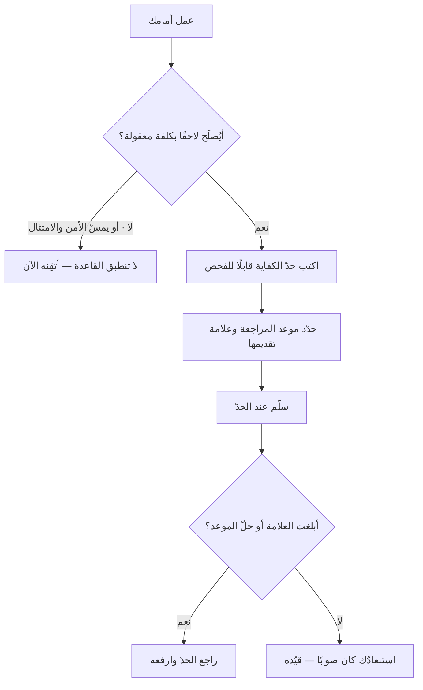

# جيّد بما يكفي الآن (Good Enough For Now)

> [!info] تعريف مختصر
> **«جيّد بما يكفي الآن» (GEFN)** قاعدة قرار تقول: توقّف عند الحدّ الذي يفي بالغرض **في هذا السياق وهذا الوقت**، ولا تُنفق على ما بعده ما دام لا يغيّر قرارًا ولا يُدرَك عند المستخدم. وأصلها العلمي مفهوم **الاكتفاء (Satisficing)** الذي صاغه **هربرت سايمون (Herbert Simon)** في نظرية العقلانية المحدودة: أن العاقل في الواقع لا يبحث عن الأمثل بل عن **أوّل ما يجتاز حدًّا يقبله**، لأن كلفة مواصلة البحث تتجاوز غالبًا ما يُكسب منه. **وشرطها الذي يفصلها عن التهاون** أن يكون الحدّ **مكتوبًا قبل البدء** لا مُعلَنًا عند التعب.

## الشرح العلمي والاحترافي

### 1. الكلمتان الحاسمتان: «يكفي» و«الآن»

- **«يكفي»** تقتضي أن يكون ثمّة **حدُّ كفايةٍ مُعرَّف**. فبلا حدّ مكتوب لا معنى للجملة، ويصير الاكتفاء اسمًا مهذّبًا للتوقّف عند الملل. وهذا الحدّ هو نفسه ما يسكن [[Definition of Done|تعريف الاكتمال]] و[[CTQ|الحرج للجودة]].
- **«الآن»** تقتضي أن يكون القرار **مؤقّتًا معلنًا**، لا حكمًا نهائيًّا. فما يكفي لمئة مستخدم لا يكفي لعشرة آلاف، وما يكفي لتجربة استكشافية لا يكفي لنظام دفع. والفرق بين GEFN و[[Technical Debt|الدَّين التقني]] المتراكم هو أن الأولى **تسجّل متى يُعاد النظر**، والثاني ينسى.

### 2. لماذا يستمرّ الإفراط في الصقل رغم أن كلفته ظاهرة؟

لأن كلفتَه **غير مرئية**، ومكسبه مرئيّ. فالساعة التي أُنفقت في تحسين شيء بلغ الكفاية تظهر في العمل المسلَّم بوصفها جودة؛ ولا يظهر في مقابلها ما **لم يُبنَ** بسببها. وهذه هي كلفة الفرصة، وهي لا تدخل أي لوحة متابعة.

**ويضاف إليها ثلاثة دوافع نفسية وتنظيمية:**

1. **تناقص العائد** لا يُحسّ لحظةَ وقوعه: أوّل 80% من الجودة قد تُنال في 20% من الجهد، والباقي يبتلع الأكثر — ومن هو داخل العمل لا يرى أين انقلبت النسبة.
2. **الصقل مريح**: تحسين شيء مفهوم أهون نفسيًّا من بدء شيء مجهول.
3. **الجودة الظاهرة تُكافَأ** أكثر ممّا يُكافَأ التسليم في وقته.

### 3. متى لا تنطبق القاعدة؟ — وهذا أهمّ من متى تنطبق

«جيّد بما يكفي» ليست إذنًا عامًّا. وثلاثة مواضع لا تدخلها:

1. **ما لا يُصلَح لاحقًا** — نموذج البيانات، وعقد الواجهة البرمجية المنشورة، وقرارات المعمارية الأساسية. فكلفة إصلاحها ترتفع ارتفاعًا حادًّا مع الزمن ([[Cost-of-Change Curve|منحنى كلفة التغيير]]).
2. **ما يمسّ السلامة أو الامتثال أو الأمن** — فحدّ الكفاية هنا مفروض من خارج ولا يملك الفريق تخفيضه.
3. **ما يُبنى عليه غيره** — فالكفاية في أساسٍ يقوم عليه عشرة أشياء تنتقل إلى العشرة.

**والقاعدة العملية:** GEFN لما هو **قابل للتراجع ومحدود الأثر**؛ وما عداه يُقرَّر بقاعدة أخرى ([[Reversible vs Irreversible Decisions]]).

### 4. كيف تُكتب بصيغة صالحة للعمل؟

الجملة الصالحة فيها ثلاثة: **الحدّ · موعد إعادة النظر · العلامة التي توجب تقديمه.**

> «تكفينا معالجة يدوية للمرتجعات حتى تبلغ الخمسة عشر أسبوعيًّا، ونراجعها في نهاية الربع، أو فورًا إن تجاوزت الخمسة والعشرين.»

وقارن بينها وبين: «سنكتفي بالحلّ اليدوي الآن» — فالثانية لا تُلزم بشيء، وستُنسى حتى تنفجر.

## أين ومتى يُستخدم

- في تحديد نطاق [[MVP|أقلّ منتج قابل للتطبيق]]، إذ هو تطبيق مباشر للقاعدة على مستوى المنتج.
- في القرارات الداخلية والأدوات المساندة، حيث لا يرى المستخدم النهائي الفرق أصلًا.
- في التقارير والوثائق: التقرير الذي يجيب عن سؤاله بلغ الكفاية، وتجميله لا يغيّر قرارًا.
- في التقدير والتحليل: التقدير الذي يكفي لاتّخاذ القرار كافٍ، وزيادة دقّته لا تغيّر القرار غالبًا.
- عند التعامل مع الدَّين التقني المقصود، بشرط تسجيله وشرط إعادة النظر ([[Technical Debt]]).

## مثال وسيناريو تطبيقي

> [!example] سيناريو ملموس
> فريق يبني لوحة تقارير داخلية لسبعة موظّفين في قسم العمليات.
>
> **المسار الأوّل:** طُلب فيها بحث وتصفية متقدّمة، وتصدير بأربع صيغ، وصلاحيات على مستوى الحقل، وتحديث لحظيّ. والتقدير: تسعة أسابيع.
>
> **وبسؤال الكفاية:** ما الذي يفعله السبعة فعلًا؟ فتبيّن بالمراقبة أنهم يفتحون اللوحة صباح كل يوم، وينظرون في ثلاثة أرقام، ويصدّرون جدولًا واحدًا إلى إكسل مرّة أسبوعيًّا.
>
> **فكُتب حدّ الكفاية:** «ثلاثة أرقام، وتصدير واحد إلى إكسل، وتحديث كل ساعة، وصلاحية على مستوى الصفحة لا الحقل. **نراجع بعد ثلاثة أشهر، أو فورًا إن تجاوز المستخدمون الخمسة عشر أو طُلب تصدير آليّ.**»
>
> **والتقدير صار أسبوعين.** وبعد ثلاثة أشهر جاءت المراجعة، فلم يُطلب شيء ممّا حُذف إلا التصفية — فأُضيفت في ثلاثة أيّام.
>
> **والعبرة ليست في السبعة أسابيع الموفَّرة**، بل في أن الفريق **لم يكن يعرف** أي الميزات ستُطلب فعلًا؛ فالبناء المسبق كان رهانًا، والتأجيل مع علامةٍ للمراجعة كان معرفةً.

## خطوات أو مخطّط

1. اسأل أوّلًا: **أهذا ممّا يُصلَح لاحقًا بكلفة معقولة؟** فإن لم يكن، فلا تُطبَّق القاعدة هنا.
2. اكتب حدّ الكفاية بصيغة قابلة للفحص، لا بصفة («كافٍ» ليس حدًّا).
3. حدّد **موعد إعادة النظر** و**العلامة** التي توجب تقديمه.
4. سجّل ما استُبعد صراحةً، لا لتنفيذه بل ليُعرَف أنه قرار لا سهو.
5. سلّم عند بلوغ الحدّ ولو بقي في نفسك شيء.
6. راجع في موعدك: فما لم يُطلب فقد ثبت أن استبعاده كان صوابًا، وهذه معلومة تُقيَّد لا تُهمَل.

## ⚠️ مفاهيم خاطئة شائعة

> [!warning]
> - **قراءتها إذنًا بالتهاون.** بل هي قاعدة تلزمك بكتابة حدّ **قبل** البدء؛ والتهاون هو التوقّف بلا حدّ مكتوب — والفرق بينهما ليس في مقدار العمل بل في وجود المعيار.
> - **الخلط بينها وبين الدَّين التقني المتروك.** فهذه تسجّل موعد المراجعة وعلامتها، وذاك يُنسى حتى يُكتشف بعد سنتين.
> - **الظنّ أنها تنطبق على كل شيء.** فما لا يُصلَح لاحقًا، وما يمسّ السلامة والامتثال، وما يُبنى عليه غيره — خارجها.
> - **حسبانها مرادفة لـ[[MVP]].** فـMVP تطبيقٌ للقاعدة على مستوى المنتج بغرض التعلّم، والقاعدة أعمّ وتنطبق على تقرير وتقدير ووثيقة.
> - **الظنّ أن نفيها هو «الجودة».** بل نفيها غالبًا **إعادة توزيع** للجودة: ما أُنفق في صقل ما بلغ الكفاية نُقص من شيء آخر لم يبلغها بعد.

## ❌ ممارسات خاطئة في المشاريع

> [!failure]
> - **إعلان الاكتفاء عند نفاد الوقت** بدل تحديده عند التخطيط، فيصير غطاءً لتقدير فاشل لا قرارًا واعيًا.
> - **الاكتفاء بلا موعد مراجعة**، فيتحوّل الحلّ المؤقّت إلى دائم — وهو أشيع مصادر الدَّين التقني في المنتجات القائمة.
> - **تطبيقها على نموذج البيانات وعقود الواجهات**، حيث تكون كلفة التصحيح أضعاف كلفة الإتقان ابتداءً.
> - **استعمالها في مواجهة اعتراض على الجودة بلا معيار**، فتصير أداة إسكات: «هذا جيّد بما يكفي» تُقال بلا حدٍّ يُحتكم إليه.
> - **صقل ما لا يراه أحد** — لوحة داخلية، أو تقرير يُقرأ مرّة، أو أداة يستعملها ثلاثة — بنفس معيار ما يراه آلاف المستخدمين.

## 🔗 مصطلحات ومفاهيم ذات صلة

[[MVP]] | [[Definition of Done]] | [[CTQ]] | [[Technical Debt]] | [[Reversible vs Irreversible Decisions]] | [[Cost-of-Change Curve]] | [[Pareto Principle]] | [[Sunk Cost Fallacy]] | [[Scope Creep]] | [[Gold Plating]] | [[Timeboxing]] | [[Quality Attributes]] | [[Cost of Delay]]
