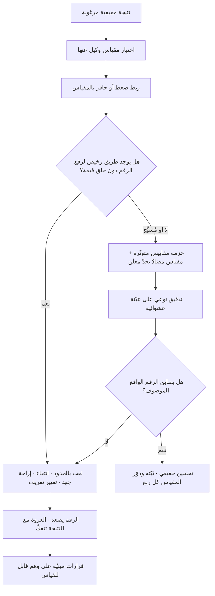

# قانون غودهارت (Goodhart's Law)

> [!info] تعريف مختصر
> مبدأ يقول إن المقياس يفقد صلاحيته بوصفه مقياسًا حالما يتحوّل إلى هدف يُضغط عليه ويُكافأ عليه. السبب أن أي مقياس ليس النتيجة نفسها بل **وكيل (Proxy)** عنها، والعلاقة بين الوكيل والنتيجة علاقة إحصائية قائمة في ظروف طبيعية غير مضغوطة. وحين يُوجَّه الضغط إلى الوكيل، يجد الناس — بذكاء ودون سوء نيّة بالضرورة — طرقًا لرفعه أرخص وأسرع من الطريق الذي يمرّ عبر النتيجة الحقيقية، فتنفكّ العروة بين الاثنين: يصعد الرقم وتبقى النتيجة مكانها أو تتراجع. القانون ليس دعوة للتوقّف عن القياس، بل لفهم أن كل مقياس مُدار يتآكل، وأن التصميم السليم يحتاج **مقاييس مضادّة، وحزمة مقاييس بدل مقياس واحد، وتدوير المقاييس مع الزمن**.

## الشرح العلمي والاحترافي
- **الأصل والصياغة الدقيقة.** الفكرة تُنسب إلى الاقتصادي البريطاني **تشارلز غودهارت (Charles Goodhart)**، الذي كان مستشارًا في بنك إنجلترا، وطرحها في ورقة قدّمها عام 1975 في سياق نقد سياسات استهداف المجاميع النقدية. وصياغته الأصلية تقنيّة وأدقّ ممّا اشتُهر لاحقًا، ومعناها: **أي انتظام إحصائي مُلاحَظ يميل إلى الانهيار حالما يُمارَس عليه ضغط لأغراض التحكّم**. أي أن العلاقة التي رُصدت في ظروف المراقبة لا تصمد حين تُستخدم أداةً للسياسة.
- **الصياغة الشائعة ليست لغودهارت.** العبارة المتداولة عالميًّا — «حين يصير المقياس هدفًا يكفّ عن كونه مقياسًا جيّدًا» — صاغتها بهذه اللغة المختصرة عالمة الأنثروبولوجيا البريطانية **مارلين ستراذرن (Marilyn Strathern)** عام 1997، في مقال عن نظم التدقيق والتقييم في الجامعات البريطانية، حيث ذكرت الفكرة منسوبةً إلى غودهارت لكن بصياغتها المكثّفة هي. لذلك من الدقّة العلمية أن يُقال: **الفكرة لغودهارت، والصياغة المشهورة لستراذرن**، وأن يُنتبه إلى أن الصياغة الشائعة أوسع مدىً من الأصل الاقتصادي الضيّق.
- **قانون قريب ومستقلّ: قانون كامبل.** صاغ عالم النفس الاجتماعي **دونالد كامبل (Donald T. Campbell)** في السبعينيات مبدأً موازيًا في سياق تقييم البرامج الاجتماعية، مفاده أن المؤشّر الكمّي كلّما استُخدم أكثر في اتّخاذ القرارات الاجتماعية كان أعرض للفساد وأقدر على تشويه العمليات التي يُفترض أن يرصدها. الاثنان وصلا إلى النتيجة نفسها من حقلين مختلفين، وهو ما يعزّز عموميّة المبدأ.
- **آليات الانهيار الأربع.** لا ينهار المقياس بطريقة واحدة، ومعرفة الآلية تحدّد العلاج: ① **الغش الصريح**: تزوير البيانات أو تعديل التعريف. ② **اللعب بالحدود (Gaming)**: الالتزام بحرفية المقياس ونقض غايته — إغلاق التذاكر بلا حل، تجزئة الطلب ليصير عدّة طلبات. ③ **الانتقاء (Selection)**: تحسين الرقم بتغيير من يُقاس لا بتحسين الأداء — رفض الحالات الصعبة، استهداف العملاء السهلين. ④ **إزاحة الجهد (Effort Displacement)**: تحويل الموارد من المهمّ غير المقيس إلى المقيس الأقلّ أهمّية، وهو الأخطر لأنه لا يبدو مخالفة على الإطلاق.
- **لماذا يشتدّ أثره في المؤسّسات الحديثة.** ثلاثة عوامل تُسرّع الانهيار: **الأتمتة** التي تجعل تحسين الرقم قابلًا للبرمجة، و**ربط الحوافز المالية** الذي يحوّل المقياس إلى دخل شخصي، و**المسافة بين من يقيس ومن يُقاس** التي تُخفي السياق فتجعل الرقم هو كل الواقع المتاح للقرار. وكلما زاد اعتماد القرار على رقم واحد، اشتدّ الضغط عليه وتسارع تآكله.
- **العلاج ليس ترك القياس بل تصميمه.** خمس رافعات عملية مجرَّبة: ① **حزمة مقاييس متوتّرة داخليًّا** (سرعة + جودة + تكلفة) بحيث لا يُرفع أحدها بلا كلفة ظاهرة. ② **مقياس مضادّ** مُعلَن لكل هدف ([[Counter Metric]]). ③ **الفصل بين مقاييس التعلّم ومقاييس المساءلة**: المقياس الذي تُبنى عليه العقوبات يفسد أسرع، فيُبقى جزء من المقاييس بلا حوافز ليظلّ صادقًا. ④ **تدوير المقاييس** ومراجعتها كل ربع، لأن أي مقياس ثابت لسنوات قد صار الفريق خبيرًا في رفعه. ⑤ **التدقيق النوعي**: عيّنة عشوائية تُفحص يدويًّا للتحقّق من أن الرقم يطابق الواقع.
- **الحدّ الفاصل بين التحسين المشروع واللعب.** المحكّ العملي سؤال واحد: **هل الفعل الذي رفع الرقم كان سيُتّخذ لو لم يكن هذا الرقم مقيسًا؟** إن كان الجواب نعم فهو تحسين حقيقي؛ وإن كان لا فهو لعب بالمقياس. والسؤال هذا يصلح أداة حوار داخل الفريق أفضل من الاتهام الأخلاقي، لأن أغلب اللعب يقع بحسن نيّة تحت ضغط الهدف.

## أين ومتى يُستخدم
- **عند تصميم [[OKR]] وربطه بالتقييم السنوي**: القانون هو السبب الرئيس للتوصية بفصل مقاييس التعلّم عن مقاييس المكافأة، ولتجنّب جعل نتيجة رئيسية واحدة تحدّد مصير الفريق.
- **عند اختيار [[North Star Metric]]**: النجم القطبي أشدّ المقاييس تعرّضًا للضغط لأنه هدف الشركة كلّها، فيُشترط له سياج من الحرّاس ومراجعة دورية لصلته بالقيمة الحقيقية.
- **في أهداف التسليم والسرعة**: مطاردة [[Throughput]] أو نقاط القصة تدفع نحو تضخيم التقديرات وتجزئة المهامّ شكليًّا، وهو ما يفسد [[Relative Estimation]] ويحوّل الفريق إلى [[Feature Factory]].
- **في الجودة والدعم**: أهداف زمن الإغلاق تُنتج إغلاقًا شكليًّا ترصده [[Reopen]] و[[Escaped Defect Rate]]؛ وأهداف [[MTTR]] قد تُنتج تسجيلًا متأخّرًا للحوادث.
- **في العقود واتفاقيات مستوى الخدمة ([[SLA]] و[[Vendor Management]])**: أي بند جزائي مرتبط برقم واحد يخلق حافزًا لهندسة الرقم؛ ولذلك تُصاغ العقود الناضجة بحزمة مؤشّرات ومراجعة نوعية.
- **في مؤشّرات الرضا مثل [[NPS]]**: ربط حوافز الموظفين بالتقييم مباشرة يدفع إلى استجداء الدرجات وانتقاء من يُرسل إليه الاستبيان، فيصير الرقم انعكاسًا لسلوك جمع البيانات لا لرضا العميل.
- **في أنظمة الذكاء الاصطناعي والتقييم الآلي**: تحسين نموذج على مقياس واحد ([[Evals]]) يُنتج نموذجًا بارعًا في المقياس ضعيفًا في المهمّة؛ وهو التعبير التقني نفسه عن القانون.
- **في الحوكمة والتقارير الرسمية ([[Governance]] و[[RAG Status]])**: حين يصير اللون الأخضر هدفًا، تتحوّل التقارير إلى تمرين في اللون لا في الحالة.

## مثال وسيناريو تطبيقي
> [!example] شركة تقنية إقليمية تدير منصّة خدمة عملاء لعملاء مؤسّسيّين. قرّرت الإدارة العليا في بداية العام هدفًا واحدًا واضحًا وسهل القياس: **خفض متوسّط زمن أول ردّ (First Response Time) من 4 ساعات إلى 30 دقيقة**، وربطت 25% من مكافأة فريق الدعم (34 موظفًا) بهذا الرقم وحده.
> **بعد ثلاثة أشهر:** متوسّط زمن أول ردّ **19 دقيقة** — تجاوز للهدف بفارق مريح، واحتفال في العرض الربعي.
> **ما حدث فعلًا:** كشف تدقيق نوعي لعيّنة من 200 تذكرة أربع سلوكيات نشأت كلّها استجابةً للمقياس، لا لسوء نيّة بل لأن الطريق إليها كان الأرخص:
> - **لعب بالحدود**: 61% من «الردود الأولى» كانت رسالة قالبية «شكرًا لتواصلك، جارٍ العمل على طلبك» ترفع الرقم ولا تحمل معلومة.
> - **انتقاء**: التذاكر المعقّدة صارت تُترك في طابور غير مصنّف أطول، لأن الردّ عليها يستهلك وقتًا يفسد المتوسّط.
> - **إزاحة جهد**: انخفض زمن **الحلّ** الفعلي عكسيًّا — من 22 ساعة إلى **41 ساعة** — لأن الانتباه كلّه انتقل إلى أول دقيقة.
> - **تغيير التعريف**: بعض الوكلاء صاروا يُغلقون التذكرة ويطلبون من العميل فتح تذكرة جديدة، فتُحسب الجديدة بزمن ردّ منخفض.
> المحصّلة القابلة للقياس: زمن أول ردّ تحسّن 92%، بينما ارتفع معدّل إعادة الفتح من 5% إلى **17%**، وانخفض رضا العملاء المؤسّسيّين في الاستبيان النصف سنوي من 8.1 إلى **6.4**، وفقدت الشركة عقدين في التجديد.
> **إعادة التصميم على أساس القانون:** استُبدل المقياس المفرد بحزمة متوتّرة معلَنة معًا: **زمن أول ردّ ذي معنى** (يُستبعَد منه القوالب الآلية بتعريف صريح)، مع **زمن الحلّ الكامل** بوصفه المقياس المتأخّر الحقيقي، مع حارسين: **معدّل إعادة الفتح ألّا يتجاوز 7%** و**نسبة التذاكر التي تجاوزت 48 ساعة دون حلّ ألّا تتجاوز 4%**. ورُبطت المكافأة بالحزمة مجتمعة لا ببند منها، وأُضيف تدقيق شهري على 50 تذكرة عشوائية. بعد ربعين: زمن أول ردّ 48 دقيقة (أسوأ من 19 وأصدق منها)، زمن الحلّ 14 ساعة، إعادة الفتح 6%، ورضا العملاء 7.9.

## خطوات أو مخطّط
1. لكل مقياس تنوي إدارته، اكتب صراحةً **النتيجة الحقيقية** التي هو وكيل عنها، وسمِّ الفجوة بينهما.
2. أجرِ تمرين اللعب: «كيف أرفع هذا الرقم بأرخص طريق دون خلق قيمة؟» وصنّف كل إجابة ضمن آليات الانهيار الأربع.
3. صمّم **حزمة** لا مقياسًا: أضف بُعدًا متوتّرًا مع الهدف (جودة مقابل سرعة، حجم مقابل تكلفة).
4. أعلن **مقياسًا مضادًّا** بحدّ رقمي مكتوب قبل بدء القياس، مع قرار مسبق عند التجاوز.
5. افصل بين ما يُقاس للتعلّم وما يُقاس للمساءلة، وقلّل ما تُبنى عليه الحوافز إلى أقلّ قدر ممكن.
6. أضف **تدقيقًا نوعيًّا دوريًّا** على عيّنة عشوائية للتحقّق من أن الرقم يطابق الواقع الموصوف.
7. راقب **معدّل تحسّن المقياس**: القفزات الكبيرة والسريعة غير المصحوبة بتغيير عملياتي معروف هي إشارة تشخيصية على اللعب لا على النجاح.
8. راجع المقاييس كل ربع، ودوّر ما تشبّع منها، واقرأها مقسّمة على الشرائح لا مجمّعة ([[Simpson's Paradox]]).

## ⚠️ مفاهيم خاطئة شائعة
> [!warning]
> - **«القانون يعني ألّا نقيس»**: بل يعني ألّا نُدير برقم واحد بلا سياج. القياس شرط الإدارة الرشيدة، والقانون تحذير من **الاختزال** لا من القياس.
> - **«القانون يفترض سوء النيّة»**: لا يشترطها إطلاقًا. أخطر آلياته — إزاحة الجهد — تقع بحسن نيّة كامل: يعمل الناس بجدّ على ما يُقاس ويُهملون ما لا يُقاس، وهذا سلوك عقلاني تحت الحافز لا خيانة.
> - **«الصياغة المشهورة هي كلام غودهارت نفسه»**: الصياغة المتداولة («حين يصير المقياس هدفًا…») لمارلين ستراذرن سنة 1997، والفكرة والأصل لتشارلز غودهارت سنة 1975 بلغة اقتصادية عن انهيار الانتظام الإحصائي تحت ضغط التحكّم.
> - **«يكفي اختيار مقياس أفضل»**: كل مقياس وكيل، وكل وكيل قابل للتآكل تحت الضغط. المشكلة بنيوية في العلاقة بين الوكيل والنتيجة، لا في رداءة الاختيار. الحلّ هيكلي (حزمة + حارس + تدوير + تدقيق) لا انتقائي.
> - **«القانون خاصّ بالاقتصاد أو بالقطاع العام»**: يظهر في التعليم والصحّة والمبيعات والتصنيع وتطوير البرمجيات وتدريب نماذج الذكاء الاصطناعي بالآلية نفسها.
> - **«ما دام المقياس متقدّمًا وقابلًا للفعل فهو آمن»**: المؤشّرات المتقدّمة ([[Leading and Lagging Indicators]]) أكثر عرضة للّعب لا أقل، لأنها أنشطة داخلية يسهل على الفريق تحريكها مباشرة.
> - **«التحسّن السريع دليل نجاح الإدارة»**: قفزة كبيرة في مقياس مُدار دون تغيير معروف في العملية ينبغي أن تُعامَل بوصفها **فرضية لعب حتى يثبت العكس**، وتُفحص بتدقيق نوعي قبل الاحتفال.

## ❌ ممارسات خاطئة في المشاريع
> [!failure]
> - **الخطأ: ربط حصّة كبيرة من المكافأة بمقياس واحد سهل القياس.** لماذا يضرّ: يجعل هندسة الرقم أعلى عائدًا من تحسين العمل، ويستقطب أذكى أفراد الفريق نحو اللعب. الحل: اربط الحافز بحزمة تتضمّن مقياسًا مضادًّا، واجعل تجاوز الحارس مُبطلًا للحافز كلّه.
> - **الخطأ: تعريف المقياس بصياغة فضفاضة تقبل التأويل.** لماذا يضرّ: يُعاد تعريف «الردّ» و«الإغلاق» و«النشط» تحت الضغط، فيتحسّن الرقم بتغيير المعنى لا الأداء. الحل: وثّق تعريفًا تشغيليًّا دقيقًا يشمل الاستثناءات، وثبّته في [[Single Source of Truth]] مع سجلّ لأي تعديل عليه.
> - **الخطأ: قياس ما يسهل قياسه وترك ما يصعب.** لماذا يضرّ: يُزيح الجهد من الجوهري غير المقيس إلى الهامشي المقيس، وهو تدهور صامت لا يظهر في أي لوحة. الحل: اكتب صراحةً قائمة «ما نقدّره ولا نقيسه»، وافحصه دوريًّا بوسائل نوعية مثل [[User Interview]] و[[Gemba Walk]].
> - **الخطأ: إبقاء المقاييس نفسها بلا مراجعة لسنوات.** لماذا يضرّ: مع الوقت يتقن النظام رفع الرقم دون تحسين النتيجة، فيصير المقياس طقسًا. الحل: راجع الحزمة كل ربع، ودوّر ما تشبّع، واحذف ما لم يغيّر قرارًا.
> - **الخطأ: الاحتفاء بتحسّن مفاجئ دون فحص سببه.** لماذا يضرّ: يُثبّت السلوك الذي أنتجه، وقد يكون لعبًا صرفًا، فيصير قدوة للبقيّة. الحل: اشترط لكل قفزة تفسيرًا عملياتيًّا موثّقًا وتدقيقًا على عيّنة قبل اعتمادها كنتيجة.
> - **الخطأ: استخدام المقاييس أداة عقاب فردي علني.** لماذا يضرّ: يقتل [[Psychological Safety]] فيتوقّف الناس عن الإبلاغ عن المشكلات وتتحسّن الأرقام لأن الأخبار السيّئة اختفت. الحل: استخدم المقاييس على مستوى النظام لا الفرد، وافصل قنوات التعلّم عن قنوات التقييم.
> - **الخطأ: افتراض أن الأتمتة تحمي المقياس من التلاعب.** لماذا يضرّ: الأتمتة تجعل اللعب أرخص وأوسع نطاقًا، لا أصعب. الحل: أضف اختبارات سلامة على البيانات نفسها، وراقب أنماطًا شاذّة (تركّز زمني، قوالب متكرّرة، دفعات متطابقة).
> - **الخطأ: تحسين نموذج أو نظام آلي على مقياس تقييم وحيد.** لماذا يضرّ: يُنتج أداءً ممتازًا على المقياس وضعيفًا على المهمّة الحقيقية، وهو انهيار غودهارت في صورته التقنية. الحل: نوّع مجموعات التقييم ([[Evals]])، واحتفظ بمجموعة مخفيّة لا يُحسَّن عليها، وأضف تقييمًا بشريًّا على عيّنة.

## 🔗 مصطلحات ومفاهيم ذات صلة
[[KPI]] | [[North Star Metric]] | [[Outcome vs Output]] | [[Counter Metric]] | [[Vanity Metrics]] | [[Leading and Lagging Indicators]] | [[Cohort Analysis]] | [[Funnel Analysis]] | [[Simpson's Paradox]] | [[Percentiles and Median vs Average]] | [[OKR]] | [[Feature Factory]] | [[Evals]] | [[Guard Rails]] | [[NPS]]
