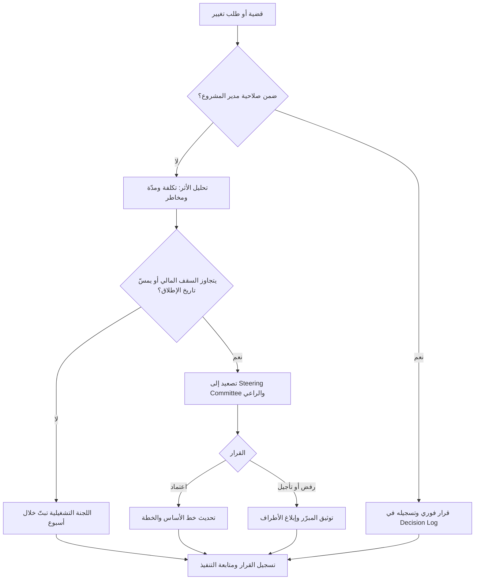

# الحوكمة (Governance)

> [!info] تعريف مختصر
> الحوكمة (Governance) هي الإطار الذي يحدّد **من يقرّر ماذا، وبأي صلاحية، ومتى، وبناءً على أي دليل** داخل المشروع. ليست اجتماعًا ولا مستندًا، بل منظومة من الأدوار والصلاحيات والسجلات ومسارات التصعيد تضمن أن القرارات تُتَّخذ في الوقت المناسب، من الشخص المخوَّل، وبمعلومات موثوقة، وأن أثر كل قرار يبقى قابلًا للتتبّع لاحقًا. باختصار: الإدارة تُنفِّذ، والحوكمة تُوجِّه وتراقب وتُخوِّل.

## الشرح العلمي والاحترافي
- **جوهر الحوكمة هو توزيع سلطة القرار**. كل مشروع يولّد تدفّقًا مستمرًّا من القرارات: تغيير في النطاق، تجاوز في الميزانية، تأخّر في مورد، خلاف بين قسمين على تصميم عملية. الحوكمة هي الجواب المُسبَق على سؤال: "هذا القرار تحديدًا، من يملك حقّ البتّ فيه؟". غياب هذا الجواب المُسبَق هو السبب الأول لتوقّف المشاريع، لأن القرار لا يُرفَض عادةً — بل يبقى معلّقًا.
- **المكوّنات العملية لأي إطار حوكمة**:
  - **هيكل اللجان ودوريتها**: عادةً ثلاث طبقات — فريق التنفيذ (يومي/أسبوعي)، لجنة تشغيلية أو `Project Board` (أسبوعي/نصف شهري)، و[[Steering Committee]] (شهري أو عند كل بوابة مرحلية). لكل طبقة نطاق قرار محدّد ومدخلات ثابتة ومخرجات إلزامية.
  - **حدود الصلاحيات المالية والنطاقية** (`Authority Thresholds`): مثلًا مدير المشروع يعتمد تغييرًا أثره أقل من 5 أيام عمل و2% من الميزانية؛ ما فوق ذلك يذهب إلى اللجنة التشغيلية؛ وما يتجاوز 10% من الميزانية أو يمسّ تاريخ الإطلاق يذهب إلى [[Sponsor]] ولجنة التوجيه.
  - **مسار التصعيد** ([[Escalation Path]]): من يُصعَّد إليه، بعد كم يومًا من الانتظار، وبأي صيغة. مسار التصعيد بلا سقف زمني ليس مسارًا بل أمنية.
  - **السجلات الإلزامية**: [[Decision Log]] (القرارات وأصحابها وتواريخها ومبرّراتها)، سجل المخاطر والقضايا ([[RAID Log]])، وسجل التغييرات ([[Change Request]]). هذه السجلات هي "الذاكرة المؤسسية" للمشروع، ومن دونها تتكرّر النقاشات نفسها كل شهر.
  - **تقارير الحالة والصحّة** ([[Project Health Report]]): إيقاع ثابت، وصيغة موحّدة، ومؤشرات لا تقبل التأويل (أخضر/أصفر/أحمر بمعايير مكتوبة لا بانطباع شخصي).
  - **قواعد اللعب** ([[Guard Rails]]): الحدود التي يتحرّك داخلها الفريق بحرّية دون استئذان، وخارجها يجب التصعيد. الحوكمة الجيدة توسّع مساحة الحرّية داخل الحدود بدل أن تطلب الإذن على كل خطوة.
- **التمييز الحاسم بين الحوكمة والإدارة (`Governance vs Management`)**: هذا هو أكثر ما يُخلَط في الممارسة العملية. **الإدارة** تعني تنفيذ العمل: تخطيط المهام، توزيعها، متابعة التقدّم، حلّ العوائق اليومية، إدارة الفريق والمورّد. **الحوكمة** تعني توجيه العمل والرقابة عليه وتخويل من ينفّذه: اعتماد الاتجاه الاستراتيجي، تخصيص الموارد، تحديد سقف المخاطر المقبول، والمساءلة عن النتيجة. مدير المشروع يعمل **داخل** إطار الحوكمة ولا يملكه؛ ومالك إطار الحوكمة هو الراعي التنفيذي ولجنة التوجيه. الاختبار العملي البسيط: إذا كان السؤال "كيف ننجزه؟" فهو إدارة، وإذا كان "هل ننجزه أصلًا، وبأي شروط، وعلى حساب ماذا؟" فهو حوكمة.
- **مبدأ التناسب (`Proportionality`)**: لا توجد حوكمة "صحيحة" مطلقًا، بل حوكمة متناسبة مع حجم المشروع ومخاطره وعدد الأطراف فيه. حوكمة ثقيلة على مشروع صغير تقتل السرعة: ثلاث لجان وأربع نماذج اعتماد لتغيير يستغرق تنفيذه ساعتين. وحوكمة رخوة على مشروع كبير متعدّد الأقسام تفتح باب الفوضى: قرارات تُتَّخذ في الممرّات، والتزامات شفهية تتبخّر، ونطاق يتمدّد بلا أثر مكتوب. القاعدة العملية: **كلّما زاد عدد الجهات المتأثّرة وحجم المال المعرَّض للخطر، زادت كثافة الحوكمة المطلوبة**، والعكس صحيح.
- **الحوكمة والامتثال ليسا الشيء نفسه**. الامتثال (`Compliance`) هو الالتزام بقواعد خارجية مفروضة (تنظيمية، أمنية، محاسبية). الحوكمة قد تشمل الامتثال لكنها أوسع منه: هدفها اتخاذ قرار جيد بسرعة كافية، لا مجرّد تفادي المخالفة.
- **علامات الحوكمة الصورية (`Governance Theater`)**: اجتماعات عرض شرائح تنتهي دون قرار مُسجَّل؛ سجلات قرارات تُملأ بأثر رجعي قبل التدقيق؛ حضور بالوكالة الدائم في لجنة التوجيه من أشخاص لا يملكون صلاحية البتّ؛ تقارير حالة "خضراء" حتى الأسبوع الذي يسبق الإخفاق مباشرة (ما يسمّى `Watermelon Reporting` — أخضر من الخارج وأحمر من الداخل)؛ وطلبات تغيير تُعتمد جماعيًّا دون تحليل أثر. كل هذه أعراض لمنظومة تنتج أوراقًا لا قرارات.

## أين ومتى يُستخدم
- **عند تأسيس أي مشروع** (`Project Initiation`): يُصاغ إطار الحوكمة في ميثاق المشروع ([[Project Charter]]) قبل بدء التنفيذ، ويشمل تسمية الراعي، وتشكيل لجنة التوجيه، وجدول الصلاحيات، وإيقاع التقارير.
- **في مشاريع `ERP` والتحوّل الرقمي متعدّدة الأقسام**: حيث تتقاطع مصالح المالية والمشتريات والمخزون والموارد البشرية، ويحتاج كل خلاف على تصميم عملية إلى جهة تحسم بسرعة.
- **في العلاقة مع المورّدين والعقود**: الحوكمة تحدّد من يوقّع على قبول التسليم، ومن يعتمد أوامر التغيير التي لها أثر مالي على العقد.
- **عند البوابات المرحلية** (`Stage Gates`) وقرار [[Go or No-Go Decision]]: لا يجوز أن يكون قرار الإطلاق قرار مدير المشروع وحده، بل قرار الجهة المخوَّلة بناءً على معايير مُتّفَق عليها مسبقًا.
- **عند تعثّر المشروع**: أول ما يُراجَع في المشاريع المتعثّرة ليس خطة العمل بل إطار الحوكمة — لأن التأخير غالبًا سببه قرارات معلّقة لا مهام متأخّرة.
- **في المشاريع متعدّدة الشركاء** (مشروع مشترك بين مؤسّستين): الحوكمة هنا ليست ترفًا بل شرط بقاء، لأن كل طرف يملك تسلسلًا إداريًّا مختلفًا.

## مثال وسيناريو تطبيقي
> [!example] شركة توزيع لديها 6 فروع تنفّذ مشروع `ERP` بميزانية 1.2 مليون ريال ومدّة 9 أشهر. في الشهر الثالث، طلب مدير المالية إضافة وحدة "الموازنات التقديرية" لم تكن ضمن النطاق، بتقدير أثر: 22 يوم عمل و95,000 ريال (≈8% من الميزانية) وتأخير أسبوعين في تاريخ الإطلاق.
> **بلا حوكمة**: يناقش الفريق الطلب في اجتماع أسبوعي، يبدو الجميع "متفهّمين"، يبدأ المحلّل العمل عليه فعليًّا "مبدئيًّا"، ثم يُكتشَف بعد شهرين أن الميزانية تجاوزت السقف وأن الإطلاق تأخّر — ولا أحد يتذكّر من وافق.
> **مع حوكمة**: جدول الصلاحيات ينصّ على أن أي تغيير أثره > 5% من الميزانية أو يمسّ تاريخ الإطلاق يُرفَع إلى [[Steering Committee]]. يُسجَّل الطلب كـ [[Change Request]] رقم CR-014 خلال 24 ساعة، ويُرفَق بتحليل أثر مكتوب (تكلفة، مدّة، مخاطر، بدائل). تجتمع اللجنة في دورتها الشهرية (وهي مُلزَمة بالبتّ خلال 10 أيام عمل حسب [[Escalation Path]])، فتقرّر: **تأجيل الوحدة إلى المرحلة الثانية بعد الاستقرار**، مع تعويض مؤقّت بتقرير موازنة يدوي. يُدوَّن القرار في [[Decision Log]] برقم وتاريخ ومالك (الراعي) ومبرّر ("حماية تاريخ الإطلاق أولوية على اكتمال الوظائف").
> **النتيجة الرقمية**: بقي المشروع ضمن ±3% من الميزانية، وأُطلِق في موعده. وحين عاد النقاش نفسه في الشهر السابع، استغرق حسمه 5 دقائق بالإحالة إلى القرار المُسجَّل بدل إعادة النقاش من الصفر.

## خطوات أو مخطّط
1. **تحديد المُساءَل النهائي**: تسمية [[Sponsor]] بالاسم والصلاحية، لا بالمنصب فقط.
2. **تصميم طبقات القرار**: فريق تنفيذ / لجنة تشغيلية / لجنة توجيه، مع تحديد دورية كل طبقة ونطاق قرارها.
3. **كتابة جدول الصلاحيات** (`Delegation of Authority`): سقوف مالية وزمنية ونطاقية واضحة بالأرقام، معتمدة من الراعي.
4. **توثيق الأدوار** عبر [[RACI]] للقرارات الحسّاسة (من يُستشار، ومن يُبلَّغ، ومن يعتمد فعليًّا).
5. **تفعيل السجلات الإلزامية**: [[Decision Log]]، [[RAID Log]]، سجل التغييرات — بمالك مُسمّى لكل سجلّ وتحديث دوري إلزامي.
6. **تحديد مسار التصعيد بسقوف زمنية**: كل مستوى ملزَم بالردّ خلال مدّة محدّدة، وإلا صُعِّد تلقائيًّا.
7. **ضبط إيقاع التقارير**: [[Project Health Report]] بصيغة موحّدة ومعايير ألوان مكتوبة.
8. **مراجعة تناسب الإطار كل مرحلة**: تخفيف ما ثبت أنه بيروقراطي، وتشديد ما ثبت أنه ثغرة.

## ⚠️ مفاهيم خاطئة شائعة
> [!warning]
> - **"الحوكمة تعني اجتماعات أكثر"**: العكس هو الصحيح في المشاريع الناضجة. الحوكمة الجيدة تقلّل الاجتماعات لأنها تحسم مسبقًا من يقرّر ماذا، فلا تحتاج إلى اجتماع لكل قرار صغير.
> - **"الحوكمة مسؤولية مدير المشروع"**: مدير المشروع يُشغّل الإطار ويغذّيه بالمعلومات، لكن ملكيته للراعي ولجنة التوجيه. مدير مشروع يحاول "حوكمة" رؤسائه سيفشل بنيويًّا.
> - **الخلط بين الحوكمة والتوثيق**: امتلاء المجلّدات بالمستندات لا يعني وجود حوكمة. الحوكمة تُقاس بجودة القرارات وسرعتها، لا بعدد الملفات.
> - **"الحوكمة تُبطئ المشروع"**: ما يُبطئ المشروع هو القرارات المعلّقة، والحوكمة هي علاجها. الحوكمة **غير المتناسبة** هي التي تُبطئ، وهي مشكلة تصميم لا مشكلة مبدأ.
> - **اعتبار الحوكمة نشاط بداية فقط**: إطار الحوكمة كائن حيّ يُراجَع مع تغيّر مرحلة المشروع ومخاطره؛ ما يناسب مرحلة التحليل لا يناسب مرحلة [[Hypercare]] بعد الإطلاق.

## ❌ ممارسات خاطئة في المشاريع
> [!failure]
> - **لجنة توجيه بلا صلاحية فعلية**: يحضرها مندوبون بالوكالة لا يملكون البتّ، فتتحوّل إلى جلسة استماع تنتهي بـ"سنعرض الأمر على الإدارة". **الحل**: اشتراط حضور أصحاب القرار شخصيًّا، وتوثيق أن أي بند لا يُبتّ فيه خلال جلستين يُصعَّد تلقائيًّا إلى الراعي.
> - **غياب جدول صلاحيات بالأرقام**: الاكتفاء بعبارات مطّاطة مثل "التغييرات الكبيرة تحتاج موافقة الإدارة" دون تعريف "الكبير". **الحل**: كتابة سقوف رقمية صريحة (نسبة من الميزانية، عدد أيام العمل، الأثر على تاريخ الإطلاق) واعتمادها من الراعي في بداية المشروع.
> - **سجلّ قرارات يُملأ بأثر رجعي**: يُستكمَل قبل التدقيق أو عند نشوب خلاف، فيفقد قيمته كمرجع محايد ويصبح أداة تبرير. **الحل**: قاعدة "لا قرار خارج المحضر"، وتسجيل كل قرار خلال 24 ساعة مع الاسم والتاريخ والمبرّر والبدائل المرفوضة.
> - **تقارير حالة تجميلية**: إبقاء المؤشر أخضر لتفادي الإحراج حتى ينفجر الوضع فجأة. **الحل**: تعريف معايير مكتوبة للألوان (مثلًا: أصفر عند انحراف > 10% في الجدول، أحمر عند > 20% أو خطر عالٍ بلا خطة استجابة)، وربط التقييم بالبيانات لا بالانطباع.
> - **حوكمة ثقيلة على مشروع صغير**: فرض ثلاث بوابات اعتماد ونموذجين لكل تغيير في مشروع مدّته ستة أسابيع، فيلتفّ الفريق على الإطار كلّه ويعمل خارجه. **الحل**: تطبيق مبدأ التناسب — مسار سريع (`Fast Track`) للتغييرات دون سقف معيّن، وحوكمة مكثّفة للقرارات ذات الأثر المادي فقط.
> - **دمج دور الراعي ومدير المشروع في شخص واحد**: يُلغي الرقابة عمليًّا لأن المنفِّذ هو نفسه المُخوِّل والمُقيِّم. **الحل**: الفصل الصارم بين الدورين، وإن اضطُرّ التنظيم لدمجهما فيجب إسناد الرقابة إلى طرف ثالث (مكتب إدارة المشاريع أو التدقيق الداخلي).
> - **إهمال مسار التصعيد حتى وقوع الأزمة**: أول تصعيد حقيقي يحدث في الشهر السادس ولا أحد يعرف الآلية. **الحل**: اختبار مسار التصعيد مبكّرًا بقضية حقيقية صغيرة، للتأكّد من أن السقوف الزمنية تعمل فعلًا.

## 🔗 مصطلحات ومفاهيم ذات صلة
[[Steering Committee]] | [[Decision Log]] | [[Escalation Path]] | [[RACI]] | [[Guard Rails]] | [[Change Request]] | [[Project Health Report]] | [[Sponsor]]
