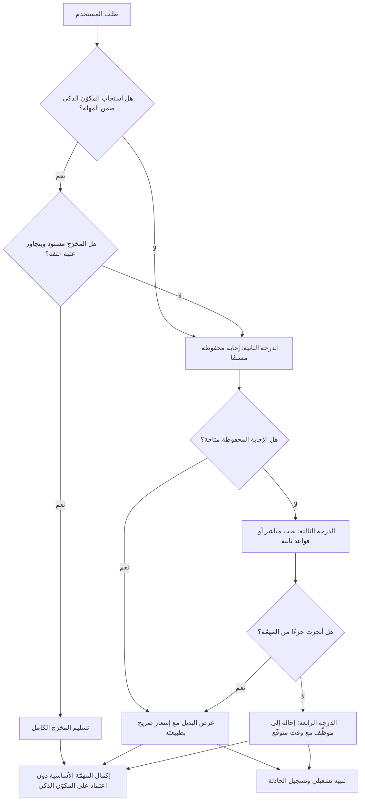

# التدهور الرشيق (Graceful Degradation)

> [!info] تعريف مختصر
> مبدأ تصميمي يقضي بأن يفقد النظام عند الفشل **قدرةً محدّدة** لا **قيمته كلّها**: فحين يتعطّل مكوّن أو يتأخّر أو يتجاوز حدّ الكلفة أو يعجز عن إنتاج مخرَج موثوق، ينتقل النظام إلى مسار بديل أضعف لكنه نافع، ويخبر المستخدم بما جرى وبما يمكنه فعله الآن. نقيضه هو الفشل الحادّ (Hard Failure): شاشة خطأ، أو دوران لا ينتهي، أو الأسوأ — إجابة مخترعة تُقدَّم بثقة كأنها صحيحة. في أنظمة الذكاء الاصطناعي يكتسب المبدأ أهمية استثنائية لأن المكوّن الذكي **احتمالي بطبعه**: يخطئ أحيانًا، ويتأخّر أحيانًا، وكلفته متغيّرة، ويعتمد غالبًا على مزوّد خارجي لا تملك أنت زمن تشغيله. لذلك لا يُسأل «هل سيفشل؟» بل «ما الذي يراه المستخدم حين يفشل؟».

## الشرح العلمي والاحترافي
- **الأصل الهندسي وامتداده**: المبدأ قديم في هندسة الأنظمة والأنظمة الحرجة، حيث تُصمَّم الأعطال لتُفقِد وظيفة ثانوية دون إسقاط الوظيفة الأساسية. وفي تصميم الويب استُعمل بمعنى قريب: بناء التجربة لتظلّ صالحة على بيئة أضعف. الجديد في سياق الذكاء الاصطناعي أن مصدر «الفشل» لم يعد العطل التقني وحده، بل أضيف إليه **الفشل الجوهري**: النموذج يعمل تمامًا، ويردّ خلال ثانية، لكن ردّه ليس موثوقًا بما يكفي لبناء قرار عليه.
- **أربعة أنواع من الفشل تحتاج مسارات مختلفة**: (أ) **فشل التوفّر** — انقطاع المزوّد أو تجاوز حدّ الطلبات؛ (ب) **فشل الزمن** — يستجيب لكن بعد وقت يفسد التجربة؛ (ج) **فشل الكلفة** — يعمل ضمن نطاق ميزانية تجاوزها يجعل العملية خاسرة اقتصاديًّا؛ (د) **فشل الثقة** — مخرَج منخفض الجودة أو بلا سند في المصدر. الخلط بينها يقود إلى مسار بديل واحد لا يناسب أيًّا منها.
- **سُلَّم التدهور لا مفتاح ثنائي**: التصميم الجيّد يرتّب البدائل تنازليًّا لا يقفز من الكامل إلى العدم. مثال نموذجي: النموذج الأقوى ← نموذج أصغر وأسرع وأرخص ← إجابة محفوظة مسبقًا من ذاكرة مؤقّتة ← نتائج بحث مباشر في المستندات دون توليد ← نموذج قائم على قواعد ثابتة ← إحالة إلى موظّف ← نموذج «اترك طلبك وسنعود إليك» مع تحديد وقت. كل درجة تحتفظ بجزء من القيمة.
- **إعلان الحالة جزء من التصميم**: التدهور الصامت يخدع المستخدم؛ فحين يهبط النظام إلى مسار أضعف دون إخبار، يبني المستخدم قراره على مخرَج يظنّه بجودة الأصل. الرشاقة تقتضي إشعارًا صادقًا وموجزًا بلا لغة تقنية: ما الذي تعطّل، وما البديل المتاح، وما الذي سيحدث بعد ذلك، ومتى.
- **قواطع الدائرة والحدود الزمنية**: من الأنماط الأساسية وضع مهلة قصوى صريحة لكل نداء، وقاطع يفتح تلقائيًّا حين تتجاوز الأخطاء عتبة معيّنة فيمنع النظام من الاستمرار في محاولة مكوّن معطوب — وهو ما يمنع تحوّل عطل مكوّن واحد إلى انهيار متسلسل يجرّ النظام كلّه معه.
- **حدّ الكلفة قرار منتج لا إعداد تقني**: تحديد سقف إنفاق لكل مستخدم أو لكل جلسة أو لكل يوم، وتحديد ما يحدث عند بلوغه (تحوّل إلى نموذج أرخص؟ حدّ استخدام؟ إشعار؟) هو قرار نموذج أعمال يتّخذه مالك المنتج بالأرقام، وله أثر مباشر في الكلفة الإجمالية للتملّك ([[TCO]]).
- **البديل يجب أن يكون نافعًا لا شكليًّا**: «حدث خطأ، حاول لاحقًا» ليست تدهورًا رشيقًا بل فشلًا مؤدّبًا. المعيار العملي: هل يستطيع المستخدم إنجاز **جزء** من مهمّته عبر المسار البديل؟ إن كان الجواب لا، فلم يُصمَّم بديل بعد.
- **المسار البديل يجب أن يُختبَر كالمسار الأصلي**: المسارات البديلة تتعفّن بصمت لأنها نادرة الاستخدام، فتُكتشف أعطالها في أسوأ لحظة ممكنة — أثناء الحادثة الحقيقية. لذلك تُدرَج حالات محاكاة الفشل ضمن مجموعة التقييم ([[Evals]]) وتُشغَّل دوريًّا، ويُختبَر التحوّل إليها فعليًّا لا نظريًّا.
- **الأثر على المؤشّرات المُعلنة**: تصميم التدهور يغيّر تعريف «التوفّر» نفسه ([[Uptime]])؛ فالنظام الذي يخدم 100% من الطلبات بجودة متدرّجة يختلف جوهريًّا عن نظام يخدم 97% بجودة كاملة ويسقط في 3%. هذا التمييز يجب أن ينعكس في أهداف مستوى الخدمة ([[SLO]]) وفي مؤشّراتها ([[SLI]]) بدل قياس التوفّر كقيمة ثنائية.

## أين ومتى يُستخدم
- **في تصميم أي ميزة تعتمد على مزوّد خارجي**: لأن زمن تشغيله خارج سيطرتك، ولا يكفي أن تثق بالتزامه التعاقدي دون خطّة لما بعد الإخلال ([[Vendor Lock-in]]).
- **عند تعذّر إنتاج مخرَج موثوق**: بدل السماح للنموذج باختلاق إجابة، يُصمَّم مخرَج «لا أعرف» نافع مع بدائل — وهو الضابط العملي المباشر ضد [[Hallucination]].
- **في وثيقة المتطلّبات ([[PRD]]) ومعايير القبول**: يجب أن يتضمّن كل متطلّب ذكي بندًا صريحًا لسلوك الفشل، يُكتب بصيغة قابلة للاختبار ([[Given When Then]]).
- **في تخطيط الاستمرارية والتعافي**: تحديد ما يبقى عاملًا أثناء العطل يرتبط مباشرة بأهداف زمن التعافي ونقطة استعادة البيانات ([[RTO and RPO]]).
- **في مواسم الذروة والإطلاقات**: تحديد أي الوظائف تُخفَّض طوعًا عند الضغط للحفاظ على الوظيفة الأساسية، بدل ترك الحمل يوزّع الفشل عشوائيًّا.
- **في ضبط تجربة الرعاية اللاحقة للإطلاق ([[Hypercare]])**: حين يكون احتمال المفاجآت أعلى، تُشدَّد المهل وتُوسَّع مسارات الإحالة إلى البشر.
- **في اتفاقيات مستوى الخدمة والتعهّدات التعاقدية**: التمييز بين «الخدمة متاحة» و«الخدمة متاحة بكامل قدرتها» يجب أن يكون منصوصًا عليه لا مفترضًا ([[SLE]]).

## مثال وسيناريو تطبيقي
> [!example] منصّة تجارة إلكترونية خليجية أضافت مساعدًا ذكيًّا لاختيار المقاسات يقرأ وصف المنتج وسجلّ مشتريات العميل ويقترح المقاس. في أسبوع الجمعة البيضاء تضاعف الحمل نحو سبعة أضعاف، فبدأ مزوّد النموذج بإرجاع أخطاء تجاوز حدّ الطلبات. النتيجة في التصميم الأول: مربّع المقاس يظهر بمؤشّر تحميل دائم لا ينتهي، وزر «أضف إلى السلة» معطّل لأنه ينتظر توصية لا تصل. توقّف الشراء في صفحات المنتجات المتأثّرة نحو 40 دقيقة قبل أن يلاحظ الفريق.
> **إعادة التصميم** بنت سُلَّم تدهور من خمس درجات مع مهلة قصوى صريحة قدرها ثانيتان لكل نداء: **الدرجة الأولى** التوصية الكاملة المشخّصة مع سبب مكتوب. **الثانية** عند التأخّر أو الخطأ: توصية محفوظة مسبقًا لهذا المنتج محسوبة ليلًا من بيانات المرتجعات والمقاسات الأكثر ملاءمة، تُعرض مع عبارة صريحة: «اقتراح عام لهذا المنتج بناءً على تجارب المشترين». **الثالثة** إن لم تتوفّر: جدول المقاسات الرسمي من المورّد مع أداة قياس بسيطة. **الرابعة** رابط محادثة مع موظّف خدمة العملاء. **الخامسة** — وهي القرار الأهم — **زر الشراء لا يعتمد على المساعد إطلاقًا** ويبقى فعّالًا في كل الحالات، مع إبراز سياسة الاستبدال المجاني تحته مباشرة.
> أُضيف قاطع دائرة يفتح تلقائيًّا عند تجاوز الأخطاء 20% خلال دقيقة فيحوّل كل الطلبات إلى الدرجة الثانية لخمس دقائق، ثم يجرّب العودة تدريجيًّا. وأُضيف سقف إنفاق يومي يحوّل النظام تلقائيًّا إلى نموذج أصغر وأرخص عند بلوغ 80% من الميزانية بدل إيقاف الخدمة عند 100%.
> في موسم الذروة التالي وقع الانقطاع نفسه لدى المزوّد واستمر 26 دقيقة. ما رصده الفريق داخليًّا: بقاء معدّل إتمام الشراء في الصفحات المتأثّرة قريبًا من مستواه المعتاد، وارتفاع محادثات خدمة العملاء بنحو 15% خلال الفترة، ولم تُسجَّل شكوى واحدة عن «الموقع لا يعمل». كلفة البناء الإضافي كانت أقل من أسبوعي عمل — مقابل 40 دقيقة توقّف شراء في أعلى يوم مبيعات في السنة.

## خطوات أو مخطّط
1. عدّد نقاط الاعتماد على مكوّنات احتمالية أو خارجية، وصنّف كلًّا منها بحسب نوع الفشل المحتمل: توفّر، زمن، كلفة، ثقة.
2. لكل نقطة، اسأل السؤال الحاسم: ما الوظيفة الأساسية التي **يجب** أن تبقى عاملة مهما حدث؟ واحمِها من الاعتماد على المكوّن الذكي.
3. ابنِ سُلَّم بدائل متدرّجًا لا مفتاحًا ثنائيًّا، بحيث تحتفظ كل درجة بجزء من القيمة.
4. حدّد مهلة قصوى صريحة لكل نداء بناءً على تجربة المستخدم لا على قدرة المزوّد.
5. ضع عتبات قاطع الدائرة وسقوف الكلفة بأرقام معتمدة من مالك المنتج، وحدّد سلوك النظام عند بلوغ كل عتبة.
6. صُغ نصوص الإشعار للمستخدم: صادقة، موجزة، خالية من اللغة التقنية، ومتضمّنة الخطوة التالية الممكنة.
7. اربط التحوّل بين الدرجات بتنبيه تشغيلي وسجلّ، فلا يحدث التدهور بصمت عن الفريق أيضًا.
8. أدرج سيناريوهات الفشل في مجموعة التقييم واختبر التحوّل فعليًّا بمحاكاة انقطاع دورية.
9. راجع بعد كل حادثة: هل عمل المسار البديل؟ هل كان نافعًا فعلًا للمستخدم؟ وحدّث التصميم ([[Root Cause Analysis]]).

## ⚠️ مفاهيم خاطئة شائعة
> [!warning]
> - **الخلط بينه وبين التحسين التدريجي (Progressive Enhancement)**: الثاني يبدأ من أساس بسيط يعمل في كل الظروف ثم يضيف طبقات عند توفّرها؛ والأول يبدأ من التجربة الكاملة ثم ينزل عند العطل. النتيجة قد تتشابه، لكن نقطة الانطلاق تختلف — وفي أنظمة الذكاء الاصطناعي البدء من الأساس البسيط غالبًا أمتن.
> - **«رسالة خطأ مهذّبة تكفي»**: التدهور الرشيق يُقاس بقدرة المستخدم على إنجاز جزء من مهمّته، لا بلطف النص. الاعتذار الجميل مع طريق مسدود يبقى طريقًا مسدودًا.
> - **«التدهور يعني تجربة أسوأ فنُخفيه عن المستخدم»**: الإخفاء يحوّل انخفاض جودة معلن إلى خداع؛ فيبني المستخدم قرارًا على مخرَج يظنّه كامل الجودة. الشفافية الموجزة تحمي الثقة وتحمي المسؤولية.
> - **«المسار البديل يُبنى لاحقًا بعد استقرار الميزة»**: المسار البديل يشكّل بنية الميزة نفسها — أي البيانات تُخزَّن مسبقًا، وأين توضع نقاط الفصل، وما الذي يُسمح له بالاعتماد على النموذج. تأجيله يعني إعادة بناء لا إضافة ([[Technical Debt]]).
> - **«يكفي وجود مسار بديل في التصميم»**: المسارات النادرة تتعطّل بصمت مع الوقت. غير المختبَر دوريًّا يجب افتراض أنه لا يعمل.
> - **«هذا شأن هندسي بحت»**: قرار ما الذي يُضحّى به عند الضغط، وماذا يُقال للعميل، وكم تُنفق قبل التحوّل إلى الأرخص — كلها قرارات منتج وحوكمة ([[Governance]]) لها كلفة على العلامة التجارية.
> - **«نجاح التدهور يعني ألّا يشعر أحد»**: بل يعني ألّا يُحرَم أحد من إنجاز مهمّته. الشعور بانخفاض الجودة مقبول ومطلوب؛ الحرمان من المهمّة هو الفشل.

## ❌ ممارسات خاطئة في المشاريع
> [!failure]
> - **جعل الوظيفة الأساسية معتمدة على المكوّن الذكي**: الخطأ ربط زر الشراء أو الإرسال أو الحفظ بانتظار مخرَج من النموذج. لماذا يضرّ: يحوّل عطلًا في ميزة مساعدة إلى توقّف كامل لمسار الإيراد. الحل: افصل المسار الأساسي عن الطبقة الذكية معماريًّا، واجعل الطبقة الذكية إضافة لا شرطًا.
> - **الاعتماد على مهلة المزوّد الافتراضية**: الخطأ ترك المهلة كما جاءت في المكتبة. لماذا يضرّ: مهلة 60 ثانية قد تكون معقولة تقنيًّا وكارثية في واجهة يتوقّع المستخدم استجابتها خلال ثانيتين، وتُراكم طلبات معلّقة تخنق النظام. الحل: مهلة مشتقّة من تجربة المستخدم، مع مسار بديل يُشغَّل عند تجاوزها.
> - **إطلاق ميزة ذكية بلا سقف كلفة**: الخطأ افتراض أن الاستخدام سيبقى ضمن التقدير. لماذا يضرّ: قد تنفجر الفاتورة بسبب حملة تسويقية ناجحة أو استخدام آلي غير متوقّع، فتتحوّل ميزة رابحة إلى خسارة. الحل: سقوف على مستوى المستخدم والجلسة واليوم، مع تحوّل تلقائي إلى نموذج أرخص، وتنبيه مالي مبكّر ([[TCO]]).
> - **عدم اختبار المسار البديل إطلاقًا**: الخطأ الاكتفاء بوجوده في المخطّط. لماذا يضرّ: يُكتشف عطله أثناء الحادثة الحقيقية فتتضاعف مدة التعافي ([[MTTR]]). الحل: محاكاة انقطاع مجدولة، وحالات فشل ضمن مجموعة التقييم، وتشغيل المسار البديل عمدًا على شريحة صغيرة من الحركة دوريًّا.
> - **التدهور الصامت بلا تنبيه ولا سجلّ**: الخطأ التحوّل التلقائي إلى مسار أضعف دون إشعار الفريق. لماذا يضرّ: قد يعمل النظام أسابيع على مسار الطوارئ ولا يعرف أحد، فتُنسب الشكاوى إلى أسباب خاطئة. الحل: كل تحوّل بين الدرجات يولّد سجلًّا ومؤشّرًا مرصودًا، وتجاوز عتبة زمنية يفتح تذكرة تلقائيًّا ([[Issue Log]]).
> - **نصوص إشعار تقنية أو تلقي اللوم على المستخدم**: الخطأ عرض رمز خطأ أو عبارة تشكّك في اتصال المستخدم. لماذا يضرّ: يُفقد الثقة ويرفع حجم تذاكر الدعم بلا فائدة. الحل: صياغة يعتمدها فريق المحتوى ضمن دليل العلامة ([[Brand Guidelines]])، تذكر ما حدث والبديل والخطوة التالية.
> - **افتراض أن مسارًا بديلًا واحدًا يكفي لكل أنواع الفشل**: الخطأ استخدام الردّ الاحتياطي نفسه للانقطاع والتأخّر وضعف الثقة. لماذا يضرّ: ضعف الثقة يحتاج إحالة إلى إنسان أو امتناعًا، بينما التأخّر قد يُعالَج بإجابة محفوظة — والخلط يعطي البديل الخاطئ في اللحظة الخاطئة. الحل: سُلَّم مسارات مصنّف بحسب نوع الفشل، موثّق في سجلّ المخاطر ([[Risk Register]]).

## 🔗 مصطلحات ومفاهيم ذات صلة
[[Hallucination]] | [[Evals]] | [[Prompt Engineering]] | [[Vibe Coding]] | [[Uptime]] | [[SLO]] | [[SLI]] | [[MTTR]] | [[RTO and RPO]] | [[Rollback]] | [[Guard Rails]] | [[Risk Register]] | [[Hypercare]]
