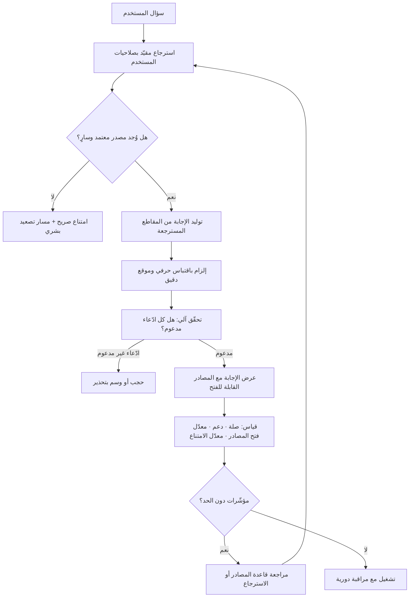

# التأريض المرجعي (Grounding)

> [!info] تعريف مختصر
> ممارسة تصميمية تُقيِّد إجابة النموذج بمجموعة مصادر محدّدة وقابلة للإحالة، بدل أن يجيب من "معرفته" المضمّنة في أوزانه. الفكرة الجوهرية أن النموذج في وضعه الافتراضي **يولّد نصًّا محتملًا لا نصًّا صحيحًا**؛ فحين تُربَط كل جملة في الإجابة بمقطع محدّد من مستند محدّد يمكن للمستخدم فتحه والتحقّق منه، ينتقل النظام من "مصدر يُصدَّق" إلى "واجهة فوق مصدر يُراجَع". والتأريض ليس مرادفًا لتقنية الاسترجاع، بل هو **الخاصّية المطلوبة** التي يُعدّ [[Retrieval-Augmented Generation]] أشهر وسيلة لتحقيقها لكنه لا يضمنها وحده.

## الشرح العلمي والاحترافي
- **جذر المشكلة التي يعالجها**: النموذج اللغوي يتنبّأ بالرمز التالي بناءً على أنماط إحصائية، ولا يحتفظ بتمييز داخلي بين "ما أعرفه من مصدر" و"ما يبدو معقولًا". لذلك تخرج المعلومة الصحيحة والمختلقة بالثقة اللغوية نفسها — وهذا بالضبط ما يجعل [[Hallucination]] مشكلة لا يحلّها مجرّد نموذج أكبر. التأريض يعالج المسألة معماريًّا: يضع بين السؤال والإجابة **طبقة مصادر** يُشترط أن تُشتقّ منها الإجابة.
- **مستويات التأريض ليست واحدة**، ومن الخطأ الحديث عنه كخاصّية ثنائية:
  ① **تأريض بالسياق**: تُحقن المستندات في السياق ويُطلب الاعتماد عليها — أضعف المستويات لأن لا شيء يمنع النموذج من المزج بين المستند ومعرفته السابقة.
  ② **تأريض بالإحالة**: تُرفَق مع كل ادّعاء إشارة إلى مصدره، فيصير التحقّق ممكنًا.
  ③ **تأريض بالاقتباس المُحدَّد**: تُعرَض العبارة الأصلية من المستند مع موقعها الدقيق (صفحة، فقرة، مادة)، فيصير التحقّق فوريًّا ورخيصًا.
  ④ **تأريض مُتحقَّق منه آليًّا**: طبقة لاحقة تقارن كل جملة في الإجابة بالمصدر المزعوم وتحجب أو تُعلِّم ما لا يُدعَم. وهذا المستوى وحده هو الذي يمنح ضمانًا عمليًّا في المجالات عالية المخاطر.
- **الفرق بين "المصدر مذكور" و"الإجابة مشتقّة من المصدر"**: من أخبث أنماط الفشل أن يولّد النموذج إجابة من معرفته العامة ثم يُلحق بها مصدرًا من الحزمة المسترجَعة لأنه يبدو ذا صلة. الإجابة تبدو مؤرَّضة والمصدر موجود، لكن العلاقة بينهما مفقودة. الكشف الوحيد هو **فتح المصدر ومطابقة العبارة**، ولهذا يُقاس التأريض بمقياسين منفصلين: هل المصدر ذو صلة؟ وهل الادّعاء مدعوم بالمصدر فعلًا؟
- **التأريض يقلب افتراض "عدم المعرفة"**: النظام المؤرَّض جيدًا يجب أن يكون قادرًا على قول «لا يوجد في المصادر المتاحة ما يجيب عن هذا». وهذا مخرَج **ناجح** لا فاشل، وأصعب ما في المسألة تنظيميًّا هو إقناع أصحاب المصلحة بذلك، لأن المستخدم يفضّل إجابة واثقة خاطئة على اعتراف صريح بالعجز — وهو الميل نفسه الذي يغذّي [[Sycophancy]].
- **بُعده الأمني**: التأريض يقلّص سطح الهجوم لأنه يحصر ما يُبنى عليه الرد في نطاق معروف، لكنه يفتح في الوقت نفسه قناة دخول: أي مستند في قاعدة المعرفة يصير جزءًا من سياق النموذج، فيصلح ناقلًا لـ[[Prompt Injection]] غير المباشر. لذا تُعامَل قاعدة المصادر كأصل أمني تُدار صلاحياته ونقاء محتواه، لا كمجرّد مجلّد ملفّات.
- **بُعده في الخصوصية والامتثال**: التأريض يجعل تدفّق البيانات قابلًا للوصف — أي بيانات دخلت السياق، من أي مستند، ولأي مستخدم — وهذا شرط عملي لأي إثبات امتثال بموجب [[PDPL]] و[[GDPR]] وتوثيق المعالجة في [[ROPA]]. كما أنه يرث ضوابط الوصول: إن لم تُطبَّق صلاحيات المستخدم على مرحلة الاسترجاع نفسها، صار المساعد قناة تجاوز لكل ضوابط الأذونات القائمة في المؤسّسة ([[Least Privilege]]).
- **الحدّ الأعلى للجودة هو جودة المصدر**: التأريض ينقل الثقة من النموذج إلى المستندات، ولا ينشئ صحّة من العدم. فإن كانت قاعدة المعرفة تحوي ثلاث نسخ متعارضة من سياسة الاسترجاع، سيقتبس النظام إحداها بثقة. لذلك يسبق مشروعَ التأريض عملُ حوكمة محتوى غير مثير للحماس لكنه حاسم: مصدر واحد للحقيقة ([[Single Source of Truth]])، وتواريخ سريان، ومالك لكل مستند، وحذف المتقادم.
- **الأثر السلوكي على المستخدم**: إظهار المصادر لا يفيد التحقّق فحسب، بل يغيّر علاقة المستخدم بالأداة: يقلّل [[Automation Bias]] لأن وجود مرجع يذكّر بأن ثمّة ما يمكن مراجعته. لكنه سلاح ذو حدّين — فعرض المصادر قد يمنح ثقة زائفة لمن لا يفتحها أصلًا. لذلك تُقاس فائدته بمعدّل فتح المصادر فعليًّا لا بوجودها في الواجهة.

## أين ومتى يُستخدم
- **في كل مساعد يجيب عن سياسات أو عقود أو أنظمة**: الإجابة بلا إحالة إلى المادة والفقرة عديمة القيمة تشغيليًّا مهما كانت صحيحة، لأن الموظّف لا يستطيع البناء عليها.
- **في بناء أي نظام قائم على [[Retrieval-Augmented Generation]]**: التأريض هو المعيار الذي يُحكَم به على المعمارية، ويُقاس ضمن [[Evals]] بمقياسي الصلة والدعم لا برضا المستخدم.
- **في المجالات عالية الأثر على المستخدم**: أي محتوى يمسّ المال أو الصحة أو الوضع القانوني تنطبق عليه اعتبارات [[YMYL]]، ويصير التأريض المُتحقَّق منه شرطًا لا تحسينًا.
- **في تصميم [[Guard Rails]]**: قاعدة «لا إجابة بلا مصدر» أحد أوضح الحدود القابلة للتنفيذ برمجيًّا، وأكثرها قابلية للمراقبة.
- **عند التعامل مع بيانات المؤسّسة الحسّاسة**: يُطبَّق التأريض مع حصر الاسترجاع في ما يملك المستخدم صلاحية رؤيته، وربط ذلك بضوابط [[Data Residency]] حين تُعالَج البيانات خارج النطاق الجغرافي.
- **في مراجعة جاهزية الإطلاق ([[Definition of Done]])**: يُشترط قبل الإصدار قياس نسبة الادّعاءات المدعومة بمصادر، ونسبة الامتناع الصحيح عند غياب المصدر.

## مثال وسيناريو تطبيقي
> [!example] بنك خليجي أطلق مساعدًا داخليًّا يجيب موظّفي الفروع عن إجراءات فتح الحسابات وضوابط [[KYC]]. قاعدة المعرفة: 1,400 مستند بصيغ متعدّدة تراكمت على مدى تسع سنوات في ثلاثة مواقع مختلفة.
> الإصدار الأول رُبط بالمستندات كلها وطُلب من النموذج «الاعتماد على المستندات المرفقة فقط». جودة الردود بدت ممتازة في العرض التجريبي. وبعد ستة أسابيع من التشغيل رُصدت 34 حالة أجاب فيها المساعد بإجراء **ملغى منذ 2021**، منها 11 حالة أدّت إلى رفض معاملات عملاء بشروط لم تعد سارية.
> التحليل أظهر ثلاثة أعطاب متمايزة: ① قاعدة المعرفة تحوي النسخة القديمة والجديدة من التعميم نفسه بلا تاريخ سريان، والاسترجاع كان يفضّل القديمة أحيانًا لأن صياغتها أقرب لصياغة سؤال الموظّف. ② في 8 حالات كانت الإجابة صحيحة المضمون لكن المصدر المرفق **لا يتضمّنها إطلاقًا**؛ النموذج ولّد من معرفته العامة وألحق أقرب مستند. ③ حين لا يجد الجواب، كان يركّب إجابة "معقولة" من مستندين مختلفين بدل أن يمتنع.
> ما نُفِّذ: ① تنظيف قاعدة المعرفة إلى 610 مستندات معتمدة، لكلٍّ مالك وتاريخ سريان، وأرشفة الباقي خارج نطاق الاسترجاع. ② إلزام المخرَج بأن يقتبس العبارة الحرفية من المصدر مع رقم البند، وطبقة تحقّق آلية تقارن كل ادّعاء بالمصدر المزعوم وتحجب غير المدعوم. ③ صياغة مخرَج امتناع صريح: «لا يوجد في السياسات المعتمدة ما يغطّي هذه الحالة — حوِّل إلى وحدة الالتزام»، وقياسه كنجاح لا كفشل. ④ لوحة تشغيلية تعرض أسبوعيًّا نسبة الامتناع ونسبة فتح الموظّفين للمصادر.
> النتيجة بعد ربع: انخفضت البلاغات عن إجابات خاطئة إلى 3 حالات، وارتفعت نسبة الامتناع الصريح من قرابة الصفر إلى 12% من الأسئلة — وهو الرقم الذي اعتبره فريق الالتزام **أهم مؤشّر نجاح** في المشروع كله، لأنه يعني أن النظام صار يعرف حدود ما يعرف.

## خطوات أو مخطّط
1. عرّف نطاق المصادر المعتمدة صراحةً، واستبعد كل ما لا مالك له ولا تاريخ سريان.
2. نظّف وحوكم المحتوى قبل بناء أي شيء: نسخة واحدة سارية لكل موضوع ([[Single Source of Truth]])، وأرشفة المتقادم خارج نطاق الاسترجاع.
3. طبّق صلاحيات المستخدم على طبقة الاسترجاع نفسها، لا على العرض فقط.
4. اشترط في تنسيق المخرَج إحالة لكل ادّعاء، مع اقتباس حرفي وموقع دقيق يمكن فتحه.
5. أضف طبقة تحقّق آلية تقارن الادّعاء بالمصدر وتحجب أو توسم غير المدعوم.
6. صمّم مخرَج الامتناع بلغة تشغيلية تخبر المستخدم بالخطوة التالية، لا برسالة اعتذار جافّة.
7. قِس مقياسين منفصلين: صلة المصدر، ودعم المصدر للادّعاء — ولا تخلطهما في رقم واحد.
8. راقب سلوك المستخدم: معدّل فتح المصادر، ومعدّل الإبلاغ عن خطأ، ومعدّل الامتناع.
9. افحص قاعدة المصادر أمنيًّا بوصفها قناة دخول محتملة لـ[[Prompt Injection]]، وقيّد من يستطيع إضافة مستند إليها.

## ⚠️ مفاهيم خاطئة شائعة
> [!warning]
> - **«التأريض والاسترجاع شيء واحد.»** الاسترجاع وسيلة، والتأريض خاصّية مطلوبة في المخرَج. يمكن أن يوجد استرجاع بلا تأريض حقيقي (النموذج يمزج بين المستند ومعرفته)، وقد يتحقّق التأريض بوسائل أخرى مثل استدعاء واجهة برمجية تعيد قيمة موثوقة. التصحيح: قِس المخرَج لا المعمارية.
> - **«وجود المصادر تحت الإجابة يعني أنها مؤرَّضة.»** المصدر المرفق قد يكون ذا صلة بالموضوع دون أن يتضمّن الادّعاء. التصحيح: افصل قياس الصلة عن قياس الدعم، وعيّن التحقّق البشري على عيّنة دورية.
> - **«التأريض يلغي الهلوسة.»** يخفّضها بدرجة كبيرة ويحوّل معظمها إلى شكل قابل للكشف، لكنه يفتح أنماط فشل جديدة: استرجاع مستند خاطئ، تركيب إجابة من مصدرين متعارضين، أو اقتباس صحيح خارج سياقه. التصحيح: أبقِ [[Evals]] فعّالة بعد التأريض لا قبله فقط.
> - **«كلما زادت المستندات تحسّنت الإجابة.»** كثرة المصادر تزيد الضجيج واحتمال التعارض وتخفض دقّة الاسترجاع. التصحيح: جودة القاعدة وحداثتها أهم من حجمها، والحذف عمل إنتاجي.
> - **«التأريض مسألة هندسية بحتة.»** أكبر عوائقه تنظيمية: من يملك المستند؟ ما النسخة السارية؟ من يعتمد الحذف؟ التصحيح: خطّط لمرحلة حوكمة محتوى قبل المرحلة التقنية، وقدّرها في الجدول بصدق.
> - **«الامتناع عن الإجابة إخفاق يجب تقليله إلى الصفر.»** الامتناع في موضعه هو الدليل الأوضح على أن النظام يعرف حدوده، ودفعه إلى الصفر يعني إعادة إنتاج الهلوسة. التصحيح: تعامل مع معدّل الامتناع كمؤشّر يُضبط عند نطاق سليم لا كعيب يُستأصل.

## ❌ ممارسات خاطئة في المشاريع
> [!failure]
> - **إسقاط أرشيف المؤسّسة كاملًا في قاعدة المعرفة.** الخطأ: توصيل مجلّدات مشتركة عمرها سنوات بلا تصفية. لماذا يضرّ: يُدخل سياسات ملغاة ومسوّدات وبيانات شخصية في نطاق الاسترجاع، ويخفض الدقّة ويخلق مخاطرة امتثال. الحل: ابدأ بنطاق ضيّق معتمَد ووسّعه بطلب موثّق، واجعل الإدراج قرارًا لا وضعًا افتراضيًّا.
> - **إهمال تطبيق الأذونات على طبقة الاسترجاع.** الخطأ: فهرسة كل شيء ثم الاعتماد على النموذج في عدم إفشاء ما لا يخصّ المستخدم. لماذا يضرّ: يحوّل المساعد إلى قناة تجاوز لكل ضوابط الوصول القائمة، ويكفي سؤال ذكي واحد لكشف بيانات رواتب أو ملفّات موظّفين. الحل: طبّق التصفية بالأذونات قبل الاسترجاع لا بعده ([[Least Privilege]]).
> - **قياس النجاح برضا المستخدم وحده.** الخطأ: مؤشّر «هل كانت الإجابة مفيدة؟» كمقياس أساسي. لماذا يضرّ: المستخدم يقيّم الطلاقة والسرعة لا الصحّة، فتُكافأ الإجابات الواثقة غير المدعومة. الحل: اجعل نسبة الادّعاءات المدعومة بمصدر هي مقياس الجودة الأساسي، والرضا مقياسًا ثانويًّا.
> - **عرض المصادر بطريقة لا تُشجّع على فتحها.** الخطأ: روابط بأسماء ملفّات غامضة أو أرقام مراجع بلا اقتباس. لماذا يضرّ: يمنح مظهر الشفافية دون فائدتها، ويزيد الثقة الزائفة بدل أن يقلّلها. الحل: اعرض العبارة المقتبسة والموقع الدقيق داخل الواجهة نفسها، وقِس معدّل الفتح.
> - **تجاهل تواريخ السريان والملكية.** الخطأ: مستندات بلا تاريخ ولا مالك في نطاق الاسترجاع. لماذا يضرّ: يُنتج إجابات صحيحة بالنسبة لسنة مضت، وهو أخطر من الخطأ الواضح لأنه يمرّ من التدقيق. الحل: اشترط بيانات تعريف إلزامية لكل مستند، واستبعد آليًّا ما تجاوز تاريخ مراجعته.
> - **اعتبار قاعدة المصادر منطقة آمنة.** الخطأ: السماح لأي موظّف أو نظام بإضافة مستندات إليها. لماذا يضرّ: يصير كل مستند ناقلًا محتملًا لتعليمات خبيثة تصل إلى سياق النموذج ([[Prompt Injection]]). الحل: اجعل الإضافة مسارًا معتمدًا مع مراجعة، وسجّل من أضاف ماذا ومتى.
> - **إطلاق المشروع بلا مسار تصعيد بشري.** الخطأ: نظام يجيب دائمًا ولا مخرج له عند العجز. لماذا يضرّ: يدفع النظام إلى تلفيق إجابة في أصعب الحالات وأخطرها بالضبط. الحل: صمّم مسار [[Human in the Loop]] كجزء من التجربة الأساسية لا كخطة طوارئ.

## 🔗 مصطلحات ومفاهيم ذات صلة
[[Retrieval-Augmented Generation]] | [[Hallucination]] | [[Sycophancy]] | [[Prompt Injection]] | [[Least Privilege]] | [[Guard Rails]] | [[Evals]] | [[Human in the Loop]] | [[Single Source of Truth]] | [[Automation Bias]] | [[YMYL]] | [[PDPL]]
