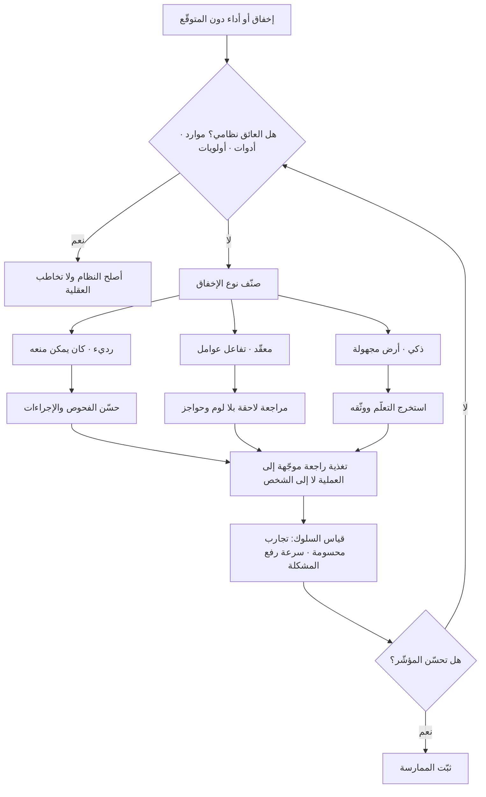

# العقلية النامية (Growth Mindset)

> [!info] تعريف مختصر
> اعتقاد الفرد بأن القدرات — كالذكاء والمهارة — قابلة للتطوّر بالجهد والاستراتيجية والتغذية الراجعة، في مقابل «العقلية الثابتة» التي ترى القدرة سمة موروثة محدّدة سلفًا. الفكرة صاغتها ونشرتها عالمة النفس **كارول دويك (Carol Dweck)** وفريقها البحثي، وتقول إن ما يعتقده الشخص عن قابلية قدرته للتغيّر يؤثّر في كيفية تفسيره للفشل: فمن يراها ثابتة يقرأ الإخفاق حكمًا على قيمته فيتجنّب التحدّي، ومن يراها قابلة للنموّ يقرأه معلومة عن استراتيجيته فيعدّلها ويكرّر. **وهذا المصطلح من أكثر مفاهيم علم النفس التنظيمي إثارةً للجدل العلمي**، إذ أظهرت الدراسات التكرارية والتحليلات البعدية اللاحقة أن أحجام الأثر أصغر بكثير ممّا أوحت به الموجة الشعبية للفكرة — ولا يمكن اليوم عرضه بأمانة دون عرض هذا النقد.

## الشرح العلمي والاحترافي
- **الآلية المفترضة**: الاعتقاد بقابلية القدرة للتغيّر يغيّر **إسناد سبب الفشل**. صاحب العقلية الثابتة يسنده إلى قدرة ناقصة (سبب داخلي غير قابل للتغيير) فيقلّ إقدامه؛ وصاحب العقلية النامية يسنده إلى استراتيجية أو جهد أو تدريب (أسباب قابلة للتعديل) فيعيد المحاولة بطريقة مختلفة. الفارق العملي إذن ليس في التفاؤل، بل في **مكان توجيه الانتباه بعد الإخفاق**.
- **ما ليس هو**: ليس الإيمان بأن الجهد وحده يكفي، ولا إنكار الفروق الفردية والقيود الواقعية، ولا التفاؤل العام. دويك نفسها كتبت لاحقًا محذّرة ممّا أسمته «العقلية النامية الزائفة»: أن يعلن المرء تبنّيه لها دون أي تغيير في السلوك، أو أن تُختزل في مدح الجهد بذاته حتى مع استراتيجية فاشلة — وهو ما يكافئ التكرار العقيم بدل التعلّم.
- **النقد العلمي — الجزء الذي يُحذف عادةً ولا ينبغي حذفه**:
  ① **ضعف أحجام الأثر**: التحليلات البعدية الواسعة التي جمعت عشرات الدراسات وجدت ارتباطًا ضعيفًا جدًّا بين العقلية المُقاسة والتحصيل الفعلي، وأثرًا صغيرًا جدًّا للتدخّلات التدريبية في المتوسط — أصغر بمراتب ممّا يوحي به الخطاب الشعبي عن المفهوم.
  ② **أزمة التكرار**: عدّة محاولات تكرار مستقلّة وواسعة العيّنة لم تُعِد إنتاج النتائج الأصلية بالحجم نفسه، وهذا نمط شهده كثير من مفاهيم علم النفس الاجتماعي في العقد الأخير، لا هذا المفهوم وحده.
  ③ **انتقائية الأثر**: حتى الدراسات الداعمة تشير إلى أن الفائدة تتركّز في فئات بعينها — الطلاب المتعثّرون أو الأقل حظًّا اقتصاديًّا — لا في عموم الناس، ومتوسّط الأثر الصغير قد يخفي أثرًا ذا معنى لفئة محدودة.
  ④ **مشكلات القياس**: تُقاس العقلية غالبًا باستبانات قصيرة تقرير ذاتي، وهي عرضة لاستجابة المرغوبية الاجتماعية؛ فمن السهل جدًّا أن يختار المشارك الإجابة «الصحيحة» دون أن يعكس ذلك اعتقاده أو سلوكه الفعلي.
  ⑤ **الانتقال غير المبرهن إلى بيئة العمل**: معظم البحث الأصلي أُجري في سياقات تعليمية مع طلاب. تعميمه على فرق هندسية أو مشاريع مؤسسية تعميم **يتجاوز الأدلّة**، ولا يوجد أساس متين لادّعاء أن ورشة عن العقلية النامية ترفع إنتاجية فريق.
  ⑥ **خطر تحميل الفرد مسؤولية عوائق بنيوية**: أخطر إساءات الاستعمال إداريًّا. حين يفشل فريق بسبب نقص موارد أو أولويات متضاربة أو دَين تقني متراكم، فإن ردّ الفشل إلى «عقلية» الأفراد يحوّل مشكلة نظامية إلى نقص شخصي — وهو ما يشلّ الإصلاح الحقيقي ويُنتج استياءً مبرَّرًا. من هنا فإن هذه الأداة تُعالج بالضبط المنطقة التي يُفترض أن يعالجها [[Blameless Postmortem]] بمنهج أسلم.
- **ما يبقى صالحًا للممارسة بعد النقد**: النقد يُسقط الادّعاء الكبير («تغيير المعتقد يغيّر الأداء بقوّة»)، ولا يُسقط جملة من الممارسات التي لها سند مستقل أمتن:
  ① **التغذية الراجعة الموجّهة إلى العملية**: التعليق على الاستراتيجية والخطوات القابلة للتعديل بدل الحكم على الشخص وصفاته، وهو أصلًا ركن في التقييم الجيّد وفي [[Active Listening]].
  ② **فصل تقييم القرار عن تقييم النتيجة**: قرار جيّد قد يعطي نتيجة سيّئة والعكس؛ وهذا سند مستقل عن نظرية العقلية.
  ③ **جعل الفشل معلومة قابلة للتحليل**: عبر آليات مؤسسية موثّقة الأثر مثل [[Blameless Postmortem]] و[[Kaizen]] و[[Feedback Loop]] — أي بتغيير النظام لا بتغيير القناعات.
  ④ **تسمية الحالة الانتقالية**: صياغة «لم نصل بعد» بدل «فشلنا» تصف واقعة زمنية لا حكمًا نهائيًّا، وهي مفيدة لغويًّا وإداريًّا حتى لو لم يُثبت أنها ترفع الأداء إحصائيًّا.
  ⑤ **الاعتراف بالحدود**: أنفع تطبيق إداري للفكرة هو التواضع نفسه الذي تدعو إليه — تجربتها بحجم صغير وقياس أثرها بدل افتراضه.
- **الخلاصة المهنية**: يُستعمل المفهوم كـ**لغة مشتركة ومبدأ لتصميم التغذية الراجعة**، لا كتفسير للأداء ولا كأداة تقييم أفراد ولا كعلاج لمشكلات تنظيمية. من يعرضه كحقيقة علمية راسخة الأثر يتجاوز ما تسمح به الأدلّة الحالية.

## أين ومتى يُستخدم
- **في تصميم التغذية الراجعة داخل الفريق**: توجيه التعليق إلى الاستراتيجية والخطوات لا إلى صفات الشخص، بما ينسجم مع مبدأ [[Blameless Postmortem]].
- **في بناء الأمان النفسي**: كلغة تُخفّض كلفة الاعتراف بعدم المعرفة، مكمّلة لـ[[Psychological Safety]] لا بديلة عنها — والبديل البنيوي أقوى أثرًا من الخطاب.
- **في مسارات التطوير المهني**: عند تصميم خطط نموّ فردية داخل [[Probation Period]] أو مسارات التخصّص، بالتركيز على مهارات قابلة للاكتساب بمعايير مُقاسة.
- **في الفرق التي تواجه تقنية جديدة**: عند تبنّي أدوات أو مجالات غير مألوفة، حيث يكون الإخفاق المبكّر متوقّعًا ومرتبطًا بـ[[Intelligent Failure]] لا بضعف الكفاءة.
- **في ثقافة التحسين المستمر**: كخلفية مفاهيمية لـ[[Kaizen]] و[[PDCA]]، مع الانتباه إلى أن الأثر الحقيقي يأتي من انضباط الدورة لا من الخطاب المصاحب لها.
- **في القيادة وأسلوب طرح الأسئلة**: عند ممارسة [[Servant Leadership]] و[[Emotional Intelligence]]، بجعل «ما الذي جرّبته وما الذي ستغيّره؟» سؤالًا افتراضيًّا بدل «لماذا فشلت؟».

## مثال وسيناريو تطبيقي
> [!example] شركة برمجيات في عمّان لديها فريق من 9 مهندسين، طُلب منه خلال 5 أشهر بناء تكاملات مع بوّابات دفع في ثلاث دول لم يسبق للفريق العمل معها. في الشهر الأول فشلت أول محاولتَي تكامل، وارتفعت نسبة إعادة العمل ([[Rework Percentage]]) إلى 34%.
> **المسار الشائع الخاطئ**: عقدت الإدارة ورشة نصف يوم عن «العقلية النامية»، وعُلّقت لافتة «الفشل فرصة للتعلّم»، وطُلب من الجميع تبنّي العقلية النامية. بعد ستة أسابيع لم يتغيّر شيء في المؤشّرات، وظهر أثر سلبي غير متوقّع: صار المهندسون يفسّرون العبارة على أنها تمهيد لتحميلهم مسؤولية مشكلة يعرفون أن سببها في مكان آخر — فوثائق البوّابات كانت ناقصة، وبيئة الاختبار لدى إحداها غير متاحة إلا 4 ساعات يوميًّا، ولم يكن هناك وقت مخصّص للاستكشاف أصلًا في خطة السباق.
> **المسار الذي اعتُمد لاحقًا**: أُبقيت اللغة وتُرك الادّعاء. لم يُطلب من أحد «تغيير عقليته»، وبدل ذلك تغيّرت أربعة أشياء في **النظام**:
> ① خُصّص يوم أسبوعي معلَن للاستكشاف التقني، بمخرج مطلوب هو **سؤال محسوم** لا ميزة مسلَّمة.
> ② تغيّرت صيغة مراجعة العمل من «لماذا تأخّر هذا؟» إلى ثلاثة أسئلة ثابتة: ما الذي جرّبته؟ ما الذي تعلّمته؟ ما الذي ستغيّره في المحاولة القادمة؟
> ③ صار كل إخفاق تكامل يُصنَّف في دقيقتين: رديء (كان يمكن منعه بفحص قائم)، أو معقّد (تفاعل بيئات)، أو ذكي (أرض مجهولة فعلًا) — فاختلفت الاستجابة باختلاف الفئة بدل ردّ فعل واحد.
> ④ صُعِّدت العوائق الخارجية بوصفها عوائق مؤسسية في [[RAID Log]]، فتفاوضت الإدارة مع البوّابة الثالثة على توسيع نافذة بيئة الاختبار.
> النتيجة بعد ثلاثة أشهر: انخفضت نسبة إعادة العمل إلى 12%، وأُنجزت التكاملات الثلاثة. والملاحظة التي سجّلها قائد الفريق بأمانة في المراجعة: من المتعذّر عزو التحسّن إلى «تغيّر في عقلية أحد»؛ التغيّر القابل للرصد كان في **الوقت المخصّص والوصول إلى بيئة الاختبار وصيغة الأسئلة** — أي في النظام. اللغة ساعدت في جعل الاعتراف بعدم المعرفة مقبولًا، لكنها لم تكن السبب، وادّعاء أنها السبب كان سيكون استنتاجًا لا تسنده الوقائع.

## خطوات أو مخطّط
1. **ابدأ من النظام لا من القناعات**: افحص أولًا هل العائق موارد أو أولويات أو أدوات أو صلاحيات. إن كان كذلك، فأي عمل على «العقلية» مضيعة للوقت وإساءة في التشخيص.
2. **غيّر صيغة التغذية الراجعة**: انتقل من الحكم على الشخص («أنت دقيق/غير دقيق») إلى وصف العملية («هذه الطريقة أعطت هذه النتيجة، ما البديل؟»).
3. **افصل تقييم القرار عن تقييم النتيجة**: قيّم جودة المعلومات والمنهج وقت اتخاذ القرار، وسجّل ذلك في [[Decision Log]] ليُحتكم إليه لاحقًا.
4. **صنّف كل إخفاق قبل الاستجابة له**: رديء أم معقّد أم ذكي ([[Intelligent Failure]])، لأن الاستجابة الموحّدة لكل الأنواع هي الخطأ الأكبر.
5. **اجعل الاعتراف بعدم المعرفة رخيصًا**: عبارات مثل «لا أعرف بعد، سأتحقّق خلال يومين» يجب أن تُقابل بالتقدير علنًا ([[Intellectual Humility]]).
6. **امنح وقتًا محجوزًا للتعلّم**: بلا وقت مخصّص في الخطة يبقى الحديث عن التعلّم شعارًا يناقضه جدول التسليم.
7. **قِس السلوك لا المعتقد**: تتبّع مؤشّرات مثل عدد التجارب المحسومة، وزمن رفع المشكلة إلى السطح، وعدد البلاغات الطوعية — لا نتائج استبانة «هل تؤمن بأن القدرات تتطوّر؟».
8. **جرّب أي تدخّل بحجم صغير وقِس أثره**: عامل ورشة العقلية نفسها كتجربة لها فرضية ومعيار فشل، لا كحقيقة مفروغ منها.
9. **امتنع عن استعمالها في التقييم الرسمي**: تصنيف موظف بأن لديه «عقلية ثابتة» يحوّل الأداة إلى وصمة، وهو ضدّ المفهوم نفسه من أساسه.

## ⚠️ مفاهيم خاطئة شائعة
> [!warning]
> - **عرضها كحقيقة علمية راسخة قوية الأثر**: هذا تجاوز للأدلّة. الوضع الحالي أقرب إلى: فكرة ذات قيمة لغوية وتصميمية للتغذية الراجعة، لكن أحجام أثرها على الأداء صغيرة وغير مستقرّة عبر الدراسات التكرارية. من يقدّمها بيقين مطلق في تدريب مؤسسي يبيع أكثر ممّا يملك.
> - **اختزالها في مدح الجهد**: «حاولتَ بجد، أحسنت» مع استراتيجية خاطئة تُكافئ التكرار العقيم. المطلوب مدح **تغيير الاستراتيجية والتعلّم**، وهو تحذير نبّهت إليه دويك نفسها في كتاباتها اللاحقة.
> - **استعمالها لتفسير الفشل التنظيمي**: نسبة إخفاق المشروع إلى «عقلية الفريق» في وجود نقص موارد أو أولويات متضاربة تشخيص خاطئ يمنع الإصلاح ويولّد استياءً محقًّا. ابدأ دائمًا بفحص النظام.
> - **الظنّ أن الشخص إمّا نامٍ أو ثابت العقلية بالكامل**: التوصيف الأدقّ أن الاستجابة تتغيّر بحسب المجال والموقف ومستوى الضغط؛ الشخص نفسه قد يستقبل النقد بانفتاح في مجال يتقنه وبدفاعية في مجال يشعر فيه بالهشاشة.
> - **افتراض أن ورشة تدريبية تُحدث تغييرًا**: لا سند قويًّا لذلك. ما يغيّر السلوك في الفرق هو تغيّر الحوافز والوقت المخصّص وصيغة الأسئلة المتكرّرة، لا محاضرة نصف يوم.
> - **الخلط بينها وبين التفاؤل أو الحماس**: الفكرة تتعلّق بمعتقد عن **قابلية القدرة للتغيّر**، وقد يجتمع هذا مع تقدير واقعي شديد التشاؤم للجدول الزمني. الخلط بينهما يحوّلها إلى أداة ضغط معنوي على من يبدي تحفّظات واقعية.

## ❌ ممارسات خاطئة في المشاريع
> [!failure]
> - **الخطأ: إطلاق حملة داخلية عن «عقلية النموّ» ردًّا على تعثّر مشروع**. لماذا يضرّ: يُقرأ كتحويل للمسؤولية من الإدارة إلى الأفراد، فيولّد سخرية داخلية تُضعف أي مبادرة ثقافية لاحقة. الحل: أدر [[Blameless Postmortem]] أولًا، وعالج العوامل النظامية الظاهرة، ولا تتحدّث عن العقليات قبل ذلك.
> - **الخطأ: إدراج «العقلية النامية» بندًا في نموذج تقييم الأداء**. لماذا يضرّ: يحوّل معتقدًا داخليًّا إلى أداء تمثيلي — يتعلّم الجميع قول العبارات الصحيحة دون تغيير سلوكي، وهو ما سُمّي «العقلية النامية الزائفة». الحل: قيّم سلوكيات مرصودة ومحدّدة (طلب تغذية راجعة، تعديل الاستراتيجية بعد نتيجة، رفع المشكلة مبكّرًا) لا معتقدات.
> - **الخطأ: استعمالها لتبرير أهداف غير واقعية**. لماذا يضرّ: يُلبس الضغط المفرط لباسًا نفسيًّا مقبولًا («من يعترض لديه عقلية ثابتة»)، فتُخنق التقديرات الصادقة ويتآكل [[Sustainable Pace]]. الحل: افصل تمامًا بين ثقافة التعلّم وبين واقعية الجدول، واحمِ من يقدّم تقديرًا متحفّظًا بدليل.
> - **الخطأ: مدح الجهد بذاته وتجاهل الاستراتيجية**. لماذا يضرّ: يعلّم الفريق أن الاجتهاد المتكرّر بالطريقة نفسها مكافَأ، فيتحوّل الإصرار إلى هدر. الحل: اجعل السؤال الثابت بعد أي إخفاق «ما الذي ستغيّره في المحاولة القادمة؟»، ولا تُقبل إجابة «سأحاول أكثر».
> - **الخطأ: الاستشهاد بأرقام مبالغ فيها عن أثر المفهوم في العروض الداخلية**. لماذا يضرّ: أول شخص في القاعة يعرف أدبيات التكرار سيُسقط مصداقية العرض كلّه، بما فيه الجزء الصحيح منه. الحل: اعرض الفكرة كإطار لغوي ومبدأ لتصميم التغذية الراجعة، واذكر محدودية الأدلّة صراحةً — فالصراحة هنا تزيد المصداقية لا تنقصها.
> - **الخطأ: تطبيقها بلا أمان نفسي حقيقي**. لماذا يضرّ: مطالبة الناس بتقبّل الفشل في بيئة تعاقب على الفشل تناقض صارخ يزيد القلق بدل أن يقلّله. الحل: ابنِ [[Psychological Safety]] بآليات ملموسة أولًا — مراجعات بلا لوم، شروط إيقاف محمية، عدم معاقبة من يرفع الأخبار السيّئة.
> - **الخطأ: توقّع أثر سريع وقياسه بمؤشّرات المشروع مباشرة**. لماذا يضرّ: يُعلن فشل المبادرة بعد شهر لأن السرعة لم ترتفع، أو — وهو الأسوأ — يُدّعى نجاحها بربطها بتحسّن سببه شيء آخر تمامًا. الحل: قِس سلوكيات وسيطة محدّدة على مدى أرباع سنوية، وسجّل صراحةً ما لا يمكن عزوه إلى المبادرة.

## 🔗 مصطلحات ومفاهيم ذات صلة
[[Intellectual Humility]] | [[Intelligent Failure]] | [[Blameless Postmortem]] | [[Psychological Safety]] | [[Pre-mortem]] | [[Kill Criteria]] | [[Kaizen]] | [[PDCA]] | [[Feedback Loop]] | [[Emotional Intelligence]] | [[Adaptability]] | [[Servant Leadership]] | [[Sustainable Pace]] | [[Confirmation Bias]]
