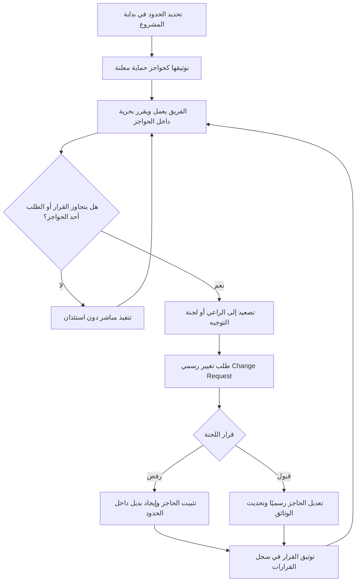

# حواجز الحماية (Guard Rails)

> [!info] تعريف مختصر
> حواجز الحماية (Guard Rails) هي الحدود المتّفق عليها في بداية المشروع والتي لا يجوز للفريق تجاوزها أثناء التنفيذ: حدود زمنية، ومالية، وتقنية، وتعاقدية أو تنظيمية. جوهر الفكرة أن هذه الحدود ليست قيودًا تُبطئ العمل، بل العكس: بوجود حدود واضحة يستطيع الفريق اتخاذ معظم القرارات بنفسه دون الرجوع للإدارة في كل تفصيلة، فهي النقيض العملي لـ[[Micromanagement]].

## الشرح العلمي والاحترافي
- **التعريف الدقيق**: حاجز الحماية هو "حدّ لا يُتجاوز" (Non-negotiable Boundary) يُتفق عليه صراحةً بين الراعي (Sponsor) وأصحاب المصلحة وفريق التنفيذ، ويُصاغ بلغة واضحة قابلة للاختبار: هل تجاوزناه أم لا؟ داخل هذه الحدود، الفريق حرّ ومُخوَّل؛ خارجها، لا بدّ من تصعيد وقرار رسمي.
- **أنواع حواجز الحماية**:
  - **زمنية (Time Guard Rails)**: موعد نهائي لا يقبل التأجيل، مثل: "موديول الفوترة يجب أن يُسلَّم قبل 30 نوفمبر لارتباطه ببداية السنة المالية للعميل".
  - **مالية (Budget Guard Rails)**: سقف إنفاق للمرحلة أو لبند معيّن، مثل: "ميزانية مرحلة الاكتشاف لا تتجاوز 50,000 وحدة، وأي تجاوز يتطلب موافقة لجنة التوجيه".
  - **تقنية (Technical Guard Rails)**: تقنية أو منصّة أو معمارية مفروضة، مثل: "قاعدة البيانات يجب أن تكون PostgreSQL"، أو "لا يُسمح باستضافة البيانات خارج نطاق المنطقة الجغرافية المحددة".
  - **تعاقدية وتنظيمية (Contractual & Regulatory Guard Rails)**: التزامات ناتجة عن خطة موقّعة أو عقد أو امتثال رقابي، مثل: نطاق موصوف في [[Scope Statement]] موقّع، أو متطلبات امتثال (GDPR، HIPAA، معايير البنك المركزي) لا يجوز المساس بها مهما كانت الضغوط.
- **الفكرة الجوهرية: الحواجز تُسرِّع ولا تُبطئ**: يبدو للوهلة الأولى أن الحدود تقيّد الفريق، لكن الواقع عكس ذلك. حين لا يعرف الفريق أين تقع الحدود، يضطر إلى استئذان الإدارة في كل قرار خشية الخطأ، فيتباطأ العمل ويتحول المدير إلى عنق زجاجة. أما حين تكون الحدود معلنة ومكتوبة، فإن الفريق يتحرك بثقة داخلها ويقرر بنفسه، وهو ما يُعرف بالتمكين المنضبط ([[Empowerment]] داخل حدود واضحة).
- **حاجز حماية مقابل قيد عام (Constraint)**: كل حاجز حماية هو قيد، لكن ليس كل قيد حاجز حماية. القيد (Constraint) وصف لواقع يحدّ من الخيارات (مثل: توفر مورد واحد فقط بخبرة معينة)، وقد يُدار أو يُخفَّف أو يُتفاوض عليه. أما حاجز الحماية فهو **قرار حوكمة صريح** بأن هذا الحد لا يُتجاوز إلا عبر مسار رسمي للتغيير.
- **حاجز حماية مقابل تعريف الإنجاز ([[Definition of Done]])**: تعريف الإنجاز **معيار جودة** يحدد متى يُعتبر عنصر العمل مكتملًا (اجتاز الاختبارات، وثِّق، رُوجع). أما حاجز الحماية فهو **حدّ للمساحة** التي يعمل الفريق داخلها أصلًا. الأول يجيب: "هل أنهينا العمل بشكل صحيح؟"، والثاني يجيب: "هل نحن أصلًا داخل المسموح؟".
- **التوثيق والمراجعة**: تُوثَّق حواجز الحماية في ميثاق المشروع أو في وثيقة سياسات صريحة ([[Explicit Policies]])، وتُذكر في اتفاقية عمل الفريق ([[Team Working Agreement]])، وتُراجع دوريًا (عند نهاية كل مرحلة أو ربع) لأن بعضها يفقد صلاحيته بتغيّر السياق، لكنها لا تُعدَّل ارتجالًا داخل المرحلة الواحدة.

## أين ومتى يُستخدم
- عند انطلاق المشروع (Kick-off) وصياغة ميثاق المشروع، لتحديد المساحة التي سيُمنح الفريق حرية التصرف داخلها.
- في نماذج التسليم بالتفويض والفرق الموزّعة أو المستقلة، حيث يصعب الرجوع للإدارة في كل قرار، فتكون الحواجز بديلًا عن الإشراف اللصيق.
- عند بناء منتج مع عميل خارجي بعقد موقّع، لضمان أن الابتكار والاستكشاف لا يقودان إلى خرق التزام تعاقدي أو رقابي.
- في اجتماعات تحديد الأولويات وفرز الطلبات الطارئة: أي طلب جديد يُقاس أولًا على حواجز الحماية قبل مناقشة قيمته.
- عند تفويض صلاحيات القرار لقادة الفرق الفرعية أو مالكي المنتج، حيث تُصاغ الحواجز كنطاق تفويض واضح (Delegation Boundaries).

## مثال وسيناريو تطبيقي
> [!example] مشروع تطوير منصّة دفع لبنك. في جلسة الانطلاق اتُّفق على أربعة حواجز حماية مكتوبة: (1) زمني — موديول التسوية اليومية يجب أن يعمل قبل 1 مارس لارتباطه بتدقيق خارجي؛ (2) مالي — سقف مرحلة التطوير 800,000 وحدة ولا يُتجاوز؛ (3) تقني — كل بيانات العملاء تبقى داخل مراكز بيانات البنك ولا تُستضاف على سحابة عامة؛ (4) تنظيمي — الالتزام بمعايير الجهة الرقابية في التشفير والتسجيل.
> خلال العمل، اقترح الفريق تسريع التطوير باستخدام خدمة تحليلات سحابية جاهزة تختصر أسبوعين كاملين. الفكرة ممتازة من حيث السرعة، لكنها تصطدم بالحاجز التقني والتنظيمي معًا لأنها ستنقل بيانات معاملات إلى خارج البنية الداخلية. هنا لم يناقش الفريق الأمر داخليًا ويقرر بنفسه، بل صعّد الطلب إلى لجنة التوجيه عبر [[Change Request]] رسمي يوضّح الأثر والبدائل.
> اللجنة رفضت الاقتراح وثبّتت الحاجز، ووُثّق القرار وسببه في [[Decision Log]]. في المقابل، حين قرر الفريق تغيير مكتبة الواجهة الأمامية وإعادة تصميم شاشة الملخّص بالكامل، لم يستأذن أحدًا؛ فالقرار يقع داخل الحواجز تمامًا، وهذا بالضبط ما وفّر على المشروع عشرات الاجتماعات.

## خطوات أو مخطّط
1. جمع الحدود الحقيقية من الراعي وأصحاب المصلحة والعقد والمتطلبات الرقابية، وتمييز ما هو "حدّ لا يُتجاوز" عمّا هو تفضيل قابل للنقاش.
2. صياغة كل حاجز بجملة واضحة قابلة للاختبار، مع ذكر نوعه (زمني / مالي / تقني / تعاقدي) وسببه ومالكه.
3. توثيق الحواجز في ميثاق المشروع ووثيقة السياسات الصريحة، وإعلانها للفريق كاملًا في جلسة الانطلاق.
4. إعلان صريح للمساحة الحرة: ما الذي يستطيع الفريق أن يقرره بنفسه داخل هذه الحواجز دون أي استئذان.
5. قياس كل طلب أو قرار جديد على الحواجز: داخلها ⇦ الفريق يقرر وينفّذ؛ خارجها ⇦ توقف وتصعيد.
6. عند الخرق المحتمل: تصعيد إلى صاحب القرار، تقديم [[Change Request]] بالأثر والبدائل، ثم توثيق القرار (قبول / رفض / تعديل الحاجز) في [[Decision Log]].
7. مراجعة الحواجز في نهاية كل مرحلة أو ربع: هل ما زالت صالحة؟ هل ظهر حاجز جديد؟ هل سقط حاجز انتهت الحاجة إليه؟

## ⚠️ مفاهيم خاطئة شائعة
> [!warning]
> - **اعتبار حواجز الحماية تقييدًا للفريق**: الحقيقة عكس ذلك؛ غياب الحدود هو ما يقيّد الفريق فعليًا لأنه يجبره على الاستئذان في كل شيء. الحاجز الواضح يمنح الفريق ثقة التحرك السريع داخل المساحة المسموحة.
> - **الخلط بين الحاجز (Guard Rail) والقيد (Constraint)**: القيد وصف لواقع يمكن التفاوض عليه أو تخفيفه، أما الحاجز فقرار حوكمة صريح لا يُتجاوز إلا بمسار تغيير رسمي.
> - **الخلط بين الحاجز وتعريف الإنجاز ([[Definition of Done]])**: تعريف الإنجاز معيار جودة لعنصر العمل، والحاجز حدّ لمساحة العمل كلها؛ يمكن أن يكون العمل مكتملًا بجودة عالية وهو مع ذلك خارج الحدود المسموحة.
> - **الظن بأن الحواجز ثابتة إلى الأبد**: هي ثابتة داخل المرحلة، لكنها تُراجَع دوريًا وتُعدَّل رسميًا عند تغيّر السياق؛ الجمود التام عليها يحوّلها إلى بيروقراطية.
> - **افتراض أن الحواجز معروفة ضمنيًا**: ما لم يُكتب ويُعلن، فهو ليس حاجزًا بل توقّع في ذهن شخص واحد، وسيتحول لاحقًا إلى لوم بعد وقوع الخطأ.

## ❌ ممارسات خاطئة في المشاريع
> [!failure]
> - **إعلان حواجز غامضة مثل "لا تتأخروا" أو "لا تنفقوا كثيرًا"**: حاجز غير قابل للاختبار لا يُغني الفريق عن الاستئذان. الحل: صياغة رقمية وزمنية دقيقة (تاريخ محدد، سقف مالي محدد، تقنية محددة).
> - **إضافة حواجز جديدة في منتصف التنفيذ دون إعلان أو أثر على الخطة**: يخلق شعورًا بأن القواعد تتغير أثناء اللعب ويقتل الثقة. الحل: أي حاجز جديد يمرّ عبر [[Change Request]] ويُوثَّق في [[Decision Log]] مع أثره على الوقت والتكلفة.
> - **الإفراط في عدد الحواجز حتى لا تبقى مساحة للقرار**: عشرات الحدود التفصيلية تُعيد المشروع فعليًا إلى [[Micromanagement]] بثوب جديد. الحل: الاقتصار على الحدود التي يترتب على خرقها ضرر حقيقي (مالي، قانوني، تعاقدي، أمني).
> - **تجاوز الحاجز بصمت لأن "الطلب صغير" أو "العميل مستعجل"**: خرق واحد غير موثّق يفتح الباب لسلسلة خروقات ويُفقد الحواجز معناها. الحل: قاعدة صارمة — أي اقتراب من الحد يعني توقف وتصعيد فوري.
> - **عدم تحديد مالك لكل حاجز**: عند الحاجة لقرار سريع لا يعرف الفريق بمن يتصل، فيتوقف العمل. الحل: كل حاجز له مالك واضح ومسار تصعيد معلن ومهلة استجابة متفق عليها.
> - **حفظ الحواجز في وثيقة لا يقرأها أحد**: توثيق دون إعلان لا قيمة له. الحل: تضمينها في [[Team Working Agreement]] ومراجعتها في جلسات الانطلاق وعند انضمام أي عضو جديد.

## 🔗 مصطلحات ومفاهيم ذات صلة
[[Decision Log]] | [[Change Request]] | [[Scope Statement]] | [[Micromanagement]] | [[Empowerment]] | [[Explicit Policies]] | [[Team Working Agreement]] | [[Definition of Done]]
