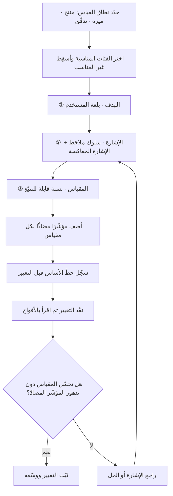

# إطار HEART لقياس تجربة المستخدم (HEART Framework)

> [!info] تعريف مختصر
> إطار لقياس **جودة تجربة المستخدم** بخمس فئات: **السعادة (Happiness)** و**الانخراط (Engagement)** و**التبنّي (Adoption)** و**الاحتفاظ (Retention)** و**نجاح المهمّة (Task Success)**؛ يُشغَّل عبر شبكة من ثلاثة أعمدة تُملأ لكل فئة: **الأهداف (Goals) ← الإشارات (Signals) ← المقاييس (Metrics)**. طُوّر داخل **جوجل (Google)** وقدّمه باحثون في تجربة المستخدم بينهم **كيري رودن (Kerry Rodden)** في ورقة مؤتمر CHI عام 2010. جوهر إسهامه ليس الحروف الخمسة، بل **العمود الأوسط**: إجبار الفريق على تسمية السلوك الملاحَظ الذي يدلّ على تحقّق الهدف قبل أن يختار أي رقم يتتبّعه — وهو ما يمنع القفز المباشر من طموح مجرّد («تجربة أفضل») إلى مقياس متاح تقنيًّا وغير دالّ.

## الشرح العلمي والاحترافي
- **المشكلة التي عالجها**: فرق تجربة المستخدم كانت تملك إمّا بيانات نوعية غنيّة غير قابلة للتجميع (ملاحظات اختبارات الاستخدام)، أو بيانات كمّية ضخمة لا تقول شيئًا عن الجودة (عدد النقرات والجلسات). الإطار جسر بينهما: يبدأ من سؤال نوعي عن التجربة، ثم ينزل به إلى مقياس كمّي قابل للتتبّع، مع بقاء المسار بين الاثنين مرئيًّا.
- **الفئات الخمس ومعنى كلٍّ منها**:
  1. **السعادة**: مواقف المستخدم الذاتية — الرضا، سهولة الاستخدام المُدرَكة، الاستعداد للتوصية. تُقاس بأدوات مسحية غالبًا، ومنها [[NPS]] ومقاييس رضا مباشرة. وهي الفئة الوحيدة التي تعتمد أساسًا على ما يقوله الناس لا على ما يفعلونه.
  2. **الانخراط**: عمق الاستخدام وتواتره لدى **المستخدمين النشطين** — عدد الجلسات لكل مستخدم، عدد العناصر المُنشأة أسبوعيًّا. المهم أن يُقاس كنسبة لكل مستخدم لا كمجموع، وإلا صار انعكاسًا لحجم القاعدة لا لجودة التجربة.
  3. **التبنّي**: دخول مستخدمين جدد إلى الميزة أو المنتج خلال فترة محدّدة. مفيد خصوصًا بعد إطلاق ميزة جديدة، ويرتبط مباشرة بمفهوم [[Adoption]].
  4. **الاحتفاظ**: بقاء المستخدمين عبر الزمن ونسبة العائدين من فوج معيّن، وهو الوجه المقابل لـ[[Churn]] ويُقرأ صحيحًا فقط عبر [[Cohort Analysis]].
  5. **نجاح المهمّة**: كفاءة المستخدم وفعاليته في إنجاز مهمّة محدّدة — نسبة الإكمال، الزمن المستغرق، معدّل الخطأ. وهي الفئة الأقرب إلى قابلية الاستخدام التقليدية، والأكثر حساسية للتغييرات التصميمية الصغيرة.
- **الشبكة الثلاثية هي المحرّك الحقيقي**: لكل فئة تُملأ ثلاث خانات: **هدف** (ما الذي نريد أن يحقّقه المستخدم؟ مصوغًا بلغة المستخدم لا بلغة الفريق)، **إشارة** (ما السلوك أو الموقف الذي سيتغيّر إن تحقّق الهدف؟ وما الإشارة المعاكسة التي تدلّ على الفشل؟)، ثم **مقياس** (كيف نحوّل الإشارة إلى رقم قابل للتتبّع في لوحة؟). الترتيب ملزم؛ وعكسه — البدء من المقاييس المتاحة — هو المصدر الأول لبطاقات مؤشّرات مزدحمة بلا معنى.
- **ليس مطلوبًا استخدام الفئات الخمس كلها**: التصميم الأصلي للإطار ينصّ صراحةً على انتقاء ما يناسب سياق المشروع. أداة تُستخدم مرّة واحدة لغرض إداري (كتقديم طلب رسمي) لا معنى لقياس "الانخراط" فيها؛ بل الانخراط العالي فيها إشارة **سلبية** تدلّ على تعثّر. وأداة استُقرّ عليها منذ سنوات لا معنى لقياس "التبنّي" فيها.
- **الفرق بين مؤشّرات المستوى الأعلى ومقاييس الجودة**: الإطار لا ينافس [[KPI]] ولا [[North Star Metric]] بل يقع تحتهما. المؤشّر الشمالي رقم واحد يعبّر عن القيمة المُوصَّلة إجمالًا؛ ومقاييس HEART تشرح **لماذا** يتحرّك ذلك الرقم أو لا يتحرّك، وتربطه بجوانب التجربة المسؤولة عنه. لوحة صحّية تضع مؤشّرًا شماليًّا في الأعلى وطبقة HEART تشخيصية تحته.
- **متى يُغني عن مؤشّرات الإيراد**: حين يكون الفريق مسؤولًا عن سطح تجربة لا عن معاملة مالية — لوحة تحكّم داخلية، أداة إدارية، تدفّق تسجيل، منتج مجاني في مرحلة نمو، أو مكوّن مشترك يستخدمه فريق آخر. في هذه الحالات لا يوجد إيراد قابل للعزو إلى عمل الفريق، ومحاولة ربطه قسرًا تُنتج نسبة مصطنعة تُشوّه القرارات. كذلك حين تسبق التجربةُ الإيرادَ زمنيًّا بفارق طويل، فمقياس التجربة هو المؤشّر المتقدّم ([[Leading and Lagging Indicators]]) الذي يمكن التصرّف بناءً عليه الآن.
- **ومتى لا يُغني**: حين يكون القرار المطروح استثماريًّا (تمويل مبادرة، تسعير، مفاضلة بين خطّي منتج) لا تصميميًّا. تحسّن نجاح المهمّة من 71% إلى 84% معلومة قيّمة لكنها لا تُجيب عن سؤال «هل يستحقّ هذا 6 أشهر عمل؟» — تلك إجابة تحتاج [[Business Case]] وتقديرًا للعائد. كذلك في المنتجات التي يكون فيها الاستخدام المكثّف نفسه مصدر الكلفة لا القيمة، قد يرتفع الانخراط ويتدهور الاقتصاد في آن. القاعدة العملية: HEART يقيس **جودة ما نصنع**، ومقاييس الإيراد تقيس **جدوى صنعه**، وإسقاط أحدهما يُنتج إما منتجًا جميلًا خاسرًا أو منتجًا مربحًا مكروهًا.
- **المؤشّرات المضادّة جزء أصيل من التطبيق السليم**: كل فئة قابلة للتلاعب بها منفردة — يمكن رفع الانخراط بأنماط مظلمة ([[Dark Patterns]])، ورفع التبنّي بإجبار المستخدم على المرور بالميزة، ورفع نجاح المهمّة بحذف الخيارات المشروعة. لذلك يُقرن كل مقياس بـ[[Counter Metric]] يكشف الضرر الجانبي، وإلا انطبق [[Goodhart's Law]] بحذافيره.

## أين ومتى يُستخدم
- **عند إعادة تصميم تدفّق قائم**: لتحديد خطّ أساس ([[Baseline]]) قبل التغيير ثم قياس أثره بعده، بدل الاكتفاء بانطباع الفريق عن أن التصميم الجديد "أفضل".
- **عند إطلاق ميزة جديدة**: فئتا التبنّي ونجاح المهمّة هما الأنسب في الأسابيع الأولى، والانخراط والاحتفاظ لاحقًا بعد استقرار القاعدة.
- **في المنتجات الداخلية والمؤسّسية**: حيث لا يوجد إيراد مباشر ولا اختيار حرّ للمستخدم، فتصبح جودة التجربة هي المقياس الوحيد الصالح لتوجيه العمل.
- **في تحويل نتائج البحث النوعي إلى قياس مستمر**: ما يظهر في [[User Interview]] وفي اختبارات الاستخدام يُترجم إلى إشارات ثم مقاييس تُتابع دون تكرار البحث كل مرة.
- **في بناء طبقة تشخيصية تحت [[North Star Metric]]**: لتفسير حركة المؤشّر الأعلى وربطها بجزء محدّد من التجربة.
- **عند الاختبار المُقارَن** ([[AB Testing]]): كإطار لاختيار المقاييس الأساسية والحارسة قبل تشغيل التجربة، لا بعد رؤية النتائج.
- **في مراجعة ما بعد الإطلاق** ([[Post-Launch Review]]): لتقديم صورة متوازنة بين ما تحسّن وما تدهور بدل سرد الإنجازات فقط.

## مثال وسيناريو تطبيقي
> [!example] **بوّابة خدمات إلكترونية حكومية في دولة خليجية — خدمة تجديد رخصة نشاط تجاري.** الفريق مسؤول عن تجربة المستخدم فقط؛ لا إيراد يمكن نسبته إليه، لأن الرسوم ثابتة نظاميًّا والخدمة إلزامية (المستخدم لا يملك خيار عدم التجديد).
> الوضع قبل العمل: 34% من المعاملات تصل إلى مركز الاتصال، ومتوسّط زمن الإنجاز 22 دقيقة، ونسبة الإكمال من أول محاولة 61%.
> بنى الفريق شبكة HEART وقرّر إسقاط فئة **الانخراط** عمدًا، لأن كثرة الدخول إلى خدمة تُنجَز مرّة في السنة إشارة تعثّر لا نجاح.
>
> | الفئة | الهدف | الإشارة | المقياس |
> |---|---|---|---|
> | نجاح المهمّة | يُنهي صاحب النشاط التجديد دون مساعدة | إكمال من أول محاولة، انخفاض العودة للخلف | نسبة الإكمال من أول جلسة · الزمن الوسيط · معدّل أخطاء التحقّق |
> | السعادة | يشعر أن الإجراء واضح لا مربك | تقييم بعد الإنجاز، لغة الشكاوى | متوسّط تقييم من 5 بعد الإتمام مباشرة |
> | التبنّي | يتحوّل من المراجعة الحضورية إلى القناة الرقمية | ارتفاع حصّة القناة الرقمية | نسبة المعاملات الرقمية من الإجمالي |
> | الاحتفاظ | يعود العام القادم رقميًّا دون تردّد | تكرار الاستخدام في الدورة التالية | نسبة العائدين رقميًّا من فوج العام السابق |
>
> اختير مؤشّران مضادّان: **نسبة المعاملات المرفوضة بعد التقديم** (حتى لا يُشترى تسريع الإكمال بتساهل في التحقّق)، و**نسبة الشكاوى المتعلّقة بالرسوم** (حتى لا يُخفى شيء لتسريع التدفّق).
> التدخّلات كانت ثلاثة فقط: تعبئة مسبقة للبيانات المعروفة لدى الجهة، وشرح فوري لسبب رفض كل حقل عند إدخاله بدل رسالة عامة في النهاية، وحفظ المسودّة تلقائيًّا.
> بعد ثلاثة أشهر: الإكمال من أول جلسة 61% → 88%، الزمن الوسيط 22 → 7 دقائق، مكالمات الدعم 34% → 11%، التقييم 3.1 → 4.4. والمؤشّر المضادّ بقي مستقرًّا (المعاملات المرفوضة 4.2% → 3.9%)، وهو ما أعطى الثقة بأن التحسّن حقيقي لا ناتج عن تخفيف التحقّق.
> لاحقًا طُلب من الفريق تمويل مرحلة ثانية أكبر. هنا لم تكفِ أرقام HEART وحدها: احتاج الفريق إلى ترجمة أثر انخفاض المكالمات إلى وفر تشغيلي مقدّر داخل [[Business Case]] كي يُقارَن الاستثمار ببدائله. وهذا بالضبط الحدّ الذي يتوقّف عنده الإطار.

## خطوات أو مخطّط
1. حدّد نطاق القياس بدقّة: منتج كامل، أم ميزة، أم تدفّق واحد؟ الشبكة تُبنى لنطاق واحد محدّد، لا لمنتج بأكمله دفعة واحدة.
2. اختر الفئات المناسبة فقط، واكتب سبب استبعاد كل فئة مُسقَطة — الاستبعاد المبرَّر جزء من جودة التطبيق.
3. لكل فئة مختارة: اكتب الهدف بلغة المستخدم («أن يُنهي التجديد دون مساعدة») لا بلغة الفريق («إطلاق التدفّق الجديد»).
4. اشتقّ الإشارة: ما السلوك الملاحَظ الذي سيتغيّر؟ واذكر معه الإشارة المعاكسة التي تدلّ على الفشل (العودة للخلف، التخلّي، الاتصال بالدعم).
5. حوّل الإشارة إلى مقياس بصياغة نسبية لا مطلقة، وحدّد وحدته وفترته وشريحته.
6. تحقّق أن كل مقياس قابل للتجميع فعليًّا من الأنظمة القائمة؛ وإن لم يكن، أضِف تتبّعه كعمل مطلوب قبل بدء التنفيذ لا بعده.
7. عيّن لكل مقياس أساسي مؤشّرًا مضادًّا يحمي من تحسينه على حساب جانب آخر.
8. سجّل خطّ الأساس قبل أي تغيير، وحدّد نافذة القياس ومعيار الحكم مسبقًا.
9. نفّذ التغيير، ثم اقرأ النتائج بالأفواج، وافصل أثر التغيير عن أثر الموسمية.
10. راجع الشبكة كل ربع: أهداف تتحقّق تُستبدل، وفئات تفقد صلتها تُسقَط، ومقاييس تحوّلت إلى غايات بذاتها تُتقاعد.

## ⚠️ مفاهيم خاطئة شائعة
> [!warning]
> - **الظنّ بوجوب استخدام الفئات الخمس دائمًا**: الإطار انتقائي بتصميمه. إقحام فئة لا تناسب طبيعة المنتج يُنتج مقاييس تُقرأ بالمقلوب — أوضح مثالها قياس الانخراط في خدمة يُفترض أن تُنجَز مرّة واحدة بسرعة.
> - **الخلط بين "الإشارة" و"المقياس"**: الإشارة سلوك («يعود المستخدم إلى الخطوة السابقة مرارًا»)، والمقياس تحويل ذلك السلوك إلى رقم («متوسّط عدد مرات الرجوع لكل جلسة»). دمج العمودين يُسقط بالضبط الخطوة التي وُجد الإطار من أجلها.
> - **اعتبار السعادة مقياسًا للجودة الفعلية**: السعادة تقيس ما يقوله المستخدم، وقد تتأثّر بعوامل خارج المنتج تمامًا (سعر، تغطية إعلامية، حادثة انقطاع لدى منافس). تُقرأ دائمًا بجوار مقاييس سلوكية لا وحدها.
> - **الظنّ بأنه بديل عن مؤشّرات الأعمال**: HEART يقيس جودة التجربة لا جدواها الاقتصادية. قرار الاستثمار يحتاج ترجمة أثر التجربة إلى كلفة أو عائد؛ وبدون هذه الترجمة تبقى الأرقام مقنعة داخل فريق المنتج وغير كافية أمام لجنة تمويل.
> - **اعتباره منافسًا للمؤشّر الشمالي**: هو طبقة تحته لا بديل عنه. المؤشّر الشمالي يجيب «هل نوصّل قيمة؟» وHEART يجيب «أين تحديدًا تنجح التجربة أو تتعثّر؟».
> - **الاعتقاد بأن ارتفاع كل الفئات معًا هو الحالة المثلى**: بين الفئات تنازلات حقيقية. تبسيط التدفّق قد يرفع نجاح المهمّة ويخفض الانخراط، وهذا نجاح لا فشل في كثير من المنتجات. يجب تحديد الفئة الحاكمة عند التعارض مسبقًا.
> - **معاملة الشبكة كوثيقة تُملأ مرّة وتُعلّق**: قيمة الإطار في كونه عقدًا حيًّا يُراجع؛ فمقياس بقي سنتين دون مراجعة يتحوّل غالبًا من أداة تشخيص إلى طقس تقارير.

## ❌ ممارسات خاطئة في المشاريع
> [!failure]
> - **الخطأ: البدء من المقاييس المتوفّرة في أداة التحليلات ثم إلصاق أهداف بها بأثر رجعي.** لماذا يضرّ: يُنتج بطاقة مؤشّرات مزدحمة تقيس ما يسهل قياسه لا ما يهمّ، وتُتّخذ قرارات تصميمية بناءً على أرقام لا تمثّل جودة التجربة. الحل: امنع فتح أداة التحليلات قبل استكمال عمودَي الهدف والإشارة كتابةً.
> - **الخطأ: قياس فئة الانخراط في أدوات تُنجَز فيها المهمّة مرّة واحدة.** لماذا يضرّ: يدفع الفريق لزيادة زمن البقاء والتنقّل، وهو ضرر صريح بالمستخدم يُكافأ عليه الفريق بالخطأ. الحل: حدّد لكل فئة اتجاه التحسّن المطلوب صراحةً (أعلى أفضل / أقل أفضل)، وأسقِط الفئة إن كان اتجاهها ملتبسًا.
> - **الخطأ: إطلاق تحسين يرفع نجاح المهمّة عبر حذف خيارات مشروعة أو تقليص خطوات تحقّق.** لماذا يضرّ: يرتفع المقياس ويظهر النجاح بينما تُدفَع الكلفة لاحقًا في معاملات مرفوضة وأخطاء وتصعيدات. الحل: اقرن كل مقياس بمؤشّر مضادّ محدّد مسبقًا، واجعل تدهوره سببًا كافيًا لإلغاء التغيير.
> - **الخطأ: قياس السعادة بمسح واحد سنوي عام عن "رضا العملاء".** لماذا يضرّ: يفصل التقييم عن التجربة المحدّدة، فلا يمكن عزو التغيّر إلى أي تدخّل، ويصبح الرقم مادة تقارير لا أداة قرار. الحل: اربط سؤال التقييم بلحظة إنهاء المهمّة نفسها، واقرأه مقسّمًا حسب التدفّق والشريحة.
> - **الخطأ: بناء الشبكة داخل فريق التصميم وحده ثم عرضها على البقية.** لماذا يضرّ: يُختار مقياس لا يستطيع فريق البيانات تجميعه أو لا يقبله فريق الأعمال كدليل، فتُهجر الشبكة بعد أسابيع. الحل: اجعل بناءها ورشة مشتركة بين المنتج والتصميم والبيانات والتشغيل، وأنهِ الورشة بتحديد مالك لكل مقياس.
> - **الخطأ: قراءة نتائج التغيير على قاعدة المستخدمين كاملة.** لماذا يضرّ: يخلط سلوك المستخدمين المعتادين على النسخة القديمة بسلوك الجدد، فيبدو التحسين ضعيفًا أو ضارًّا بلا سبب حقيقي. الحل: افصل الأفواج ([[Cohort Analysis]])، وحدّد فترة تكيّف قبل بدء احتساب النتائج.
> - **الخطأ: استخدام أرقام HEART وحدها لطلب تمويل مرحلة كبيرة.** لماذا يضرّ: تُقابَل بسؤال «وماذا تساوي هذه النسبة بالريال؟» فتفقد المبادرة زخمها رغم صحّتها. الحل: أرفق ترجمة تقديرية لأثر التحسّن (وفر تشغيلي، خفض تصعيدات، زمن موظّف مُحرَّر) ضمن [[Business Case]] مع توضيح صريح لدرجة عدم اليقين.

## 🔗 مصطلحات ومفاهيم ذات صلة
[[KPI]] | [[North Star Metric]] | [[Counter Metric]] | [[Retention]] | [[Adoption]] | [[NPS]] | [[Cohort Analysis]] | [[AB Testing]] | [[Goodhart's Law]] | [[Vanity Metrics]] | [[AARRR]] | [[Empathy Map]] | [[Service Blueprint]]
