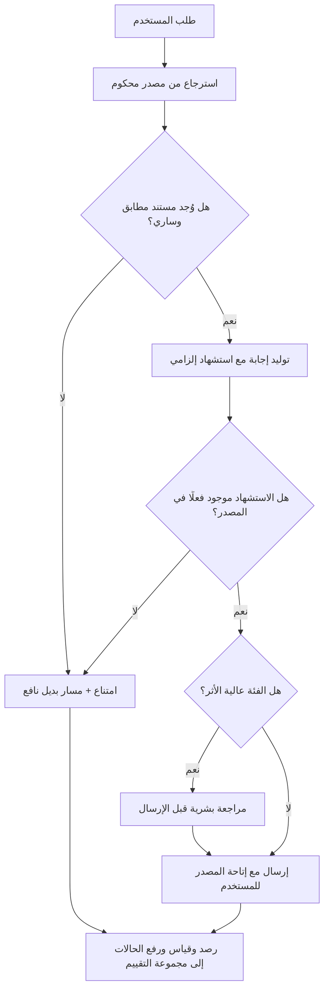

# الهلوسة (Hallucination)

> [!info] تعريف مختصر
> إنتاج نموذج لغوي لمعلومة غير صحيحة أو غير موجودة أصلًا، مصوغة بلغة سليمة ونبرة واثقة لا تحمل أي إشارة إلى أنها مشكوك فيها. سبب الظاهرة ليس «عطلًا» في النموذج، بل طبيعة عمله: النموذج يولّد التكملة **الأرجح لغويًّا** بحسب ما تعلّمه من أنماط النص، لا التكملة **الصحيحة واقعيًّا**؛ والصدق في مخرجاته أثر جانبي مرغوب لا هدفًا محسوبًا. لذلك يستوي عند النموذج — من حيث آلية التوليد — أن ينتج اسم كتاب حقيقي أو اسم كتاب لم يُكتب قط، ما دام الاسمان يبدوان معقولين في موضعهما. الهلوسة إذن **خاصّية بنيوية (Structural Property)** تُدار بالتصميم والتحقّق، لا خلل يُنتظر إصلاحه في التحديث القادم.

## الشرح العلمي والاحترافي
- **جذر الظاهرة في دالة الهدف نفسها**: النماذج اللغوية الكبيرة تُدرَّب أساسًا على مهمّة إحصائية: بالنظر إلى النص السابق، ما التكملة الأكثر احتمالًا؟ لا يوجد داخل هذه الدالة أي تمثيل صريح لمفهوم «الحقيقة» ولا مرجع خارجي تُقارَن به المخرجات أثناء التوليد. النموذج لا يخزّن قاعدة بيانات من الوقائع يستعلم منها، بل يخزّن أنماطًا إحصائية عالية الأبعاد تسمح بإعادة توليد ما يشبه الوقائع. ولذلك فإن مطالبة النموذج بألّا يهلوس أبدًا تشبه مطالبة محرّك بحث بألّا يعرض أبدًا نتيجة غير ذات صلة: تحسينٌ ممكن، وإلغاءٌ غير ممكن بالبنية الحالية.
- **الثقة اللغوية ليست ثقة معرفية**: أخطر ما في الهلوسة ليس الخطأ ذاته، بل **غياب إشارة الشك**. الإنسان حين لا يعرف يتردّد، ويستخدم عبارات تحوّط، وتتغيّر نبرته. النموذج لا يفعل: يولّد الجملة الخاطئة بالطلاقة النحوية والأسلوبية نفسها التي يولّد بها الجملة الصحيحة. هذا يعطّل أهم آلية بشرية لاكتشاف الخطأ — قراءة إشارات عدم اليقين — ويجعل المراجعة السطحية عديمة الجدوى تقريبًا.
- **أنواع متمايزة تحتاج علاجات متمايزة**: من المفيد عمليًّا التفريق بين: (أ) **هلوسة واقعية** — معلومة عن العالم غير صحيحة؛ (ب) **هلوسة مرجعية** — اختلاق مصدر أو رابط أو رقم قضية أو معرّف منتج بصيغة صحيحة الشكل؛ (ج) **هلوسة سياقية** — مخالفة المستند المُعطى للنموذج نفسه بأن ينسب إليه ما ليس فيه؛ (د) **هلوسة تعليمية** — تجاهل قيد صريح في الطلب ثم الادّعاء بأنه طُبِّق. النوع (ج) هو الأخطر في أنظمة الأعمال لأنه يمرّ من فلاتر «المصدر موجود» بسهولة.
- **علاقة عكسية جزئية بين الإبداع والانضباط**: خفض عشوائية التوليد يقلّل الانحراف عن المألوف لكنه يقلّل معه التنوّع والقدرة على الصياغة الجديدة. لا يوجد إعداد واحد يعطي «صفر هلوسة» مع «إبداع كامل»؛ وهذا مقايضة تصميمية يجب أن يتّخذها مالك المنتج صراحةً بحسب الاستخدام، لا أن تُترك إعدادًا افتراضيًّا.
- **الاسترجاع من مصدر (Retrieval) يخفّف ولا يُلغي**: ربط النموذج بمستندات المؤسسة يقلّل الهلوسة الواقعية بشكل ملموس لأنه يستبدل «التذكّر» بـ«القراءة». لكنه يفتح بابًا آخر: إذا كان الاسترجاع ضعيفًا أو المستند قديمًا أو متناقضًا، فسيصوغ النموذج إجابة واثقة مبنيّة على مصدر خاطئ — وهذه هلوسة بغطاء مرجعي، أصعب في الكشف لأنها تأتي مع اقتباس.
- **الميل إلى الإجابة أقوى من الميل إلى الاعتراف بالجهل**: أساليب التدريب التي تكافئ الإجابات المفيدة والمرضية للمستخدم تدفع النموذج ضمنيًّا إلى تفضيل تقديم إجابة على قول «لا أعلم». ولهذا يكون طلب الامتناع الصريح عند غياب الدليل جزءًا ضروريًّا من تصميم التوجيه، لا رفاهية ([[Prompt Engineering]]).
- **قابلية القياس شرط الإدارة**: ما لا يُقاس لا يُدار. معدّل الهلوسة قابل للقياس عبر مجموعة حالات اختبار محفوظة ذات إجابات مرجعية، تُشغَّل عند كل تغيير في النموذج أو التوجيه ([[Evals]]). بدون ذلك يصبح الحكم على جودة النظام انطباعًا شخصيًّا متقلّبًا، ويستحيل معرفة هل التحديث الأخير حسّن الوضع أم أفسده.
- **الخطر يتناسب مع كلفة الخطأ لا مع تكراره**: نظام يهلوس بنسبة 2% في توليد أفكار تسويقية غير مؤذٍ عمليًّا. النظام نفسه بالنسبة ذاتها في حساب استحقاق مالي أو تفسير بند تعاقدي أو إرشاد دوائي كارثة. لذلك تُقاس المخاطرة بحاصل ضرب الاحتمال في الأثر ([[Probability and Impact Matrix]])، وتُبنى الضوابط على أساس الأثر لا التكرار.

## أين ومتى يُستخدم
- **عند تحديد نطاق أي ميزة تعتمد على نموذج لغوي**: تُطرح الهلوسة كافتراض قائم يجب تصميم المنتج حوله، ويُكتب في وثيقة المتطلّبات ([[PRD]]) ما الذي يحدث حين تقع، لا ما إذا كانت ستقع.
- **في سجلّ المخاطر ([[Risk Register]]) و[[RAID Log]]**: تُسجَّل الهلوسة كخطر دائم له مالك وضوابط وحدود قبول، لا كعيب مؤقّت في انتظار الإصلاح.
- **في تعريف الإنجاز ([[Definition of Done]]) لأي مخرَج مولَّد**: لا يُعدّ المخرَج منجزًا لمجرّد أنه صدر، بل بعد مروره بمسار تحقّق متّفق عليه — بشري أو آلي بحسب مستوى الخطر.
- **في تصميم مسارات الأمان والحدود ([[Guard Rails]])**: تحديد المواضيع الممنوعة، وحالات الإحالة الإجبارية إلى إنسان، وصيغ الرفض المقبولة.
- **في اختبار الحالات الحدّية ([[Edge Cases]]) واختبار الانحدار ([[Regression Testing]])**: لأن ترقية النموذج تشبه تغيير مكتبة أساسية — قد تُصلح شيئًا وتكسر آخر دون إشعار.
- **في تحليل الأسباب الجذرية ([[Root Cause Analysis]]) بعد شكوى عميل**: التمييز بين خطأ ناتج عن استرجاع مستند خاطئ وخطأ ناتج عن توليد حرّ يغيّر العلاج كليًّا.
- **عند تصميم المسار البديل حين لا تُتاح إجابة موثوقة**: أي التدهور الرشيق ([[Graceful Degradation]]) بدل إجابة مخترعة.

## مثال وسيناريو تطبيقي
> [!example] شركة تأمين في الخليج أطلقت مساعدًا ذكيًّا يجيب عن أسئلة العملاء حول تغطية وثائقهم، مبنيًّا على نموذج لغوي مربوط بمكتبة داخلية فيها 412 مستندًا (شروط عامة، ملاحق، تعميمات تنظيمية). في التجربة الداخلية بدا الأداء ممتازًا: 40 سؤالًا جرّبها الفريق وأجاب عنها المساعد بصياغة أفضل من موظّفي المركز.
> بعد الإطلاق بستة أسابيع، وصلت شكوى: عميل سأل «هل تغطي وثيقتي إصلاح الزجاج الأمامي؟» فأجابه المساعد بنعم مع ذكر «البند 7-3» وسقف تعويض محدّد. البند 7-3 لم يكن موجودًا في وثيقة ذلك العميل إطلاقًا؛ كان في منتج آخر أوقفت الشركة بيعه قبل سنتين، وبقي مستنده في المكتبة دون وسم بتاريخ الإيقاف. أنكرت الشركة الاستحقاق، فتصاعدت الشكوى.
> عند التحليل تبيّن أن المشكلة ثلاثية لا واحدة: **أولًا** استرجاع ضعيف لأن المكتبة لم تُقسَّم بحسب المنتج، فجَلَبت أقرب نص متشابه لغويًّا لا أصحّه تعاقديًّا. **ثانيًا** توجيه ناقص لم يُلزم النموذج بالتحقّق من مطابقة رقم المنتج قبل الإجابة ولا بالامتناع عند الغموض. **ثالثًا** غياب أي مسار تحقّق: لم يكن هناك اختبار محفوظ يسأل عن منتج موقوف ويتوقّع الامتناع.
> ما فعله الفريق: وسم كل مستند بمعرّف المنتج وتاريخي السريان والإيقاف، ومنع الاسترجاع خارج منتج العميل تقنيًّا لا بالتوجيه فقط، وإلزام الإجابة بالاستشهاد بمقطع نصّي حرفي من مستند مطابق وإلا فالإحالة إلى موظف، وبناء مجموعة تقييم من 180 حالة فيها 45 حالة يجب أن تنتهي بامتناع. النتيجة التي رصدها الفريق داخليًّا خلال الربع التالي: انخفاض إجابات «الاستحقاق» الخاطئة في عيّنة المراجعة الأسبوعية من 11 حالة إلى حالتين، مقابل ارتفاع نسبة الإحالة إلى موظّف من 6% إلى 14% — وهي كلفة قبلها الفريق صراحةً بوصفها أرخص من نزاع تعاقدي واحد.

## خطوات أو مخطّط
1. صنّف حالة الاستخدام بحسب كلفة الخطأ: توليد إبداعي، أو مساعدة داخلية، أو إجابة مُلزِمة للعميل، أو قرار مالي/قانوني/صحي.
2. اكتب صراحةً في وثيقة المتطلّبات: ما المخرَج المقبول؟ وما السلوك المطلوب عند غياب المعرفة؟ وما الذي يجب ألّا يُنتَج أبدًا؟
3. اربط النموذج بمصدر معرفة محكوم، وامنع الإجابة خارج نطاق المصدر تقنيًّا لا بالرجاء اللغوي وحده.
4. ألزِم المخرَج بالاستشهاد بمقطع من المصدر، واجعل تعذّر الاستشهاد سببًا كافيًا للامتناع.
5. ابنِ مجموعة تقييم تتضمّن حالات يجب أن ينتهي فيها النظام بالامتناع، لا حالات النجاح فقط ([[Evals]]).
6. صمّم مسارًا بديلًا نافعًا عند الامتناع أو التعذّر بدل رسالة خطأ جافّة ([[Graceful Degradation]]).
7. حدّد بوّابة مراجعة بشرية للفئات عالية الأثر، وسجّل قرار المراجع لتغذية التحسين.
8. راقب في الإنتاج: عيّنة أسبوعية مراجَعة يدويًّا + قناة إبلاغ للمستخدم + مؤشّر معدّل خطأ متتبَّع عبر الزمن ([[Feedback Loop]]).
9. أعِد تشغيل مجموعة التقييم كاملة عند أي تغيير في النموذج أو التوجيه أو المصدر، وعامل النتيجة كبوّابة إصدار.

## ⚠️ مفاهيم خاطئة شائعة
> [!warning]
> - **«الهلوسة عيب سيختفي مع النموذج القادم»**: التحسّن حقيقي ومستمر، لكن الآلية التي تنتج الإجابة الصحيحة هي نفسها التي تنتج الخاطئة. تراجع المعدّل لا يعني بلوغ الصفر، وتصميم منتج يفترض الصفر يبني نفسه على وعد لا يملكه أحد.
> - **«الهلوسة تعني أن النموذج يكذب»**: الكذب يفترض معرفة بالحقيقة وقصدًا لإخفائها. النموذج لا يملك أيًّا منهما. توصيفه بالكذب يقود إلى علاجات أخلاقية بلا معنى بدل علاجات هندسية، ويُلبس النظام قصدًا لا يملكه.
> - **«إذا ذكر النموذج مصدرًا فالإجابة موثوقة»**: النموذج قادر على توليد مصدر بصيغة سليمة تمامًا وهو غير موجود، أو موجود لكنه لا يحتوي ما نُسب إليه. التحقّق الوحيد المعتبر هو مطابقة المقطع المقتبس بالمصدر الفعلي آليًّا.
> - **«الاسترجاع من مستنداتنا يلغي المشكلة»**: يقلّلها ويغيّر شكلها. مع استرجاع ضعيف أو مستندات قديمة أو متعارضة، تتحوّل الهلوسة من اختلاق إلى نقل واثق عن مصدر خاطئ — وهذا أصعب اكتشافًا.
> - **«زيادة التفصيل في التوجيه تكفي»**: التوجيه الجيّد يخفض المعدّل بوضوح، لكنه طبقة إقناع لا طبقة إلزام. ما يجب ألّا يحدث أبدًا يُمنع بقيد تقني خارج النموذج، لا بجملة داخل الطلب.
> - **«الهلوسة مشكلة تقنية تخصّ فريق الهندسة»**: قرار مستوى الخطر المقبول، وموضع الإنسان في المسار، وما يُقال للمستخدم عند التعذّر — كلها قرارات منتج وحوكمة ([[Governance]])، وكلفتها تقع على العلامة التجارية لا على الشيفرة.

## ❌ ممارسات خاطئة في المشاريع
> [!failure]
> - **الإطلاق بعد تجربة يدوية لبضع عشرات الأسئلة**: الخطأ أن تُعتمد الجودة على انطباع «جرّبناها وبدت جيّدة». لماذا يضرّ: العيّنة اليدوية تميل إلى الأسئلة المألوفة وتغفل الحالات الحدّية التي تقع في الإنتاج يوميًّا، ولا تكشف الانحدار عند التحديث. الحل: مجموعة تقييم محفوظة تُشغَّل كبوّابة إصدار قبل كل تغيير ([[Evals]]).
> - **إخفاء درجة عدم اليقين عن المستخدم**: الخطأ عرض كل إجابة بالثقة نفسها. لماذا يضرّ: يُلغي حذر المستخدم ويحوّل خطأ النظام إلى قرار عمل خاطئ. الحل: أظهر المصدر، وميّز الإجابات منخفضة الثقة بصريًّا، واجعل الامتناع سلوكًا مرئيًّا لا فشلًا مخفيًّا.
> - **معاقبة النظام على قول «لا أعلم»**: الخطأ ضبط الأداء على «معدّل الإجابة» أو «نسبة التغطية». لماذا يضرّ: يدفع الضبط والتوجيه نحو الإجابة دائمًا، فيرتفع معدّل الخطأ بينما يبدو المؤشّر ممتازًا — وهي حالة نموذجية من قياس النشاط بدل الأثر ([[Outcome vs Output]]). الحل: اجعل الامتناع الصحيح نجاحًا محسوبًا في مقياس الجودة.
> - **الاكتفاء بمراجعة بشرية شكلية**: الخطأ وضع موظّف يضغط «موافق» على عشرات المخرجات في الساعة. لماذا يضرّ: طلاقة المخرَج تُنتج ثقة زائفة، فتتحوّل المراجعة إلى ختم يمنح غطاءً مسؤوليًّا دون فحص حقيقي. الحل: راجع عيّنة أصغر بعمق حقيقي، وزوّد المراجع بالمقطع المصدري بجانب الإجابة، وقِس معدّل اكتشافه للأخطاء المزروعة.
> - **ترقية النموذج مباشرةً في الإنتاج لأنه «أحدث وأفضل»**: الخطأ اعتبار الترقية تحسينًا مضمونًا. لماذا يضرّ: النموذج الأقوى عمومًا قد يتراجع تحديدًا في مهمّتك أو يغيّر تنسيق مخرجاته فيكسر ما بعده. الحل: عامل الترقية كتغيير يستوجب تشغيل مجموعة التقييم كاملة ومقارنة النتائج قبل/بعد، مع خطة تراجع ([[Rollback]]).
> - **إهمال قِدَم المصادر وتعارضها**: الخطأ ضخّ كل ملفات الشركة في المكتبة دفعة واحدة. لماذا يضرّ: النموذج لا يعرف أيّ نسخة هي السارية، فينقل عن سياسة ملغاة بثقة تامة. الحل: مصدر واحد للحقيقة موسوم بتاريخ السريان ومالك محدّد ([[Single Source of Truth]])، مع استبعاد الملغى من الاسترجاع.
> - **غياب مسار تصعيد عند الشكوى**: الخطأ عدم وجود إجراء لما يحدث حين يبني عميل قرارًا على إجابة خاطئة. لماذا يضرّ: يتحوّل خطأ تقني إلى نزاع تعاقدي وسمعة متضرّرة. الحل: إجراء موثّق ([[SOP]]) يحدّد التعويض والتصعيد وتسجيل الحالة في سجلّ القضايا ([[Issue Log]]) وإضافتها إلى مجموعة التقييم.

## 🔗 مصطلحات ومفاهيم ذات صلة
[[Evals]] | [[Prompt Engineering]] | [[Graceful Degradation]] | [[Vibe Coding]] | [[Guard Rails]] | [[Risk Register]] | [[Edge Cases]] | [[Single Source of Truth]] | [[Root Cause Analysis]] | [[Regression Testing]] | [[Governance]]
