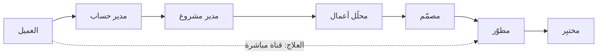

# التسليمة (Handoff)

> [!info] تعريف مختصر
> التسليمة هي **انتقال عنصر عمل من شخص أو فريق إلى آخر** لإتمام مرحلة تالية. وهي في أدبيات [[Toyota Production System|لين]] مصدر هدر مزدوج: **زمن انتظار** في الطابور الجديد، و**فقدان سياق** لا يُنقَل مع الوثيقة. والقاعدة الحاكمة: **كلّما زاد عدد التسليمات بين العميل النهائي والمنفّذ، زاد الغموض وارتفع احتمال تسليم شيء غير قابل للاستخدام.**

## الشرح العلمي والاحترافي
- **ما يُفقَد ليس المحتوى بل السياق.** النصّ يُنقَل عادةً بدقّة؛ أمّا **لماذا** كُتب — أيّ مشكلة يحلّ، وأيّ بدائل رُفِضت ولماذا، وأيّ افتراضات قام عليها — فلا يُنقَل. والمنفّذ يواجه آلاف القرارات الصغيرة التي لم تنصّ عليها الوثيقة، فيخمّنها أو يسأل فيدخل طابور انتظار.
- **التضخيم الأسّي للغموض**: إن نقلت كلّ حلقة 90% من السياق بدقّة، فبعد أربع حلقات يبقى $0.9^4 \approx 66\%$، وبعد ستّ $0.9^6 \approx 53\%$. أي أنّ **نصف السياق يتبخّر في سلسلة من ستّ حلقات دون أن يُخطئ أحد**.
- **تفتيت المسؤولية**: حين يمرّ العمل بستّة أشخاص لا يشعر أحد بملكيّته. ومن أوضح أعراضه شعور المختبِر بأنّه «يسلّم قنبلة موقوتة»: يعلم بالمشكلة، ولا يملك سلطة الإيقاف، ولا يتحمّل الملكية.
- **الكلفة الزمنية**: كلّ تسليمة تُنشئ **طابورًا جديدًا**. وبقانون الطوابير، الفريق المستقبِل المشغول قرب طاقته القصوى يُنتج انتظارًا ينمو أسّيًّا لا خطّيًّا. ولهذا يفوق زمن الانتظار في المؤسّسات المقسّمة صوامعَ زمنَ العمل الفعلي بأضعاف — وهو ما يقيسه مباشرةً [[Flow Efficiency|كفاءة التدفّق]].
- **مشكلة الوكيل (`Proxy Problem`)**: حين يتحوّل دور وسيط (محلّل، مالك منتج، مدير مشروع) إلى **ناقل طلبات** بلا سلطة قرار، يصير حلقة تسليمة إضافية بلا قيمة مضافة. والاختبار الحاسم لأيّ حلقة: **ما القرار الذي تملكه؟** وكلّ حلقة لا تملك قرارًا هي حلقة نقل — أي هدر بتعريف لين.
- **ليست كلّ تسليمة هدرًا**: التسليمة إلى **تخصّص نادر** حقيقي (أمن، امتثال، بيانات ضخمة) قد تكون القرار الصحيح. والفرق أنّ التسليمة المبرَّرة تنقل العمل إلى **قدرة غير موجودة**، والتسليمة الهدر تنقله إلى **قدرة كان يمكن أن توجد**.

## أين ومتى يُستخدم
- في **رسم [[Value Stream Mapping|خريطة تدفّق القيمة]]**: كلّ تسليمة نقطة قياس لزمن الانتظار.
- عند **تصميم بنية الفرق**: تقليل التسليمات هو الغرض الأصلي من [[Cross-functional Team|الفريق متعدّد الوظائف]].
- في **تشخيص ميزة سُلّمت ولم تحلّ المشكلة**: عدّ الحلقات بين العميل والمنفّذ يفسّر الأمر عادةً.
- عند **مراجعة الأدوار**: تحديد الأدوار التي لا تملك قرارًا وتحويلها أو حذفها.
- في **تحليل انخفاض [[Psychological Safety|الأمان النفسي]]**: التسليمات المتتابعة تنقل اللوم دون أن تنقل الصلاحية.

## مثال وسيناريو تطبيقي
> [!example] سلسلة من سبع حلقات في شركة برمجيات.
> **المسار:** العميل ← مدير حساب ← مدير مشروع ← محلّل أعمال ← مصمّم ← مطوّر ← مختبِر ← عمليات.
> **ما حدث:** المطوّر رأى نفسه «مترجمًا لا مطوّرًا» — ينفّذ التصاميم حرفيًّا دون معرفة السياق. ووصل العمل إلى المختبِر متأخّرًا فعُصِر زمنه، فسلّم وهو يعلم بوجود مشاكل.
> **القياس:** زمن العمل الفعلي المجمَّع 11 ساعة، والزمن الكلّي 26 يومًا ⇒ **كفاءة تدفّق نحو 5%**.
> **التدخّل بثلاث درجات:** (فوري) حضور مطوّر ومختبِر جلسة الصقل مع مالك المنتج ← حذف حلقة؛ (متوسّط) مالك منتج حقيقي **داخل** الفريق يملك سلطة الأولوية ← حذف طبقتَي وساطة؛ (بنيوي) تواصل دوري منظَّم بين الفريق ومستخدمين حقيقيّين ← إنهاء مشكلة الوكيل.
> **الأثر بعد ربع:** انخفض عدد الحلقات من سبع إلى أربع، وانخفض زمن التدفّق من 26 يومًا إلى 12.

## خطوات أو مخطّط
1. **ارسم كلّ من يمرّ عليه العمل** من العميل إلى الإنتاج — بالتتبّع إلى الوراء من عنصر حقيقي، لا بالسؤال النظري.
2. **اعدّ الحلقات** واكتب أمام كلّ حلقة: ما القرار الذي تملكه؟
3. **صنّف الحلقات** إلى: تملك قرارًا · تضيف مهارة غير موجودة · **تنقل فقط**.
4. **احذف حلقات النقل** أو ادمجها.
5. **قصّر المسافة** بين المنفّذ والعميل: ضع مالك منتج حقيقيًّا داخل الفريق.
6. **قِس الأثر** على [[Flow Efficiency|كفاءة التدفّق]] بعد كلّ حذف.

## ⚠️ مفاهيم خاطئة شائعة
> [!warning]
> - **الظنّ بأنّ التوثيق الأفضل يعوّض التسليمة**: الوثيقة تنقل المحتوى لا السياق؛ ولا تُغني عن المشاركة في تكوين الفهم.
> - **اعتبار كلّ تسليمة هدرًا**: التسليمة إلى تخصّص نادر حقيقي قرار سليم؛ والهدر هو التسليمة إلى قدرة كان يمكن أن توجد داخل الفريق.
> - **الخلط بين تقليل التسليمات وإلغاء التخصّص**: المطلوب حذف **الحدود الإدارية** لا حذف الخبرة.
> - **افتراض أنّ المشكلة في جودة الأشخاص**: الغموض يتضخّم أسّيًّا حتى لو أدّى كلّ شخص عمله بإتقان.

## ❌ ممارسات خاطئة في المشاريع
> [!failure]
> - **إضافة حلقة تنسيق لعلاج سوء التنسيق**: تزيد الغموض والانتظار. الحلّ: احذف حلقة بدل أن تضيف.
> - **إبقاء دور وسيط بلا سلطة قرار**: يتحوّل إلى «آلة فاكس» تنقل الطلبات. الحلّ: امنحه سلطة الأولوية أو ادمج الدور.
> - **عزل المطوّرين عن المستخدمين «توفيرًا لوقتهم»**: يوفّر ساعات ويكلّف أسابيع إعادة عمل. الحلّ: تواصل دوري منظَّم ومحدود الوقت.
> - **قياس كلّ مرحلة على حدة**: كلّ مرحلة تبدو كفؤة والرحلة كلّها بطيئة. الحلّ: قِس من [[Lead Time|نشوء الطلب]] إلى الوصول للإنتاج.

## 🔗 مصطلحات ومفاهيم ذات صلة
[[Cross-functional Team]] | [[Flow Efficiency]] | [[Value Stream Mapping]] | [[Dependency]] | [[Value-Added vs Non-Value-Added vs Pure Waste]] | [[Psychological Safety]] | [[05 - Product Owner]] | [[03 - الفجوة الكبرى والفوضى التشغيلية]]
